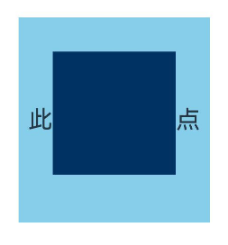

# 自定义绘制设置

更新时间：2026-04-20 06:34:33

来源：https://developer.huawei.com/consumer/cn/doc/harmonyos-references/ts-universal-attributes-draw-modifier
**支持设备：** Phone | PC/2in1 | Tablet | Wearable | TV

当某些组件本身的绘制内容不满足需求时，可使用自定义组件绘制功能，在原有组件基础上部分绘制，或者全部自行绘制，以达到预期效果。例如：独特的按钮形状、文字和图像混合的图标等。自定义组件绘制提供了自定义绘制修改器，来实现更自由地组件绘制。

> [!NOTE]
> 从API version 12开始支持。后续版本如有新增内容，则采用上角标单独标记该内容的起始版本。


##### drawModifier

drawModifier(modifier: DrawModifier | undefined): T

设置组件的自定义绘制修改器。

> [!NOTE]
> 该接口不支持在 attributeModifier 中调用。


**元服务API：** 从API version 12开始，该接口支持在元服务中使用。

**系统能力：** SystemCapability.ArkUI.ArkUI.Full

**组件支持范围:**

[AlphabetIndexer](https://developer.huawei.com/consumer/cn/doc/harmonyos-references/ts-container-alphabet-indexer)、[Badge](https://developer.huawei.com/consumer/cn/doc/harmonyos-references/ts-container-badge)、[Blank](https://developer.huawei.com/consumer/cn/doc/harmonyos-references/ts-basic-components-blank)、[Button](https://developer.huawei.com/consumer/cn/doc/harmonyos-references/ts-basic-components-button)、[CalendarPicker](https://developer.huawei.com/consumer/cn/doc/harmonyos-references/ts-basic-components-calendarpicker)、[Checkbox](https://developer.huawei.com/consumer/cn/doc/harmonyos-references/ts-basic-components-checkbox)、[CheckboxGroup](https://developer.huawei.com/consumer/cn/doc/harmonyos-references/ts-basic-components-checkboxgroup)、[Circle](https://developer.huawei.com/consumer/cn/doc/harmonyos-references/ts-drawing-components-circle)、[Column](https://developer.huawei.com/consumer/cn/doc/harmonyos-references/ts-container-column)、[ColumnSplit](https://developer.huawei.com/consumer/cn/doc/harmonyos-references/ts-container-columnsplit)、[Counter](https://developer.huawei.com/consumer/cn/doc/harmonyos-references/ts-container-counter)、[DataPanel](https://developer.huawei.com/consumer/cn/doc/harmonyos-references/ts-basic-components-datapanel)、[DatePicker](https://developer.huawei.com/consumer/cn/doc/harmonyos-references/ts-basic-components-datepicker)、[Ellipse](https://developer.huawei.com/consumer/cn/doc/harmonyos-references/ts-drawing-components-ellipse)、[Flex](https://developer.huawei.com/consumer/cn/doc/harmonyos-references/ts-container-flex)、[FlowItem](https://developer.huawei.com/consumer/cn/doc/harmonyos-references/ts-container-flowitem)、[FolderStack](https://developer.huawei.com/consumer/cn/doc/harmonyos-references/ts-container-folderstack)、[FormLink](https://developer.huawei.com/consumer/cn/doc/harmonyos-references/ts-container-formlink)、[Gauge](https://developer.huawei.com/consumer/cn/doc/harmonyos-references/ts-basic-components-gauge)、[Grid](https://developer.huawei.com/consumer/cn/doc/harmonyos-references/ts-container-grid)、[GridCol](https://developer.huawei.com/consumer/cn/doc/harmonyos-references/ts-container-gridcol)、[GridItem](https://developer.huawei.com/consumer/cn/doc/harmonyos-references/ts-container-griditem)、[GridRow](https://developer.huawei.com/consumer/cn/doc/harmonyos-references/ts-container-gridrow)、[Hyperlink](https://developer.huawei.com/consumer/cn/doc/harmonyos-references/ts-container-hyperlink)、[Image](https://developer.huawei.com/consumer/cn/doc/harmonyos-references/ts-basic-components-image)、[ImageAnimator](https://developer.huawei.com/consumer/cn/doc/harmonyos-references/ts-basic-components-imageanimator)、[ImageSpan](https://developer.huawei.com/consumer/cn/doc/harmonyos-references/ts-basic-components-imagespan)、[Line](https://developer.huawei.com/consumer/cn/doc/harmonyos-references/ts-drawing-components-line)、[List](https://developer.huawei.com/consumer/cn/doc/harmonyos-references/ts-container-list)、[ListItem](https://developer.huawei.com/consumer/cn/doc/harmonyos-references/ts-container-listitem)、[ListItemGroup](https://developer.huawei.com/consumer/cn/doc/harmonyos-references/ts-container-listitemgroup)、[LoadingProgress](https://developer.huawei.com/consumer/cn/doc/harmonyos-references/ts-basic-components-loadingprogress)、[Marquee](https://developer.huawei.com/consumer/cn/doc/harmonyos-references/ts-basic-components-marquee)、[Menu](https://developer.huawei.com/consumer/cn/doc/harmonyos-references/ts-basic-components-menu)、[MenuItem](https://developer.huawei.com/consumer/cn/doc/harmonyos-references/ts-basic-components-menuitem)、[MenuItemGroup](https://developer.huawei.com/consumer/cn/doc/harmonyos-references/ts-basic-components-menuitemgroup)、[NavDestination](https://developer.huawei.com/consumer/cn/doc/harmonyos-references/ts-basic-components-navdestination)、[Navigation](https://developer.huawei.com/consumer/cn/doc/harmonyos-references/ts-basic-components-navigation)、[Navigator](https://developer.huawei.com/consumer/cn/doc/harmonyos-references/ts-container-navigator)、[NavRouter](https://developer.huawei.com/consumer/cn/doc/harmonyos-references/ts-basic-components-navrouter)、[NodeContainer](https://developer.huawei.com/consumer/cn/doc/harmonyos-references/ts-basic-components-nodecontainer)、[Path](https://developer.huawei.com/consumer/cn/doc/harmonyos-references/ts-drawing-components-path)、[PatternLock](https://developer.huawei.com/consumer/cn/doc/harmonyos-references/ts-basic-components-patternlock)、[Polygon](https://developer.huawei.com/consumer/cn/doc/harmonyos-references/ts-drawing-components-polygon)、[Polyline](https://developer.huawei.com/consumer/cn/doc/harmonyos-references/ts-drawing-components-polyline)、[Progress](https://developer.huawei.com/consumer/cn/doc/harmonyos-references/ts-basic-components-progress)、[QRCode](https://developer.huawei.com/consumer/cn/doc/harmonyos-references/ts-basic-components-qrcode)、[Radio](https://developer.huawei.com/consumer/cn/doc/harmonyos-references/ts-basic-components-radio)、[Rating](https://developer.huawei.com/consumer/cn/doc/harmonyos-references/ts-basic-components-rating)、[Rect](https://developer.huawei.com/consumer/cn/doc/harmonyos-references/ts-drawing-components-rect)、[Refresh](https://developer.huawei.com/consumer/cn/doc/harmonyos-references/ts-container-refresh)、[RelativeContainer](https://developer.huawei.com/consumer/cn/doc/harmonyos-references/ts-container-relativecontainer)、[RichEditor](https://developer.huawei.com/consumer/cn/doc/harmonyos-references/ts-basic-components-richeditor)、[Row](https://developer.huawei.com/consumer/cn/doc/harmonyos-references/ts-container-row)、[RowSplit](https://developer.huawei.com/consumer/cn/doc/harmonyos-references/ts-container-rowsplit)、[Scroll](https://developer.huawei.com/consumer/cn/doc/harmonyos-references/ts-container-scroll)、[ScrollBar](https://developer.huawei.com/consumer/cn/doc/harmonyos-references/ts-basic-components-scrollbar)、[Search](https://developer.huawei.com/consumer/cn/doc/harmonyos-references/ts-basic-components-search)、[Select](https://developer.huawei.com/consumer/cn/doc/harmonyos-references/ts-basic-components-select)、[Shape](https://developer.huawei.com/consumer/cn/doc/harmonyos-references/ts-drawing-components-shape)、[SideBarContainer](https://developer.huawei.com/consumer/cn/doc/harmonyos-references/ts-container-sidebarcontainer)、[Slider](https://developer.huawei.com/consumer/cn/doc/harmonyos-references/ts-basic-components-slider)、[Stack](https://developer.huawei.com/consumer/cn/doc/harmonyos-references/ts-container-stack)、[Stepper](https://developer.huawei.com/consumer/cn/doc/harmonyos-references/ts-basic-components-stepper)、[StepperItem](https://developer.huawei.com/consumer/cn/doc/harmonyos-references/ts-basic-components-stepperitem)、[Swiper](https://developer.huawei.com/consumer/cn/doc/harmonyos-references/ts-container-swiper)、[SymbolGlyph](https://developer.huawei.com/consumer/cn/doc/harmonyos-references/ts-basic-components-symbolglyph)、[TabContent](https://developer.huawei.com/consumer/cn/doc/harmonyos-references/ts-container-tabcontent)、[Tabs](https://developer.huawei.com/consumer/cn/doc/harmonyos-references/ts-container-tabs)、[Text](https://developer.huawei.com/consumer/cn/doc/harmonyos-references/ts-basic-components-text)、[TextArea](https://developer.huawei.com/consumer/cn/doc/harmonyos-references/ts-basic-components-textarea)、[TextClock](https://developer.huawei.com/consumer/cn/doc/harmonyos-references/ts-basic-components-textclock)、[TextInput](https://developer.huawei.com/consumer/cn/doc/harmonyos-references/ts-basic-components-textinput)、[TextPicker](https://developer.huawei.com/consumer/cn/doc/harmonyos-references/ts-basic-components-textpicker)、[TextTimer](https://developer.huawei.com/consumer/cn/doc/harmonyos-references/ts-basic-components-texttimer)、[TimePicker](https://developer.huawei.com/consumer/cn/doc/harmonyos-references/ts-basic-components-timepicker)、[Toggle](https://developer.huawei.com/consumer/cn/doc/harmonyos-references/ts-basic-components-toggle)、[WaterFlow](https://developer.huawei.com/consumer/cn/doc/harmonyos-references/ts-container-waterflow)、[XComponent](https://developer.huawei.com/consumer/cn/doc/harmonyos-references/ts-basic-components-xcomponent)

**参数：**

| 参数名 | 类型 | 必填 | 说明 |
| --- | --- | --- | --- |
| modifier | DrawModifier \| undefined | 是 | 自定义绘制修改器，其中定义了自定义绘制的逻辑。 默认值：undefined 说明： 每个自定义修改器只对当前绑定组件的FrameNode生效，对其子节点不生效。 |


**返回值：**

| 类型 | 说明 |
| --- | --- |
| T | 返回当前组件。 |


##### DrawModifier

DrawModifier可设置遮罩层前景（drawOverlay）、前景（drawForeground）、内容前景（drawFront）、内容（drawContent）和内容背景（drawBehind）的绘制方法，还提供主动触发重绘的方法[invalidate](#invalidate)。每个DrawModifier实例只能设置到一个组件上，禁止进行重复设置。

自定义层级示例图





**元服务API：** 从API version 12开始，该接口支持在元服务中使用。

**系统能力：** SystemCapability.ArkUI.ArkUI.Full


##### drawFront

drawFront?(drawContext: DrawContext): void

自定义绘制内容前景的接口，若重载该方法则可进行内容前景的自定义绘制。

**元服务API：** 从API version 12开始，该接口支持在元服务中使用。

**系统能力：** SystemCapability.ArkUI.ArkUI.Full

**参数：**

| 参数名 | 类型 | 必填 | 说明 |
| --- | --- | --- | --- |
| drawContext | DrawContext | 是 | 图形绘制上下文。 |


**示例：**

请参考[示例1（通过DrawModifier进行自定义绘制）](#示例1通过drawmodifier进行自定义绘制)。


##### drawContent

drawContent?(drawContext: DrawContext): void

自定义绘制内容的接口，若重载该方法则可进行内容的自定义绘制，会替换组件原本的内容绘制函数。

该接口的[DrawContext](https://developer.huawei.com/consumer/cn/doc/harmonyos-references/js-apis-arkui-graphics#drawcontext)中的Canvas是用于记录指令的临时Canvas，并非节点的真实Canvas。使用请参见[调整自定义绘制Canvas的变换矩阵](https://developer.huawei.com/consumer/cn/doc/harmonyos-guides/arkts-user-defined-extension-drawmodifier#调整自定义绘制canvas的变换矩阵)。

**元服务API：** 从API version 12开始，该接口支持在元服务中使用。

**系统能力：** SystemCapability.ArkUI.ArkUI.Full

**参数：**

| 参数名 | 类型 | 必填 | 说明 |
| --- | --- | --- | --- |
| drawContext | DrawContext | 是 | 图形绘制上下文。 |


**示例：**

请参考[示例1（通过DrawModifier进行自定义绘制）](#示例1通过drawmodifier进行自定义绘制)。


##### drawBehind

drawBehind?(drawContext: DrawContext): void

自定义绘制背景的接口，若重载该方法则可进行背景的自定义绘制。

**元服务API：** 从API version 12开始，该接口支持在元服务中使用。

**系统能力：** SystemCapability.ArkUI.ArkUI.Full

**参数：**

| 参数名 | 类型 | 必填 | 说明 |
| --- | --- | --- | --- |
| drawContext | DrawContext | 是 | 图形绘制上下文。 |


**示例：**

请参考[示例1（通过DrawModifier进行自定义绘制）](#示例1通过drawmodifier进行自定义绘制)。


##### drawForeground20+

drawForeground(drawContext: DrawContext): void

自定义绘制前景的接口，若重载该方法则可进行前景的自定义绘制。需要对其组件的前景层进行绘制时重载该方法。

**元服务API：** 从API version 20开始，该接口支持在元服务中使用。

**系统能力：** SystemCapability.ArkUI.ArkUI.Full

**参数：**

| 参数名 | 类型 | 必填 | 说明 |
| --- | --- | --- | --- |
| drawContext | DrawContext | 是 | 图形绘制上下文。 |


**示例：**

请参考[示例2（通过DrawModifier对容器的前景进行自定义绘制）](#示例2通过drawmodifier对容器的前景进行自定义绘制)。


##### drawOverlay23+

drawOverlay(drawContext: DrawContext): void

自定义绘制遮罩层的接口，若重载该方法则可进行遮罩层的自定义绘制。需要对其组件的遮罩层进行绘制时重载该方法。

**元服务API：** 从API version 23开始，该接口支持在元服务中使用。

**系统能力：** SystemCapability.ArkUI.ArkUI.Full

**参数：**

| 参数名 | 类型 | 必填 | 说明 |
| --- | --- | --- | --- |
| drawContext | DrawContext | 是 | 图形绘制上下文。 |


**示例：**

```ArkTS
// test.ets
import { drawing } from '@kit.ArkGraphics2D';

class MyForegroundDrawModifier extends DrawModifier {
  public scaleX: number = 3;
  public scaleY: number = 3;
  uiContext: UIContext;

  constructor(uiContext: UIContext) {
    super();
    this.uiContext = uiContext;
  }

  // 重载drawOverlay方法，实现自定义绘制遮罩层前景
  drawOverlay(context: DrawContext): void {
    const brush = new drawing.Brush();
    brush.setColor({
      alpha: 255,
      red: 0,
      green: 50,
      blue: 100
    });
    context.canvas.attachBrush(brush);
    const halfWidth = context.size.width / 2;
    const halfHeight = context.size.height / 2;
    context.canvas.drawRect({
      left: this.uiContext.vp2px(halfWidth - 30 * this.scaleX),
      top: this.uiContext.vp2px(halfHeight - 30 * this.scaleY),
      right: this.uiContext.vp2px(halfWidth + 30 * this.scaleX),
      bottom: this.uiContext.vp2px(halfHeight + 60 * this.scaleY)
    });
  }
}

@Entry
@Component
struct DrawModifierExample {
  // 将自定义绘制遮罩层前景的类实例化，传入UIContext实例
  private overlayModifier: MyForegroundDrawModifier = new MyForegroundDrawModifier(this.getUIContext());

  build() {
    Column() {
      Text('此文本是子节点')
        .fontSize(36)
        .width('100%')
        .height('100%')
        .textAlign(TextAlign.Center)
    }
    .margin(50)
    .width(280)
    .height(300)
    .backgroundColor(0x87CEEB)
    // 调用此接口并传入自定义绘制前景的类实例，即可实现自定义绘制前景
    .drawModifier(this.overlayModifier)
  }
}
```


##### invalidate

invalidate(): void

主动触发重绘的接口，开发者无需也无法重载，调用会触发所绑定组件的重绘。

**元服务API：** 从API version 12开始，该接口支持在元服务中使用。

**系统能力：** SystemCapability.ArkUI.ArkUI.Full

**示例：**

请参考[示例1（通过DrawModifier进行自定义绘制）](#示例1通过drawmodifier进行自定义绘制)。


##### DrawContext

type DrawContext = DrawContext

**元服务API：** 从API version 12开始，该接口支持在元服务中使用。

**系统能力：** SystemCapability.ArkUI.ArkUI.Full

| 类型 | 说明 |
| --- | --- |
| DrawContext | 图形绘制上下文。 |


##### 示例


##### 示例1（通过DrawModifier进行自定义绘制）

通过DrawModifier对[Text](https://developer.huawei.com/consumer/cn/doc/harmonyos-references/ts-basic-components-text)组件进行自定义绘制。

```ArkTS
// xxx.ets
import { drawing } from '@kit.ArkGraphics2D';
import { AnimatorResult } from '@kit.ArkUI';

// 继承DrawModifier实现自定义绘制控制器
class MyFullDrawModifier extends DrawModifier {
  public scaleX: number = 1;
  public scaleY: number = 1;
  uiContext: UIContext;

  constructor(uiContext: UIContext) {
    super();
    this.uiContext = uiContext;
  }

  // 重载drawBehind方法，自定义绘制背景
  drawBehind(context: DrawContext): void {
    const brush = new drawing.Brush();
    brush.setColor({
      alpha: 255,
      red: 255,
      green: 0,
      blue: 0
    });
    context.canvas.attachBrush(brush);
    const halfWidth = context.size.width / 2;
    const halfHeight = context.size.height / 2;
    context.canvas.drawRect({
      left: this.uiContext.vp2px(halfWidth - 50 * this.scaleX),
      top: this.uiContext.vp2px(halfHeight - 50 * this.scaleY),
      right: this.uiContext.vp2px(halfWidth + 50 * this.scaleX),
      bottom: this.uiContext.vp2px(halfHeight + 50 * this.scaleY)
    });
  }

  // 重载drawContent方法，自定义绘制内容
  drawContent(context: DrawContext): void {
    const brush = new drawing.Brush();
    brush.setColor({
      alpha: 255,
      red: 0,
      green: 255,
      blue: 0
    });
    context.canvas.attachBrush(brush);
    const halfWidth = context.size.width / 2;
    const halfHeight = context.size.height / 2;
    context.canvas.drawRect({
      left: this.uiContext.vp2px(halfWidth - 30 * this.scaleX),
      top: this.uiContext.vp2px(halfHeight - 30 * this.scaleY),
      right: this.uiContext.vp2px(halfWidth + 30 * this.scaleX),
      bottom: this.uiContext.vp2px(halfHeight + 30 * this.scaleY)
    });
  }

  // 重载drawFront方法，自定义绘制内容前景
  drawFront(context: DrawContext): void {
    const brush = new drawing.Brush();
    brush.setColor({
      alpha: 255,
      red: 0,
      green: 0,
      blue: 255
    });
    context.canvas.attachBrush(brush);
    const halfWidth = context.size.width / 2;
    const halfHeight = context.size.height / 2;
    const radiusScale = (this.scaleX + this.scaleY) / 2;
    context.canvas.drawCircle(this.uiContext.vp2px(halfWidth), this.uiContext.vp2px(halfHeight),
      this.uiContext.vp2px(20 * radiusScale));
  }
}

// 继承DrawModifier实现自定义绘制控制器，仅支持自定义绘制内容前景
class MyFrontDrawModifier extends DrawModifier {
  public scaleX: number = 1;
  public scaleY: number = 1;
  uiContext: UIContext;

  constructor(uiContext: UIContext) {
    super();
    this.uiContext = uiContext;
  }

  drawFront(context: DrawContext): void {
    const brush = new drawing.Brush();
    brush.setColor({
      alpha: 255,
      red: 0,
      green: 0,
      blue: 255
    });
    context.canvas.attachBrush(brush);
    const halfWidth = context.size.width / 2;
    const halfHeight = context.size.height / 2;
    const radiusScale = (this.scaleX + this.scaleY) / 2;
    context.canvas.drawCircle(this.uiContext.vp2px(halfWidth), this.uiContext.vp2px(halfHeight),
      this.uiContext.vp2px(20 * radiusScale));
  }
}

@Entry
@Component
struct DrawModifierExample {
  private fullModifier: MyFullDrawModifier = new MyFullDrawModifier(this.getUIContext());
  private frontModifier: MyFrontDrawModifier = new MyFrontDrawModifier(this.getUIContext());
  private drawAnimator: AnimatorResult | undefined = undefined;
  @State modifier: DrawModifier = new MyFrontDrawModifier(this.getUIContext());
  private count = 0;

  // 创建Animator对象并设置动画
  create() {
    let self = this;
    this.drawAnimator = this.getUIContext().createAnimator({
      duration: 1000,
      easing: 'ease',
      delay: 0,
      fill: 'forwards',
      direction: 'normal',
      iterations: 1,
      begin: 0,
      end: 2
    });
    this.drawAnimator.onFrame = (value: number) => {
      console.info('frame value =', value);
      const tempModifier = self.modifier as MyFullDrawModifier | MyFrontDrawModifier;
      tempModifier.scaleX = Math.abs(value - 1);
      tempModifier.scaleY = Math.abs(value - 1);
      // 主动触发重绘
      self.modifier.invalidate();
    };
  }

  build() {
    Column() {
      Row() {
        Text('test text')
          .width(100)
          .height(100)
          .margin(10)
          .backgroundColor(Color.Gray)
          .onClick(() => {
            const tempModifier = this.modifier as MyFullDrawModifier | MyFrontDrawModifier;
            tempModifier.scaleX -= 0.1;
            tempModifier.scaleY -= 0.1;
          })
          .drawModifier(this.modifier)
      }

      Row() {
        Button('create')
          .width(100)
          .height(100)
          .borderRadius(50)
          .margin(10)
          .onClick(() => {
            this.create();
          })
        Button('play')
          .width(100)
          .height(100)
          .borderRadius(50)
          .margin(10)
          .onClick(() => {
            if (this.drawAnimator) {
              this.drawAnimator.play();
            }
          })
        Button('changeModifier')
          .width(100)
          .height(100)
          .borderRadius(50)
          .margin(10)
          .onClick(() => {
            this.count += 1;
            if (this.count % 2 === 1) {
              console.info('change to full modifier');
              this.modifier = this.fullModifier;
            } else {
              console.info('change to front modifier');
              this.modifier = this.frontModifier;
            }
          })
      }
    }
    .width('100%')
    .height('100%')
  }
}
```


##### 示例2（通过DrawModifier对容器的前景进行自定义绘制）

通过DrawModifier对[Column](https://developer.huawei.com/consumer/cn/doc/harmonyos-references/ts-container-column)容器的前景进行自定义绘制。

```ArkTS
// xxx.ets
import { drawing } from '@kit.ArkGraphics2D';

class MyForegroundDrawModifier extends DrawModifier {
  public scaleX: number = 3;
  public scaleY: number = 3;
  uiContext: UIContext;

  constructor(uiContext: UIContext) {
    super();
    this.uiContext = uiContext;
  }

  // 重载drawForeground方法，实现自定义绘制前景
  drawForeground(context: DrawContext): void {
    const brush = new drawing.Brush();
    brush.setColor({
      alpha: 255,
      red: 0,
      green: 50,
      blue: 100
    });
    context.canvas.attachBrush(brush);
    const halfWidth = context.size.width / 2;
    const halfHeight = context.size.height / 2;
    context.canvas.drawRect({
      left: this.uiContext.vp2px(halfWidth - 30 * this.scaleX),
      top: this.uiContext.vp2px(halfHeight - 30 * this.scaleY),
      right: this.uiContext.vp2px(halfWidth + 30 * this.scaleX),
      bottom: this.uiContext.vp2px(halfHeight + 30 * this.scaleY)
    });
  }
}

@Entry
@Component
struct DrawModifierExample {
  // 将自定义绘制前景的类实例化，传入UIContext实例
  private foregroundModifier: MyForegroundDrawModifier = new MyForegroundDrawModifier(this.getUIContext());

  build() {
    Column() {
      Text('此文本是子节点')
        .fontSize(36)
        .width('100%')
        .height('100%')
        .textAlign(TextAlign.Center)
    }
    .margin(50)
    .width(280)
    .height(300)
    .backgroundColor(0x87CEEB)
    // 调用此接口并传入自定义绘制前景的类实例，即可实现自定义绘制前景
    .drawModifier(this.foregroundModifier)
  }
}
```


