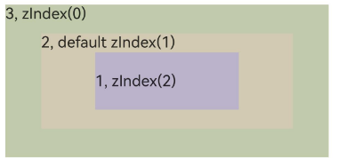
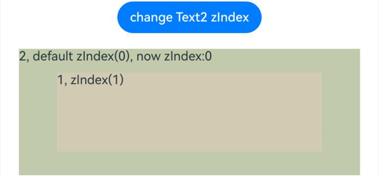
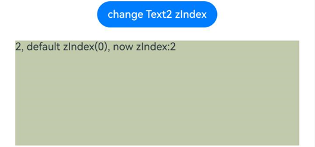
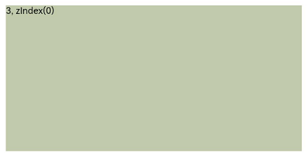

# Z序控制

更新时间：2026-03-09 02:50:43

来源：https://developer.huawei.com/consumer/cn/doc/harmonyos-references/ts-universal-attributes-z-order
**支持设备：** Phone | PC/2in1 | Tablet | Wearable | TV

组件的Z序，设置同一容器中兄弟组件的堆叠顺序。
 
> [!NOTE]
> 从API version 7开始支持。后续版本如有新增内容，则采用上角标单独标记该内容的起始版本。

  

##### zIndex

zIndex(value: number): T
 
设置组件的堆叠顺序。
 
**卡片能力：** 从API version 9开始，该接口支持在ArkTS卡片中使用。
 
**元服务API：** 从API version 11开始，该接口支持在元服务中使用。
 
**系统能力：** SystemCapability.ArkUI.ArkUI.Full
 
**参数：**
  
| 参数名 | 类型 | 必填 | 说明 |
| --- | --- | --- | --- |
| value | number | 是 | 同一容器中兄弟组件显示层级关系。zIndex值越大，显示层级越高，即zIndex值大的组件会覆盖在zIndex值小的组件上方。当不涉及新增或减少兄弟节点，动态改变zIndex时会在zIndex改变前层级顺序的基础上进行稳定排序。 |
 
 
**返回值：**
  
| 类型 | 说明 |
| --- | --- |
| T | 返回当前组件。 |
 
 
  

##### 示例

  

##### 示例1（设置组件堆叠顺序）

该示例通过zIndex设置组件堆叠顺序。
 
```ArkTS
// xxx.ets
@Entry
@Component
struct ZIndexExample {
  build() {
    Column() {
      Stack() {
        // Stack会重叠组件，默认后定义的在最上面，具有较高zIndex值的元素在zIndex较小的元素前面
        // Text1设置zIndex值为2
        Text('1, zIndex(2)')
          .size({ width: '40%', height: '30%' }).backgroundColor(0xbbb2cb)
          .zIndex(2)
        // Text2设置zIndex值为1
        Text('2, default zIndex(1)')
          .size({ width: '70%', height: '50%' }).backgroundColor(0xd2cab3).align(Alignment.TopStart)
          .zIndex(1)
        // Text3设置zIndex值为0
        Text('3, zIndex(0)')
          .size({ width: '90%', height: '80%' }).backgroundColor(0xc1cbac).align(Alignment.TopStart)
          .zIndex(0)
      }.width('100%').height(200)
    }.width('100%').height(200)
  }
}
```
 
Stack容器内子组件不设置zIndex的效果。
 



 
Stack容器子组件设置zIndex后的效果。
 



 
  

##### 示例2（动态修改zIndex属性）

该示例使用Button组件动态修改zIndex属性。
 
```ArkTS
// xxx.ets
@Entry
@Component
struct ZIndexExample {
  @State zIndex_: number = 0

  build() {
    Column() {
      // 点击Button改变zIndex后，在点击Button前的层级顺序上根据zIndex进行稳定排序。
      Button("change Text2 zIndex")
        .onClick(() => {
          this.zIndex_ = (this.zIndex_ + 1) % 3;
        })
      Stack() {
        // Text1设置zIndex值为1
        Text('1, zIndex(1)')
          .size({ width: '70%', height: '50%' }).backgroundColor(0xd2cab3).align(Alignment.TopStart)
          .zIndex(1)
        // Text2设置zIndex默认值为0
        Text('2, default zIndex(0), now zIndex:' + this.zIndex_)
          .size({ width: '90%', height: '80%' }).backgroundColor(0xc1cbac).align(Alignment.TopStart)
          .zIndex(this.zIndex_)
      }.width('100%').height(200)
    }.width('100%').height(200)
  }
}
```
 
不点击Button修改zIndex值的效果。
 


 
点击Button动态修改zIndex，使Text1和Text2的zIndex相等，因为在点击Button前的层级顺序上根据zIndex进行稳定排序，层级顺序不发生改变。
 



 
点击Button动态修改zIndex，使Text2的zIndex大于Text1，层级顺序发生改变。
 



 
  

##### 示例3（设置不同容器内组件的zIndex属性）

该示例在不同容器内设置zIndex属性。其中，Text1、Text2和Text3在不同的Stack容器内。虽然Text3的zIndex值最小，但Text1、Text2仍无法按照预期显示在Text3的上方。
 
```ArkTS
// xxx.ets
@Entry
@Component
struct ZIndexExample {
  build() {
    Stack() {
      Stack() {
        // Text1设置zIndex值为2
        Text('1, zIndex(2)')
          .size({ width: '40%', height: '30%' }).backgroundColor(0xbbb2cb)
          .zIndex(2)
        // Text2设置zIndex值为1
        Text('2, default zIndex(1)')
          .size({ width: '70%', height: '50%' }).backgroundColor(0xd2cab3).align(Alignment.TopStart)
          .zIndex(1)
      }.width('100%').height(200)

      Stack() {
        // zIndex在不同容器的组件中无法生效，Text3会显示在最上方
        // Text3设置zIndex值为0
        Text('3, zIndex(0)')
          .size({ width: '90%', height: '80%' }).backgroundColor(0xc1cbac).align(Alignment.TopStart)
          .zIndex(0)
      }.width('100%').height(200)
    }.width('100%').height(200)
  }
}
```
 


