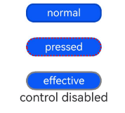
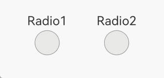
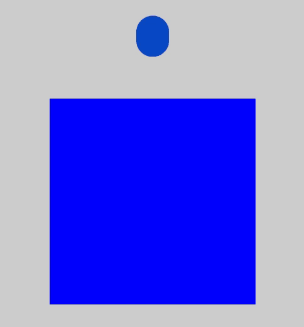

# 多态样式

更新时间：2026-03-09 02:50:43

来源：https://developer.huawei.com/consumer/cn/doc/harmonyos-references/ts-universal-attributes-polymorphic-style
**支持设备：** Phone / PC/2in1 / Tablet / Wearable / TV

设置组件不同状态下的样式。


## stateStyles
**支持设备：** Phone / PC/2in1 / Tablet / Wearable / TV

stateStyles(value: StateStyles): T

设置组件不同状态的样式。


> [!NOTE]
> 该接口不支持在[attributeModifier](https://developer.huawei.com/consumer/cn/doc/harmonyos-references/ts-universal-attributes-attribute-modifier#attributemodifier)中调用。

**卡片能力：** 从API version 9开始，该接口支持在ArkTS卡片中使用。

**元服务API：** 从API version 11开始，该接口支持在元服务中使用。

**系统能力：** SystemCapability.ArkUI.ArkUI.Full

**参数：**


| 参数名 | 类型 | 必填 | 说明 |
| --- | --- | --- | --- |
| value | [StateStyles](#statestyles-1) | 是 | 设置组件不同状态的样式。 |


**返回值：**


| 类型 | 说明 |
| --- | --- |
| T | 返回当前组件。 |


## StateStyles
**支持设备：** Phone / PC/2in1 / Tablet / Wearable / TV

**元服务API：** 从API version 11开始，该接口支持在元服务中使用。

**系统能力：** SystemCapability.ArkUI.ArkUI.Full


| 名称 | 类型 | 只读 | 可选 | 说明 |
| --- | --- | --- | --- | --- |
| normal | any | 否 | 是 | 组件无状态时的样式。          卡片能力： 从API version 9开始，该接口支持在ArkTS卡片中使用。 |
| pressed | any | 否 | 是 | 组件按下状态的样式。          卡片能力： 从API version 9开始，该接口支持在ArkTS卡片中使用。 |
| disabled | any | 否 | 是 | 组件禁用状态的样式。          卡片能力： 从API version 9开始，该接口支持在ArkTS卡片中使用。 |
| focused | any | 否 | 是 | 组件获焦状态的样式。          卡片能力： 从API version 9开始，该接口支持在ArkTS卡片中使用。 |
| clicked | any | 否 | 是 | 组件点击状态的样式。          卡片能力： 从API version 9开始，该接口支持在ArkTS卡片中使用。 |
| selected10+ | object | 否 | 是 | 组件选中状态的样式。          卡片能力： 从API version 10开始，该接口支持在ArkTS卡片中使用。 |


**selected选中状态说明**


- 当前多态样式的选中状态样式依赖组件选中属性值，可以使用[点击事件](https://developer.huawei.com/consumer/cn/doc/harmonyos-references/ts-universal-events-click)修改属性值，或使用属性自带[\$\$](https://developer.huawei.com/consumer/cn/doc/harmonyos-guides/arkts-two-way-sync)双向绑定功能。
- 当前支持selected的组件及其参数/属性值：                                             组件           支持的参数/属性           起始API版本                                                 [Checkbox](https://developer.huawei.com/consumer/cn/doc/harmonyos-references/ts-basic-components-checkbox)           select           10                               [CheckboxGroup](https://developer.huawei.com/consumer/cn/doc/harmonyos-references/ts-basic-components-checkboxgroup)           selectAll           10                               [Radio](https://developer.huawei.com/consumer/cn/doc/harmonyos-references/ts-basic-components-radio)           checked           10                               [Toggle](https://developer.huawei.com/consumer/cn/doc/harmonyos-references/ts-basic-components-toggle)           isOn           10                               [ListItem](https://developer.huawei.com/consumer/cn/doc/harmonyos-references/ts-container-listitem)           selected           10                               [GridItem](https://developer.huawei.com/consumer/cn/doc/harmonyos-references/ts-container-griditem)           selected           10                               [MenuItem](https://developer.huawei.com/consumer/cn/doc/harmonyos-references/ts-basic-components-menuitem)           selected           10

**pressed和clicked状态说明**


- 当clicked和pressed同时在一个组件上使用时，只有后注册的状态才能生效。


## 示例
**支持设备：** Phone / PC/2in1 / Tablet / Wearable / TV


### 示例1（设置Text多态样式）

该示例展示了状态为pressed和disabled时Text组件的样式变化。


```ts
// xxx.ets
@Entry
@Component
struct StyleExample {
  @State isEnable: boolean = true

  @Styles
  pressedStyles(): void {
    .backgroundColor("#ED6F21")
    .borderRadius(10)
    .borderStyle(BorderStyle.Dashed)
    .borderWidth(2)
    .borderColor("#33000000")
    .width(120)
    .height(30)
    .opacity(1)
  }

  @Styles
  disabledStyles(): void {
    .backgroundColor("#E5E5E5")
    .borderRadius(10)
    .borderStyle(BorderStyle.Solid)
    .borderWidth(2)
    .borderColor("#2a4c1919")
    .width(90)
    .height(25)
    .opacity(1)
  }

  @Styles
  normalStyles(): void {
    .backgroundColor("#0A59F7")
    .borderRadius(10)
    .borderStyle(BorderStyle.Solid)
    .borderWidth(2)
    .borderColor("#33000000")
    .width(100)
    .height(25)
    .opacity(1)
  }

  build() {
    Flex({ direction: FlexDirection.Column, alignItems: ItemAlign.Center }) {
      Text("normal")
      .fontSize(14)
      .fontColor(Color.White)
      .opacity(0.5)
      // stateStyles设置组件无状态时的样式
      .stateStyles({
        normal: this.normalStyles,
      })
      .margin({ bottom: 20 })
      .textAlign(TextAlign.Center)
      Text("pressed")
      .backgroundColor("#0A59F7")
      .borderRadius(20)
      .borderStyle(BorderStyle.Dotted)
      .borderWidth(2)
      .borderColor(Color.Red)
      .width(100)
      .height(25)
      .opacity(1)
      .fontSize(14)
      .fontColor(Color.White)
      // stateStyles设置组件按下状态时的样式
      .stateStyles({
        pressed: this.pressedStyles,
      })
      .margin({ bottom: 20 })
      .textAlign(TextAlign.Center)
      Text(this.isEnable == true ? "effective" : "disabled")
      .backgroundColor("#0A59F7")
      .borderRadius(20)
      .borderStyle(BorderStyle.Solid)
      .borderWidth(2)
      .borderColor(Color.Gray)
      .width(100)
      .height(25)
      .opacity(1)
      .fontSize(14)
      .fontColor(Color.White)
      .enabled(this.isEnable)
      // stateStyles设置组件禁用状态时的样式
      .stateStyles({
        disabled: this.disabledStyles,
      })
      .textAlign(TextAlign.Center)
      Text("control disabled")
      .onClick(() => {
        this.isEnable = !this.isEnable
        console.info(`${this.isEnable}`)
      })
    }
    .width(350).height(300)
  }
}
```




### 示例2（设置Radio多态样式）

该示例展示了状态为selected时Radio组件的样式变化。


```ts
// xxx.ets
@Entry
@Component
struct Index {
  @State value: boolean = false
  @State value2: boolean = false

  @Styles
  normalStyles(): void{
    .backgroundColor("#E5E5E1")
  }

  @Styles
  selectStyles(): void{
    .backgroundColor("#ED6F21")
    .borderWidth(2)
  }

  build() {
    Flex({ direction: FlexDirection.Row, justifyContent: FlexAlign.Center, alignItems: ItemAlign.Center }) {
      Column() {
        Text('Radio1')
        .fontSize(25)
        Radio({ value: 'Radio1', group: 'radioGroup1' })
        .checked(this.value)
        .height(50)
        .width(50)
        .borderWidth(0)
        .borderRadius(30)
        .onClick(() => {
          this.value = !this.value
        })
        .stateStyles({
          normal: this.normalStyles,
          selected: this.selectStyles,
        })
      }
      .margin(30)

      Column() {
        Text('Radio2')
        .fontSize(25)
        Radio({ value: 'Radio2', group: 'radioGroup2' })
        .checked($$this.value2)
        .height(50)
        .width(50)
        .borderWidth(0)
        .borderRadius(30)
        .stateStyles({
          normal: this.normalStyles,
          selected: this.selectStyles,
        })
      }
      .margin(30)
  }.padding({ top: 30 })
  }
}
```




### 示例3（设置Builder多态样式）

该示例展示了状态为pressed时Builder组件的样式变化。


```ts
import { ComponentContent } from '@kit.ArkUI';
import { BusinessError } from '@kit.BasicServicesKit';

@Component
struct Child {
  build() {
    Row()
    .zIndex(10)
    .width(200)
    .height(200)
    .stateStyles({
      normal: {
        .backgroundColor(Color.Blue)
      },
      pressed: {
        .backgroundColor(Color.Black)
      }
    })
  }
}

@Builder
function buildText() {
  Child()
}

@Entry
@Component
struct Index {
  private contentNode: ComponentContent<Object> =
  new ComponentContent(this.getUIContext(), wrapBuilder(buildText));

  build() {
    Column() {
      Button().margin({ top: 200 }).onClick((event: ClickEvent) => {
        this.getUIContext()
        .getPromptAction()
        .openCustomDialog(this.contentNode)
        .then(() => {
          console.info('OpenCustomDialog complete.')
        })
        .catch((error: BusinessError) => {
          let message = (error as BusinessError).message;
          let code = (error as BusinessError).code;
          console.error(`OpenCustomDialog args error code is ${code}, message is ${message}`);
        })
      })
    }
    .width('100%')
    .height('100%')
  }
}
```


