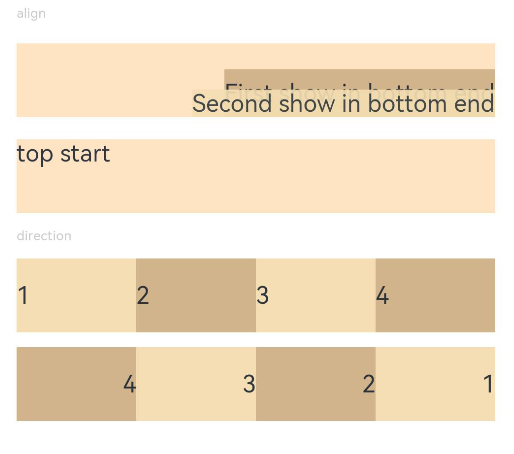
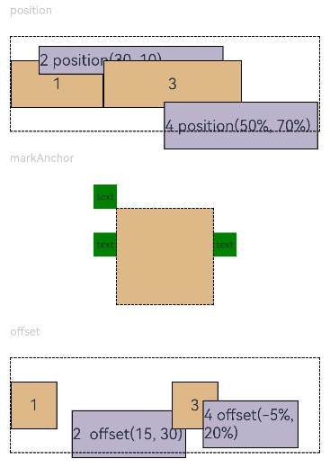
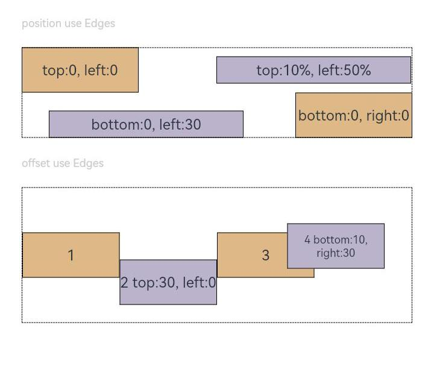
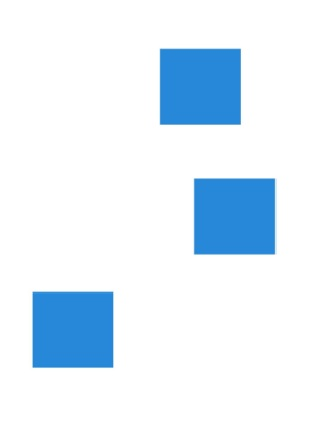
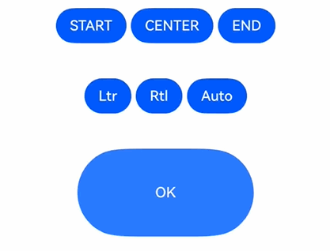
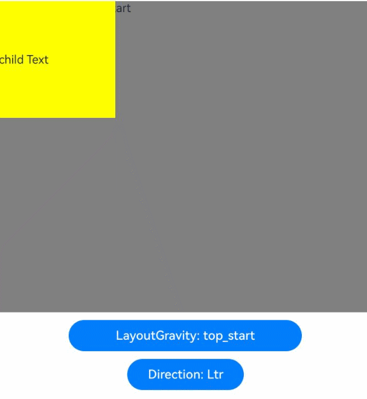

# 位置设置

更新时间：2026-04-24 08:10:21

来源：https://developer.huawei.com/consumer/cn/doc/harmonyos-references/ts-universal-attributes-location
**支持设备：** Phone / PC/2in1 / Tablet / Wearable / TV

设置组件对齐方式、布局方向及显示位置。


## align
**支持设备：** Phone / PC/2in1 / Tablet / Wearable / TV

align(value: Alignment): T

设置当前组件绘制区域内的子组件的对齐方式，支持[attributeModifier](https://developer.huawei.com/consumer/cn/doc/harmonyos-references/ts-universal-attributes-attribute-modifier#attributemodifier)动态设置属性方法。

**卡片能力：** 从API version 9开始，该接口支持在ArkTS卡片中使用。

**元服务API：** 从API version 11开始，该接口支持在元服务中使用。

**系统能力：** SystemCapability.ArkUI.ArkUI.Full

**参数：**


| 参数名 | 类型 | 必填 | 说明 |
| --- | --- | --- | --- |
| value | [Alignment](https://developer.huawei.com/consumer/cn/doc/harmonyos-references/ts-appendix-enums#alignment) | 是 | 设置当前组件绘制区域内的子组件的对齐方式。          只在[Stack](https://developer.huawei.com/consumer/cn/doc/harmonyos-references/ts-container-stack)、[FolderStack](https://developer.huawei.com/consumer/cn/doc/harmonyos-references/ts-container-folderstack)、[Shape](https://developer.huawei.com/consumer/cn/doc/harmonyos-references/ts-drawing-components-shape)、[Button](https://developer.huawei.com/consumer/cn/doc/harmonyos-references/ts-basic-components-button)、[Marquee](https://developer.huawei.com/consumer/cn/doc/harmonyos-references/ts-basic-components-marquee)、[StepperItem](https://developer.huawei.com/consumer/cn/doc/harmonyos-references/ts-basic-components-stepperitem)、[Text](https://developer.huawei.com/consumer/cn/doc/harmonyos-references/ts-basic-components-text)、[TextArea](https://developer.huawei.com/consumer/cn/doc/harmonyos-references/ts-basic-components-textarea)、[TextInput](https://developer.huawei.com/consumer/cn/doc/harmonyos-references/ts-basic-components-textinput)、[RichEditor](https://developer.huawei.com/consumer/cn/doc/harmonyos-references/ts-basic-components-richeditor)、[Hyperlink](https://developer.huawei.com/consumer/cn/doc/harmonyos-references/ts-container-hyperlink)、[SymbolGlyph](https://developer.huawei.com/consumer/cn/doc/harmonyos-references/ts-basic-components-symbolglyph)、[ListItem](https://developer.huawei.com/consumer/cn/doc/harmonyos-references/ts-container-listitem)、[GridItem](https://developer.huawei.com/consumer/cn/doc/harmonyos-references/ts-container-griditem)、[Scroll](https://developer.huawei.com/consumer/cn/doc/harmonyos-references/ts-container-scroll)、[FlowItem](https://developer.huawei.com/consumer/cn/doc/harmonyos-references/ts-container-flowitem)、[ImageAnimator](https://developer.huawei.com/consumer/cn/doc/harmonyos-references/ts-basic-components-imageanimator)、[LoadingProgress](https://developer.huawei.com/consumer/cn/doc/harmonyos-references/ts-basic-components-loadingprogress)、[PatternLock](https://developer.huawei.com/consumer/cn/doc/harmonyos-references/ts-basic-components-patternlock)、[Progress](https://developer.huawei.com/consumer/cn/doc/harmonyos-references/ts-basic-components-progress)、[QRCode](https://developer.huawei.com/consumer/cn/doc/harmonyos-references/ts-basic-components-qrcode)、[TextClock](https://developer.huawei.com/consumer/cn/doc/harmonyos-references/ts-basic-components-textclock)、[TextTimer](https://developer.huawei.com/consumer/cn/doc/harmonyos-references/ts-basic-components-texttimer)、[MenuItem](https://developer.huawei.com/consumer/cn/doc/harmonyos-references/ts-basic-components-menuitem)、[Toggle](https://developer.huawei.com/consumer/cn/doc/harmonyos-references/ts-basic-components-toggle)、[Checkbox](https://developer.huawei.com/consumer/cn/doc/harmonyos-references/ts-basic-components-checkbox)、[NodeContainer](https://developer.huawei.com/consumer/cn/doc/harmonyos-references/ts-basic-components-nodecontainer)中生效，其中和文本相关的组件Marquee、Text、TextArea、TextInput、RichEditor、Hyperlink的align结果参考[textAlign](https://developer.huawei.com/consumer/cn/doc/harmonyos-references/ts-basic-components-text#textalign)。          不支持textAlign属性的组件则无法设置水平方向的文字对齐。          默认值：Alignment.Center          说明：          该属性在[Stack](https://developer.huawei.com/consumer/cn/doc/harmonyos-references/ts-container-stack)组件上支持镜像能力，在其他组件上不支持镜像能力。          在Stack中该属性与alignContent效果一致，只能设置子组件在当前组件内的对齐方式。 |


**返回值：**


| 类型 | 说明 |
| --- | --- |
| T | 返回当前组件。 |


## align20+
**支持设备：** Phone / PC/2in1 / Tablet / Wearable / TV

align(alignment: Alignment | LocalizedAlignment): T

设置当前组件绘制区域内的子组件的对齐方式，增加支持镜像的能力，支持[attributeModifier](https://developer.huawei.com/consumer/cn/doc/harmonyos-references/ts-universal-attributes-attribute-modifier#attributemodifier)动态设置属性方法。

**卡片能力：** 从API version 20开始，该接口支持在ArkTS卡片中使用。

**元服务API：** 从API version 20开始，该接口支持在元服务中使用。

**系统能力：** SystemCapability.ArkUI.ArkUI.Full

**参数：**


| 参数名 | 类型 | 必填 | 说明 |
| --- | --- | --- | --- |
| alignment | [Alignment](https://developer.huawei.com/consumer/cn/doc/harmonyos-references/ts-appendix-enums#alignment) \| [LocalizedAlignment](https://developer.huawei.com/consumer/cn/doc/harmonyos-references/ts-appendix-enums#localizedalignment20) | 是 | 设置当前组件绘制区域内的子组件的对齐方式，增加支持镜像的能力。          LocalizedAlignment只在[Shape](https://developer.huawei.com/consumer/cn/doc/harmonyos-references/ts-drawing-components-shape)、[Button](https://developer.huawei.com/consumer/cn/doc/harmonyos-references/ts-basic-components-button)、[GridItem](https://developer.huawei.com/consumer/cn/doc/harmonyos-references/ts-container-griditem)、[FlowItem](https://developer.huawei.com/consumer/cn/doc/harmonyos-references/ts-container-flowitem)、[ImageAnimator](https://developer.huawei.com/consumer/cn/doc/harmonyos-references/ts-basic-components-imageanimator)、[LoadingProgress](https://developer.huawei.com/consumer/cn/doc/harmonyos-references/ts-basic-components-loadingprogress)、[PatternLock](https://developer.huawei.com/consumer/cn/doc/harmonyos-references/ts-basic-components-patternlock)、[Progress](https://developer.huawei.com/consumer/cn/doc/harmonyos-references/ts-basic-components-progress)、[QRCode](https://developer.huawei.com/consumer/cn/doc/harmonyos-references/ts-basic-components-qrcode)、[TextClock](https://developer.huawei.com/consumer/cn/doc/harmonyos-references/ts-basic-components-textclock)、[TextTimer](https://developer.huawei.com/consumer/cn/doc/harmonyos-references/ts-basic-components-texttimer)、[StepperItem](https://developer.huawei.com/consumer/cn/doc/harmonyos-references/ts-basic-components-stepperitem)、[MenuItem](https://developer.huawei.com/consumer/cn/doc/harmonyos-references/ts-basic-components-menuitem)、[Toggle](https://developer.huawei.com/consumer/cn/doc/harmonyos-references/ts-basic-components-toggle)、[Checkbox](https://developer.huawei.com/consumer/cn/doc/harmonyos-references/ts-basic-components-checkbox)、[ListItem](https://developer.huawei.com/consumer/cn/doc/harmonyos-references/ts-container-listitem)中有效果。          其中，除[ListItem](https://developer.huawei.com/consumer/cn/doc/harmonyos-references/ts-container-listitem)与Alignment的效果保持一致以外，其他组件镜像切换均生效；其他设置LocalizedAlignment无效果的组件按其默认效果显示。          默认值：Alignment.Center、LocalizedAlignment.CENTER          设置异常值按默认值处理，效果为居中显示。          说明：          Alignment类型不支持镜像能力；LocalizedAlignment类型支持镜像能力，选择LocalizedAlignment中的枚举值，根据direction或系统语言方向的改变实现镜像切换。其中direction的优先级高于系统语言方向，当设置direction且不为auto时，LocalizedAlignment的镜像按照direction进行布局；当设置direction为auto或未设置时，LocalizedAlignment的镜像按照系统语言方向进行布局。 |


**返回值：**


| 类型 | 说明 |
| --- | --- |
| T | 返回当前组件。 |


## direction
**支持设备：** Phone / PC/2in1 / Tablet / Wearable / TV

direction(value: Direction): T

设置当前组件绘制区域内主轴方向上的布局，支持[attributeModifier](https://developer.huawei.com/consumer/cn/doc/harmonyos-references/ts-universal-attributes-attribute-modifier#attributemodifier)动态设置属性方法。

**卡片能力：** 从API version 9开始，该接口支持在ArkTS卡片中使用。

**元服务API：** 从API version 11开始，该接口支持在元服务中使用。

**系统能力：** SystemCapability.ArkUI.ArkUI.Full

**参数：**


| 参数名 | 类型 | 必填 | 说明 |
| --- | --- | --- | --- |
| value | [Direction](https://developer.huawei.com/consumer/cn/doc/harmonyos-references/ts-appendix-enums#direction) | 是 | 设置当前组件绘制区域内主轴方向上的布局。          属性配置为auto的时候，按照系统语言方向进行布局。          该属性在Column组件上不生效。          默认值：Direction.Auto          direction取undefined或null时按默认值处理。 |


**返回值：**


| 类型 | 说明 |
| --- | --- |
| T | 返回当前组件。 |


## position
**支持设备：** Phone / PC/2in1 / Tablet / Wearable / TV

position(value: Position | Edges | LocalizedEdges): T

绝对定位，确定子组件相对父组件内容区的位置，支持[attributeModifier](https://developer.huawei.com/consumer/cn/doc/harmonyos-references/ts-universal-attributes-attribute-modifier#attributemodifier)动态设置属性方法。


**卡片能力：** 从API version 9开始，该接口支持在ArkTS卡片中使用。

**元服务API：** 从API version 11开始，该接口支持在元服务中使用。

**系统能力：** SystemCapability.ArkUI.ArkUI.Full

**参数：**


| 参数名 | 类型 | 必填 | 说明 |
| --- | --- | --- | --- |
| value | [Position](https://developer.huawei.com/consumer/cn/doc/harmonyos-references/ts-types#position) \| [Edges12+](https://developer.huawei.com/consumer/cn/doc/harmonyos-references/ts-types#edges12) \| [LocalizedEdges12+](https://developer.huawei.com/consumer/cn/doc/harmonyos-references/ts-types#localizededges12) | 是 | 绝对定位，确定子组件相对父组件内容区的位置，父组件内容区的大小为父组件大小减去[border](https://developer.huawei.com/consumer/cn/doc/harmonyos-references/ts-universal-attributes-border#border)、[padding](https://developer.huawei.com/consumer/cn/doc/harmonyos-references/ts-universal-attributes-size#padding)、[safeAreaPadding](https://developer.huawei.com/consumer/cn/doc/harmonyos-references/ts-universal-attributes-size#safeareapadding14)后提供给子组件可布局的内容区域大小。          设置异常值时该属性不生效。 |


**返回值：**


| 类型 | 说明 |
| --- | --- |
| T | 返回当前组件。 |


## markAnchor
**支持设备：** Phone / PC/2in1 / Tablet / Wearable / TV

markAnchor(value: Position | LocalizedPosition): T

设置元素在位置定位时的锚点，支持[attributeModifier](https://developer.huawei.com/consumer/cn/doc/harmonyos-references/ts-universal-attributes-attribute-modifier#attributemodifier)动态设置属性方法。

**卡片能力：** 从API version 9开始，该接口支持在ArkTS卡片中使用。

**元服务API：** 从API version 11开始，该接口支持在元服务中使用。

**系统能力：** SystemCapability.ArkUI.ArkUI.Full

**参数：**


| 参数名 | 类型 | 必填 | 说明 |
| --- | --- | --- | --- |
| value | [Position](https://developer.huawei.com/consumer/cn/doc/harmonyos-references/ts-types#position) \| [LocalizedPosition12+](https://developer.huawei.com/consumer/cn/doc/harmonyos-references/ts-types#localizedposition12) | 是 | 设置元素在位置定位时的锚点，基于position或offset的初始位置，进行进一步的偏移调整。          设置.position({x: value1, y: value2}).markAnchor({x: value3, y: value4})，效果等于设置.position({x: value1 - value3, y: value2 - value4})，offset同理。          单独设置.markAnchor({x: value1, y: value2})，效果等于设置.offset({x: -value1, y: -value2})。          API version 9及以前，默认值为：{x: 0, y: 0}          API version 10：无默认值。          设置异常值时该属性不生效。 |


**返回值：**


| 类型 | 说明 |
| --- | --- |
| T | 返回当前组件。 |


## offset
**支持设备：** Phone / PC/2in1 / Tablet / Wearable / TV

offset(value: Position | Edges | LocalizedEdges): T

相对偏移，组件相对原本的布局位置进行偏移。和position一起使用时，position生效，offset不生效，支持[attributeModifier](https://developer.huawei.com/consumer/cn/doc/harmonyos-references/ts-universal-attributes-attribute-modifier#attributemodifier)动态设置属性方法。

**卡片能力：** 从API version 9开始，该接口支持在ArkTS卡片中使用。

**元服务API：** 从API version 11开始，该接口支持在元服务中使用。

**系统能力：** SystemCapability.ArkUI.ArkUI.Full

**参数：**


| 参数名 | 类型 | 必填 | 说明 |
| --- | --- | --- | --- |
| value | [Position](https://developer.huawei.com/consumer/cn/doc/harmonyos-references/ts-types#position) \| [Edges12+](https://developer.huawei.com/consumer/cn/doc/harmonyos-references/ts-types#edges12) \| [LocalizedEdges12+](https://developer.huawei.com/consumer/cn/doc/harmonyos-references/ts-types#localizededges12) | 是 | 相对偏移，组件基于原本的布局位置进行偏移。offset属性不影响父组件布局，仅在绘制时调整位置。          Position类型基于组件自身左上角偏移，Edges类型基于组件自身四边偏移。 offset属性设置{x: x, y: y}与设置{left: x, top: y}以及{right: -x, bottom: -y}效果相同，类型LocalizedEdges支持镜像模式：LTR模式下start等同于x，RTL模式下start等同于-x。          API version 9及以前，默认值为：{x: 0, y: 0}          默认单位：vp          API version 10：无默认值。          设置异常值时该属性不生效。 |


**返回值：**


| 类型 | 说明 |
| --- | --- |
| T | 返回当前组件。 |


## alignRules9+
**支持设备：** Phone / PC/2in1 / Tablet / Wearable / TV

alignRules(value: AlignRuleOption): T

指定设置在相对布局组件中子组件的对齐规则，仅当父组件为[RelativeContainer](https://developer.huawei.com/consumer/cn/doc/harmonyos-references/ts-container-relativecontainer)时生效，支持[attributeModifier](https://developer.huawei.com/consumer/cn/doc/harmonyos-references/ts-universal-attributes-attribute-modifier#attributemodifier)动态设置属性方法。

**卡片能力：** 从API version 9开始，该接口支持在ArkTS卡片中使用。

**元服务API：** 从API version 11开始，该接口支持在元服务中使用。

**系统能力：** SystemCapability.ArkUI.ArkUI.Full

**参数：**


| 参数名 | 类型 | 必填 | 说明 |
| --- | --- | --- | --- |
| value | [AlignRuleOption](#alignruleoption9对象说明) | 是 | 指定设置在相对布局组件中子组件的对齐规则。 |


**返回值：**


| 类型 | 说明 |
| --- | --- |
| T | 返回当前组件。 |


## alignRules12+
**支持设备：** Phone / PC/2in1 / Tablet / Wearable / TV

alignRules(alignRule: LocalizedAlignRuleOptions): T

指定设置在相对布局组件中子组件的对齐规则，仅当父组件为[RelativeContainer](https://developer.huawei.com/consumer/cn/doc/harmonyos-references/ts-container-relativecontainer)时生效。该方法水平方向上以start和end分别替代原方法的left和right，以便在RTL模式下能镜像显示，建议使用该方法指定设置在相对布局组件中子组件的对齐规则，支持[attributeModifier](https://developer.huawei.com/consumer/cn/doc/harmonyos-references/ts-universal-attributes-attribute-modifier#attributemodifier)动态设置属性方法。

**卡片能力：** 从API version 12开始，该接口支持在ArkTS卡片中使用。

**元服务API：** 从API version 12开始，该接口支持在元服务中使用。

**系统能力：** SystemCapability.ArkUI.ArkUI.Full

**参数：**


| 参数名 | 类型 | 必填 | 说明 |
| --- | --- | --- | --- |
| alignRule | [LocalizedAlignRuleOptions](#localizedalignruleoptions12对象说明) | 是 | 指定设置在相对布局组件中子组件的对齐规则。 |


**返回值：**


| 类型 | 说明 |
| --- | --- |
| T | 返回当前组件。 |


## layoutGravity20+
**支持设备：** Phone / PC/2in1 / Tablet / Wearable / TV

layoutGravity(alignment: LocalizedAlignment): T

单独设置Stack组件中子组件的对齐规则，仅当父组件为Stack时生效。与align属性同时使用时，layoutGravity优先级更高，支持[attributeModifier](https://developer.huawei.com/consumer/cn/doc/harmonyos-references/ts-universal-attributes-attribute-modifier#attributemodifier)动态设置属性方法。

**卡片能力：** 从API version 20开始，该接口支持在ArkTS卡片中使用。

**元服务API：** 从API version 20开始，该接口支持在元服务中使用。

**系统能力：** SystemCapability.ArkUI.ArkUI.Full

**参数：**


| 参数名 | 类型 | 必填 | 说明 |
| --- | --- | --- | --- |
| alignment | [LocalizedAlignment](https://developer.huawei.com/consumer/cn/doc/harmonyos-references/ts-appendix-enums#localizedalignment20) | 是 | 指定设置在Stack组件中子组件的对齐规则。          默认值：LocalizedAlignment.CENTER 。说明：当传入异常值时，按默认值处理。 |


**返回值：**


| 类型 | 说明 |
| --- | --- |
| T | 返回当前组件。 |


## AlignRuleOption9+对象说明
**支持设备：** Phone / PC/2in1 / Tablet / Wearable / TV

**卡片能力：** 从API version 9开始，该接口支持在ArkTS卡片中使用。

**系统能力：** SystemCapability.ArkUI.ArkUI.Full


| 名称 | 类型 | 只读 | 可选 | 说明 |
| --- | --- | --- | --- | --- |
| left | [HorizontalAlignParam](#horizontalalignparam23对象说明) | 否 | 是 | 设置左对齐参数。          API version 23之前，入参类型为{ anchor: string, align: [HorizontalAlign](https://developer.huawei.com/consumer/cn/doc/harmonyos-references/ts-appendix-enums#horizontalalign) }。          元服务API： 从API version 11开始，该接口支持在元服务中使用。 |
| right | [HorizontalAlignParam](#horizontalalignparam23对象说明) | 否 | 是 | 设置右对齐参数。          API version 23之前，入参类型为{ anchor: string, align: [HorizontalAlign](https://developer.huawei.com/consumer/cn/doc/harmonyos-references/ts-appendix-enums#horizontalalign) }。          元服务API： 从API version 11开始，该接口支持在元服务中使用。 |
| middle | [HorizontalAlignParam](#horizontalalignparam23对象说明) | 否 | 是 | 设置横向居中对齐方式的参数。          API version 23之前，入参类型为{ anchor: string, align: [HorizontalAlign](https://developer.huawei.com/consumer/cn/doc/harmonyos-references/ts-appendix-enums#horizontalalign) }。          元服务API： 从API version 11开始，该接口支持在元服务中使用。 |
| top | [VerticalAlignParam](#verticalalignparam23对象说明) | 否 | 是 | 设置顶部对齐的参数。          API version 23之前，入参类型为{ anchor: string, align: [VerticalAlign](https://developer.huawei.com/consumer/cn/doc/harmonyos-references/ts-appendix-enums#verticalalign) }。          元服务API： 从API version 11开始，该接口支持在元服务中使用。 |
| bottom | [VerticalAlignParam](#verticalalignparam23对象说明) | 否 | 是 | 设置底部对齐的参数。          API version 23之前，入参类型为{ anchor: string, align: [VerticalAlign](https://developer.huawei.com/consumer/cn/doc/harmonyos-references/ts-appendix-enums#verticalalign) }。          元服务API： 从API version 11开始，该接口支持在元服务中使用。 |
| center | [VerticalAlignParam](#verticalalignparam23对象说明) | 否 | 是 | 设置纵向居中对齐方式的参数。          API version 23，之前入参类型为{ anchor: string, align: [VerticalAlign](https://developer.huawei.com/consumer/cn/doc/harmonyos-references/ts-appendix-enums#verticalalign) }。          元服务API： 从API version 11开始，该接口支持在元服务中使用。 |
| bias11+ | [Bias](https://developer.huawei.com/consumer/cn/doc/harmonyos-references/ts-types#bias对象说明) | 否 | 是 | 设置组件在锚点约束下的偏移参数，其值为到左/上侧锚点的距离与锚点间总距离的比值。          卡片能力： 从API version 11开始，该接口支持在ArkTS卡片中使用。          元服务API： 从API version 12开始，该接口支持在元服务中使用。 |


## HorizontalAlignParam23+对象说明
**支持设备：** Phone / PC/2in1 / Tablet / Wearable / TV

定义在相对布局组件中子组件在水平方向上的对齐规则。


> [!NOTE]
> 为规范匿名对象的定义，从API version 23开始，修改了此处的元素定义。其中，保留了历史匿名对象的起始版本信息，会出现外层元素@since版本号高于内层元素版本号的情况，但这不影响接口的使用。

**卡片能力：** 从API version 23开始，该接口支持在ArkTS卡片中使用。

**元服务API：** 从API version 23开始，该接口支持在元服务中使用。

**系统能力：** SystemCapability.ArkUI.ArkUI.Full


| 名称 | 类型 | 只读 | 可选 | 说明 |
| --- | --- | --- | --- | --- |
| anchor9+ | string | 否 | 否 | 设置作为锚点的组件的id值。          卡片能力： 从API version 9开始，该接口支持在ArkTS卡片中使用。          元服务API： 从API version 11开始，该接口支持在元服务中使用。 |
| align9+ | [HorizontalAlign](https://developer.huawei.com/consumer/cn/doc/harmonyos-references/ts-appendix-enums#horizontalalign) | 否 | 否 | 设置相对于锚点组件的横向对齐方式。          卡片能力： 从API version 9开始，该接口支持在ArkTS卡片中使用。          元服务API： 从API version 11开始，该接口支持在元服务中使用。 |


## VerticalAlignParam23+对象说明
**支持设备：** Phone / PC/2in1 / Tablet / Wearable / TV

定义在相对布局组件中子组件在垂直方向上的对齐规则。


> [!NOTE]
> 为规范匿名对象的定义，从API version 23开始，修改了此处的元素定义。其中，保留了历史匿名对象的起始版本信息，会出现外层元素@since版本号高于内层元素版本号的情况，但这不影响接口的使用。

**卡片能力：** 从API version 23开始，该接口支持在ArkTS卡片中使用。

**元服务API：** 从API version 23开始，该接口支持在元服务中使用。

**系统能力：** SystemCapability.ArkUI.ArkUI.Full


| 名称 | 类型 | 只读 | 可选 | 说明 |
| --- | --- | --- | --- | --- |
| anchor9+ | string | 否 | 否 | 设置作为锚点的组件的id值。          卡片能力： 从API version 9开始，该接口支持在ArkTS卡片中使用。          元服务API： 从API version 11开始，该接口支持在元服务中使用。 |
| align9+ | [VerticalAlign](https://developer.huawei.com/consumer/cn/doc/harmonyos-references/ts-appendix-enums#verticalalign) | 否 | 否 | 设置相对于锚点组件的纵向对齐方式。          卡片能力： 从API version 9开始，该接口支持在ArkTS卡片中使用。          元服务API： 从API version 11开始，该接口支持在元服务中使用。 |


## LocalizedAlignRuleOptions12+对象说明
**支持设备：** Phone / PC/2in1 / Tablet / Wearable / TV

**元服务API：** 从API version 12开始，该接口支持在元服务中使用。

**系统能力：** SystemCapability.ArkUI.ArkUI.Full


| 名称 | 类型 | 只读 | 可选 | 说明 |
| --- | --- | --- | --- | --- |
| start | [LocalizedHorizontalAlignParam](#localizedhorizontalalignparam12对象说明) | 否 | 是 | 设置横向对齐方式的参数，LTR模式时为左对齐，RTL模式时为右对齐。 |
| end | [LocalizedHorizontalAlignParam](#localizedhorizontalalignparam12对象说明) | 否 | 是 | 设置横向对齐方式的参数，LTR模式时为右对齐，RTL模式时为左对齐。 |
| middle | [LocalizedHorizontalAlignParam](#localizedhorizontalalignparam12对象说明) | 否 | 是 | 设置横向居中对齐方式的参数。 |
| top | [LocalizedVerticalAlignParam](#localizedverticalalignparam12对象说明) | 否 | 是 | 设置纵向顶部对齐的参数。 |
| bottom | [LocalizedVerticalAlignParam](#localizedverticalalignparam12对象说明) | 否 | 是 | 设置纵向底部对齐的参数。 |
| center | [LocalizedVerticalAlignParam](#localizedverticalalignparam12对象说明) | 否 | 是 | 设置纵向居中对齐方式的参数。 |
| bias | [Bias](https://developer.huawei.com/consumer/cn/doc/harmonyos-references/ts-types#bias对象说明) | 否 | 是 | 设置组件在锚点约束下的偏移参数，其值为到左/上侧锚点的距离与锚点间总距离的比值。 |


## LocalizedHorizontalAlignParam12+对象说明
**支持设备：** Phone / PC/2in1 / Tablet / Wearable / TV

**元服务API：** 从API version 12开始，该接口支持在元服务中使用。

**系统能力：** SystemCapability.ArkUI.ArkUI.Full


| 名称 | 类型 | 只读 | 可选 | 说明 |
| --- | --- | --- | --- | --- |
| anchor | string | 否 | 否 | 设置作为锚点的组件的id值。 |
| align | [HorizontalAlign](https://developer.huawei.com/consumer/cn/doc/harmonyos-references/ts-appendix-enums#horizontalalign) | 否 | 否 | 设置相对于锚点组件的横向对齐方式。 |


## LocalizedVerticalAlignParam12+对象说明
**支持设备：** Phone / PC/2in1 / Tablet / Wearable / TV

**元服务API：** 从API version 12开始，该接口支持在元服务中使用。

**系统能力：** SystemCapability.ArkUI.ArkUI.Full


| 名称 | 类型 | 只读 | 可选 | 说明 |
| --- | --- | --- | --- | --- |
| anchor | string | 否 | 否 | 设置作为锚点的组件的id值。 |
| align | [VerticalAlign](https://developer.huawei.com/consumer/cn/doc/harmonyos-references/ts-appendix-enums#verticalalign) | 否 | 否 | 设置相对于锚点组件的纵向对齐方式。 |


## chainMode12+
**支持设备：** Phone / PC/2in1 / Tablet / Wearable / TV

chainMode(direction: Axis, style: ChainStyle): T

指定以该组件为链头所构成的链的参数，仅当父组件为[RelativeContainer](https://developer.huawei.com/consumer/cn/doc/harmonyos-references/ts-container-relativecontainer)时生效。链头指满足成链规则时链的第一个组件（水平方向从左边起始，镜像语言下从右边起始；竖直方向从上边起始）。

详细用法请参考[RelativeContainer示例7（设置链）](https://developer.huawei.com/consumer/cn/doc/harmonyos-references/ts-container-relativecontainer#示例7设置链)。

**元服务API：** 从API version 12开始，该接口支持在元服务中使用。

**系统能力：** SystemCapability.ArkUI.ArkUI.Full

**参数：**


| 参数名 | 类型 | 必填 | 说明 |
| --- | --- | --- | --- |
| direction | [Axis](https://developer.huawei.com/consumer/cn/doc/harmonyos-references/ts-appendix-enums#axis) | 是 | 链的方向。 |
| style | [ChainStyle](#chainstyle12) | 是 | 链的样式。 |


**返回值：**


| 类型 | 说明 |
| --- | --- |
| T | 返回当前组件。 |


## ChainStyle12+
**支持设备：** Phone / PC/2in1 / Tablet / Wearable / TV

定义链的风格，支持[attributeModifier](https://developer.huawei.com/consumer/cn/doc/harmonyos-references/ts-universal-attributes-attribute-modifier#attributemodifier)动态设置属性方法。

**元服务API：** 从API version 12开始，该接口支持在元服务中使用。

**系统能力：** SystemCapability.ArkUI.ArkUI.Full


| 名称 | 说明 |
| --- | --- |
| SPREAD | 组件在约束锚点间均匀分布。详细用法请参考[RelativeContainer示例7（设置链）](https://developer.huawei.com/consumer/cn/doc/harmonyos-references/ts-container-relativecontainer#示例7设置链)。 |
| SPREAD_INSIDE | 除首尾2个子组件的其他组件在约束锚点间均匀分布。详细用法请参考[RelativeContainer示例7（设置链）](https://developer.huawei.com/consumer/cn/doc/harmonyos-references/ts-container-relativecontainer#示例7设置链)。 |
| PACKED | 链内子组件无间隙。详细用法请参考[RelativeContainer示例7（设置链）](https://developer.huawei.com/consumer/cn/doc/harmonyos-references/ts-container-relativecontainer#示例7设置链)。 |


> [!NOTE]
> 使用链时，RelativeContainer会为链中的相互依赖的组件定义一个大小计算顺序，大小计算完成后再确定使用ChainStyle的位置。因此使用SPREAD或PACKED风格时，只以链头组件为锚点进行布局的非链组件A和链中其他节点有相同布局优先级，当组件A的id的字典排序靠前时，此时组件A的alignRules先于链的ChainStyle生效。


## chainWeight14+
**支持设备：** Phone / PC/2in1 / Tablet / Wearable / TV

chainWeight(chainWeight: ChainWeightOptions): T

对形成链的组件进行重新布局。仅当父组件为[RelativeContainer](https://developer.huawei.com/consumer/cn/doc/harmonyos-references/ts-container-relativecontainer)时生效。


> [!NOTE]
> 从API version 23开始，支持[attributeModifier](https://developer.huawei.com/consumer/cn/doc/harmonyos-references/ts-universal-attributes-attribute-modifier#attributemodifier)动态设置属性方法。

**系统能力：** SystemCapability.ArkUI.ArkUI.Full

**元服务API：** 从API version 14开始，该接口支持在元服务中使用。

**参数：**


| 参数名 | 类型 | 必填 | 说明 |
| --- | --- | --- | --- |
| chainWeight | [ChainWeightOptions](https://developer.huawei.com/consumer/cn/doc/harmonyos-references/ts-types#chainweightoptions14对象说明) | 是 | 设置了chainWeight属性的组件与同一条链上的兄弟组件在水平或竖直方向的尺寸会按照设置的权重进行分配，分配时会忽略组件本身尺寸设置，按分配的权重自适应占满剩余空间。 |


**返回值：**


| 类型 | 说明 |
| --- | --- |
| T | 返回当前组件。 |


**示例：**

具体示例请参考[示例10（设置链中节点权重）](https://developer.huawei.com/consumer/cn/doc/harmonyos-references/ts-container-relativecontainer#示例10设置链中节点权重)。


## 示例
**支持设备：** Phone / PC/2in1 / Tablet / Wearable / TV


### 示例1（对齐方式和主轴方向上的布局）

设置内容在元素内的对齐方式和子元素在父组件主轴方向上的布局。


```ts
// xxx.ets
@Entry
@Component
struct PositionExample1 {
  build() {
    Column() {
      Column({ space: 10 }) {
        // 元素内容<元素宽高，设置内容在与元素内的对齐方式
        Text('align').fontSize(9).fontColor(0xCCCCCC).width('90%')
        Stack() {
          Text('First show in bottom end').height('65%').backgroundColor(0xD2B48C)
          Text('Second show in bottom end').backgroundColor(0xF5DEB3).opacity(0.9)
      }.width('90%').height(50).margin({ top: 5 }).backgroundColor(0xFFE4C4)
        .align(Alignment.BottomEnd)
        Stack() {
          Text('top start')
      }.width('90%').height(50).margin({ top: 5 }).backgroundColor(0xFFE4C4)
        .align(Alignment.TopStart)

        // 父组件设置direction为Direction.Ltr，子元素从左到右排列
        Text('direction').fontSize(9).fontColor(0xCCCCCC).width('90%')
        Row() {
          Text('1').height(50).width('25%').fontSize(16).backgroundColor(0xF5DEB3)
          Text('2').height(50).width('25%').fontSize(16).backgroundColor(0xD2B48C)
          Text('3').height(50).width('25%').fontSize(16).backgroundColor(0xF5DEB3)
          Text('4').height(50).width('25%').fontSize(16).backgroundColor(0xD2B48C)
        }
        .width('90%')
        .direction(Direction.Ltr)
        // 父组件设置direction为Direction.Rtl，子元素从右到左排列
        Row() {
          Text('1').height(50).width('25%').fontSize(16).backgroundColor(0xF5DEB3).textAlign(TextAlign.End)
          Text('2').height(50).width('25%').fontSize(16).backgroundColor(0xD2B48C).textAlign(TextAlign.End)
          Text('3').height(50).width('25%').fontSize(16).backgroundColor(0xF5DEB3).textAlign(TextAlign.End)
          Text('4').height(50).width('25%').fontSize(16).backgroundColor(0xD2B48C).textAlign(TextAlign.End)
        }
        .width('90%')
        .direction(Direction.Rtl)
      }
    }
    .width('100%').margin({ top: 5 })
  }
}
```




### 示例2（位置偏移）

基于父组件、相对定位、锚点作出位置偏移。


```ts
// xxx.ets
@Entry
@Component
struct PositionExample2 {
  build() {
    Column({ space: 20 }) {
      // 设置子组件左上角相对于父组件左上角的偏移��置
      Text('position').fontSize(12).fontColor(0xCCCCCC).width('90%')
      Row() {
        Text('1').size({ width: '30%', height: '50' }).backgroundColor(0xdeb887).border({ width: 1 }).fontSize(16)
        .textAlign(TextAlign.Center)
        Text('2 position(30, 10)')
        .size({ width: '60%', height: '30' })
        .backgroundColor(0xbbb2cb)
        .border({ width: 1 })
        .fontSize(16)
        .align(Alignment.Start)
        .position({ x: 30, y: 10 })
        Text('3').size({ width: '45%', height: '50' }).backgroundColor(0xdeb887).border({ width: 1 }).fontSize(16)
        .textAlign(TextAlign.Center)
        Text('4 position(50%, 70%)')
        .size({ width: '50%', height: '50' })
        .backgroundColor(0xbbb2cb)
        .border({ width: 1 })
        .fontSize(16)
        .position({ x: '50%', y: '70%' })
    }.width('90%').height(100).border({ width: 1, style: BorderStyle.Dashed })

      // 相对于起点偏移，其中x为最终定位点距离起点水平方向间距，x>0往左，反之向右。
      // y为最终定位点距离起点垂直方向间距，y>0向上，反之向下
      Text('markAnchor').fontSize(12).fontColor(0xCCCCCC).width('90%')
      Stack({ alignContent: Alignment.TopStart }) {
        Row()
        .size({ width: '100', height: '100' })
        .backgroundColor(0xdeb887)
        Text('text')
        .fontSize('30px')
        .textAlign(TextAlign.Center)
        .size({ width: 25, height: 25 })
        .backgroundColor(Color.Green)
        .markAnchor({ x: 25, y: 25 })
        Text('text')
        .fontSize('30px')
        .textAlign(TextAlign.Center)
        .size({ width: 25, height: 25 })
        .backgroundColor(Color.Green)
        .markAnchor({ x: -100, y: -25 })
        Text('text')
        .fontSize('30px')
        .textAlign(TextAlign.Center)
        .size({ width: 25, height: 25 })
        .backgroundColor(Color.Green)
        .markAnchor({ x: 25, y: -25 })
  }.margin({ top: 25 }).border({ width: 1, style: BorderStyle.Dashed })

      // 相对定位，x>0向右偏移，反之向左，y>0向下偏移，反之向上
      Text('offset').fontSize(12).fontColor(0xCCCCCC).width('90%')
      Row() {
        Text('1').size({ width: '15%', height: '50' }).backgroundColor(0xdeb887).border({ width: 1 }).fontSize(16)
        .textAlign(TextAlign.Center)
        Text('2  offset(15, 30)')
        .size({ width: 120, height: '50' })
        .backgroundColor(0xbbb2cb)
        .border({ width: 1 })
        .fontSize(16)
        .align(Alignment.Start)
        .offset({ x: 15, y: 30 })
        Text('3').size({ width: '15%', height: '50' }).backgroundColor(0xdeb887).border({ width: 1 }).fontSize(16)
        .textAlign(TextAlign.Center)
        Text('4 offset(-5%, 20%)')
        .size({ width: 100, height: '50' })
        .backgroundColor(0xbbb2cb)
        .border({ width: 1 })
        .fontSize(16)
        .offset({ x: '-5%', y: '20%' })
    }.width('90%').height(100).border({ width: 1, style: BorderStyle.Dashed })
    }
    .width('100%').margin({ top: 25 })
  }
}
```




### 示例3（绝对定位和相对偏移）

使用position设置绝对定位，确定子组件相对父组件的位置。使用offset设置相对偏移，组件相对原本的布局位置进行偏移。


```ts
// xxx.ets
@Entry
@Component
struct Example3 {
  build() {
    Column({ space: 20 }) {
      Text('position use Edges').fontSize(12).fontColor(0xCCCCCC).width('90%')
      Row() {
        Text('bottom:0, right:0')
        .size({ width: '30%', height: '50' })
        .backgroundColor(0xdeb887)
        .border({ width: 1 })
        .fontSize(16)
        .textAlign(TextAlign.Center)
        .position({ bottom: 0, right: 0 })
        Text('top:0, left:0')
        .size({ width: '30%', height: '50' })
        .backgroundColor(0xdeb887)
        .border({ width: 1 })
        .fontSize(16)
        .textAlign(TextAlign.Center)
        .position({ top: 0, left: 0 })
        Text('top:10%, left:50%')
        .size({ width: '50%', height: '30' })
        .backgroundColor(0xbbb2cb)
        .border({ width: 1 })
        .fontSize(16)
        .textAlign(TextAlign.Center)
        .position({ top: '10%', left: '50%' })
        Text('bottom:0, left:30')
        .size({ width: '50%', height: '30' })
        .backgroundColor(0xbbb2cb)
        .border({ width: 1 })
        .fontSize(16)
        .textAlign(TextAlign.Center)
        .position({ bottom: 0, left: 30 })
    }.width('90%').height(100).border({ width: 1, style: BorderStyle.Dashed })


      Text('offset use Edges').fontSize(12).fontColor(0xCCCCCC).width('90%')
      Row() {
        Text('1')
        .size({ width: '25%', height: 50 })
        .backgroundColor(0xdeb887)
        .border({ width: 1 })
        .fontSize(16)
        .textAlign(TextAlign.Center)
        Text('2 top:30, left:0')
        .size({ width: '25%', height: 50 })
        .backgroundColor(0xbbb2cb)
        .border({ width: 1 })
        .fontSize(16)
        .textAlign(TextAlign.Center)
        .offset({ top: 30, left: 0 })
        Text('3')
        .size({ width: '25%', height: 50 })
        .backgroundColor(0xdeb887)
        .border({ width: 1 })
        .fontSize(16)
        .textAlign(TextAlign.Center)
        Text('4 bottom:10, right:30')
        .size({ width: '25%', height: 50 })
        .backgroundColor(0xbbb2cb)
        .border({ width: 1 })
        .fontSize(12)
        .textAlign(TextAlign.Center)
        .offset({ bottom: 10, right: 30 })
    }.width('90%').height(150).border({ width: 1, style: BorderStyle.Dashed })
  }.width('100%').margin({ top: 25 })
  }
}
```




### 示例4（镜像效果）

通用布局属性支持[使用镜像能力](https://developer.huawei.com/consumer/cn/doc/harmonyos-guides/arkts-internationalization#使用镜像能力)。下述示例从上到下依次通过[position](#position)、[offset](#offset)和[markAnchor](#markanchor)实现镜像效果，为对比镜像前后的差异，浅蓝色对应镜像前效果，深蓝色对应镜像后效果。


```ts
// xxx.ets
import { LengthMetrics } from '@kit.ArkUI';

@Entry
@Component
struct Example4 {
  private scroller: Scroller = new Scroller()

  build() {
    Column() {
      Stack({ alignContent: Alignment.End }) {
        Scroll(this.scroller) {
          Flex({ direction: FlexDirection.Column }) {
            RelativeContainer() {
              Row() {
              }
              .position({ start: LengthMetrics.px(200), top: LengthMetrics.px(100) }) // position接口中的参数使用LocalizedEdges类型，支持镜像翻转效果
              .width("30%")
              .height("20%")
              .backgroundColor('rgb(0, 74, 175)')
              .padding(50)
              .margin(50)

              Row() {
              }
              .position({ left: '200px', top: '100px' }) // position接口中的参数使用Edges类型，不支持镜像翻转效果
              .width("30%")
              .height("20%")
              .backgroundColor('rgb(39, 135, 217)')
              .padding(50)
              .margin(50)

              Row() {
              }
              .offset({ start: LengthMetrics.vp(100), top: LengthMetrics.vp(200) }) // offset接口中的参数使用LocalizedEdges类型，支持镜像翻转效果
              .width("30%")
              .height("20%")
              .backgroundColor('rgb(0, 74, 175)')
              .padding(50)
              .margin(50)

              Row() {
              }
              .offset({ left: 100, top: 200 }) // offset接口中的参数使用Edges类型，不支持镜像翻转效果
              .width("30%")
              .height("20%")
              .backgroundColor('rgb(39, 135, 217)')
              .padding(50)
              .margin(50)

              Row() {
              }
              .markAnchor({
                start: LengthMetrics.fp(100),
                top: LengthMetrics.fp(-350)
              }) // markAnchor接口中的参数使用LocalizedPosition类型，支持镜像翻转效果
              .width("30%")
              .height("20%")
              .backgroundColor('rgb(0, 74, 175)')
              .padding(50)
              .margin(50)

              Row() {
              }
              .markAnchor({ x: '100fp', y: '-350fp' }) // markAnchor接口中的参数使用Position类型，不支持镜像翻转效果
              .width("30%")
              .height("20%")
              .backgroundColor('rgb(39, 135, 217)')
              .padding(50)
              .margin(50)
            }
            .backgroundColor(Color.White)
            .padding(50)
            .margin(50)
          }
        }
        .width('100%')
        .scrollBar(BarState.Off)
        .scrollable(ScrollDirection.Vertical)

        ScrollBar({ scroller: this.scroller, direction: ScrollBarDirection.Vertical, state: BarState.Auto }) {
          Text()
          .width(20)
          .height(100)
          .borderRadius(10)
          .backgroundColor('#C0C0C0')
        }.width(20).backgroundColor('#ededed')
      }
    }.height('90%')
  }
}
```

镜像前效果：



镜像后效果如下，镜像生效条件请参考[使用镜像能力](https://developer.huawei.com/consumer/cn/doc/harmonyos-guides/arkts-internationalization#使用镜像能力)：


### 示例5（align属性适配镜像特性）

设置内容在元素内的对齐方式和子元素在父组件主轴方向上的布局。


```ts
// xxx.ets
@Entry
@Component
struct buttonTestDemo {
  @State isLocalizedAlignment: LocalizedAlignment[] =
  [LocalizedAlignment.TOP_START, LocalizedAlignment.TOP, LocalizedAlignment.TOP_END, LocalizedAlignment.START,
  LocalizedAlignment.CENTER, LocalizedAlignment.END, LocalizedAlignment.BOTTOM_START, LocalizedAlignment.BOTTOM,
  LocalizedAlignment.BOTTOM_END]
  @State isLocalizedAlignmentIndex: number = 4
  @State isDirection: Direction[] = [Direction.Ltr, Direction.Rtl, Direction.Auto]
  @State isDirectionIndex: number = 0

  build() {
    Row() {
      Column() {

        Row({ space: 5 }) {
          Button('START')
          .onClick(() => {
            this.isLocalizedAlignmentIndex = 3
          })
          Button('CENTER')
          .onClick(() => {
            this.isLocalizedAlignmentIndex = 4
          })
          Button('END')
          .onClick(() => {
            this.isLocalizedAlignmentIndex = 5
          })
        }.margin(20)

        Row({ space: 5 }) {
          Button('Ltr')
          .onClick(() => {
            this.isDirectionIndex = 0
          })
          Button('Rtl')
          .onClick(() => {
            this.isDirectionIndex = 1
          })
          Button('Auto')
          .onClick(() => {
            this.isDirectionIndex = 2
          })
        }.margin(20)

        Row() {
          Button('OK', { type: ButtonType.Capsule, stateEffect: true })
          .backgroundColor(0x317aff)
          .width(200)
          .height(100)
          .direction(this.isDirection[this.isDirectionIndex])
          .align(this.isLocalizedAlignment[this.isLocalizedAlignmentIndex])
        }.margin(20)
      }
      .width('100%')
    }
    .height('100%')
  }
}
```




### 示例6（layoutGravity属性单独设置Stack组件中子组件的对齐规则）

更改Stack中Text的位置。


```ts
// xxx.ets
@Entry
@Component
struct Index5 {
  private layoutGravityArr: LocalizedAlignment[] = [
  LocalizedAlignment.TOP_START, LocalizedAlignment.TOP, LocalizedAlignment.TOP_END,
  LocalizedAlignment.START, LocalizedAlignment.CENTER, LocalizedAlignment.END,
  LocalizedAlignment.BOTTOM_START, LocalizedAlignment.BOTTOM, LocalizedAlignment.BOTTOM_END];
  @State layoutGravityIndex: number = 0;
  private directionArr: Direction[] = [Direction.Ltr, Direction.Rtl, Direction.Auto];
  @State directionIndex: number = 0;

  build() {
    Row() {
      Column() {
        Stack({
          alignContent: Alignment.TopStart
        }) {
          Text('StackChildAlign_TopStart').fontSize(15)
          Text('Child Text')
          .width(150)
          .height(150)
          .backgroundColor(Color.Yellow)
          .fontSize(15)
          .layoutGravity(this.layoutGravityArr[this.layoutGravityIndex])
        }
        .width('100%')
        .height(400)
        .backgroundColor(Color.Grey)
        .margin({ top: 10, bottom: 10 })
        .direction(this.directionArr[this.directionIndex])

        Button("LayoutGravity: " + this.layoutGravityArr[this.layoutGravityIndex])
        .width(300)
        .fontSize(16)
        .onClick(() => {
          this.layoutGravityIndex = ++this.layoutGravityIndex % this.layoutGravityArr.length;
        })
        .margin({ bottom: 10 })

        Button("Direction: " + this.directionArr[this.directionIndex])
        .width(150)
        .fontSize(16)
        .onClick(() => {
          this.directionIndex = ++this.directionIndex % this.directionArr.length;
        })
        .margin({ bottom: 10 })
      }
      .width('100%')
    }
    .height('100%')
  }
}
```


