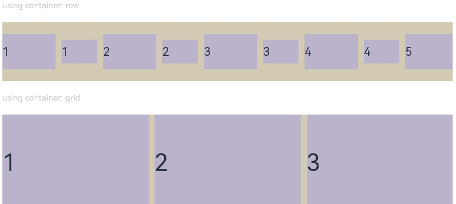
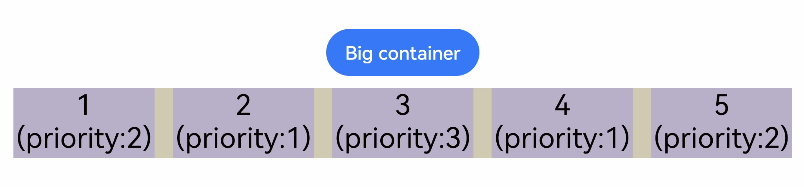

# 布局约束

更新时间：2026-03-09 02:50:43

来源：https://developer.huawei.com/consumer/cn/doc/harmonyos-references/ts-universal-attributes-layout-constraints
**支持设备：** Phone | PC/2in1 | Tablet | Wearable | TV

通过组件的宽高比和显示优先级约束组件显示效果。
 
> [!NOTE]
> 从API version 7开始支持。后续版本如有新增内容，则采用上角标单独标记该内容的起始版本。

  

##### aspectRatio

**支持设备：** Phone | PC/2in1 | Tablet | Wearable | TV

aspectRatio(value: number): T
 
指定当前组件的宽高比，aspectRatio=width/height。
 
- 仅设置width、aspectRatio时，height=width/aspectRatio。
- 仅设置height、aspectRatio时，width=height*aspectRatio。
- 同时设置width、height和aspectRatio时，height不生效，height=width/aspectRatio。

 
设置aspectRatio属性后，组件宽高会受父组件内容区大小限制，[constraintSize](https://developer.huawei.com/consumer/cn/doc/harmonyos-references/ts-universal-attributes-size#constraintsize)的优先级高于aspectRatio。
 
**卡片能力：** 从API version 9开始，该接口支持在ArkTS卡片中使用。
 
**元服务API：** 从API version 11开始，该接口支持在元服务中使用。
 
**系统能力：** SystemCapability.ArkUI.ArkUI.Full
 
**参数：**
  
| 参数名 | 类型 | 必填 | 说明 |
| --- | --- | --- | --- |
| value | number | 是 | 指定当前组件的宽高比。 API version 9及以前，默认值为：1.0。 API version 10：无默认值。 说明： 该属性在不设置值或者设置非法值(小于等于0)时不生效。 例如，Row只设置宽度且没有子组件，aspectRatio不设置值或者设置成负数时，此时Row高度为0。 |
 
 
**返回值：**
  
| 类型 | 说明 |
| --- | --- |
| T | 返回当前组件。 |
 
 
  

##### displayPriority

**支持设备：** Phone | PC/2in1 | Tablet | Wearable | TV

displayPriority(value: number): T
 
设置当前组件在布局容器中显示的优先级。
 
**卡片能力：** 从API version 9开始，该接口支持在ArkTS卡片中使用。
 
**元服务API：** 从API version 11开始，该接口支持在元服务中使用。
 
**系统能力：** SystemCapability.ArkUI.ArkUI.Full
 
**参数：**
  
| 参数名 | 类型 | 必填 | 说明 |
| --- | --- | --- | --- |
| value | number | 是 | 设置当前组件在布局容器中显示的优先级。 默认值：1 说明： 仅在Row/Column/Flex(单行)容器组件中生效。 小数点后的数字不作优先级区分，即区间为[x, x + 1)内的数字视为相同优先级。例如：1.0与1.9为同一优先级。 子组件的displayPriority均不大于1时，优先级没有区别。 当子组件的displayPriority大于1时，displayPriority数值越大，优先级越高。若父容器空间不足，隐藏低优先级子组件。若某一优先级的子组件被隐藏，则优先级更低的子组件也都被隐藏。 |
 
 
**返回值：**
  
| 类型 | 说明 |
| --- | --- |
| T | 返回当前组件。 |
 
 
  

##### 示例

**支持设备：** Phone | PC/2in1 | Tablet | Wearable | TV

  

##### 示例1（设置组件宽高比）

通过aspectRatio设置不同的宽高比。
 
```ArkTS
// xxx.ets
@Entry
@Component
struct AspectRatioExample {
  private children: string[] = ['1', '2', '3', '4', '5', '6']

  build() {
    Column({ space: 20 }) {
      Text('using container: row').fontSize(14).fontColor(0xCCCCCC).width('100%')
      Row({ space: 10 }) {
        ForEach(this.children, (item:string) => {
          // 组件宽度 = 组件高度*1.5 = 90
          Text(item)
            .backgroundColor(0xbbb2cb)
            .fontSize(20)
            .aspectRatio(1.5)
            .height(60)
          // 组件高度 = 组件宽度/1.5 = 60/1.5 = 40
          Text(item)
            .backgroundColor(0xbbb2cb)
            .fontSize(20)
            .aspectRatio(1.5)
            .width(60)
        }, (item:string) => item)
      }
      .size({ width: "100%", height: 100 })
      .backgroundColor(0xd2cab3)
      .clip(true)

      // grid子元素width/height=3/2
      Text('using container: grid').fontSize(14).fontColor(0xCCCCCC).width('100%')
      Grid() {
        ForEach(this.children, (item:string) => {
          GridItem() {
            Text(item)
              .backgroundColor(0xbbb2cb)
              .fontSize(40)
              .width('100%')
              .aspectRatio(1.5)
          }
        }, (item:string) => item)
      }
      .columnsTemplate('1fr 1fr 1fr')
      .columnsGap(10)
      .rowsGap(10)
      .size({ width: "100%", height: 165 })
      .backgroundColor(0xd2cab3)
    }.padding(10)
  }
}
```
 
**图1** 竖屏显示
 



 
**图2** 横屏显示
 



 
  

##### 示例2（设置组件显示优先级）

使用displayPriority为子组件设置显示优先级。
 
```text
class ContainerInfo {
  label: string = '';
  size: string = '';
}

class ChildInfo {
  text: string = '';
  priority: number = 0;
}

@Entry
@Component
struct DisplayPriorityExample {
  // 显示容器大小
  private container: ContainerInfo[] = [
    { label: 'Big container', size: '90%' },
    { label: 'Middle container', size: '50%' },
    { label: 'Small container', size: '30%' }
  ]
  private children: ChildInfo[] = [
    { text: '1\n(priority:2)', priority: 2 },
    { text: '2\n(priority:1)', priority: 1 },
    { text: '3\n(priority:3)', priority: 3 },
    { text: '4\n(priority:1)', priority: 1 },
    { text: '5\n(priority:2)', priority: 2 }
  ]
  @State currentIndex: number = 0;

  build() {
    Column({ space: 10 }) {
      // 切换父级容器大小
      Button(this.container[this.currentIndex].label).backgroundColor(0x317aff)
        .onClick(() => {
          this.currentIndex = (this.currentIndex + 1) % this.container.length;
        })
      // 通过变量设置Flex父容器宽度
      Flex({ justifyContent: FlexAlign.SpaceBetween }) {
        ForEach(this.children, (item:ChildInfo) => {
          // 使用displayPriority给子组件绑定显示优先级
          Text(item.text)
            .width(120)
            .height(60)
            .fontSize(24)
            .textAlign(TextAlign.Center)
            .backgroundColor(0xbbb2cb)
            .displayPriority(item.priority)
        }, (item:ChildInfo) => item.text)
      }
      .width(this.container[this.currentIndex].size)
      .backgroundColor(0xd2cab3)
    }.width("100%").margin({ top: 50 })
  }
}
```
 
横屏显示
 


