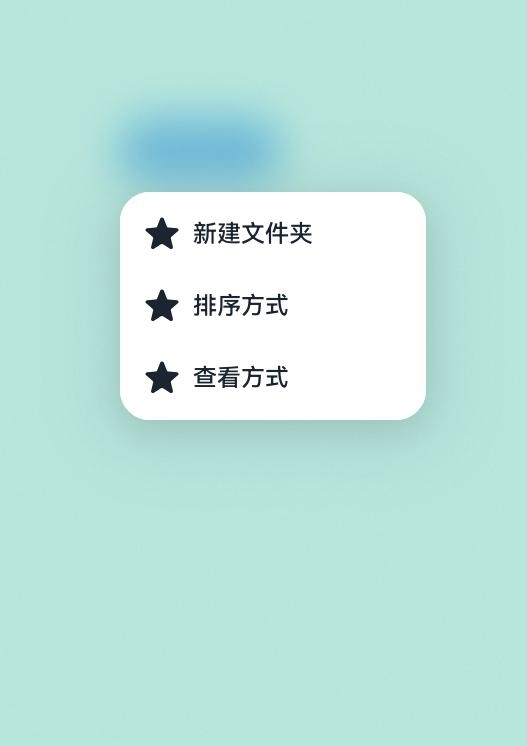
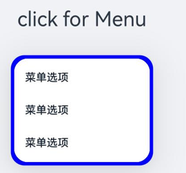
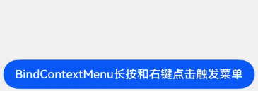
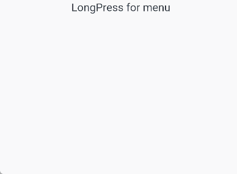
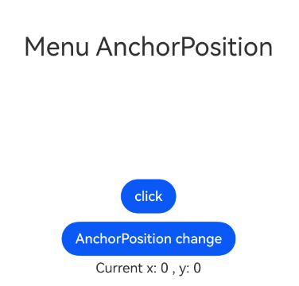
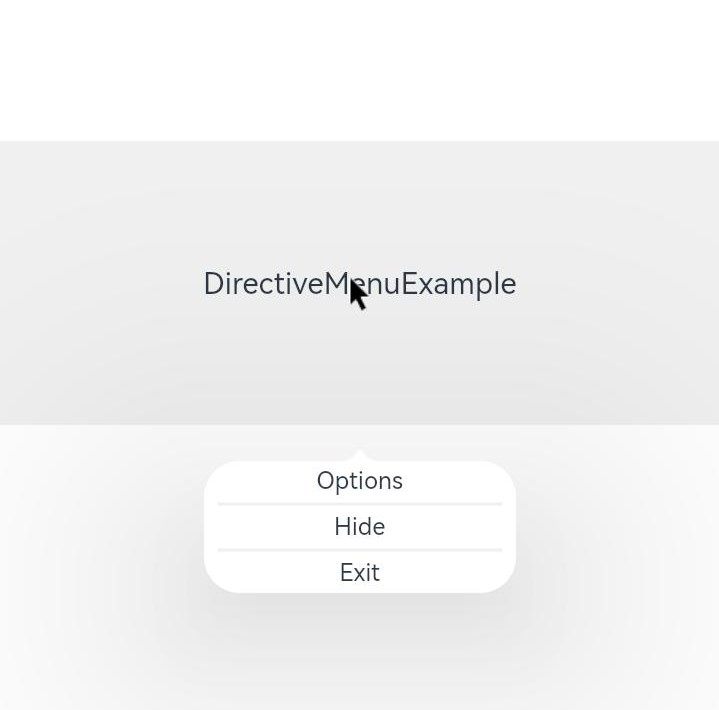
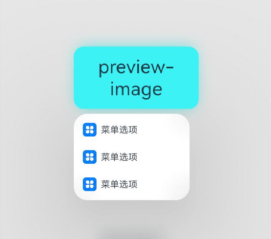
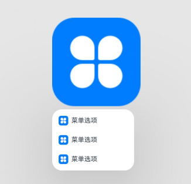
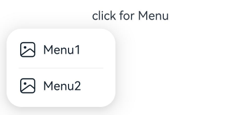

# 菜单控制

更新时间：2026-05-26 06:48:54

来源：https://developer.huawei.com/consumer/cn/doc/harmonyos-references/ts-universal-attributes-menu
**支持设备：** Phone | PC/2in1 | Tablet | Wearable | TV

为组件绑定弹出式菜单，支持长按、点击或鼠标右键来触发菜单的弹出，菜单项以垂直列表形式显示。

> [!NOTE]
> 从API version 7开始支持。后续版本如有新增内容，则采用上角标单独标记该内容的起始版本。 不支持在CustomBuilder中使用bindMenu和bindContextMenu弹出多级菜单。对此，可以使用 Menu组件 来实现多级菜单。 弹出菜单的文本内容不支持长按选中。 当窗口大小发生变化以及点击菜单内容区时，菜单自动隐藏。 如果绑定菜单的组件是可拖动节点且未指定bindContextMenu的preview，菜单弹出时会显示拖拽预览图，且菜单选项和预览图不会相互避让。开发者可根据使用场景设置preview或将目标节点设置为不可拖动。 从API version 12开始，菜单支持长按500ms弹出子菜单，支持按压态跟随手指移动。 仅支持使用 Menu组件 且子组件包含 MenuItem 或 MenuItemGroup 的场景。 仅支持 MenuPreviewMode 设置为NONE的菜单。 菜单最大宽度受设备所占栅格限制，即使设置宽度100%，也不会占满屏幕。 菜单绑定的组件对象销毁时，菜单消失。 bindContextMenu 仅支持在子窗中显示， bindMenu 可以通过配置 MenuOptions 中的showInSubWindow属性设置是否在子窗中显示。


#### bindMenu

**支持设备：** Phone | PC/2in1 | Tablet | Wearable | TV

bindMenu(content: Array&lt;MenuElement&gt; | CustomBuilder, options?: MenuOptions): T

给组件绑定菜单，点击后弹出菜单。弹出的菜单项支持图标+文本排列以及自定义组件两种功能。

> [!NOTE]
> 从API version 20开始，该接口仅当content的入参类型为Array&lt;MenuElement&gt;时支持在 attributeModifier 中调用。


**元服务API：** 从API version 11开始，该接口支持在元服务中使用。

**系统能力：** SystemCapability.ArkUI.ArkUI.Full

**参数：**

| 参数名 | 类型 | 必填 | 说明 |
| --- | --- | --- | --- |
| content | Array&lt;MenuElement&gt; \| CustomBuilder | 是 | 配置菜单项图标和文本的数组，或者自定义组件。 |
| options | MenuOptions | 否 | 配置弹出菜单的参数。 |


**返回值：**

| 类型 | 说明 |
| --- | --- |
| T | 返回当前组件。 |


#### bindMenu11+

**支持设备：** Phone | PC/2in1 | Tablet | Wearable | TV

bindMenu(isShow: boolean, content: Array&lt;MenuElement&gt; | CustomBuilder, options?: MenuOptions): T

给组件绑定菜单，菜单的显隐通过控制绑定的isShow触发。弹出的菜单项支持图标+文本排列以及自定义组件两种功能。

> [!NOTE]
> 从API version 20开始，该接口仅当content的入参类型为Array&lt;MenuElement&gt;时支持在 attributeModifier 中调用。


**元服务API：** 从API version 12开始，该接口支持在元服务中使用。

**系统能力：** SystemCapability.ArkUI.ArkUI.Full

**参数：**

| 参数名 | 类型 | 必填 | 说明 |
| --- | --- | --- | --- |
| isShow | boolean | 是 | 支持开发者通过状态变量控制显隐。菜单必须等待页面全部构建才能展示，因此不能在页面构建中设置为true，否则会导致显示位置及形状错误，该参数从API version 18开始支持!!语法双向绑定变量。 true：弹出菜单；false：关闭菜单。 默认值：false |
| content | Array&lt;MenuElement&gt; \| CustomBuilder | 是 | 配置菜单项图标和文本的数组，或者自定义组件。 |
| options | MenuOptions | 否 | 配置弹出菜单的参数。 |


**返回值：**

| 类型 | 说明 |
| --- | --- |
| T | 返回当前组件。 |


#### bindContextMenu8+

**支持设备：** Phone | PC/2in1 | Tablet | Wearable | TV

bindContextMenu(content: CustomBuilder, responseType: ResponseType, options?: ContextMenuOptions): T

给组件绑定菜单，控制菜单显隐的触发方式为长按或右键点击，弹出的菜单项需自定义。若需通过代码逻辑控制菜单显隐，请使用[bindContextMenu12+](#bindcontextmenu12)。

> [!TIP]
> 不支持在输入法类型窗口中使用bindContextMenu(默认子窗实现)，详情见输入法框架的约束与限制说明 createPanel 。 该接口不支持在 attributeModifier 中调用。


**元服务API：** 从API version 11开始，该接口支持在元服务中使用。

**系统能力：** SystemCapability.ArkUI.ArkUI.Full

**参数：**

| 参数名 | 类型 | 必填 | 说明 |
| --- | --- | --- | --- |
| content | CustomBuilder | 是 | 自定义菜单内容构造器。 |
| responseType | ResponseType | 是 | 菜单弹出条件，长按或者右键点击。不支持鼠标长按。 |
| options | ContextMenuOptions | 否 | 配置弹出菜单的参数。 |


**返回值：**

| 类型 | 说明 |
| --- | --- |
| T | 返回当前组件。 |


#### bindContextMenu12+

**支持设备：** Phone | PC/2in1 | Tablet | Wearable | TV

bindContextMenu(isShown: boolean, content: CustomBuilder, options?: ContextMenuOptions): T

给组件绑定菜单，菜单的显隐通过控制绑定的isShown触发。

当isShown为true时，弹出菜单；为false时，隐藏菜单。菜单项支持自定义。

菜单弹出位置仅由placement设置决定，与点击位置无关。

> [!TIP]
> 不支持在输入法类型窗口中使用bindContextMenu(默认子窗实现)，详情见输入法框架的约束与限制说明 createPanel 。 该接口不支持在 attributeModifier 中调用。


**系统能力：** SystemCapability.ArkUI.ArkUI.Full

**元服务API：** 从API version 12开始，该接口支持在元服务中使用。

**参数：**

| 参数名 | 类型 | 必填 | 说明 |
| --- | --- | --- | --- |
| isShown | boolean | 是 | 支持开发者通过状态变量控制显隐。菜单必须等待页面全部构建完成后才能展示，如果在页面构建前或构建中设置为true，可能导致显示位置及形状错误、无法正常弹出显示等问题。不支持长按触发拖拽。该参数从API version 18开始支持!!语法双向绑定变量。 true：弹出菜单；false：关闭菜单。 默认值：false |
| content | CustomBuilder | 是 | 自定义菜单内容构造器。 |
| options | ContextMenuOptions | 否 | 配置弹出菜单的参数。 |


**返回值：**

| 类型 | 说明 |
| --- | --- |
| T | 返回当前组件。 |


#### bindContextMenuWithResponse23+

**支持设备：** Phone | PC/2in1 | Tablet | Wearable | TV

bindContextMenuWithResponse(content: CustomBuilderT&lt;ResponseType&gt; | undefined, options?: ContextMenuOptions): T

给组件绑定菜单，控制菜单显隐的触发方式为长按或右键点击，弹出的菜单需自定义样式和内容。

> [!TIP]
> 不支持在输入法类型窗口中使用bindContextMenuWithResponse（默认子窗实现），详情见输入法框架的约束与限制说明 createPanel 。 该接口不支持在 attributeModifier 中调用。


**元服务API：** 从API version 23开始，该接口支持在元服务中使用。

**系统能力：** SystemCapability.ArkUI.ArkUI.Full

**模型约束：** 此接口仅可在Stage模型下使用。

**参数：**

| 参数名 | 类型 | 必填 | 说明 |
| --- | --- | --- | --- |
| content | CustomBuilderT&lt;ResponseType&gt; \| undefined | 是 | 自定义菜单内容构造器。入参为触发菜单的方式，开发者可据此实现差异化的内容。当传入undefined时，无菜单弹出。 |
| options | ContextMenuOptions | 否 | 配置弹出菜单的参数。 |


**返回值：**

| 类型 | 说明 |
| --- | --- |
| T | 返回当前组件。 |


#### MenuElement

**支持设备：** Phone | PC/2in1 | Tablet | Wearable | TV

菜单项的图标、文本和交互信息。

**系统能力：** SystemCapability.ArkUI.ArkUI.Full

| 名称 | 类型 | 只读 | 可选 | 说明 |
| --- | --- | --- | --- | --- |
| value | ResourceStr | 否 | 否 | 菜单项文本。 元服务API： 从API version 11开始，该接口支持在元服务中使用。 |
| icon10+ | ResourceStr | 否 | 是 | 菜单项图标。 元服务API： 从API version 11开始，该接口支持在元服务中使用。 |
| enabled11+ | boolean | 否 | 是 | 菜单条目是否可进行交互。 true：菜单条目可以进行交互；false：菜单条目不可以进行交互。 默认值：true 元服务API： 从API version 12开始，该接口支持在元服务中使用。 |
| action | () => void | 否 | 否 | 点击菜单项的事件回调。 元服务API： 从API version 11开始，该接口支持在元服务中使用。 |
| symbolIcon12+ | SymbolGlyphModifier | 否 | 是 | 设置菜单项图标。通过Modifier配置菜单项图标，若同时配置symbolIcon和icon的情况下，icon图标不显示。 元服务API： 从API version 12开始，该接口支持在元服务中使用。 |


#### MenuOptions10+

**支持设备：** Phone | PC/2in1 | Tablet | Wearable | TV

菜单项的信息，继承自[ContextMenuOptions](#contextmenuoptions10)。

**系统能力：** SystemCapability.ArkUI.ArkUI.Full

| 名称 | 类型 | 只读 | 可选 | 说明 |
| --- | --- | --- | --- | --- |
| title | ResourceStr | 否 | 是 | 菜单标题。 说明： 仅在content设置为Array&lt;MenuElement&gt; 时生效。 元服务API： 从API version 11开始，该接口支持在元服务中使用。 |
| showInSubWindow11+ | boolean | 否 | 是 | 是否在子窗口显示菜单。 true：在子窗口显示菜单；false：不在子窗显示菜单。 默认值：2in1设备上为true，其他设备为false。 说明： 仅对2in1设备生效。 元服务API： 从API version 12开始，该接口支持在元服务中使用。 |


#### ContextMenuOptions10+

**支持设备：** Phone | PC/2in1 | Tablet | Wearable | TV

菜单项的信息。

**系统能力：** SystemCapability.ArkUI.ArkUI.Full

| 名称 | 类型 | 只读 | 可选 | 说明 |
| --- | --- | --- | --- | --- |
| offset | Position | 否 | 是 | 菜单弹出位置的偏移量，不会导致菜单显示超出屏幕范围。 默认值：{ x: 0, y: 0 }，不支持设置百分比。 说明： 菜单类型为相对父组件区域弹出时，自动根据菜单位置属性 (placement)将区域的宽或高计入偏移量中。 offset最终取值与placement设置值的关系参见表1：同时设置offset与placement时菜单的偏移位置。 未设置、异常值或者undefined时按默认{ x: 0, y: 0 }处理。若传入偏移量超出屏幕范围外，则会就近约束到屏幕范围内。 如果菜单调整了显示位置（与placement初始值主方向不一致），则偏移值 (offset) 失效。 元服务API： 从API version 11开始，该接口支持在元服务中使用。 |
| placement | Placement | 否 | 是 | 菜单组件优先显示的位置，当前位置显示不下时，会自动调整位置。 说明： 1. 作为bindMenu入参时，默认值为Placement.BottomLeft。 2. 作为bindContextMenu8+或bindContextMenuWithResponse23+入参时，默认效果为菜单跟随点击位置弹出。 3. 作为bindContextMenu12+入参时，默认值为Placement.BottomLeft。 4. placement值设置为undefined、null或缺省时，按默认值处理。 元服务API： 从API version 11开始，该接口支持在元服务中使用。 |
| enableArrow | boolean | 否 | 是 | 是否显示箭头。如果菜单的大小和位置不足以放置箭头时，不会显示箭头。 默认值：false，不显示箭头。 说明： enableArrow为true时，placement未设置或者值为非法值，默认在目标物上方显示（此时菜单默认位置与接口的关系参见表3：enableArrow为true且placement未设置或者值为非法值的菜单默认位置），否则按照placement的位置优先显示。当前位置显示不下时，会自动调整位置，enableArrow为undefined时，不显示箭头。bindContextMenu从API version 10开始支持该属性；bindMenu从API version 12开始支持该属性。 元服务API： 从API version 11开始，该接口支持在元服务中使用。 |
| enableHoverMode18+ | boolean | 否 | 是 | 菜单组件是否响应悬停态（半折叠状态）变化，即在悬停态下是否触发避让折痕区域。 默认值：false，2in1设备默认为true。未设置或者值为非法值时，生效默认值。 说明： 1. 如果菜单的弹出位置在悬停态折痕区域，菜单组件不会响应悬停态。 2. 2in1设备从API version 20开始生效。 3. 2in1设备仅在窗口瀑布模式下生效。 元服务API： 从API version 18开始，该接口支持在元服务中使用。 |
| arrowOffset | Length | 否 | 是 | 箭头在菜单处的偏移。偏移量必须合法且转换为具体数值时大于0才会生效，另外该值生效时不会导致箭头超出菜单四周的安全距离。 默认值：0 单位：vp 说明： 箭头距菜单四周的安全距离为菜单圆角大小与箭头宽度的一半之和。 根据配置的placement来计算是在水平还是垂直方向上偏移。 箭头在菜单水平方向时，偏移量为箭头至最左侧箭头安全距离处的距离。箭头在菜单垂直方向时，偏移量为箭头至最上侧箭头安全距离处的距离。 根据配置的placement的不同，箭头展示的默认位置不同： 在菜单不发生避让的情况下，箭头最终位置与placement设置值的关系参见表2：同时设置arrowOffset与placement时菜单箭头的默认位置。 bindContextMenu从API version 10开始支持该属性；bindMenu从API version 12开始支持该属性。 元服务API： 从API version 11开始，该接口支持在元服务中使用。 |
| preview11+ | MenuPreviewMode \| CustomBuilder | 否 | 是 | 长按悬浮菜单或使用bindContextMenu12+显示菜单的预览内容样式，可以为目标组件的截图，也可以为用户自定义的内容。 默认值：MenuPreviewMode.NONE，无预览内容。 说明： - 不支持responseType为ResponseType.RightClick时触发，如果responseType为ResponseType.RightClick，则不会显示预览内容。 - 当未设置preview参数或preview参数设置为MenuPreviewMode.NONE时，enableArrow参数生效。 - 当preview参数设置为MenuPreviewMode.IMAGE或CustomBuilder时，enableArrow为true时也不显示箭头。 元服务API： 从API version 12开始，该接口支持在元服务中使用。 |
| previewAnimationOptions11+ | ContextMenuAnimationOptions | 否 | 是 | 控制长按预览的显示效果。 默认值：{ scale: [0.95, 1.1], transition: undefined, hoverScale: undefined }。 说明： 倍率设置参数小于等于0时，不生效。 元服务API： 从API version 12开始，该接口支持在元服务中使用。 |
| previewBorderRadius19+ | BorderRadiusType | 否 | 是 | 设置预览图边框圆角半径。 默认值：16vp 说明： 当水平方向上两个圆角半径之和的最大值超过预览图的宽度，或者垂直方向上两个圆角半径之和的最大值超过预览图的高度时，应采用预览图所能允许的最大圆角半径值。 圆角设置越大，圆角动画变化越快。 元服务API： 从API version 19开始，该接口支持在元服务中使用。 |
| layoutRegionMargin13+ | Margin | 否 | 是 | 设置预览图与菜单布局时距上下左右边界的最小边距。 说明： 仅支持vp、px、fp、lpx、百分比。 当margin设置异常值或负值时，按默认值处理。 若preview为CustomBuilder，设置margin.left或margin.right时，预览图取消最大栅格的宽度限制。 注意应避免设置过大的margin导致布局区域变小，使得预览图和菜单无法正常布局。 当水平方向上margin之和超过布局最大宽度时，margin.left和margin.right均不生效，按默认值处理。 当垂直方向上margin之和超过布局最大高度时，margin.top和margin.bottom均不生效，按默认值处理。 边距默认值为左右边距16vp，上边距16vp, 下边距为4vp。 元服务API： 从API version 13开始，该接口支持在元服务中使用。 |
| previewScaleMode20+ | PreviewScaleMode | 否 | 是 | 预览图缩放方式。 默认值：PreviewScaleMode.AUTO 说明： 布局空间不足时，控制预览图的缩放方式。未设置或设置undefined按照PreviewScaleMode.AUTO处理。当设置成PreviewScaleMode.CONSTANT时，如果预览图过大，剩余的空间不足以放置菜单时，菜单将重叠显示在预览图之下。 预览图的最大宽高不会超过预览图最大可布局区域（窗口大小减去上下左右的安全边距）。 元服务API： 从API version 20开始，该接口支持在元服务中使用。 |
| availableLayoutArea20+ | AvailableLayoutArea | 否 | 是 | 设置预览图宽高的可布局区域，预览图的百分比依据此设置计算，最终可能因安全区限制而被压缩或裁剪。 说明： 未设置或设置为undefined时，百分比依据窗口大小计算。若设置为AvailableLayoutArea.SAFE_AREA，预览图的可布局区域为窗口大小减去上下左右的安全边距。 元服务API： 从API version 20开始，该接口支持在元服务中使用。 |
| onAppear | () => void | 否 | 是 | 菜单弹出后的事件回调。 元服务API： 从API version 11开始，该接口支持在元服务中使用。 |
| onDisappear | () => void | 否 | 是 | 菜单消失后的事件回调。 元服务API： 从API version 11开始，该接口支持在元服务中使用。 |
| aboutToAppear11+ | () => void | 否 | 是 | 菜单显示动效前的事件回调。 元服务API： 从API version 12开始，该接口支持在元服务中使用。 |
| aboutToDisappear11+ | () => void | 否 | 是 | 菜单退出动效前的事件回调。 元服务API： 从API version 12开始，该接口支持在元服务中使用。 |
| backgroundColor11+ | ResourceColor | 否 | 是 | 菜单背板颜色。 默认值：Color.Transparent。 元服务API： 从API version 12开始，该接口支持在元服务中使用。 |
| backgroundBlurStyle11+ | BlurStyle | 否 | 是 | 菜单背板模糊材质。 默认值：BlurStyle.COMPONENT_ULTRA_THICK。 元服务API： 从API version 12开始，该接口支持在元服务中使用。 |
| transition12+ | TransitionEffect | 否 | 是 | 设置菜单显示和退出的过渡效果。 说明： 菜单退出动效过程中，进行横竖屏切换，菜单会避让。二级菜单不继承自定义动效。弹出过程可以点击二级菜单，退出动效执行过程不允许点击二级菜单。 详细描述见TransitionEffect对象说明。 动效曲线使用弹簧曲线，在动效退出时，由于弹簧曲线的回弹震荡，菜单消失后有较长的拖尾，使得其他事件无法响应。 元服务API： 从API version 12开始，该接口支持在元服务中使用。 |
| borderRadius12+ | Length \| BorderRadiuses \| LocalizedBorderRadiuses | 否 | 是 | 设置菜单的边框圆角半径。 默认值：2in1设备上默认值8vp，其他设备上默认值20vp。 说明： 支持百分比。 当水平方向两个圆角半径之和的最大值超出菜单宽度或垂直方向两个圆角半径之和的最大值超出菜单高度时，采用菜单默认圆角半径值。 当设置Length类型且传参为异常值时，菜单圆角取默认值。 当设置BorderRadiuses或LocalizedBorderRadiuses类型且传参为异常值时，菜单默认没有圆角。 元服务API： 从API version 12开始，该接口支持在元服务中使用。 |
| backgroundBlurStyleOptions18+ | BackgroundBlurStyleOptions | 否 | 是 | 背景模糊效果。 元服务API： 从API version 18开始，该接口支持在元服务中使用。 |
| backgroundEffect18+ | BackgroundEffectOptions | 否 | 是 | 背景效果参数。 元服务API： 从API version 18开始，该接口支持在元服务中使用。 |
| hapticFeedbackMode18+ | HapticFeedbackMode | 否 | 是 | 菜单弹出时振动效果。 默认值：HapticFeedbackMode.DISABLED，菜单弹出时不振动。 说明： 只有一级菜单可配置弹出时振动效果。 仅当用户启用系统触感反馈且在工程的module.json5中配置requestPermissions字段开启ohos.permission.VIBRATE振动权限时，方可生效。配置如下： 元服务API： 从API version 18开始，该接口支持在元服务中使用。 |
| outlineWidth20+ | Dimension \| EdgeOutlineWidths | 否 | 是 | 设置菜单边框外描边宽度。 默认值：0vp 说明： 不支持百分比，若需要外描边效果，outlineWidth为必填项。 元服务API： 从API version 20开始，该接口支持在元服务中使用。 |
| outlineColor20+ | ResourceColor \| EdgeColors | 否 | 是 | 设置菜单边框外描边颜色。 说明： 默认值：'#19ffffff' 元服务API： 从API version 20开始，该接口支持在元服务中使用。 |
| mask20+ | boolean \| MenuMaskType | 否 | 是 | 设置菜单是否有蒙层及蒙层样式。 true：有蒙层；false：没有蒙层；MenuMaskType：自定义蒙层的样式。 默认值：菜单有预览图时默认显示蒙层，否则不显示。 说明： 当设备配置不显示菜单蒙层时，该接口不生效。如当前在2in1设备上该接口不生效。 元服务API： 从API version 20开始，该接口支持在元服务中使用。 |
| modalMode20+ | ModalMode | 否 | 是 | 设置菜单的模态模式。 说明： 默认值：ModalMode.AUTO 元服务API： 从API version 20开始，该接口支持在元服务中使用。 |
| anchorPosition20+ | Position | 否 | 是 | 通过设定水平与垂直偏移量，控制菜单相对于绑定组件左上角的弹出位置，与单独使用offset接口不同的是可以覆盖显示在绑定组件上。 默认值：{ x: undefined, y: undefined }，不支持设置百分比。 说明： 1. 当菜单处于预览状态时，设定的偏移量将无法生效。 2. 预设的placement对齐参数将不再生效。 3. 叠加offset参数的偏移量，最终确定菜单的精确弹出位置。 4. 当水平与垂直偏移量均设为负值时，菜单重置到Placement.BottomLeft进行显示。 5. 当水平或垂直偏移量存在undefined或null时，效果等同于不设置anchorPosition，此时预设的placement对齐参数可以生效。 元服务API： 从API version 20开始，该接口支持在元服务中使用。 |
| onWillAppear20+ | Callback&lt;void&gt; | 否 | 是 | 菜单显示动效前的事件回调。 说明： 1. 正常时序依次为：aboutToAppear>>onWillAppear>>onAppear>>onDidAppear>>aboutToDisappear>>onWillDisappear>>onDisappear>>onDidDisappear。 2. aboutToAppear是初始化时触发调用，onWillAppear是在动画执行前触发调用，onWillAppear在aboutToAppear之后执行。 元服务API： 从API version 20开始，该接口支持在元服务中使用。 |
| onDidAppear20+ | Callback&lt;void&gt; | 否 | 是 | 菜单弹出后的事件回调。 说明： 1. 正常时序依次为：aboutToAppear>>onWillAppear>>onAppear>>onDidAppear>>aboutToDisappear>>onWillDisappear>>onDisappear>>onDidDisappear。 2. 快速点击弹出，消失菜单时，存在onWillDisappear在onDidAppear前生效。 3. 当菜单入场动效未完成时关闭菜单，该回调不会触发。 4.onAppear和onDidAppear触发时机相同，onDidAppear在onAppear后生效。 元服务API： 从API version 20开始，该接口支持在元服务中使用。 |
| onWillDisappear20+ | Callback&lt;void&gt; | 否 | 是 | 菜单退出动效前的事件回调。 说明： 1. 正常时序依次为：aboutToAppear>>onWillAppear>>onAppear>>onDidAppear>>aboutToDisappear>>onWillDisappear>>onDisappear>>onDidDisappear。 2. 快速点击弹出，消失菜单时，存在onWillDisappear在onDidAppear前生效。 3. aboutToDisappear和onWillDisappear触发时机相同，onWillDisappear在aboutToDisappear后生效。 元服务API： 从API version 20开始，该接口支持在元服务中使用。 |
| onDidDisappear20+ | Callback&lt;void&gt; | 否 | 是 | 菜单消失后的事件回调。 说明： 1. 正常时序依次为：aboutToAppear>>onWillAppear>>onAppear>>onDidAppear>>aboutToDisappear>>onWillDisappear>>onDisappear>>onDidDisappear。 2. onDisappear和onDidDisappear触发时机相同，onDidDisappear在onDisappear后生效。 元服务API： 从API version 20开始，该接口支持在元服务中使用。 |
| keyboardAvoidMode23+ | MenuKeyboardAvoidMode | 否 | 是 | 设置菜单是否避让软键盘。 说明： 未设置或设置为undefined时，按照MenuKeyboardAvoidMode.NONE处理。 元服务API： 从API version 23开始，该接口支持在元服务中使用。 模型约束： 此接口仅可在Stage模型下使用。 |
| minKeyboardAvoidDistance23+ | LengthMetrics | 否 | 是 | 设置菜单避让软键盘的最小距离。 说明： 未设置、设置为负数或undefined时，按照8vp处理。仅在keyboardAvoidMode设置为避让软键盘时生效。 元服务API： 从API version 23开始，该接口支持在元服务中使用。 模型约束： 此接口仅可在Stage模型下使用。 |


**表1：同时设置offset与placement时菜单的偏移位置**

| placement设置的值 | 菜单的偏移量说明 |
| --- | --- |
| Placement.TopLeft、Placement.Top、Placement.TopRight | offset的x为正数，菜单相对组件向右进行偏移，offset的y为正数，菜单相对组件向上进行偏移。 |
| Placement.BottomLeft、Placement.Bottom、Placement.BottomRight | offset的x为正数，菜单相对组件向左进行偏移，offset的y为正数，菜单相对组件向下进行偏移。 |
| Placement.RightTop、Placement.Right、Placement.RightBottom | offset的x为正数，菜单相对组件向右进行偏移，offset的y为正数，菜单相对组件向下进行偏移。 |


**表2：同时设置arrowOffset与placement时菜单箭头的默认位置**

| placement设置的值 | 菜单箭头的位置说明 |
| --- | --- |
| Placement.Top、Placement.Bottom | 箭头显示在水平方向且默认居中，且距离菜单左侧边缘距离为箭头安全距离。 |
| Placement.Left、Placement.Right | 箭头显示在垂直方向且默认居中，且距离菜单上侧距离为箭头安全距离。 |
| Placement.TopLeft、Placement.BottomLeft | 箭头默认显示在水平方向，且距离菜单左侧边缘距离为箭头安全距离。 |
| Placement.TopRight、Placement.BottomRight | 箭头默认显示在水平方向，且距离菜单右侧距离为箭头安全距离。 |
| Placement.LeftTop、Placement.RightTop | 箭头默认显示在垂直方向，且距离菜单上侧距离为箭头安全距离。 |
| Placement.LeftBottom、Placement.RightBottom | 箭头默认显示在垂直方向，且距离菜单下侧距离为箭头安全距离。 |


**表3：enableArrow为true且placement未设置或者值为非法值的菜单默认位置**

| 接口 | 菜单默认位置 |
| --- | --- |
| bindMenu | Placement.BottomLeft |
| bindMenu11+ | Placement.BottomLeft |
| bindContextMenu8+ | Placement.Top |
| bindContextMenu12+ | Placement.BottomLeft |
| bindContextMenuWithResponse23+ | Placement.Top |


#### MenuPreviewMode11+

**支持设备：** Phone | PC/2in1 | Tablet | Wearable | TV

菜单的预览样式。

**元服务API：** 从API version 12开始，该接口支持在元服务中使用。

**系统能力：** SystemCapability.ArkUI.ArkUI.Full

| 名称 | 值 | 说明 |
| --- | --- | --- |
| NONE | 0 | 不显示预览内容。 |
| IMAGE | 1 | 预览内容为触发长按悬浮菜单组件的截图。 |


#### ContextMenuAnimationOptions11+

**支持设备：** Phone | PC/2in1 | Tablet | Wearable | TV

长按预览时显示的样式信息。

**系统能力：** SystemCapability.ArkUI.ArkUI.Full

| 名称 | 类型 | 只读 | 可选 | 说明 |
| --- | --- | --- | --- | --- |
| scale | AnimationRange&lt;number&gt; | 否 | 是 | 动画开始和结束时相对预览原图缩放比例。 默认值：[0.95, 1.1] 说明： 缩放比例需要根据实际开发场景设置，建议设置值为小于预览图宽度或布局的最大限制。 元服务API： 从API version 12开始，该接口支持在元服务中使用。 |
| transition12+ | TransitionEffect | 否 | 是 | 设置菜单显示和退出的过渡效果。 说明： 在菜单退出动效过程中，横竖屏切换时，菜单会避让。二级菜单不继承自定义动效。弹出过程中可以点击二级菜单，但在退出动效执行过程中不允许点击二级菜单。 详细描述见TransitionEffect对象说明。 元服务API： 从API version 12开始，该接口支持在元服务中使用。 |
| hoverScale12+ | AnimationRange&lt;number&gt; | 否 | 是 | 在自定义预览图（preview为CustomBuilder类型）以及长按弹出（responseType指定为LongPress）菜单的场景下，hoverScale用于为绑定组件的截图浮起动画设置两个参数：相对于预览原图的起始与结束缩放比例。hoverScale设置后，浮起动画和预览图之间会有切换过渡动效。 说明： 倍率设置参数小于等于0时，不生效。 bindContextMenu12+场景下，不生效。 设置transition接口时，不生效。 使用此接口且同时使用scale接口时，scale接口起始值不生效。 为保障最佳体验，最终预览图尺寸不建议小于原组件截图尺寸。当前预览动效宽高会受组件截图和自定义预览大小影响，请根据实际使用情况自行保障展示效果。 元服务API： 从API version 12开始，该接口支持在元服务中使用。 |
| hoverScaleInterruption20+ | boolean | 否 | 是 | 在自定义预览图（preview为CustomBuilder类型）以及长按弹出（responseType指定为LongPress）菜单的场景下，且hoverScaleInterruption为true时，在触发拖拽效果前抬起手是否允许取消预览菜单弹出。true表示允许取消预览菜单弹出，false表示不允许取消预览菜单弹出。 默认值：false 说明： 未设置hoverScale接口或设置了transition接口时，该参数不生效。长按时长不足以触发拖拽效果时抬起手，预览菜单hoverScale效果回退，预览菜单不弹出，并可触发原组件上绑定的click等手势事件。长按时长足以触发拖拽效果后抬起手，预览菜单正常弹出，并不再触发原组件上绑定的click等手势事件。 元服务API： 从API version 20开始，该接口支持在元服务中使用。 |


#### AnimationRange11+

**支持设备：** Phone | PC/2in1 | Tablet | Wearable | TV

type AnimationRange&lt;T&gt;=[from: T, to: T]

动画开始和结束时相对预览原图缩放比例。

**系统能力：** SystemCapability.ArkUI.ArkUI.Full

**元服务API：** 从API version 12开始，该接口支持在元服务中使用。

| 类型 | 说明 |
| --- | --- |
| [from: T, to: T] | from表示动画开始时相对预览原图缩放比例，to表示动画结束时相对预览原图缩放比例。 |


#### HapticFeedbackMode18+

**支持设备：** Phone | PC/2in1 | Tablet | Wearable | TV

菜单弹出时振动效果。

**元服务API：** 从API version 18开始，该接口支持在元服务中使用。

**系统能力：** SystemCapability.ArkUI.ArkUI.Full

| 名称 | 值 | 说明 |
| --- | --- | --- |
| DISABLED | 0 | 菜单弹出时不振动。 |
| ENABLED | 1 | 菜单弹出时振动。 |
| AUTO | 2 | 菜单振动效果跟随系统，当前为菜单有蒙层时振动。 |


#### BorderRadiusType19+

**支持设备：** Phone | PC/2in1 | Tablet | Wearable | TV

type BorderRadiusType = [Length](https://developer.huawei.com/consumer/cn/doc/harmonyos-references/ts-types#length) | [BorderRadiuses](https://developer.huawei.com/consumer/cn/doc/harmonyos-references/ts-types#borderradiuses9) | [LocalizedBorderRadiuses](https://developer.huawei.com/consumer/cn/doc/harmonyos-references/ts-types#localizedborderradiuses12)

圆角类型。

**元服务API：** 从API version 19开始，该接口支持在元服务中使用。

**系统能力：** SystemCapability.ArkUI.ArkUI.Full

| 类型 | 说明 |
| --- | --- |
| Length | 长度类型，用于描述尺寸单位。 |
| BorderRadiuses | 圆角类型，用于描述组件边框圆角半径。 |
| LocalizedBorderRadiuses | 圆角类型，用于描述组件边框圆角半径。 |


#### MenuMaskType20+类型说明

**支持设备：** Phone | PC/2in1 | Tablet | Wearable | TV

设置蒙层样式。

**元服务API：** 从API version 20开始，该接口支持在元服务中使用。

**系统能力：** SystemCapability.ArkUI.ArkUI.Full

| 名称 | 类型 | 只读 | 可选 | 说明 |
| --- | --- | --- | --- | --- |
| color | ResourceColor | 否 | 是 | 设置蒙层颜色。 默认值：\$r('sys.color.ohos_id_color_mask_thin') |
| backgroundBlurStyle | BlurStyle | 否 | 是 | 设置蒙层模糊材质。 默认值：BlurStyle.BACKGROUND_THIN |


#### ModalMode20+枚举说明

**支持设备：** Phone | PC/2in1 | Tablet | Wearable | TV

子窗菜单的模态模式。

**元服务API：** 从API version 20开始，该接口支持在元服务中使用。

**系统能力：** SystemCapability.ArkUI.ArkUI.Full

| 名称 | 值 | 说明 |
| --- | --- | --- |
| AUTO | 0 | 自动模式，菜单组件在当前设备的默认行为。当前版本在所有设备上的效果等同于ModalMode.NONE。 |
| NONE | 1 | 除菜单自身区域外，其他区域均可传递事件，下层控件可响应事件。 |
| TARGET_WINDOW | 2 | 菜单所在应用的窗口与菜单区域不可传递事件，其他区域可传递事件。 |


#### PreviewScaleMode20+枚举说明

**支持设备：** Phone | PC/2in1 | Tablet | Wearable | TV

预览图的缩放方式。

**元服务API：** 从API version 20开始，该接口支持在元服务中使用。

**系统能力：** SystemCapability.ArkUI.ArkUI.Full

| 名称 | 值 | 说明 |
| --- | --- | --- |
| AUTO | 0 | 预览图根据Placement自动调整预览图宽高及缩放。 |
| CONSTANT | 1 | 预览图不缩放，大小保持不变。最终仍会受到安全区的限制而出现压缩、裁剪。 |
| MAINTAIN | 2 | 预览图缩放时保持宽高比。 |


#### AvailableLayoutArea20+枚举说明

**支持设备：** Phone | PC/2in1 | Tablet | Wearable | TV

预览图宽高设置为百分比时的参考可布局区域大小。

**元服务API：** 从API version 20开始，该接口支持在元服务中使用。

**系统能力：** SystemCapability.ArkUI.ArkUI.Full

| 名称 | 值 | 说明 |
| --- | --- | --- |
| SAFE_AREA | 0 | 参考可布局区域大小为窗口大小减去上下左右安全边距。 |


#### MenuKeyboardAvoidMode23+枚举说明

**支持设备：** Phone | PC/2in1 | Tablet | Wearable | TV

菜单避让软键盘的模式。

**元服务API：** 从API version 23开始，该接口支持在元服务中使用。

**系统能力：** SystemCapability.ArkUI.ArkUI.Full

**模型约束：** 此接口仅可在Stage模型下使用。

| 名称 | 值 | 说明 |
| --- | --- | --- |
| NONE | 0 | 菜单不避让软键盘。 |
| TRANSLATE_AND_RESIZE | 1 | 菜单避让软键盘。如果空间不足，会平移或重新调整菜单大小避让软键盘。 |


#### 示例

**支持设备：** Phone | PC/2in1 | Tablet | Wearable | TV


#### 示例1（弹出普通菜单）

该示例为bindMenu通过配置[MenuElement](#menuelement)弹出普通菜单。

```text
@Entry
@Component
struct MenuExample {
  build() {
    Column() {
      Text('click for Menu')
        .bindMenu([
          {
            value: 'Menu1',
            action: () => {
              console.info('handle Menu1 select');
            }
          },
          {
            value: 'Menu2',
            action: () => {
              console.info('handle Menu2 select');
            }
          },
        ])
    }
    .width('100%')
    .margin({ top: 5 })
  }
}
```





#### 示例2（弹出自定义菜单）

该示例为bindMenu通过配置CustomBuilder弹出自定义菜单。同时，从API version 18开始支持通过配置[ContextMenuOptions](#contextmenuoptions10)中的hapticFeedbackMode属性实现菜单弹出时的振动效果。

```text
@Entry
@Component
struct MenuExample {
  @State listData: number[] = [0, 0, 0];

  @Builder MenuBuilder() {
    Flex({ direction: FlexDirection.Column, justifyContent: FlexAlign.Center, alignItems: ItemAlign.Center }) {
      ForEach(this.listData, (item:number, index) => {
        Column() {
          Row() {
            // $r('app.media.icon')需要替换为开发者所需的图像资源文件。
            Image($r("app.media.icon")).width(20).height(20).margin({ right: 5 })
            Text(`Menu${index as number + 1}`).fontSize(20)
          }
          .width('100%')
          .height(30)
          .justifyContent(FlexAlign.Center)
          .align(Alignment.Center)
          .onClick(() => {
            console.info(`Menu${index as number + 1} Clicked!`);
          })

          if (index != this.listData.length - 1) {
            Divider().height(10).width('80%').color('#ccc')
          }
        }.padding(5).height(40)
      })
    }.width(100)
  }

  build() {
    Column() {
      Text('click for menu')
        .fontSize(20)
        .margin({ top: 20 })
        .bindMenu(this.MenuBuilder, { hapticFeedbackMode: HapticFeedbackMode.ENABLED })
    }
    .height('100%')
    .width('100%')
    .backgroundColor('#f0f0f0')
  }
}
```





#### 示例3（长按弹出菜单）

该示例为bindContextMenu通过配置[responseType](https://developer.huawei.com/consumer/cn/doc/harmonyos-references/ts-appendix-enums#responsetype8).LongPress弹出菜单。

```text
@Entry
@Component
struct ContextMenuExample {
  @Builder MenuBuilder() {
    Flex({ direction: FlexDirection.Column, justifyContent: FlexAlign.Center, alignItems: ItemAlign.Center }) {
      Text('Test menu item 1')
        .fontSize(20)
        .width(100)
        .height(50)
        .textAlign(TextAlign.Center)
      Divider().height(10)
      Text('Test menu item 2')
        .fontSize(20)
        .width(100)
        .height(50)
        .textAlign(TextAlign.Center)
    }.width(100)
  }

  build() {
    Column() {
      Text('LongPress for menu')
    }
    .width('100%')
    .margin({ top: 5 })
    .bindContextMenu(this.MenuBuilder, ResponseType.LongPress)
  }
}
```


#### 示例4（右键弹出指向型菜单）

该示例为bindContextMenu通过配置[responseType](https://developer.huawei.com/consumer/cn/doc/harmonyos-references/ts-appendix-enums#responsetype8).RightClick和[ContextMenuOptions](#contextmenuoptions10)中的enableArrow属性弹出指向型菜单。同时，从API version 18开始支持通过配置[ContextMenuOptions](#contextmenuoptions10)中的hapticFeedbackMode属性实现菜单弹出时的振动效果。

```text
@Entry
@Component
struct DirectiveMenuExample {
  @Builder MenuBuilder() {
    Flex({ direction: FlexDirection.Column, alignItems: ItemAlign.Center, justifyContent: FlexAlign.Center }) {
      Text('Options')
      Divider().strokeWidth(2).margin(5).color('#F0F0F0')
      Text('Hide')
      Divider().strokeWidth(2).margin(5).color('#F0F0F0')
      Text('Exit')
    }
    .width(200)
  }

  build() {
    Flex({ direction: FlexDirection.Column, alignItems: ItemAlign.Center, justifyContent: FlexAlign.Center }) {
      Column() {
        Text("DirectiveMenuExample")
          .fontSize(20)
          .width('100%')
          .height("25%")
          .backgroundColor('#F0F0F0')
          .textAlign(TextAlign.Center)
          .bindContextMenu(this.MenuBuilder, ResponseType.RightClick, {
            enableArrow: true,
            placement: Placement.Bottom,
            hapticFeedbackMode: HapticFeedbackMode.ENABLED
          })
      }
    }
    .width('100%')
    .height('100%')
  }
}
```





#### 示例5（长按弹出菜单的截图预览样式）

该示例为bindContextMenu通过配置[responseType](https://developer.huawei.com/consumer/cn/doc/harmonyos-references/ts-appendix-enums#responsetype8).LongPress和[ContextMenuOptions](#contextmenuoptions10)中preview属性的[MenuPreviewMode](#menupreviewmode11)类型弹出菜单预览样式。

```text
@Entry
@Component
struct Index {
  // $r('app.media.icon')需要替换为开发者所需的图像资源文件。
  private iconStr: ResourceStr = $r("app.media.icon");

  @Builder
  MyMenu() {
    Menu() {
      MenuItem({ startIcon: this.iconStr, content: "菜单选项" })
      MenuItem({ startIcon: this.iconStr, content: "菜单选项" })
      MenuItem({ startIcon: this.iconStr, content: "菜单选项" })
    }
  }

  build() {
    Column({ space: 50 }) {
      Column() {
        Column() {
          Text('preview-image')
            .width(200)
            .height(100)
            .textAlign(TextAlign.Center)
            .margin(100)
            .fontSize(30)
            .bindContextMenu(this.MyMenu, ResponseType.LongPress,
              { preview: MenuPreviewMode.IMAGE,
                previewAnimationOptions: {scale: [0.8, 1.0]},
              })
            .backgroundColor("#ff3df2f5")
        }
      }.width('100%')
    }
  }
}
```


#### 示例6（长按弹出菜单的自定义预览样式）

该示例为bindContextMenu通过配置[responseType](https://developer.huawei.com/consumer/cn/doc/harmonyos-references/ts-appendix-enums#responsetype8).LongPress和[ContextMenuOptions](#contextmenuoptions10)中preview属性的[CustomBuilder](https://developer.huawei.com/consumer/cn/doc/harmonyos-references/ts-types#custombuilder8)类型弹出菜单自定义预览样式。

```text
@Entry
@Component
struct Index {
  // $r('app.media.icon')需要替换为开发者所需的图像资源文件。
  private iconStr: ResourceStr = $r("app.media.icon");

  @Builder
  MyMenu() {
    Menu() {
      MenuItem({ startIcon: this.iconStr, content: "菜单选项" })
      MenuItem({ startIcon: this.iconStr, content: "菜单选项" })
      MenuItem({ startIcon: this.iconStr, content: "菜单选项" })
    }
  }

  @Builder
  MyPreview() {
    Column() {
      Image($r('app.media.icon'))
        .width(200)
        .height(200)
    }
  }

  build() {
    Column({ space: 50 }) {
      Column() {
        Column() {
          Text('preview-builder')
            .width(200)
            .height(100)
            .textAlign(TextAlign.Center)
            .margin(100)
            .fontSize(30)
            .bindContextMenu(this.MyMenu, ResponseType.LongPress,
              {
                preview: this.MyPreview
              })
        }
      }.width('100%')
    }
  }
}
```





#### 示例7（设置状态变量弹出菜单）

该示例为[bindContextMenu](#bindcontextmenu12)通过配置isShown弹出菜单预览样式。

```text
@Entry
@Component
struct Index {
  // $r('app.media.icon')需要替换为开发者所需的图像资源文件。
  private iconStr: ResourceStr = $r("app.media.icon");
  @State isShown: boolean = false;

  @Builder
  MyMenu() {
    Menu() {
      MenuItem({ startIcon: this.iconStr, content: "菜单选项" })
      MenuItem({ startIcon: this.iconStr, content: "菜单选项" })
      MenuItem({ startIcon: this.iconStr, content: "菜单选项" })
    }
  }

  @Builder
  MyPreview() {
    Column() {
      Image($r('app.media.icon'))
        .width(200)
        .height(200)
    }
  }

  build() {
    Column({ space: 50 }) {
      Column() {
        Column() {
          Text('preview-builder')
            .width(200)
            .height(100)
            .textAlign(TextAlign.Center)
            .margin(100)
            .fontSize(30)
            .bindContextMenu(this.isShown, this.MyMenu,
              {
                preview: this.MyPreview,
                aboutToDisappear: ()=>{
                  this.isShown = false;
                }
              })
          Button('click')
            .onClick(()=>{
              this.isShown = true;
            })
        }
      }.width('100%')
    }
  }
}
```





#### 示例8（设置菜单和预览的动效）

该示例为bindContextMenu通过配置[ContextMenuOptions](#contextmenuoptions10)中的transition属性，实现自定义菜单以及菜单预览时的显示和退出动效。

```text
@Entry
@Component
struct MenuExample {
  @Builder
  MenuBuilder() {
    Flex({ direction: FlexDirection.Column, justifyContent: FlexAlign.Center, alignItems: ItemAlign.Center }) {
      Text('Menu item 1')
        .fontSize(12)
        .width(200)
        .height(30)
        .textAlign(TextAlign.Center)
      Divider().height(10)
      Text('Menu item 2')
        .fontSize(12)
        .width(100)
        .height(30)
        .textAlign(TextAlign.Center)
    }.width(100)
  }

  @Builder
  MyPreview() {
    Column() {
      // $r('app.media.startIcon')需要替换为开发者所需的图像资源文件。
      Image($r('app.media.startIcon'))
        .width(50)
        .height(50)
    }
  }

  build() {
    Column() {
      Button('LongPress bindContextMenu')
        .margin({ top: 15 })
        .bindContextMenu(
          this.MenuBuilder,
          ResponseType.LongPress, {
          transition: TransitionEffect.OPACITY.animation({ duration: 4000, curve: Curve.Ease }).combine(
            TransitionEffect.rotate({ z: 1, angle: 180 })),
          preview: this.MyPreview,
          previewAnimationOptions: {
            scale: [0.8, 1.0],
            transition: TransitionEffect.OPACITY.animation({ duration: 4000, curve: Curve.Ease }).combine(
              TransitionEffect.rotate({ z: 1, angle: 180 }))
          }
        })
    }
    .width('100%')
    .margin({ top: 5 })
  }
}
```





#### 示例9（设置symbol类型图标）

该示例为bindMenu通过配置[MenuElement](#menuelement)的symbolIcon弹出菜单。

```text
import { SymbolGlyphModifier } from '@kit.ArkUI';
@Entry
@Component
struct MenuExample {
  @State symbolIconModifier1: SymbolGlyphModifier = new SymbolGlyphModifier($r('sys.symbol.ohos_photo')).fontSize('24vp');
  @State symbolIconModifier2: SymbolGlyphModifier = new SymbolGlyphModifier($r('sys.symbol.ohos_photo')).fontSize('24vp');
  build() {
    Column() {
      Text('click for Menu')
    }
    .width('100%')
    .margin({ top: 5 })
    .bindMenu([
      {
        value: 'Menu1',
        symbolIcon:this.symbolIconModifier1,
        action: () => {
          console.info('handle Menu1 select');
        }
      },
      {
        value: 'Menu2',
        symbolIcon:this.symbolIconModifier2,
        action: () => {
          console.info('handle Menu2 select');
        }
      },
    ])
  }
}
```





#### 示例10（设置一镜到底动效）

该示例为bindContextMenu通过配置[ContextMenuOptions](#contextmenuoptions10)中previewAnimationOptions属性的hoverScale，实现组件截图到自定义预览图的一镜到底过渡动效。

```text
@Entry
@Component
struct Index {
  // $r('app.media.xxx')需要替换为开发者所需的图像资源文件。
  private iconStr: ResourceStr = $r("app.media.app_icon");

  @Builder
  MyMenu() {
    Menu() {
      MenuItem({ startIcon: this.iconStr, content: "菜单选项" })
      MenuItem({ startIcon: this.iconStr, content: "菜单选项" })
      MenuItem({ startIcon: this.iconStr, content: "菜单选项" })
    }
  }

  @Builder
  MyPreview() {
    Column() {
      Image($r('app.media.example'))
        .width(200)
        .height(200)
    }
  }

  build() {
    Column({ space: 50 }) {
      Column() {
        Column() {
          Image($r('app.media.example'))
            .width(100)
            .height(100)
            .margin(100)
            .bindContextMenu(this.MyMenu, ResponseType.LongPress,
              {
                preview: this.MyPreview,
                previewAnimationOptions: {
                  hoverScale: [1.0, 0.95]
                }
              })
        }
      }.width('100%')
    }
  }
}
```


#### 示例11（自定义背景模糊效果参数）

该示例为bindMenu通过配置[ContextMenuOptions](#contextmenuoptions10)中的backgroundBlurStyleOptions属性，实现了自定义菜单背景模糊效果。

从API version 18开始，在ContextMenuOptions中新增了backgroundBlurStyleOptions属性。

```text
@Entry
@Component
struct MenuExample {
  build() {
    Stack() {
      // $r('app.media.bg')需要替换为开发者所需的图像资源文件。
      Image($r('app.media.bg'))
      Column() {
        Text('click for Menu')
          .bindMenu([
            {
              value: 'Menu1',
              action: () => {
                console.info('handle Menu1 select')
              }
            },
            {
              value: 'Menu2',
              action: () => {
                console.info('handle Menu2 select')
              }
            },
          ],
            {
              backgroundBlurStyle: BlurStyle.BACKGROUND_THIN,
              backgroundBlurStyleOptions: {
                colorMode: ThemeColorMode.LIGHT,
                blurOptions: { grayscale: [20, 20] },
                policy: BlurStyleActivePolicy.ALWAYS_ACTIVE,
                adaptiveColor: AdaptiveColor.AVERAGE,
                scale: 1
              },
            }
          )
      }
      .width('100%')
      .margin({ top: 5 })
    }
  }
}
```





#### 示例12（自定义背景效果参数）

该示例为bindMenu通过配置[ContextMenuOptions](#contextmenuoptions10)中的backgroundEffect属性，实现了自定义菜单背景效果。

从API version 18开始，在ContextMenuOptions中新增了backgroundEffect属性。

```text
@Entry
@Component
struct MenuExample {
  build() {
    Stack() {
      // $r('app.media.bg')需要替换为开发者所需的图像资源文件。
      Image($r('app.media.bg'))
      Column() {
        Text('click for Menu')
          .bindMenu([
            {
              value: 'Menu1',
              action: () => {
                console.info('handle Menu1 select');
              }
            },
            {
              value: 'Menu2',
              action: () => {
                console.info('handle Menu2 select');
              }
            },
          ],
            {
              backgroundBlurStyle: BlurStyle.BACKGROUND_THIN,
              backgroundEffect: {
                radius: 60,
                saturation: 10,
                brightness: 1,
                color: '#661A1A1A',
                adaptiveColor: AdaptiveColor.AVERAGE,
                blurOptions:{grayscale:[20,20]}
              }
            }
          )
      }
      .width('100%')
      .margin({ top: 5 })
    }
  }
}
```


#### 示例13（设置一镜到底动效支持抬手打断）

该示例通过为bindContextMenu配置[ContextMenuOptions](#contextmenuoptions10)中的previewAnimationOptions属性实现了一镜到底过渡动效的同时，再配置hoverScaleInterruption控制是否允许长按抬手取消菜单弹出。

从API version 20开始，在previewAnimationOptions的类型[ContextMenuAnimationOptions](#contextmenuanimationoptions11)中新增了hoverScaleInterruption属性。

```text
@Entry
@Component
struct Index {
  // $r('app.media.xxx')需要替换为开发者所需的图像资源文件。
  private iconStr: ResourceStr = $r("app.media.app_icon");

  @Builder
  MyMenu() {
    Menu() {
      MenuItem({ startIcon: this.iconStr, content: "菜单选项" })
      MenuItem({ startIcon: this.iconStr, content: "菜单选项" })
      MenuItem({ startIcon: this.iconStr, content: "菜单选项" })
    }
  }

  @Builder
  MyPreview() {
    Column() {
      Image($r('app.media.example'))
        .width(300)
        .height(200)
    }
  }

  build() {
    Column({ space: 50 }) {
      Column() {
        Column() {
          Image($r('app.media.example'))
            .width(100)
            .height(100)
            .margin(100)
            .bindContextMenu(this.MyMenu, ResponseType.LongPress,
              {
                preview: this.MyPreview,
                previewAnimationOptions: {
                  hoverScale: [1.0, 0.8],
                  hoverScaleInterruption: true
                }
              })
            .onClick(() => {
              console.info('trigger onClick')
            })
        }
      }.width('100%')
    }
  }
}
```





#### 示例14（设置预览图边框圆角半径）

该示例通过bindContextMenu配置[responseType](https://developer.huawei.com/consumer/cn/doc/harmonyos-references/ts-appendix-enums#responsetype8).LongPress来实现功能。同时，在[ContextMenuOptions](#contextmenuoptions10)中配置preview属性的[MenuPreviewMode](#menupreviewmode11)类型来设置菜单预览样式。最后，通过设置previewBorderRadius来实现预览图边框的圆角半径。

从API version 19开始，在[ContextMenuOptions](#contextmenuoptions10)中新增了previewBorderRadius属性。

```text
@Entry
@Component
struct Index {
  // $r('app.media.startIcon')需要替换为开发者所需的图像资源文件。
  private iconStr: ResourceStr = $r("app.media.startIcon");

  @Builder
  MyMenu() {
    Menu() {
      MenuItem({ startIcon: this.iconStr, content: "菜单选项" })
      MenuItem({ startIcon: this.iconStr, content: "菜单选项" })
      MenuItem({ startIcon: this.iconStr, content: "菜单选项" })
    }
  }

  build() {
    Column({ space: 50 }) {
      Column() {
        Column() {
          Text('preview-image')
            .width(200)
            .height(100)
            .textAlign(TextAlign.Center)
            .margin(100)
            .fontSize(30)
            .bindContextMenu(this.MyMenu, ResponseType.LongPress,
              {
                preview: MenuPreviewMode.IMAGE,
                previewBorderRadius: 50
              })
            .backgroundColor("#ff7fcdff")
        }
      }.width('100%')
    }
  }
}
```


#### 示例15（bindMenu配置生命周期回调）

该示例为bindMenu配置生命周期回调。

从API version 20开始，在[ContextMenuOptions](#contextmenuoptions10)中新增了onWillAppear、onDidAppear、onWillDisappear和onDidDisappear属性。

```text
@Entry
@Component
struct Index {
  // $r('app.media.startIcon')需要替换为开发者所需的图像资源文件。
  private iconStr: ResourceStr = $r("app.media.startIcon");
  @State isShown: boolean = false;
  @State textColor: Color = Color.Black;
  @State blueColor: Color = Color.Blue;
  @State onWillAppear: boolean = false;
  @State onDidAppear: boolean = false;
  @State onWillDisappear: boolean = false;
  @State onDidDisappear: boolean = false;

  @Builder
  MyMenu() {
    Menu() {
      MenuItem({ startIcon: this.iconStr, content: "菜单选项" })
      MenuItem({ startIcon: this.iconStr, content: "菜单选项" })
      MenuItem({ startIcon: this.iconStr, content: "菜单选项" })
    }
  }

  build() {
    Column() {
      Column({ space: 30 }) {
        Text('onWillAppear').fontColor(this.onWillAppear ? this.blueColor : this.textColor)
        Text('onDidAppear').fontColor(this.onDidAppear ? this.blueColor : this.textColor)
        Text('onWillDisappear').fontColor(this.onWillDisappear ? this.blueColor : this.textColor)
        Text('onDidDisappear').fontColor(this.onDidDisappear ? this.blueColor : this.textColor)
        Button('click')
          .onClick(() => {
            this.isShown = true;
          })
          .width(100)
          .height(50)
        Text('callback')
          .width(200)
          .height(100)
          .textAlign(TextAlign.Center)
          .fontSize(20)
          .fontColor(this.textColor)
          .bindMenu(this.isShown, this.MyMenu,
            {
              onWillAppear: () => {
                console.info("menu cycle life onWillAppear");
                this.onWillAppear = true;
              },
              onDidAppear: () => {
                console.info("menu cycle life onDidAppear");
                this.onDidAppear = true;
              },
              onWillDisappear: () => {
                this.isShown = false;
                console.info("menu cycle life onWillDisappear");
                this.onWillDisappear = true;
              },
              onDidDisappear: () => {
                console.info("menu cycle life onDidDisappear");
                this.onDidDisappear = true;
              }
            })
      }
    }.width('100%')
  }
}
```


#### 示例16（设置菜单蒙层）

该示例为bindMenu通过配置mask属性设置菜单蒙层。

从API version 20开始，在[ContextMenuOptions](#contextmenuoptions10)中新增了mask属性。

```text
import { SymbolGlyphModifier } from '@kit.ArkUI';

@Entry
@Component
struct Index {
  @State startIconModifier: SymbolGlyphModifier = new SymbolGlyphModifier($r('sys.symbol.ohos_star'))
  @State isShow: boolean = false;

  @Builder
  MyMenu() {
    Menu() {
      MenuItem({
        symbolStartIcon: this.startIconModifier,
        content: "新建文件夹",
      })
      MenuItem({
        symbolStartIcon: this.startIconModifier,
        content: "排序方式",
      })
      MenuItem({
        symbolStartIcon: this.startIconModifier,
        content: "查看方式",
      })
    }
  }

  build() {
    Button('bindMenu')
      .position({ top: 80, left: 80 })
      .onClick(() => {
        this.isShow = !this.isShow;
      })
      .bindMenu(this.isShow, this.MyMenu, {
        mask: { color: 'rgba(23,169,141,0.5)', backgroundBlurStyle: BlurStyle.Thin }
      })
  }
}
```


#### 示例17（bindMenu设置下拉菜单外描边样式）

该示例为bindMenu通过配置outlineWidth和outlineColor属性设置下拉菜单外描边样式。

从API version 20开始，在[ContextMenuOptions](#contextmenuoptions10)中新增了outlineWidth和outlineColor属性。

```text
@Entry
@Component
struct Index {
  @Builder
  MyMenu() {
    Menu() {
      MenuItem({ content: "菜单选项" })
      MenuItem({ content: "菜单选项" })
      MenuItem({ content: "菜单选项" })
    }.width(200)
  }

  build() {
    Column({ space: 50 }) {
      Column() {
        Column() {
          Text('click for Menu')
            .width(200)
            .height(100)
            .textAlign(TextAlign.Center)
            .margin(100)
            .fontSize(30)
            .bindMenu(this.MyMenu,
              {
                outlineWidth: '5vp',
                outlineColor: Color.Blue
              })
        }
      }
      .width('100%')
      .height('100%')
      .backgroundColor('#F0F2F5')
    }
  }
}
```


#### 示例18（bindMenu传入带参数的CustomBuilder）

该示例通过在bindMenu中传入带参数的CustomBuilder来配置菜单的具体属性。

```text
@Entry
@Component
struct Index {
  @State menuItemList: string[] = ['新建', '历史', '书签', '设置']

  @Builder
  MenuBuilder(itemList: string[]) {
    Flex({ direction: FlexDirection.Column, alignItems: ItemAlign.Center }) {
      ForEach(itemList, (item: string, index) => {
        Row() {
          Text(item)
            .width('100%')
            .height(32)
            .fontWeight(400)
            .fontSize(14)
            .fontColor(Color.Black)
            .textAlign(TextAlign.Center)
        }
        .onClick(() => {
          console.info('handle' + item + 'Clicked!')
        })
        if (index != itemList.length - 1) {
          Divider().height(10).width('80%').color('#ccc')
        }
      })
    }
    .width(100)
  }

  build() {
    Column() {
      Text('click for Menu')
        .bindMenu(this.MenuBuilder(this.menuItemList))
    }
    .height('100%')
    .width('100%')
    .backgroundColor('#f0f0f0')
  }
}
```


#### 示例19（根据触发方式弹出不同内容的菜单）

该示例通过在[bindContextMenuWithResponse](#bindcontextmenuwithresponse23)中传入CustomBuilderT&lt;ResponseType&gt;给目标组件绑定菜单，组件会在UI函数中返回弹出菜单的触发方式，开发者可根据返回的触发方式实现差异化显示。

从API version 23开始，新增了bindContextMenuWithResponse的接口。

```text
@Entry
@Component
struct Index {
  @State longPress: string = 'LONG_PRESS';
  @State rightClick: string = 'RIGHT_CLICK';

  @Builder
  MenuBuilderWithParam(type: ResponseType) {
    Flex({ direction: FlexDirection.Column, justifyContent: FlexAlign.Center, alignItems: ItemAlign.Center }) {
      Text('Current ResponseType = ' + (type === 0 ? 'RIGHT_CLICK' : 'LONG_PRESS'))
      Divider().height(10)
      if (type === ResponseType.LongPress) {
        Text('Item: ' + this.longPress)
          .fontSize(20)
          .width(200)
          .height(20)
          .textAlign(TextAlign.Center)
      }
      if (type === ResponseType.RightClick) {
        Text('Item: ' + this.rightClick)
          .fontSize(20)
          .width(200)
          .height(20)
          .textAlign(TextAlign.Center)
      }
    }
  }

  build() {
    Stack() {
      Button('BindContextMenu长按和右键点击触发菜单')
        .bindContextMenuWithResponse(this.MenuBuilderWithParam, {
          enableArrow: true,
        })
    }
    .height('100%')
    .width('100%')
    .backgroundColor('#f0f0f0')
  }
}
```


#### 示例20（设置菜单避让软键盘）

该示例通过在bindMenu中配置keyboardAvoidMode设置菜单避让软键盘，通过minKeyboardAvoidDistance设置菜单避让软键盘的最小距离。

从API version 23开始，[ContextMenuOptions](#contextmenuoptions10)中新增keyboardAvoidMode、minKeyboardAvoidDistance属性。

```text
import { inputMethod } from '@kit.IMEKit';
import { LengthMetrics } from '@kit.ArkUI';

@Entry
@Component
struct Index {
  private inputController: inputMethod.InputMethodController = inputMethod.getController();

  @Builder
  MyMenu() {
    Menu() {
      MenuItem({ content: 'MenuItemContent' })
      MenuItem({ content: 'MenuItemContent' })
      MenuItem({ content: 'MenuItemContent' })
      MenuItem({ content: 'MenuItemContent' })
      MenuItem({ content: 'MenuItemContent' })
    }
  }

  build() {
    RelativeContainer() {
      Button('Click Show Menu')
        .alignRules({
          center: { anchor: '__container__', align: VerticalAlign.Center },
          middle: { anchor: '__container__', align: HorizontalAlign.Center },
        })
        .bindMenu(this.MyMenu, {
          keyboardAvoidMode: MenuKeyboardAvoidMode.TRANSLATE_AND_RESIZE,
          minKeyboardAvoidDistance: LengthMetrics.vp(20)
        })
        .onClick(() => {
          setTimeout(() => {
            this.attachAndListener()
          }, 2000)
        })
    }
    .height('100%')
    .width('100%')

  }

  async attachAndListener() {
    focusControl.requestFocus('Index')
    try {
      await this.inputController.attach(true, {
        inputAttribute: {
          textInputType: inputMethod.TextInputType.TEXT,
          enterKeyType: inputMethod.EnterKeyType.SEARCH
        }
      })
    } catch (err) {
      console.error('Fail to attach')
    }
  }
}
```


#### 示例21（设置菜单相对于绑定组件左上角的弹出位置）

该示例通过设置[ContextMenuOptions](#contextmenuoptions10)中的anchorPosition属性，实现了菜单相对于绑定组件左上角弹出的效果。

从API version 20开始，在ContextMenuOptions中新增了anchorPosition属性。

```text
@Entry
@Component
struct Index {
  // $r('app.media.startIcon')需要替换为开发者所需的图像资源文件。
  private iconStr: ResourceStr = $r('app.media.startIcon');
  @State isShown: boolean = false;

  @Builder
  MyMenu() {
    Menu() {
      MenuItem({ startIcon: this.iconStr, content: '菜单选项' })
      MenuItem({ startIcon: this.iconStr, content: '菜单选项' })
      MenuItem({ startIcon: this.iconStr, content: '菜单选项' })
    }
  }

  @State menuAnchorPositionIndex: number = 0;
  private menuAnchorPositionArray: Array<Position> = new Array<Position>(
    { x: 0, y: 0 },
    { x: 150, y: 0 },
    { x: 0, y: 150 },
    { x: 150, y: 150 },
  );

  build() {
    Column({ space: 50 }) {
      Column() {
        Column() {
          Text('Test Menu AnchorPosition')
            .width(500)
            .height(100)
            .textAlign(TextAlign.Center)
            .margin(100)
            .fontSize(30)
            .bindContextMenu(this.isShown, this.MyMenu,
              {
                anchorPosition: this.menuAnchorPositionArray[this.menuAnchorPositionIndex],
                aboutToDisappear: () => {
                  this.isShown = false;
                }
              })
          Button('click')
            .margin(5)
            .onClick(() => {
              this.isShown = true;
            })

          Button('AnchorPosition change')
            .margin(5)
            .onClick(() => {
              this.menuAnchorPositionIndex++;
              if (this.menuAnchorPositionIndex >= this.menuAnchorPositionArray.length) {
                this.menuAnchorPositionIndex = 0;
              }
            })
          Text('Current x: ' + this.menuAnchorPositionArray[this.menuAnchorPositionIndex]?.x +
            ' , y: ' + this.menuAnchorPositionArray[this.menuAnchorPositionIndex]?.y)
        }
      }.width('100%')
    }
  }
}
```


