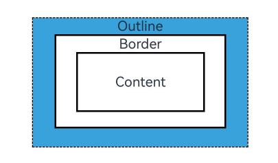
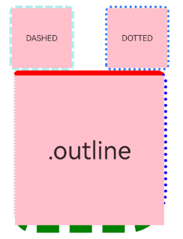
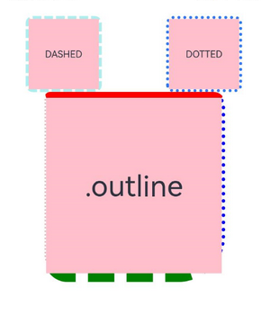
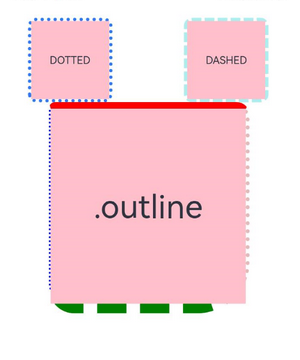

# 外描边设置

更新时间：2026-03-09 07:25:19

来源：https://developer.huawei.com/consumer/cn/doc/harmonyos-references/ts-universal-attributes-outline
**支持设备：** Phone / PC/2in1 / Tablet / Wearable / TV

设置组件外描边（outline）样式。外描边绘制在组件的外侧，不影响布局，不会占用组件本身大小。




> [!NOTE]
> 从API version 11开始支持。后续版本如有新增内容，则采用上角标单独标记该内容的起始版本。


## outline
**支持设备：** Phone / PC/2in1 / Tablet / Wearable / TV

outline(value: OutlineOptions): T

统一外描边样式设置接口。

**卡片能力：** 从API version 11开始，该接口支持在ArkTS卡片中使用。

**元服务API：** 从API version 12开始，该接口支持在元服务中使用。

**系统能力：** SystemCapability.ArkUI.ArkUI.Full

**参数：**


| 参数名 | 类型 | 必填 | 说明 |
| --- | --- | --- | --- |
| value | [OutlineOptions](https://developer.huawei.com/consumer/cn/doc/harmonyos-references/ts-types#outlineoptions11对象说明) | 是 | 外描边样式。 |


**返回值：**


| 类型 | 说明 |
| --- | --- |
| T | 返回当前组件。 |


## outline18+
**支持设备：** Phone / PC/2in1 / Tablet / Wearable / TV

outline(options: Optional<OutlineOptions>): T

统一外描边样式设置接口。与[outline](#outline)相比，options参数新增了对undefined类型的支持。

**卡片能力：** 从API version 18开始，该接口支持在ArkTS卡片中使用。

**元服务API：** 从API version 18开始，该接口支持在元服务中使用。

**系统能力：** SystemCapability.ArkUI.ArkUI.Full

**参数：**


| 参数名 | 类型 | 必填 | 说明 |
| --- | --- | --- | --- |
| options | [Optional](https://developer.huawei.com/consumer/cn/doc/harmonyos-references/ts-universal-attributes-custom-property#optionalt)&lt;[OutlineOptions](https://developer.huawei.com/consumer/cn/doc/harmonyos-references/ts-types#outlineoptions11对象说明)&gt; | 是 | 外描边样式。 当options的值为undefined时，恢复为无外边框效果。 |


**返回值：**


| 类型 | 说明 |
| --- | --- |
| T | 返回当前组件。 |


## OutlineStyle枚举说明
**支持设备：** Phone / PC/2in1 / Tablet / Wearable / TV

外描边样式。

**卡片能力：** 从API version 11开始，该接口支持在ArkTS卡片中使用。

**元服务API：** 从API version 12开始，该接口支持在元服务中使用。

**系统能力：** SystemCapability.ArkUI.ArkUI.Full


| 名称 | 值 | 说明 |
| --- | --- | --- |
| SOLID | 0 | 显示为一条实线。 |
| DASHED | 1 | 显示为一系列短的方形虚线。 |
| DOTTED | 2 | 显示为一系列圆点，圆点半径为outlineWidth的一半。 |


## outlineStyle
**支持设备：** Phone / PC/2in1 / Tablet / Wearable / TV

outlineStyle(value: OutlineStyle | EdgeOutlineStyles): T

设置元素的外描边样式。不设置该接口时，默认显示为一条实线。

**卡片能力：** 从API version 11开始，该接口支持在ArkTS卡片中使用。

**元服务API：** 从API version 12开始，该接口支持在元服务中使用。

**系统能力：** SystemCapability.ArkUI.ArkUI.Full

**参数：**


| 参数名 | 类型 | 必填 | 说明 |
| --- | --- | --- | --- |
| value | [OutlineStyle](#outlinestyle枚举说明) \| [EdgeOutlineStyles](https://developer.huawei.com/consumer/cn/doc/harmonyos-references/ts-types#edgeoutlinestyles11对象说明) | 是 | 设置元素的外描边样式。 |


**返回值：**


| 类型 | 说明 |
| --- | --- |
| T | 返回当前组件。 |


## outlineStyle18+
**支持设备：** Phone / PC/2in1 / Tablet / Wearable / TV

outlineStyle(style: Optional<OutlineStyle | EdgeOutlineStyles>): T

设置元素的外描边样式。不设置该接口时，默认显示为一条实线。与[outlineStyle](#outlinestyle)相比，style参数新增了对undefined类型的支持。

**卡片能力：** 从API version 18开始，该接口支持在ArkTS卡片中使用。

**元服务API：** 从API version 18开始，该接口支持在元服务中使用。

**系统能力：** SystemCapability.ArkUI.ArkUI.Full

**参数：**


| 参数名 | 类型 | 必填 | 说明 |
| --- | --- | --- | --- |
| style | [Optional](https://developer.huawei.com/consumer/cn/doc/harmonyos-references/ts-universal-attributes-custom-property#optionalt)&lt;[OutlineStyle](#outlinestyle枚举说明) \| [EdgeOutlineStyles](https://developer.huawei.com/consumer/cn/doc/harmonyos-references/ts-types#edgeoutlinestyles11对象说明)&gt; | 是 | 设置元素的外描边样式。 当style的值为undefined时，恢复为无外描边样式的效果。 |


**返回值：**


| 类型 | 说明 |
| --- | --- |
| T | 返回当前组件。 |


## outlineWidth
**支持设备：** Phone / PC/2in1 / Tablet / Wearable / TV

outlineWidth(value: Dimension | EdgeOutlineWidths): T

设置元素的外描边宽度。不设置该接口时，默认无变化。

**卡片能力：** 从API version 11开始，该接口支持在ArkTS卡片中使用。

**元服务API：** 从API version 12开始，该接口支持在元服务中使用。

**系统能力：** SystemCapability.ArkUI.ArkUI.Full

**参数：**


| 参数名 | 类型 | 必填 | 说明 |
| --- | --- | --- | --- |
| value | [Dimension](https://developer.huawei.com/consumer/cn/doc/harmonyos-references/ts-types#dimension10) \| [EdgeOutlineWidths](https://developer.huawei.com/consumer/cn/doc/harmonyos-references/ts-types#edgeoutlinewidths11对象说明) | 是 | 设置元素的外描边宽度，不支持百分比。 |


**返回值：**


| 类型 | 说明 |
| --- | --- |
| T | 返回当前组件。 |


## outlineWidth18+
**支持设备：** Phone / PC/2in1 / Tablet / Wearable / TV

outlineWidth(width: Optional<Dimension | EdgeOutlineWidths>): T

设置元素的外描边宽度。不设置该接口时，默认无变化。与[outlineWidth](#outlinewidth)相比，width参数新增了对undefined类型的支持。

**卡片能力：** 从API version 18开始，该接口支持在ArkTS卡片中使用。

**元服务API：** 从API version 18开始，该接口支持在元服务中使用。

**系统能力：** SystemCapability.ArkUI.ArkUI.Full

**参数：**


| 参数名 | 类型 | 必填 | 说明 |
| --- | --- | --- | --- |
| width | [Optional](https://developer.huawei.com/consumer/cn/doc/harmonyos-references/ts-universal-attributes-custom-property#optionalt)&lt;[Dimension](https://developer.huawei.com/consumer/cn/doc/harmonyos-references/ts-types#dimension10) \| [EdgeOutlineWidths](https://developer.huawei.com/consumer/cn/doc/harmonyos-references/ts-types#edgeoutlinewidths11对象说明)&gt; | 是 | 设置元素的外描边宽度，不支持百分比。 当width的值为undefined时，恢复为无外描边宽度的效果。 |


**返回值：**


| 类型 | 说明 |
| --- | --- |
| T | 返回当前组件。 |


## outlineColor
**支持设备：** Phone / PC/2in1 / Tablet / Wearable / TV

outlineColor(value: ResourceColor | EdgeColors | LocalizedEdgeColors): T

设置元素的外描边颜色。不设置该接口时，默认显示为黑色。

**卡片能力：** 从API version 11开始，该接口支持在ArkTS卡片中使用。

**元服务API：** 从API version 12开始，该接口支持在元服务中使用。

**系统能力：** SystemCapability.ArkUI.ArkUI.Full

**参数：**


| 参数名 | 类型 | 必填 | 说明 |
| --- | --- | --- | --- |
| value | [ResourceColor](https://developer.huawei.com/consumer/cn/doc/harmonyos-references/ts-types#resourcecolor) \| [EdgeColors](https://developer.huawei.com/consumer/cn/doc/harmonyos-references/ts-types#edgecolors9) \| [LocalizedEdgeColors](https://developer.huawei.com/consumer/cn/doc/harmonyos-references/ts-types#localizededgecolors12)12+ | 是 | 设置元素的外描边颜色。 |


**返回值：**


| 类型 | 说明 |
| --- | --- |
| T | 返回当前组件。 |


## outlineColor18+
**支持设备：** Phone / PC/2in1 / Tablet / Wearable / TV

outlineColor(color: Optional<ResourceColor | EdgeColors | LocalizedEdgeColors>): T

设置元素的外描边颜色。不设置该接口时，默认显示为黑色。与[outlineColor](#outlinecolor)相比，color参数新增了对undefined类型的支持。

**卡片能力：** 从API version 18开始，该接口支持在ArkTS卡片中使用。

**元服务API：** 从API version 18开始，该接口支持在元服务中使用。

**系统能力：** SystemCapability.ArkUI.ArkUI.Full

**参数：**


| 参数名 | 类型 | 必填 | 说明 |
| --- | --- | --- | --- |
| color | [Optional](https://developer.huawei.com/consumer/cn/doc/harmonyos-references/ts-universal-attributes-custom-property#optionalt)&lt;[ResourceColor](https://developer.huawei.com/consumer/cn/doc/harmonyos-references/ts-types#resourcecolor) \| [EdgeColors](https://developer.huawei.com/consumer/cn/doc/harmonyos-references/ts-types#edgecolors9) \| [LocalizedEdgeColors](https://developer.huawei.com/consumer/cn/doc/harmonyos-references/ts-types#localizededgecolors12)&gt; | 是 | 设置元素的外描边颜色。 当color的值为undefined时，恢复为描边颜色为Color.Black的效果。 |


**返回值：**


| 类型 | 说明 |
| --- | --- |
| T | 返回当前组件。 |


## outlineRadius
**支持设备：** Phone / PC/2in1 / Tablet / Wearable / TV

outlineRadius(value: Dimension | OutlineRadiuses): T

设置元素的外描边圆角半径。不设置该接口时，默认无变化。

**卡片能力：** 从API version 11开始，该接口支持在ArkTS卡片中使用。

**元服务API：** 从API version 12开始，该接口支持在元服务中使用。

**系统能力：** SystemCapability.ArkUI.ArkUI.Full

**参数：**


| 参数名 | 类型 | 必填 | 说明 |
| --- | --- | --- | --- |
| value | [Dimension](https://developer.huawei.com/consumer/cn/doc/harmonyos-references/ts-types#dimension10) \| [OutlineRadiuses](https://developer.huawei.com/consumer/cn/doc/harmonyos-references/ts-types#outlineradiuses11对象说明) | 是 | 设置元素的外描边圆角半径，不支持百分比。 最大生效值：组件width/2 + outlineWidth或组件height/2 + outlineWidth。 |


**返回值：**


| 类型 | 说明 |
| --- | --- |
| T | 返回当前组件。 |


## outlineRadius18+
**支持设备：** Phone / PC/2in1 / Tablet / Wearable / TV

outlineRadius(radius: Optional<Dimension | OutlineRadiuses>): T

设置元素的外描边圆角半径。不设置该接口时，默认无变化。与[outlineRadius](#outlineradius)相比，radius参数新增了对undefined类型的支持。

**卡片能力：** 从API version 18开始，该接口支持在ArkTS卡片中使用。

**元服务API：** 从API version 18开始，该接口支持在元服务中使用。

**系统能力：** SystemCapability.ArkUI.ArkUI.Full

**参数：**


| 参数名 | 类型 | 必填 | 说明 |
| --- | --- | --- | --- |
| radius | [Optional](https://developer.huawei.com/consumer/cn/doc/harmonyos-references/ts-universal-attributes-custom-property#optionalt)&lt;[Dimension](https://developer.huawei.com/consumer/cn/doc/harmonyos-references/ts-types#dimension10) \| [OutlineRadiuses](https://developer.huawei.com/consumer/cn/doc/harmonyos-references/ts-types#outlineradiuses11对象说明)&gt; | 是 | 设置元素的外描边圆角半径，不支持百分比。 最大生效值：组件width/2 + outlineWidth或组件height/2 + outlineWidth。 当radius的值为undefined时，恢复为外描边圆角半径为0的效果。 |


**返回值：**


| 类型 | 说明 |
| --- | --- |
| T | 返回当前组件。 |


## 示例
**支持设备：** Phone / PC/2in1 / Tablet / Wearable / TV


### 示例1（使用外描边属性）

该示例主要演示如何通过[outline](#outline)来实现组件外描边。


```ts
// xxx.ets
@Entry
@Component
struct OutlineExample {
  build() {
    Column() {
      Flex({ justifyContent: FlexAlign.SpaceAround, alignItems: ItemAlign.Center }) {
        // 线段
        Text('DASHED')
        .backgroundColor(Color.Pink)
        .outlineStyle(OutlineStyle.DASHED).outlineWidth(5).outlineColor(0xAFEEEE).outlineRadius(10)
        .width(120).height(120).textAlign(TextAlign.Center).fontSize(16)
        // 点线
        Text('DOTTED')
        .backgroundColor(Color.Pink)
        .outline({ width: 5, color: 0x317AF7, radius: 10, style: OutlineStyle.DOTTED })
        .width(120).height(120).textAlign(TextAlign.Center).fontSize(16)
      }.width('100%').height(150)

      Text('.outline')
      .backgroundColor(Color.Pink)
      .fontSize(50)
      .width(300)
      .height(300)
      .outline({
        width: { left: 3, right: 6, top: 10, bottom: 15 },
        color: { left: '#e3bbbb', right: Color.Blue, top: Color.Red, bottom: Color.Green },
        radius: { topLeft: 10, topRight: 20, bottomLeft: 40, bottomRight: 80 },
        style: {
          left: OutlineStyle.DOTTED,
          right: OutlineStyle.DOTTED,
          top: OutlineStyle.SOLID,
          bottom: OutlineStyle.DASHED
        }
      }).textAlign(TextAlign.Center)
    }
  }
}
```




### 示例2（使用LocalizedEdgeColors类型）

该示例将[outline](#outline)属性中的color属性值设置为[LocalizedEdgeColors](https://developer.huawei.com/consumer/cn/doc/harmonyos-references/ts-types#localizededgecolors12)类型。


```ts
// xxx.ets

@Entry
@Component
struct OutlineExample {
  build() {
    Column() {
      Flex({ justifyContent: FlexAlign.SpaceAround, alignItems: ItemAlign.Center }) {
        // 线段
        Text('DASHED')
        .backgroundColor(Color.Pink)
        .outlineStyle(OutlineStyle.DASHED).outlineWidth(5).outlineColor(0xAFEEEE).outlineRadius(10)
        .width(120).height(120).textAlign(TextAlign.Center).fontSize(16)
        // 点线
        Text('DOTTED')
        .backgroundColor(Color.Pink)
        .outline({ width: 5, color: 0x317AF7, radius: 10, style: OutlineStyle.DOTTED })
        .width(120).height(120).textAlign(TextAlign.Center).fontSize(16)
      }.width('100%').height(150)

      Text('.outline')
      .backgroundColor(Color.Pink)
      .fontSize(50)
      .width(300)
      .height(300)
      .outline({
        width: { left: 3, right: 6, top: 10, bottom: 15 },
        color: { start: '#e3bbbb', end: Color.Blue, top: Color.Red, bottom: Color.Green },
        radius: { topLeft: 10, topRight: 20, bottomLeft: 40, bottomRight: 80 },
        style: {
          left: OutlineStyle.DOTTED,
          right: OutlineStyle.DOTTED,
          top: OutlineStyle.SOLID,
          bottom: OutlineStyle.DASHED
        }
      }).textAlign(TextAlign.Center)
    }
  }
}
```

从左至右显示语言示例图



从右至左显示语言示例图


