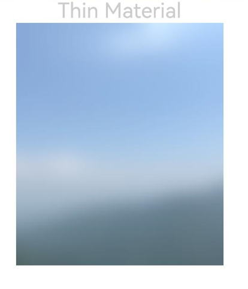

# 组件内容模糊

更新时间：2026-04-20 06:34:33

来源：https://developer.huawei.com/consumer/cn/doc/harmonyos-references/ts-universal-attributes-foreground-blur-style
**支持设备：** Phone / PC/2in1 / Tablet / Wearable / TV

为当前组件添加内容模糊效果。


> [!NOTE]
> 从API version 10开始支持。后续版本如有新增内容，则采用上角标单独标记该内容的起始版本。


## foregroundBlurStyle
**支持设备：** Phone / PC/2in1 / Tablet / Wearable / TV

foregroundBlurStyle(value: BlurStyle, options?: ForegroundBlurStyleOptions): T

为当前组件提供内容模糊能力。


> [!NOTE]
> 从API version 18开始，该接口支持在[attributeModifier](https://developer.huawei.com/consumer/cn/doc/harmonyos-references/ts-universal-attributes-attribute-modifier#attributemodifier)中调用。

**元服务API：** 从API version 11开始，该接口支持在元服务中使用。

**系统能力：** SystemCapability.ArkUI.ArkUI.Full

**参数：**


| 参数名 | 类型 | 必填 | 说明 |
| --- | --- | --- | --- |
| value | [BlurStyle](https://developer.huawei.com/consumer/cn/doc/harmonyos-references/ts-universal-attributes-background#blurstyle9) | 是 | 内容模糊样式。 |
| options | [ForegroundBlurStyleOptions](#foregroundblurstyleoptions对象说明) | 否 | 内容模糊选项。默认值请参考[ForegroundBlurStyleOptions](#foregroundblurstyleoptions对象说明)。 |


**返回值：**


| 类型 | 说明 |
| --- | --- |
| T | 返回当前组件。 |


## foregroundBlurStyle18+
**支持设备：** Phone / PC/2in1 / Tablet / Wearable / TV

foregroundBlurStyle(style: Optional<BlurStyle>, options?: ForegroundBlurStyleOptions): T

为当前组件提供内容模糊能力。与[foregroundBlurStyle](#foregroundblurstyle)相比，style参数新增了对undefined类型的支持。

**元服务API：** 从API version 18开始，该接口支持在元服务中使用。

**系统能力：** SystemCapability.ArkUI.ArkUI.Full

**参数：**


| 参数名 | 类型 | 必填 | 说明 |
| --- | --- | --- | --- |
| style | [Optional](https://developer.huawei.com/consumer/cn/doc/harmonyos-references/ts-universal-attributes-custom-property#optionalt)&lt;[BlurStyle](https://developer.huawei.com/consumer/cn/doc/harmonyos-references/ts-universal-attributes-background#blurstyle9)&gt; | 是 | 内容模糊样式。          当style的值为undefined时，恢复为无模糊的内容。 |
| options | [ForegroundBlurStyleOptions](#foregroundblurstyleoptions对象说明) | 否 | 内容模糊选项。默认值请参考[ForegroundBlurStyleOptions](#foregroundblurstyleoptions对象说明)。 |


**返回值：**


| 类型 | 说明 |
| --- | --- |
| T | 返回当前组件。 |


## foregroundBlurStyle19+
**支持设备：** Phone / PC/2in1 / Tablet / Wearable / TV

foregroundBlurStyle(style: Optional<BlurStyle>, options?: ForegroundBlurStyleOptions, sysOptions?: SystemAdaptiveOptions): T

为当前组件提供内容模糊能力。与[foregroundBlurStyle18+](#foregroundblurstyle18)相比，新增了sysOptions参数，即支持系统自适应调节参数。


> [!NOTE]
> foregroundBlurStyle接口为实时模糊接口，每帧执行实时渲染，性能负载较大。当模糊内容与模糊半径均无需变动时，推荐采用静态模糊接口[blur](https://developer.huawei.com/consumer/cn/doc/harmonyos-references/js-apis-effectkit#blur)。最佳实践请参考：[图像模糊动效优化-使用场景](https://developer.huawei.com/consumer/cn/doc/best-practices/bpta-fuzzy-scene-performance-optimization#section4945532519)。

**元服务API：** 从API version 19开始，该接口支持在元服务中使用。

**系统能力：** SystemCapability.ArkUI.ArkUI.Full

**参数：**


| 参数名 | 类型 | 必填 | 说明 |
| --- | --- | --- | --- |
| style | [Optional](https://developer.huawei.com/consumer/cn/doc/harmonyos-references/ts-universal-attributes-custom-property#optionalt)&lt;[BlurStyle](https://developer.huawei.com/consumer/cn/doc/harmonyos-references/ts-universal-attributes-background#blurstyle9)&gt; | 是 | 内容模糊样式。          当style的值为undefined时，恢复为无模糊的内容。 |
| options | [ForegroundBlurStyleOptions](#foregroundblurstyleoptions对象说明) | 否 | 可选参数，内容模糊选项。默认值请参考[ForegroundBlurStyleOptions](#foregroundblurstyleoptions对象说明)。 |
| sysOptions | [SystemAdaptiveOptions](https://developer.huawei.com/consumer/cn/doc/harmonyos-references/ts-universal-attributes-background#systemadaptiveoptions19) | 否 | 系统自适应调节参数。          默认值：{ disableSystemAdaptation: false } |


**返回值：**


| 类型 | 说明 |
| --- | --- |
| T | 返回当前组件。 |


## ForegroundBlurStyleOptions对象说明
**支持设备：** Phone / PC/2in1 / Tablet / Wearable / TV

继承自[BlurStyleOptions](#blurstyleoptions)，设置内容模糊选项。

**元服务API：** 从API version 11开始，该接口支持在元服务中使用。

**系统能力：** SystemCapability.ArkUI.ArkUI.Full


## BlurStyleOptions
**支持设备：** Phone / PC/2in1 / Tablet / Wearable / TV

内容模糊选项。

**系统能力：** SystemCapability.ArkUI.ArkUI.Full


| 名称 | 类型 | 只读 | 可选 | 说明 |
| --- | --- | --- | --- | --- |
| colorMode | [ThemeColorMode](#themecolormode枚举说明) | 否 | 是 | 内容模糊效果使用的深浅色模式。          默认值：ThemeColorMode.SYSTEM          元服务API： 从API version 11开始，该接口支持在元服务中使用。 |
| adaptiveColor | [AdaptiveColor](#adaptivecolor枚举说明) | 否 | 是 | 内容模糊效果使用的取色模式。          默认值：AdaptiveColor.DEFAULT          元服务API： 从API version 11开始，该接口支持在元服务中使用。 |
| blurOptions11+ | [BlurOptions](#bluroptions11) | 否 | 是 | 灰阶模糊参数。          默认值：grayscale: [0,0]          元服务API： 从API version 12开始，该接口支持在元服务中使用。 |
| scale12+ | number | 否 | 是 | 内容模糊效果程度。          默认值：1.0          取值范围：[0.0, 1.0]          1.0表示模糊程度最高。          0.0表示模糊程度最低。          元服务API： 从API version 12开始，该接口支持在元服务中使用。 |


## ThemeColorMode枚举说明
**支持设备：** Phone / PC/2in1 / Tablet / Wearable / TV

设置颜色模式。

**元服务API：** 从API version 11开始，该接口支持在元服务中使用。

**系统能力：** SystemCapability.ArkUI.ArkUI.Full


| 名称 | 值 | 说明 |
| --- | --- | --- |
| SYSTEM | 0 | 跟随系统深浅色模式。 |
| LIGHT | 1 | 固定使用浅色模式。 |
| DARK | 2 | 固定使用深色模式。 |


## AdaptiveColor枚举说明
**支持设备：** Phone / PC/2in1 / Tablet / Wearable / TV

取色模式。

**元服务API：** 从API version 11开始，该接口支持在元服务中使用。

**系统能力：** SystemCapability.ArkUI.ArkUI.Full


| 名称 | 值 | 说明 |
| --- | --- | --- |
| DEFAULT | 0 | 不使用取色模糊。使用默认的颜色作为蒙版颜色。采用非DEFAULT方式较耗时。 |
| AVERAGE | 1 | 使用取色模糊。将取色区域的颜色平均值作为蒙版颜色。 |


## BlurOptions11+
**支持设备：** Phone / PC/2in1 / Tablet / Wearable / TV

灰阶模糊参数。

**元服务API：** 从API version 12开始，该接口支持在元服务中使用。

**系统能力：** SystemCapability.ArkUI.ArkUI.Full


| 名称 | 类型 | 只读 | 可选 | 说明 |
| --- | --- | --- | --- | --- |
| grayscale | [number, number] | 否 | 否 | 灰阶模糊参数，两参数取值范围均为[0,127] 。对图像中的黑白色进行色阶调整，使其趋于灰色更为柔和美观，对图像中的彩色调整没有效果。参数一表示对黑色的提亮程度，参数二表示对白色的压暗程度，参数值越大调整效果越明显（黑白色变得越灰），有效值范围0-127。例如：设置参数为（20,20），图片中的黑色像素RGB:[0, 0, 0]会调整为[20,20,20]，白色像素RGB:[255,255,255]会调整为[235,235,235]（255-20），图像中的彩色像素维持不变。 |


## 示例
**支持设备：** Phone / PC/2in1 / Tablet / Wearable / TV

该示例主要演示通过foregroundBlurStyle为图片设置内容模糊效果。


```ts
// xxx.ets
@Entry
@Component
struct ForegroundBlurStyleDemo {
  build() {
    Column() {
      Text('Thin Material').fontSize(30).fontColor(0xCCCCCC)
      // $r("app.media.bg")需要替换为开发者所需的图像资源文件。
      Image($r('app.media.bg'))
      .width(300)
      .height(350)
      .foregroundBlurStyle(BlurStyle.Thin,
      { colorMode: ThemeColorMode.LIGHT, adaptiveColor: AdaptiveColor.DEFAULT, scale: 1.0 })
    }
    .height('100%')
    .width('100%')
  }
}
```


