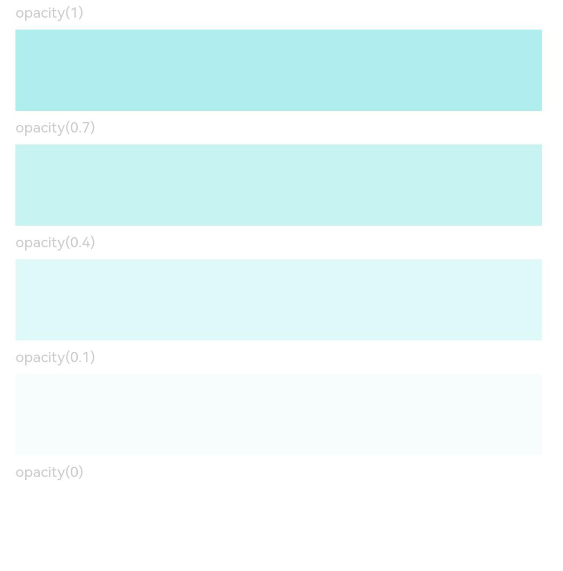

# 透明度设置

更新时间：2026-03-09 02:50:43

来源：https://developer.huawei.com/consumer/cn/doc/harmonyos-references/ts-universal-attributes-opacity
**支持设备：** Phone / PC/2in1 / Tablet / Wearable / TV

设置组件的透明度。


> [!NOTE]
> 从API version 7开始支持。后续版本如有新增内容，则采用上角标单独标记该内容的起始版本。


## opacity
**支持设备：** Phone / PC/2in1 / Tablet / Wearable / TV

opacity(value: number | Resource): T

设置组件的不透明度。

**卡片能力：** 从API version 9开始，该接口支持在ArkTS卡片中使用。

**元服务API：** 从API version 11开始，该接口支持在元服务中使用。

**系统能力：** SystemCapability.ArkUI.ArkUI.Full

**参数：**


| 参数名 | 类型 | 必填 | 说明 |
| --- | --- | --- | --- |
| value | number \| [Resource](https://developer.huawei.com/consumer/cn/doc/harmonyos-references/ts-types#resource) | 是 | 元素的不透明度，取值范围为0到1，若设置的值小于0时，则取值为0，若设置的值大于1时，则取值为1，1表示不透明，0表示完全透明，达到隐藏组件效果，但是在布局中占位。   默认值：1  说明：   子组件会继承父组件的透明度，并与自身的透明度属性叠加。如：父组件透明度为0.1，子组件设置透明度为0.8，则子组件实际透明度为0.1*0.8=0.08。 |


**返回值：**


| 类型 | 说明 |
| --- | --- |
| T | 返回当前组件。 |


## opacity18+
**支持设备：** Phone / PC/2in1 / Tablet / Wearable / TV

opacity(opacity: Optional<number | Resource>): T

设置组件的不透明度。与[opacity](#opacity)相比，opacity参数新增了对undefined类型的支持。

**卡片能力：** 从API version 18开始，该接口支持在ArkTS卡片中使用。

**元服务API：** 从API version 18开始，该接口支持在元服务中使用。

**系统能力：** SystemCapability.ArkUI.ArkUI.Full

**参数：**


| 参数名 | 类型 | 必填 | 说明 |
| --- | --- | --- | --- |
| opacity | [Optional](https://developer.huawei.com/consumer/cn/doc/harmonyos-references/ts-universal-attributes-custom-property#optionalt)&lt;number \| [Resource](https://developer.huawei.com/consumer/cn/doc/harmonyos-references/ts-types#resource)&gt; | 是 | 元素的不透明度，取值范围为0到1，若设置的值小于0时，则取值为0，若设置的值大于1时，则取值为1，1表示不透明，0表示完全透明，达到隐藏组件效果，但是在布局中占位。   默认值：1  说明：   子组件会继承父组件的透明度，并与自身的透明度属性叠加。如：父组件透明度为0.1，子组件设置透明度为0.8，则子组件实际透明度为0.1*0.8=0.08。 当opacity的值为undefined时，恢复为默认不透明度为1的状态。 |


**返回值：**


| 类型 | 说明 |
| --- | --- |
| T | 返回当前组件。 |


## 示例
**支持设备：** Phone / PC/2in1 / Tablet / Wearable / TV

该示例主要显示通过[opacity](#opacity)设置组件的不透明度。


```ts
// xxx.ets
@Entry
@Component
struct OpacityExample {
  build() {
    Column({ space: 5 }) {
      Text('opacity(1)').fontSize(9).width('90%').fontColor(0xCCCCCC)
      Text().width('90%').height(50).opacity(1).backgroundColor(0xAFEEEE)
      Text('opacity(0.7)').fontSize(9).width('90%').fontColor(0xCCCCCC)
      Text().width('90%').height(50).opacity(0.7).backgroundColor(0xAFEEEE)
      Text('opacity(0.4)').fontSize(9).width('90%').fontColor(0xCCCCCC)
      Text().width('90%').height(50).opacity(0.4).backgroundColor(0xAFEEEE)
      Text('opacity(0.1)').fontSize(9).width('90%').fontColor(0xCCCCCC)
      Text().width('90%').height(50).opacity(0.1).backgroundColor(0xAFEEEE)
      Text('opacity(0)').fontSize(9).width('90%').fontColor(0xCCCCCC)
      Text().width('90%').height(50).opacity(0).backgroundColor(0xAFEEEE)
    }
    .width('100%')
    .padding({ top: 5 })
  }
}
```


