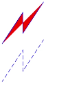

# polyline

更新时间：2026-03-09 02:50:43

来源：https://developer.huawei.com/consumer/cn/doc/harmonyos-references/js-components-svg-polyline
**支持设备：** Phone / PC/2in1 / Tablet / Wearable / TV


> [!NOTE]
> 该组件从API version 7开始支持。后续版本如有新增内容，则采用上角标单独标记该内容的起始版本。

绘制折线。


## 权限列表
**支持设备：** Phone / PC/2in1 / Tablet / Wearable / TV

无


## 子组件
**支持设备：** Phone / PC/2in1 / Tablet / Wearable / TV

支持[animate](https://developer.huawei.com/consumer/cn/doc/harmonyos-references/js-components-svg-animate)、[animateMotion](https://developer.huawei.com/consumer/cn/doc/harmonyos-references/js-components-svg-animatemotion)、[animateTransform](https://developer.huawei.com/consumer/cn/doc/harmonyos-references/js-components-svg-animatetransform)。


## 属性
**支持设备：** Phone / PC/2in1 / Tablet / Wearable / TV

支持Svg组件[通用属性](https://developer.huawei.com/consumer/cn/doc/harmonyos-references/js-components-svg-common-attributes)和以下属性。


| 名称 | 类型 | 默认值 | 必填 | 描述 |
| --- | --- | --- | --- | --- |
| id | string | - | 否 | 组件的唯一标识。 |
| points | string | - | 否 | 设置折线的多个坐标点。 格式为[x1,y1 x2,y2 x3,y3]。 支持属性动画，如果属性动画里设置的动效变化值的坐标个数与原始points的格式不一样，则无效。 |


## 示例
**支持设备：** Phone / PC/2in1 / Tablet / Wearable / TV


```text
<!-- xxx.hml -->
<div class="container">
<svg fill="white" stroke="blue" width="400" height="400">
<polyline points="10,110 60,35 60,85 110,10" fill="red"></polyline>
<polyline points="10,200 60,125 60,175 110,100" stroke-dasharray="10 5" stroke-dashoffset="3"></polyline>
</svg>
</div>
```


