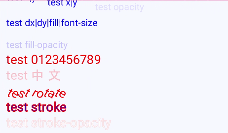
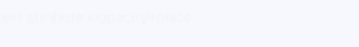
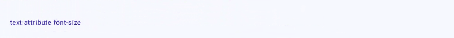
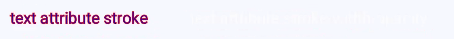

# text

更新时间：2026-03-09 02:50:43

来源：https://developer.huawei.com/consumer/cn/doc/harmonyos-references/js-components-svg-text
**支持设备：** Phone / PC/2in1 / Tablet / Wearable / TV

文本，用于呈现一段信息。


## 权限列表
**支持设备：** Phone / PC/2in1 / Tablet / Wearable / TV

无


## 子组件
**支持设备：** Phone / PC/2in1 / Tablet / Wearable / TV

支持[tspan](https://developer.huawei.com/consumer/cn/doc/harmonyos-references/js-components-svg-tspan)、[textPath](https://developer.huawei.com/consumer/cn/doc/harmonyos-references/js-components-svg-textpath)、[animate](https://developer.huawei.com/consumer/cn/doc/harmonyos-references/js-components-svg-animate)、[animateTransform](https://developer.huawei.com/consumer/cn/doc/harmonyos-references/js-components-svg-animatetransform)。


## 属性
**支持设备：** Phone / PC/2in1 / Tablet / Wearable / TV

支持以下表格中的属性。


| 名称 | 类型 | 默认值 | 必填 | 描述 |
| --- | --- | --- | --- | --- |
| id | string | - | 否 | 组件的唯一标识。 |
| x | &lt;length&gt;\|&lt;percentage&gt; | 0 | 否 | 设置组件左上角x轴坐标。 |
| y | &lt;length&gt;\|&lt;percentage&gt; | 0 | 否 | 设置组件左上角y轴坐标。 |
| dx | &lt;length&gt;\|&lt;percentage&gt; | 0 | 否 | 设置文本x轴偏移。 |
| dy | &lt;length&gt;\|&lt;percentage&gt; | 0 | 否 | 设置文本y轴偏移。 |
| rotate | number | 0 | 否 | 字体以左下角为圆心旋转角度，正数顺时针，负数逆时针。 |
| font-size | &lt;length&gt; | 30px | 否 | 设置文本的尺寸。 |
| fill | &lt;color&gt; | black | 否 | 字体填充颜色。 |
| fill-opacity | number | 1.0 | 否 | 字体填充透明度。 |
| opacity | number | 1 | 否 | 元素的透明度，取值范围为0到1，1表示为不透明，0表示为完全透明。支持属性动画。 |
| stroke | &lt;color&gt; | black | 否 | 绘制字体边框并指定颜色。 |
| stroke-width | number | 1 | 否 | 字体边框宽度。 默认单位：px |
| stroke-opacity | number | 1.0 | 否 | 字体边框透明度。 |


## 示例
**支持设备：** Phone / PC/2in1 / Tablet / Wearable / TV


```text
/* xxx.css */
.container {
flex-direction: row;
justify-content: flex-start;
align-items: flex-start;
height: 1000px;
width: 1080px;
}
```


```text
<!-- xxx.hml -->
<div class="container">
<svg>
<text x="20px" y="0px" font-size="30" fill="blue">test x|y</text>
<text x="150" y="15" font-size="30" fill="blue">test x|y</text>
<text x="300" y="30" font-size="30" fill="blue" opacity="0.1">test opacity</text>
<text dx="20" y="30" dy="50" fill="blue" font-size="30">test dx|dy|fill|font-size</text>
<text x="20" y="150" fill="blue" font-size="30" fill-opacity="0.2">test fill-opacity</text>
<text x="20" y="200" fill="red" font-size="40">test 0123456789</text>
<text x="20" y="250" fill="red" font-size="40" fill-opacity="0.2">test 中文</text>
<text x="20" y="300" rotate="30" fill="red" font-size="40">test rotate</text>
<text x="20" y="350" fill="blue" font-size="40" stroke="red" stroke-width="2">test stroke</text>
<text x="20" y="400" fill="white" font-size="40" stroke="red" stroke-width="2" stroke-opacity="0.5">test stroke-opacity</text>
</svg>
</div>
```



属性动画示例


```text
/* xxx.css  */
.container {
flex-direction: row;
justify-content: flex-start;
align-items: flex-start;
height: 3000px;
width: 1080px;
}
```


```text
<!-- xxx.hml -->
<div class="container">
<svg>
<text y="50" font-size="30" fill="blue">
text attribute x|opacity|rotate
<animate attributeName="x" from="100" by="400" dur="3s" repeatCount="indefinite"></animate>
<animate attributeName="opacity" from="0.01" to="0.99" dur="3s" repeatCount="indefinite"></animate>
<animate attributeName="rotate" from="0" to="360" dur="3s" repeatCount="indefinite"></animate>
</text>
</svg>
</div>
```




```text
<!-- xxx.hml -->
<div class="container">
<svg>
<text x="20" y="200" fill="blue">
text attribute font-size
<animate attributeName="font-size" from="10" to="50" dur="3s" repeatCount="indefinite">
</animate>
</text>
</svg>
</div>
```




```text
<!-- xxx.hml -->
<div class="container">
<svg>
<text x="20" y="250" font-size="25" fill="blue" stroke="red">
text attribute stroke
<animate attributeName="stroke" from="red" to="#00FF00" dur="3s" repeatCount="indefinite"></animate>
</text>
<text x="300" y="250" font-size="25" fill="white" stroke="red">
text attribute stroke-width-opacity
<animate attributeName="stroke-width" from="1" to="5" dur="3s" repeatCount="indefinite"></animate>
<animate attributeName="stroke-opacity" from="0.01" to="0.99" dur="3s" repeatCount="indefinite"></animate>
</text>
</svg>
</div>
```


