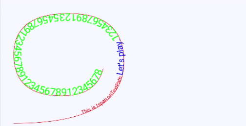
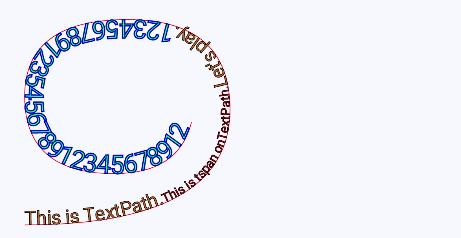
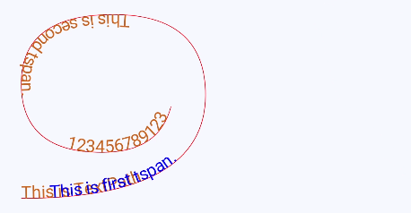
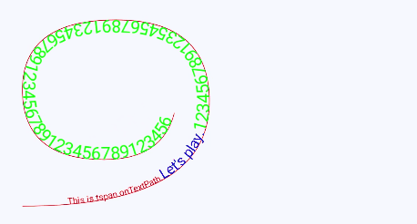
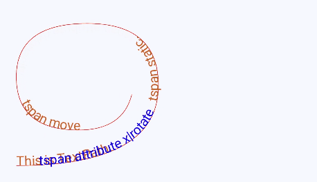
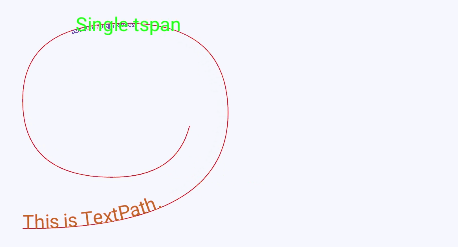
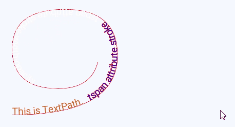

# textPath

更新时间：2026-03-09 02:50:43

来源：https://developer.huawei.com/consumer/cn/doc/harmonyos-references/js-components-svg-textpath
**支持设备：** Phone | PC/2in1 | Tablet | Wearable | TV

沿路径绘制文本。
 
> [!NOTE]
> 该组件从API version 7开始支持。后续版本如有新增内容，则采用上角标单独标记该内容的起始版本。 按指定的路径绘制文本，可嵌套子标签tspan分段。 只支持被父元素标签text嵌套。

  

##### 权限列表

**支持设备：** Phone | PC/2in1 | Tablet | Wearable | TV

无
 
  

##### 子组件

**支持设备：** Phone | PC/2in1 | Tablet | Wearable | TV

[tspan](https://developer.huawei.com/consumer/cn/doc/harmonyos-references/js-components-svg-tspan)。
 
  

##### 属性

**支持设备：** Phone | PC/2in1 | Tablet | Wearable | TV

支持以下表格中的属性。
  
| 名称 | 类型 | 默认值 | 描述 |
| --- | --- | --- | --- |
| id | string | - | 组件的唯一标识。 |
| path | string | 0 | 设置路径的形状。 字母指令表示的意义如下： - M = moveto - L = lineto - H = horizontal lineto - V = vertical lineto - C = curveto - S = smooth curveto - Q = quadratic Bezier curve - T = smooth quadratic Bezier curveto - A = elliptical Arc - Z = closepath 默认值：0 |
| startOffset | &lt;length&gt;\|&lt;percentage&gt; | 0 | 设置文本沿path绘制的起始偏移。 默认值：0 |
| font-size | &lt;length&gt; | 30px | 设置文本的尺寸。 默认值：30px |
| fill | &lt;color&gt; | black | 字体填充颜色。 默认值：black |
| by | number | - | 相对被指定动画的属性偏移值，from默认为原属性值。 |
| opacity | number | 1 | 元素的透明度，取值范围为0到1，1表示为不透明，0表示为完全透明。支持属性动画。 默认值：1 |
| fill-opacity | number | 1.0 | 字体填充透明度。 默认值：1.0 |
| stroke | &lt;color&gt; | black | 绘制字体边框并指定颜色。 默认值：black |
| stroke-width | number | 1 | 字体边框宽度。 默认值：1px |
| stroke-opacity | number | 1.0 | 字体边框透明度。 默认值：1.0 |
 
 
  

##### 示例

**支持设备：** Phone | PC/2in1 | Tablet | Wearable | TV

textPath属性示例，textpath文本内容沿着属性path中的路径绘制文本，起点偏移20%的path长度。（绘制的元素&lt;path&gt;曲线仅做参照）
 
```text
<!-- xxx.hml -->
<div class="container">
  <svg fill="#00FF00" x="50">
    <path d="M40,360 Q360,360 360,180 Q360,40 200,40 Q40,40 40,160 Q40,280 180,280 Q280,280 300,200" stroke="red" fill="none"></path>
    <text>
      <textpath fill="blue" startOffset="20%" path="M40,360 Q360,360 360,180 Q360,40 200,40 Q40,40 40,160 Q40,280 180,280 Q280,280 300,200" font-size="30px">
        This is textpath test.
      </textpath>
    </text>
  </svg>
</div>
```
 
```text
/* xxx.css */
.container {
    flex-direction: row;
    justify-content: flex-start;
    align-items: flex-start;
    height: 1200px;
    width: 600px;
}
```
 



 
textpath与tspan组合示例与效果图
 
```text
<!-- xxx.hml -->
<div class="container">
  <svg fill="#00FF00" x="50">
    <path d="M40,360 Q360,360 360,180 Q360,40 200,40 Q40,40 40,160 Q40,280 180,280 Q280,280 300,200" stroke="red" fill="none"></path>
      <text>
        <textpath fill="blue" startOffset="20%" path="M40,360 Q360,360 360,180 Q360,40 200,40 Q40,40 40,160 Q40,280 180,280 Q280,280 300,200" font-size="15px">
          <tspan dx="-50px" fill="red">This is tspan onTextPath.</tspan>
          <tspan font-size="25px">Let's play.</tspan>
          <tspan font-size="30px" fill="#00FF00">12345678912354567891234567891234567891234567891234567890</tspan>
        </textpath>
      </text>
  </svg>
</div>
```
 



 
```text
<!-- xxx.hml -->
<div class="container">
  <svg fill="#00FF00" x="50">
    <path d="M40,360 Q360,360 360,180 Q360,40 200,40 Q40,40 40,160 Q40,280 180,280 Q280,280 300,200" stroke="red" fill="none"></path>
    <text>
      <textpath fill="#D2691E" path="M40,360 Q360,360 360,180 Q360,40 200,40 Q40,40 40,160 Q40,280 180,280 Q280,280 300,200" font-size="30px" stroke="black" stroke-width="1" >
        This is TextPath.
        <tspan font-size="20px" fill="red">This is tspan onTextPath.</tspan>
        <tspan font-size="30px">Let's play.</tspan>
        <tspan font-size="40px" fill="#00FF00"  stroke="blue" stroke-width="2">12345678912354567891234567891234567891234567891234567890
        </tspan>
      </textpath>
    </text>
  </svg>
</div>
```
 



 
```text
<!-- xxx.hml -->
<div class="container">
  <svg fill="#00FF00" x="50">
    <path d="M40,360 Q360,360 360,180 Q360,40 200,40 Q40,40 40,160 Q40,280 180,280 Q280,280 300,200" stroke="red" fill="none">
    </path>
    <!--      数值百分比    -->
    <text>
      <textpath fill="#D2691E" path="M40,360 Q360,360 360,180 Q360,40 200,40 Q40,40 40,160 Q40,280 180,280 Q280,280 300,200" font-size="30px">
        This is TextPath.
        <tspan x="50" fill="blue">This is first tspan.</tspan>
        <tspan x="50%">This is second tspan.</tspan>
        <tspan dx="10%">12345678912354567891234567891234567891234567891234567890</tspan>
      </textpath>
    </text>
  </svg>
</div>
```
 



 
startOffset属性动画，文本绘制时起点偏移从10%运动到40%，不绘制超出path长度范围的文本。
 
```text
/* xxx.css */
.container {
    flex-direction: row;
    justify-content: flex-start;
    align-items: flex-start;
    height: 3000px;
    width: 1080px;
}
```
 
```text
<!-- xxx.hml -->
<div class="container">
  <svg fill="#00FF00">
    <path d="M40,360 Q360,360 360,180 Q360,40 200,40 Q40,40 40,160 Q40,280 180,280 Q280,280 300,200" stroke="red" fill="none"></path>
    <text>
      <textpath fill="blue" startOffset="10%" path="M40,360 Q360,360 360,180 Q360,40 200,40 Q40,40 40,160 Q40,280 180,280 Q280,280 300,200" font-size="15px">
        <tspan dx="-50px" fill="red">This is tspan onTextPath.</tspan>
        <tspan font-size="25px">Let's play.</tspan>
        <tspan font-size="30px" fill="#00FF00">12345678912354567891234567891234567891234567891234567890</tspan>
        <animate attributeName="startOffset" from="10%" to="40%" dur="3s" repeatCount="indefinite"></animate>
      </textpath>
    </text>
  </svg>
</div>
```
 



 
textpath与tspan组合属性动画与效果图
 
```text
<!-- xxx.hml -->
<div class="container">
  <svg fill="#00FF00">
    <path d="M40,360 Q360,360 360,180 Q360,40 200,40 Q40,40 40,160 Q40,280 180,280 Q280,280 300,200" stroke="red" fill="none">
    </path>
    <text>
      <textpath fill="#D2691E" path="M40,360 Q360,360 360,180 Q360,40 200,40 Q40,40 40,160 Q40,280 180,280 Q280,280 300,200" font-size="30px">
        This is TextPath.
        <tspan x="50" fill="blue">
          tspan attribute x|rotate
          <animate attributeName="x" from="50" to="100" dur="5s" repeatCount="indefinite"></animate>
          <animate attributeName="rotate" from="0" to="360" dur="5s" repeatCount="indefinite"></animate>
        </tspan>
        <tspan x="30%">tspan static.</tspan>
        <tspan>
          tspan attribute dx|opacity
          <animate attributeName="dx" from="0%" to="30%" dur="3s" repeatCount="indefinite"></animate>
          <animate attributeName="opacity" from="0.01" to="0.99" dur="3s" repeatCount="indefinite"></animate>
        </tspan>
        <tspan dx="5%">tspan move</tspan>
      </textpath>
    </text>
  </svg>
</div>
```
 



 
(1) "tspan attribute x|rotate" 文本绘制起点偏移从50px运动到100px，顺时针旋转0度到360度。
 
(2) "tspan attribute dx|opacity" 在 "tspan static." 绘制结束后再开始绘制，向后偏移量从0%运动到30%，透明度从浅到深变化。
 
(3) "tspan move" 在上一段tspan绘制完成后，向后偏移5%的距离进行绘制，呈现跟随前一段tspan移动的效果。
 
textpath与tspan组合属性动画与效果图
 
```text
<!-- xxx.hml -->
<div class="container">
  <svg fill="#00FF00">
    <path d="M40,360 Q360,360 360,180 Q360,40 200,40 Q40,40 40,160 Q40,280 180,280 Q280,280 300,200" stroke="red"
      fill="none">
    </path>
    <text>
      <textpath fill="#D2691E" path="M40,360 Q360,360 360,180 Q360,40 200,40 Q40,40 40,160 Q40,280 180,280 Q280,280 300,200" font-size="30px">
        This is TextPath.
        <tspan dx="20" fill="blue">
          tspan attribute fill|fill-opacity
          <animate attributeName="fill" from="blue" to="red" dur="3s" repeatCount="indefinite"></animate>
          <animate attributeName="fill-opacity" from="0.01" to="0.99" dur="3s" repeatCount="indefinite"></animate>
        </tspan>
        <tspan dx="20" fill="blue">
          tspan attribute font-size
          <animate attributeName="font-size" from="10" to="50" dur="3s" repeatCount="indefinite"></animate>
        </tspan>
      </textpath>
        <tspan font-size="30">Single tspan</tspan>
    </text>
  </svg>
</div>
```
 



 
(1) "This is TextPath." 在path上无偏移绘制第一段文本内容，大小30px，颜色"#D2691E"。
 
(2) "tspan attribute fill|fill-opacity" 相对上一段文本结束后偏移20px，颜色从蓝到红，透明度从浅到深。
 
(3) "tspan attribute font-size" 绘制起点相对上一段结束后偏移20px，起点静止，字体大小从10px到50px，整体长度持续拉长。
 
(4) "Single tspan" 在上一段的尾部做水平绘制，呈现跟随上一段运动的效果。
 
textpath与tspan组合属性动画与效果图
 
```text
<!-- xxx.hml -->
<div class="container">
  <svg fill="#00FF00">
    <path d="M40,360 Q360,360 360,180 Q360,40 200,40 Q40,40 40,160 Q40,280 180,280 Q280,280 300,200" stroke="red"
      fill="none">
    </path>
    <text>
      <textpath fill="#D2691E" path="M40,360 Q360,360 360,180 Q360,40 200,40 Q40,40 40,160 Q40,280 180,280 Q280,280 300,200" font-size="30px">
          This is TextPath.
          <tspan dx="20" fill="blue">
            tspan attribute stroke
            <animate attributeName="stroke" from="red" to="#00FF00" dur="3s" repeatCount="indefinite"></animate>
          </tspan>
          <tspan dx="20" fill="white" stroke="red">
            tspan attribute stroke-width-opacity
            <animate attributeName="stroke-width" from="1" to="5" dur="3s" repeatCount="indefinite"></animate>
            <animate attributeName="stroke-opacity" from="0.01" to="0.99" dur="3s" repeatCount="indefinite"></animate>
          </tspan>
      </textpath>
    </text>
  </svg>
</div>
```
 


 
(1) "tspan attribute stroke" 轮廓颜色从红色逐渐转变成绿色。
 
(2) "tspan attribute stroke-width-opacity" 轮廓宽度从细1px转变粗5px，透明度从浅到深。
