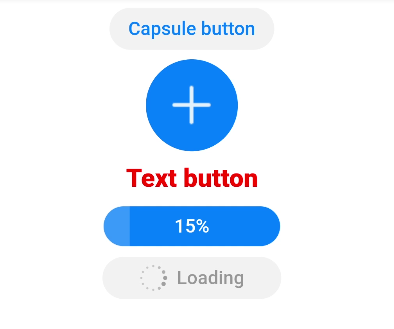

# button

更新时间：2026-03-09 02:50:43

来源：https://developer.huawei.com/consumer/cn/doc/harmonyos-references/js-components-basic-button
**支持设备：** Phone / PC/2in1 / Tablet / Wearable / TV


> [!NOTE]
> 从API version 4开始支持。后续版本如有新增内容，则采用上角标单独标记该内容的起始版本。

按钮组件，包括胶囊按钮、圆形按钮、文本按钮、弧形按钮、下载按钮。


## 子组件
**支持设备：** Phone / PC/2in1 / Tablet / Wearable / TV

不支持。


## 属性
**支持设备：** Phone / PC/2in1 / Tablet / Wearable / TV

除支持[通用属性](https://developer.huawei.com/consumer/cn/doc/harmonyos-references/js-components-common-attributes)外，还支持如下属性：


| 名称 | 类型 | 默认值 | 必填 | 描述 |
| --- | --- | --- | --- | --- |
| type | string | - | 否 | 不支持动态修改。默认展示为胶囊型按钮，不同于胶囊类型，四边圆角可以通过border-radius分别指定。该属性可选值包括： - capsule：胶囊型按钮，带圆角按钮，有背景色和文本。 - circle：圆形按钮，支持放置图标。 - text：文本按钮，仅包含文本显示。 - arc：弧形按钮，仅支持智能穿戴。 - download：下载按钮，额外增加下载进度条功能。 |
| value | string | - | 否 | button的文本值。 |
| icon | string | - | 否 | button的图标路径，图标格式为jpg，png和svg。 |
| placement5+ | string | end | 否 | 仅在type属性为缺省时生效，设置图标位于文本的位置，可选值为： - start：图标位于文本起始处。 - end：图标位于文本结束处。 - top：图标位于文本上方。 - bottom：图标位于文本下方。 |
| waiting | boolean | false | 否 | waiting状态，waiting为true时展现等待中转圈效果，位于文本左侧。值为false时，不展示等待中效果。类型为download时不生效。 |


## 样式
**支持设备：** Phone / PC/2in1 / Tablet / Wearable / TV


### type设置为非arc
**支持设备：** Phone / PC/2in1 / Tablet / Wearable / TV

除支持[通用样式](https://developer.huawei.com/consumer/cn/doc/harmonyos-references/js-components-common-styles)外，还支持如下样式：


| 名称 | 类型 | 默认值 | 必填 | 描述 |
| --- | --- | --- | --- | --- |
| text-color | &lt;color&gt; | #007dff | 否 | 按钮的文本颜色。 |
| font-size | &lt;length&gt; | 16px | 否 | 按钮的文本尺寸。 |
| allow-scale | boolean | true | 否 | 按钮的文本尺寸是否跟随系统设置字体缩放尺寸进行放大缩小。true表示跟随系统放大缩小，false表示不跟随系统放大缩小。 如果在config描述文件中针对ability配置了fontSize的config-changes标签，则应用不会重启而直接生效。 |
| font-style | string | normal | 否 | 按钮的字体样式。 |
| font-weight | number \| string | normal | 否 | 按钮的字体粗细。见[text组件font-weight的样式属性](https://developer.huawei.com/consumer/cn/doc/harmonyos-references/js-components-basic-text#样式)。 |
| font-family | &lt;string&gt; | sans-serif | 否 | 按钮的字体列表，用逗号分隔，每个字体用字体名或者字体族名设置。列表中第一个系统中存在的或者通过[自定义字体](https://developer.huawei.com/consumer/cn/doc/harmonyos-references/js-components-common-customizing-font)指定的字体，会被选中作为文本的字体。 |
| icon-width | &lt;length&gt; | - | 否 | 设置圆形按钮内部图标的宽，默认填满整个圆形按钮。 icon使用svg图源时必须设置该样式。 |
| icon-height | &lt;length&gt; | - | 否 | 设置圆形按钮内部图标的高，默认填满整个圆形按钮。 icon使用svg图源时必须设置该样式。 |
| radius | &lt;length&gt; | - | 否 | 按钮圆角半径。在圆形按钮类型下该样式优先于通用样式的width和height样式。 |


### type设置为arc
**支持设备：** Phone / PC/2in1 / Tablet / Wearable / TV

除支持[通用样式](https://developer.huawei.com/consumer/cn/doc/harmonyos-references/js-components-common-styles)中background-color、opacity、display、visibility、position、[left|top|right|bottom]外，还支持如下样式：


| 名称 | 类型 | 默认值 | 必填 | 描述 |
| --- | --- | --- | --- | --- |
| text-color | &lt;color&gt; | #de0000 | 否 | 弧形按钮的文本颜色。 |
| font-size | &lt;length&gt; | 37.5px | 否 | 弧形按钮的文本尺寸。 |
| allow-scale | boolean | true | 否 | 弧形按钮的文本尺寸是否跟随系统设置字体缩放尺寸进行放大缩小。true表示跟随系统放大缩小，false表示不跟随系统放大缩小。 |
| font-style | string | normal | 否 | 弧形按钮的字体样式。 |
| font-weight | number \| string | normal | 否 | 弧形按钮的字体粗细。见[text组件font-weight的样式属性](https://developer.huawei.com/consumer/cn/doc/harmonyos-references/js-components-basic-text#样式)。 |
| font-family | &lt;string&gt; | sans-serif | 否 | 按钮的字体列表，用逗号分隔，每个字体用字体名或者字体族名设置。列表中第一个系统中存在的或者通过[自定义字体](https://developer.huawei.com/consumer/cn/doc/harmonyos-references/js-components-common-customizing-font)指定的字体，会被选中作为文本的字体。 |


## 事件
**支持设备：** Phone / PC/2in1 / Tablet / Wearable / TV

支持[通用事件](https://developer.huawei.com/consumer/cn/doc/harmonyos-references/js-components-common-events)。


## 方法
**支持设备：** Phone / PC/2in1 / Tablet / Wearable / TV

支持[通用方法](https://developer.huawei.com/consumer/cn/doc/harmonyos-references/js-components-common-methods)。

类型为download时，支持如下方法：


| 名称 | 参数 | 描述 |
| --- | --- | --- |
| setProgress | { progress:percent } | 设定下载按钮进度条进度，取值位于0-100区间内，当设置的值大于0时，下载按钮展现进度条。当设置的值大于等于100时，取消进度条显示。 浮在进度条上的文字通过value值进行变更。 |


## 示例
**支持设备：** Phone / PC/2in1 / Tablet / Wearable / TV


```text
<!-- xxx.hml -->
<div class="div-button">
<button class="first" type="capsule" value="Capsule button"></button>
<button class="button circle" type="circle" icon="common/ic_add_default.png"></button>
<button class="button text" type="text">Text button</button>
<button class="button download" type="download" id="download-btn"
onclick="progress">{{downloadText}}</button>
<button class="last" type="capsule" waiting="true">Loading</button>
</div>
```


```text
/* xxx.css */
.div-button {
flex-direction: column;
align-items: center;
}
.first{
background-color: #F2F2F2;
text-color: #0D81F2;
}
.button {
margin-top: 15px;
}
.last{
background-color: #F2F2F2;
text-color: #969696;
margin-top: 15px;
width: 280px;
height:72px;
}
.button:waiting {
width: 280px;
}
.circle {
background-color: #007dff;
radius: 72px;
icon-width: 72px;
icon-height: 72px;
}
.text {
text-color: red;
font-size: 40px;
font-weight: 900;
font-family: sans-serif;
font-style: normal;
}
.download {
width: 280px;
text-color: white;
background-color: #007dff;
}
```


```text
// xxx.js
export default {
data: {
count: 5,
downloadText: "Download"
},
progress(e) {
this.count += 10;
this.downloadText = this.count + "%";
this.$element('download-btn').setProgress({ progress: this.count});
if (this.count >= 100) {
this.downloadText = "Done";
}
}
}
```


