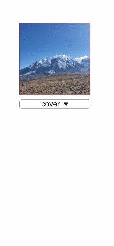

# image

更新时间：2026-03-09 02:50:43

来源：https://developer.huawei.com/consumer/cn/doc/harmonyos-references/js-components-basic-image
**支持设备：** Phone / PC/2in1 / Tablet / Wearable / TV


> [!NOTE]
> 从API version 4开始支持。后续版本如有新增内容，则采用上角标单独标记该内容的起始版本。

图片组件，用来渲染展示图片。


## 子组件
**支持设备：** Phone / PC/2in1 / Tablet / Wearable / TV

不支持。


## 属性
**支持设备：** Phone / PC/2in1 / Tablet / Wearable / TV

除支持[通用属性](https://developer.huawei.com/consumer/cn/doc/harmonyos-references/js-components-common-attributes)外，还支持如下属性：


| 名称 | 类型 | 默认值 | 必填 | 描述 |
| --- | --- | --- | --- | --- |
| src | string | - | 否 | 图片的路径，支持本地路径，图片格式包括png、jpg、bmp、svg和gif。 - 支持Base64字符串6+。格式为data:image/[png \| jpeg \| bmp \| webp];base64, [base64 data], 其中[base64 data]为Base64字符串数据。 - 支持dataability://的路径前缀，用于访问通过data ability提供的图片路径6+。 |
| alt | string | - | 否 | 占位图，当指定图片在加载中时显示。 |


## 样式
**支持设备：** Phone / PC/2in1 / Tablet / Wearable / TV

除支持[通用样式](https://developer.huawei.com/consumer/cn/doc/harmonyos-references/js-components-common-styles)外，还支持如下属性：


| 名称 | 类型 | 默认值 | 必填 | 描述 |
| --- | --- | --- | --- | --- |
| object-fit | string | cover | 否 | 设置图片的缩放类型，不支持svg格式。可选值类型说明请见object-fit类型说明。 |
| match-text-direction | boolean | false | 否 | 图片是否跟随文字方向，不支持svg格式。 默认值：false，表示图片不跟随文字方向。 |
| fit-original-size | boolean | false | 否 | [image](https://developer.huawei.com/consumer/cn/doc/harmonyos-references/js-components-basic-image)组件在未设置宽高的情况下是否适应图源尺寸，该属性为true时object-fit属性不生效，svg类型图源不支持该属性。 默认值：false，表示[image](https://developer.huawei.com/consumer/cn/doc/harmonyos-references/js-components-basic-image)组件在未设置宽高的情况下不适应图源尺寸。 |
| object-position7+ | string | 0px 0px | 否 | 设置图片在组件内展示的位置。 设置类型有两种： 1. 像素，单位px，示例 15px 15px 代表X轴或者Y轴移动的位置。 2. 字符，可选值： - left 图片显示在组件左侧。 - top 图片显示在组件顶部位置。 - right 图片显示在组件右侧位置。 - bottom 图片显示在组件底部位置。 |


**表1** object-fit 类型说明


| 类型 | 描述 |
| --- | --- |
| cover | 保持宽高比进行缩小或者放大，使得图片两边都大于或等于显示边界，居中显示。 |
| contain | 保持宽高比进行缩小或者放大，使得图片完全显示在显示边界内，居中显示。 |
| fill | 不保持宽高比进行放大缩小，使得图片填充满显示边界。 |
| none | 保持原有尺寸进行居中显示。 |
| scale-down | 保持宽高比居中显示，图片缩小或者保持不变。 |


> [!NOTE]
> 使用svg图片资源时：


## 事件
**支持设备：** Phone / PC/2in1 / Tablet / Wearable / TV

除支持[通用事件](https://developer.huawei.com/consumer/cn/doc/harmonyos-references/js-components-common-events)外，还支持如下事件：


| 名称 | 参数 | 描述 |
| --- | --- | --- |
| complete | {  width：width，  height：height  } | 图片成功加载时触发该回调，返回成功加载的图源尺寸。 |
| error | {  width：width，  height：height  } | 图片加载出现异常时触发该回调，异常时长宽为零。 |


## 方法
**支持设备：** Phone / PC/2in1 / Tablet / Wearable / TV

支持[通用方法](https://developer.huawei.com/consumer/cn/doc/harmonyos-references/js-components-common-methods)。


## 示例
**支持设备：** Phone / PC/2in1 / Tablet / Wearable / TV


```text
<!-- xxx.hml -->
<div class="container">
<image src="common/images/example.png" style="width: 300px; height: 300px; object-fit:{{fit}}; object-position: center center; border: 1px solid red;">
</image>
<select class="selects" onchange="change_fit"><option for="{{fits}}" value="{{$item}}">{{$item}}</option></select>
</div>
```


```text
/* xxx.css */
.container {
justify-content: center;
align-items: center;
flex-direction: column;
}
.selects{
margin-top: 20px;
width:300px;
border:1px solid #808080;
border-radius: 10px;
}
```


```text
// xxx.js
export default {
data: {
fit:"cover",
fits: ["cover", "contain", "fill", "none", "scale-down"],
},
change_fit(e) {
this.fit = e.newValue;
},
}
```


