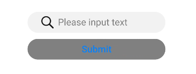
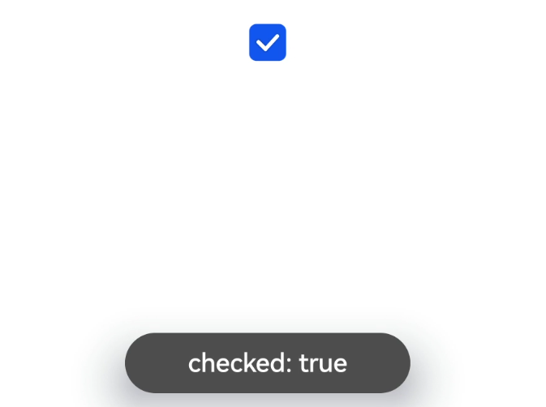
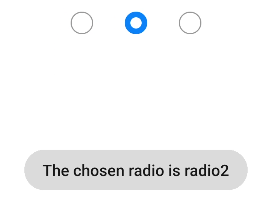

# input

更新时间：2026-04-20 06:34:33

来源：https://developer.huawei.com/consumer/cn/doc/harmonyos-references/js-components-basic-input
**支持设备：** Phone / PC/2in1 / Tablet / Wearable / TV

> [!NOTE]
> 从API version 4开始支持。后续版本如有新增内容，则采用上角标单独标记该内容的起始版本。

交互式组件，包括单选框，多选框，按钮和单行文本输入框。

## 权限列表
**支持设备：** Phone / PC/2in1 / Tablet / Wearable / TV

无

## 子组件
**支持设备：** Phone / PC/2in1 / Tablet / Wearable / TV

不支持。

## 属性
**支持设备：** Phone / PC/2in1 / Tablet / Wearable / TV

除支持[通用属性](https://developer.huawei.com/consumer/cn/doc/harmonyos-references/js-components-common-attributes)外，还支持如下属性：

| 名称 | 类型 | 默认值 | 必填 | 描述 |
| --- | --- | --- | --- | --- |
| type | string | text | 否 | input组件类型，可选值为text，email，date，time，number，password，button，checkbox，radio。 其中text，email，date，time，number，password这六种类型之间支持动态切换修改。 button，checkbox，radio不支持动态修改。可选值定义如下： - button：定义可点击的按钮； - checkbox：定义多选框； - radio：定义单选按钮，允许在多个拥有相同name值的选项中选中其中一个； - text：定义一个单行的文本字段； - email：定义用于e-mail地址的字段； - date：定义 date 控件（包括年、月、日，不包括时间）； - time：定义用于输入时间的控件（不带时区）； - number：定义用于输入数字的字段； - password：定义密码字段（字段中的字符会被遮蔽）。 |
| checked | boolean | false | 否 | 当前组件是否选中，仅type为checkbox和radio生效。 true表示选中，false表示未选中。 |
| name | string | - | 否 | input组件的名称。 type为radio时，name为必填。 |
| value | string | - | 否 | input组件的value值，当类型为radio时必填且相同name值的选项该值唯一。 |
| placeholder | string | - | 否 | 设置提示文本的内容，仅在type为text\|email\|date\|time\|number\|password时生效。 |
| maxlength | number | - | 否 | 输入框可输入的最多字符数量，不填表示不限制输入框中字符数量。 |
| enterkeytype | string | default | 否 | 不支持动态修改。 设置软键盘Enter按钮的类型，可选值为： - default：默认 - next：下一项 - go：前往 - done：完成 - send：发送 - search：搜索 除“next”外，点击后会自动收起软键盘。 |
| headericon | string | - | 否 | 在文本输入前的图标资源路径，该图标不支持点击事件（button，checkbox和radio不生效），图标格式为jpg，png和svg。 |
| showcounter5+ | boolean | false | 否 | 文本输入框是否显示计数下标，需要配合maxlength一起使用。 true表示显示，false表示不显示。 |
| menuoptions5+ | Array&lt;MenuOption&gt; | - | 否 | 设置文本选择弹框点击更多按钮之后显示的菜单项。 |
| autofocus6+ | boolean | false | 否 | 是否自动获焦。 应用首页中设置不生效，可在onActive中延迟（100-500ms左右）调用focus方法实现输入框在首页中自动获焦。 true表示文本框自动获焦，false表示文本框不自动获焦。 |
| selectedstart6+ | number | -1 | 否 | 开始选择文本时初始选择位置。 |
| selectedend6+ | number | -1 | 否 | 开始选择文本时结尾选择位置。 |
| softkeyboardenabled6+ | boolean | true | 否 | 编辑时是否弹出系统软键盘。 true表示会弹出系统软键盘，false表示不会弹出。 |
| showpasswordicon6+ | boolean | true | 否 | 是否显示密码框末尾的图标（仅type为password时生效）。 true表示显示密码框末尾的图标，false表示不显示。 |

**表1** MenuOption5+

| 名称 | 类型 | 描述 |
| --- | --- | --- |
| icon | string | 菜单选项中的图标路径。 |
| content | string | 菜单选项中的文本内容。 |

## 样式
**支持设备：** Phone / PC/2in1 / Tablet / Wearable / TV

除支持[通用样式](https://developer.huawei.com/consumer/cn/doc/harmonyos-references/js-components-common-styles)外，还支持如下样式：

| 名称 | 类型 | 默认值 | 必填 | 描述 |
| --- | --- | --- | --- | --- |
| color | &lt;color&gt; | #e6000000 | 否 | 单行输入框或者按钮的文本颜色。 |
| font-size | &lt;length&gt; | 16px | 否 | 单行输入框或者按钮的文本尺寸。 |
| allow-scale | boolean | true | 否 | 单行输入框或者按钮的文本尺寸是否跟随系统设置字体缩放尺寸进行放大缩小。true表示跟随，false表示不跟随。 如果在config描述文件中针对ability配置了fontSize的config-changes标签，则应用不会重启而直接生效。 |
| placeholder-color | &lt;color&gt; | #99000000 | 否 | 单行输入框的提示文本的颜色，type为text \| email \| date \| time \| number \| password时生效。 |
| font-weight | number \| string | normal | 否 | 单行输入框或者按钮的字体粗细，见[text组件font-weight的样式属性](https://developer.huawei.com/consumer/cn/doc/harmonyos-references/js-components-basic-text#样式)。 |
| caret-color6+ | &lt;color&gt; | - | 否 | 设置输入光标的颜色。 |

## 事件
**支持设备：** Phone / PC/2in1 / Tablet / Wearable / TV

除支持[通用事件](https://developer.huawei.com/consumer/cn/doc/harmonyos-references/js-components-common-events)外，还支持如下事件：

- 当input类型为text、email、date、time、number、password时，支持如下事件：   名称 参数 描述   change {  value: inputValue  }  输入框输入内容发生变化时触发该事件，返回用户当前输入值。 改变value属性值不会触发该回调。   enterkeyclick {  value: enterKey  }  软键盘enter键点击后触发该事件，返回enter按钮的类型，enterKey类型为number，可选值为： - 2：设置enterkeytype属性为go时生效。 - 3：设置enterkeytype属性为search时生效。 - 4：设置enterkeytype属性为send时生效。 - 5：设置enterkeytype属性为next时生效。 - 6：不设置enterkeytype或者设置enterkeytype属性为default、done时生效。   translate5+ {  value: selectedText  }  设置此事件后，进行文本选择操作后文本选择弹窗会出现翻译按钮，点击翻译按钮之后，触发该回调，返回选中的文本内容。  share5+ {  value: selectedText  }  设置此事件后，进行文本选择操作后文本选择弹窗会出现分享按钮，点击分享按钮之后，触发该回调，返回选中的文本内容。  search5+ {  value: selectedText  }  设置此事件后，进行文本选择操作后文本选择弹窗会出现搜索按钮，点击搜索按钮之后，触发该回调，返回选中的文本内容。  optionselect5+ {  index: optionIndex,  value: selectedText  }  文本选择弹窗中设置menuoptions属性后，用户在文本选择操作后，点击菜单项后触发该回调，返回点击的菜单项序号和选中的文本内容。  selectchange6+ { start: number, end: number  }  文本选择变化时触发事件。
- 当input类型为checkbox、radio时，支持如下事件：   名称 参数 描述   change {  checked:true | false  }  checkbox多选框或radio单选框的checked状态发生变化时触发该事件。

## 方法
**支持设备：** Phone / PC/2in1 / Tablet / Wearable / TV

除支持[通用方法](https://developer.huawei.com/consumer/cn/doc/harmonyos-references/js-components-common-methods)外，还支持如下方法：

| 名称 | 参数 | 描述 |
| --- | --- | --- |
| focus | {  focus: true\|false  }， focus不传值时默认为true。 | 使组件获得或者失去焦点，type为text \| email \| date \| time \| number \| password时，可弹出或收起软键盘。 |
| showError | {  error: string  } | 展示输入错误提示，type为text \| email \| date \| time \| number \| password时生效。 |
| delete6+ | - | type为text \| email \| date \| time \| number \| password时，根据当前光标位置删除文本内容，如果当前输入组件没有光标，默认删除最后一个字符并展示光标。 |

## 示例
**支持设备：** Phone / PC/2in1 / Tablet / Wearable / TV

1. type为text  __PREBLOCK_0__  __PREBLOCK_1__  __PREBLOCK_2__  
2. type为button  __PREBLOCK_3__  __PREBLOCK_4__  
3. type为checkbox  __PREBLOCK_5__  __PREBLOCK_6__  __PREBLOCK_7__  
4. type为radio  __PREBLOCK_8__  __PREBLOCK_9__  __PREBLOCK_10__  
