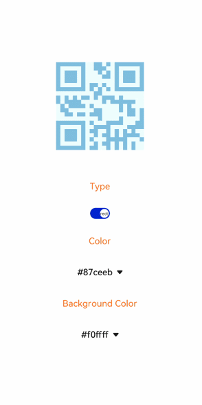

# qrcode

更新时间：2026-03-09 02:50:43

来源：https://developer.huawei.com/consumer/cn/doc/harmonyos-references/js-components-basic-qrcode
**支持设备：** Phone / PC/2in1 / Tablet / Wearable / TV


> [!NOTE]
> 从API version 5开始支持。后续版本如有新增内容，则采用上角标单独标记该内容的起始版本。

生成并显示二维码。


## 权限列表
**支持设备：** Phone / PC/2in1 / Tablet / Wearable / TV

无


## 子组件
**支持设备：** Phone / PC/2in1 / Tablet / Wearable / TV

不支持。


## 属性
**支持设备：** Phone / PC/2in1 / Tablet / Wearable / TV

除支持[通用属性](https://developer.huawei.com/consumer/cn/doc/harmonyos-references/js-components-common-attributes)外，还支持如下属性：


| 名称 | 类型 | 默认值 | 必填 | 描述 |
| --- | --- | --- | --- | --- |
| value | string | - | 是 | 用来生成二维码的内容。 |
| type | string | rect | 否 | 二维码类型。可能选项有： - rect：矩形二维码。 - circle：圆形二维码。 |


## 样式
**支持设备：** Phone / PC/2in1 / Tablet / Wearable / TV

除支持[通用样式](https://developer.huawei.com/consumer/cn/doc/harmonyos-references/js-components-common-styles)外，还支持如下样式：


| 名称 | 类型 | 默认值 | 必填 | 描述 |
| --- | --- | --- | --- | --- |
| color | &lt;color&gt; | #000000 | 否 | 二维码颜色。 |
| background-color | &lt;color&gt; | #ffffff | 否 | 二维码背景颜色。 |


## 事件
**支持设备：** Phone / PC/2in1 / Tablet / Wearable / TV

支持[通用事件](https://developer.huawei.com/consumer/cn/doc/harmonyos-references/js-components-common-events)。


## 方法
**支持设备：** Phone / PC/2in1 / Tablet / Wearable / TV

支持[通用方法](https://developer.huawei.com/consumer/cn/doc/harmonyos-references/js-components-common-methods)。


## 示例
**支持设备：** Phone / PC/2in1 / Tablet / Wearable / TV


```text
<!-- xxx.hml -->
<div class="container">
<qrcode value="{{qr_value}}" type="{{qr_type}}"
style="color: {{qr_col}};background-color: {{qr_bcol}};width: {{qr_size}};height: {{qr_size}};margin-bottom: 70px;"></qrcode>
<text class="txt">Type</text>
<switch showtext="true" checked="true" texton="rect" textoff="circle" onchange="setType"></switch>
<text class="txt">Color</text>
<select onchange="setCol">
<option for="{{col_list}}" value="{{$item}}">{{$item}}</option>
</select>
<text class="txt">Background Color</text>
<select onchange="setBCol">
<option for="{{bcol_list}}" value="{{$item}}">{{$item}}</option>
</select>
</div>
```


```text
/* xxx.css */
.container {
width: 100%;
height: 100%;
flex-direction: column;
justify-content: center;
align-items: center;
}
.txt {
margin: 30px;
color: orangered;
}
select{
margin-top: 40px;
margin-bottom: 40px;
}
```


```text
/* index.js */
export default {
data: {
qr_type: 'rect',
qr_size: '300px',
qr_col: '#87ceeb',
col_list: ['#87ceeb','#fa8072','#da70d6','#80ff00ff','#00ff00ff'],
qr_bcol: '#f0ffff',
bcol_list: ['#f0ffff','#ffffe0','#d8bfd8']
},
setType(e) {
if (e.checked) {
this.qr_type = 'rect'
} else {
this.qr_type = 'circle'
}
},
setCol(e) {
this.qr_col = e.newValue
},
setBCol(e) {
this.qr_bcol = e.newValue
}
}
```


