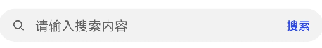

# search

更新时间：2026-03-09 02:50:43

来源：https://developer.huawei.com/consumer/cn/doc/harmonyos-references/js-components-basic-search
**支持设备：** Phone / PC/2in1 / Tablet / Wearable / TV


> [!NOTE]
> 从API version 4开始支持。后续版本如有新增内容，则采用上角标单独标记该内容的起始版本。

提供搜索框组件，用于提供用户搜索内容的输入区域。


## 子组件
**支持设备：** Phone / PC/2in1 / Tablet / Wearable / TV

不支持。


## 属性
**支持设备：** Phone / PC/2in1 / Tablet / Wearable / TV

除支持[通用属性](https://developer.huawei.com/consumer/cn/doc/harmonyos-references/js-components-common-attributes)外，还支持如下属性：


| 名称 | 类型 | 默认值 | 必填 | 描述 |
| --- | --- | --- | --- | --- |
| icon | string | - | 否 | 搜索图标，默认使用系统搜索图标，图标格式为svg，jpg和png。 |
| hint | string | - | 否 | 搜索提示文字。 |
| value | string | - | 否 | 搜索框搜索文本值。 |
| searchbutton5+ | string | - | 否 | 搜索框末尾搜索按钮文本值。 |
| menuoptions5+ | Array&lt;MenuOption&gt; | - | 否 | 设置文本选择弹框点击更多按钮之后显示的菜单项。 |


**表1** MenuOption5+


| 名称 | 类型 | 描述 |
| --- | --- | --- |
| icon | string | 菜单选项中的图标路径。 |
| content | string | 菜单选项中的文本内容。 |


## 样式
**支持设备：** Phone / PC/2in1 / Tablet / Wearable / TV

除支持[通用样式](https://developer.huawei.com/consumer/cn/doc/harmonyos-references/js-components-common-styles)外，还支持如下样式：


| 名称 | 类型 | 默认值 | 必填 | 描述 |
| --- | --- | --- | --- | --- |
| color | &lt;color&gt; | #e6000000 | 否 | 搜索框的文本颜色。 |
| font-size | &lt;length&gt; | 16px | 否 | 搜索框的文本尺寸。 |
| allow-scale | boolean | true | 否 | 搜索框的文本尺寸是否跟随系统设置字体缩放尺寸进行放大缩小。true表示跟随系统放大缩小，false表示不跟随系统放大缩小。 如果在config描述文件中针对ability配置了fontSize的config-changes标签，则应用不会重启而直接生效。 |
| placeholder-color | &lt;color&gt; | #99000000 | 否 | 搜索框的提示文本颜色。 |
| font-weight | number \| string | normal | 否 | 搜索框的字体粗细，见text组件[font-weight](https://developer.huawei.com/consumer/cn/doc/harmonyos-references/js-components-basic-text#样式)的样式属性。 |
| font-family | string | sans-serif | 否 | 搜索框的字体列表，用逗号分隔，每个字体用字体名或者字体族名设置。列表中第一个系统中存在的或者通过[自定义字体](https://developer.huawei.com/consumer/cn/doc/harmonyos-references/js-components-common-customizing-font)指定的字体，会被选中作为文本的字体。 |
| caret-color6+ | &lt;color&gt; | - | 否 | 设置输入光标的颜色。 |


## 事件
**支持设备：** Phone / PC/2in1 / Tablet / Wearable / TV

除支持[通用事件](https://developer.huawei.com/consumer/cn/doc/harmonyos-references/js-components-common-events)外，还支持如下事件：


| 名称 | 参数 | 描述 |
| --- | --- | --- |
| change | { text:newText } | 输入内容发生变化时触发。 改变value属性值不会触发该回调。 |
| submit | { text:submitText } | 点击搜索图标、搜索按钮5+或者按下软键盘搜索按钮时触发。 |
| translate5+ | { value: selectedText } | 设置此事件后，进行文本选择操作后文本选择弹窗会出现翻译按钮，点击翻译按钮之后，触发该回调，返回选中的文本内容。 |
| share5+ | { value: selectedText } | 设置此事件后，进行文本选择操作后文本选择弹窗会出现分享按钮，点击分享按钮之后，触发该回调，返回选中的文本内容。 |
| search5+ | { value: selectedText } | 设置此事件后，进行文本选择操作后文本选择弹窗会出现搜索按钮，点击搜索按钮之后，触发该回调，返回选中的文本内容。 |
| optionselect5+ | { index:optionIndex, value: selectedText } | 文本选择弹窗中设置menuoptions属性后，用户在文本选择操作后，点击菜单项后触发该回调，返回点击的菜单项序号和选中的文本内容。 |


## 方法
**支持设备：** Phone / PC/2in1 / Tablet / Wearable / TV

支持[通用方法](https://developer.huawei.com/consumer/cn/doc/harmonyos-references/js-components-common-methods)。


## 示例
**支持设备：** Phone / PC/2in1 / Tablet / Wearable / TV


```text
<!-- xxx.hml -->
<div class="container">
<search hint="请输入搜索内容" searchbutton="搜索" @search="search">
</search>
</div>
```


```text
/* xxx.css */
.container {
display: flex;
justify-content: center;
align-items: center;
}
```


