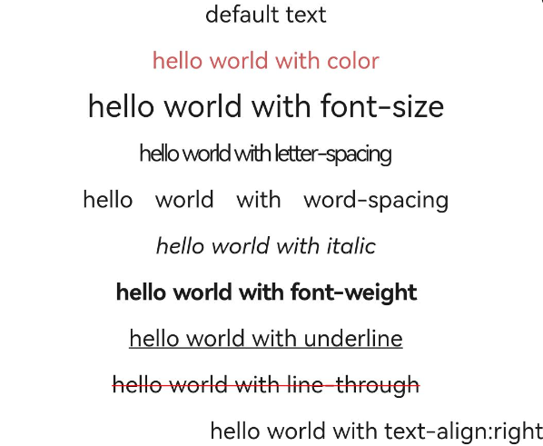

# text

更新时间：2026-04-20 06:34:33

来源：https://developer.huawei.com/consumer/cn/doc/harmonyos-references/js-components-basic-text
**支持设备：** Phone / PC/2in1 / Tablet / Wearable / TV


文本，用于呈现一段信息。


## 权限列表
**支持设备：** Phone / PC/2in1 / Tablet / Wearable / TV

无


## 子组件
**支持设备：** Phone / PC/2in1 / Tablet / Wearable / TV

支持<[span](https://developer.huawei.com/consumer/cn/doc/harmonyos-references/js-components-basic-span)>。


## 属性
**支持设备：** Phone / PC/2in1 / Tablet / Wearable / TV

支持[通用属性](https://developer.huawei.com/consumer/cn/doc/harmonyos-references/js-components-common-attributes)。


## 样式
**支持设备：** Phone / PC/2in1 / Tablet / Wearable / TV

除支持[通用样式](https://developer.huawei.com/consumer/cn/doc/harmonyos-references/js-components-common-styles)外，还支持如下样式：


| 名称 | 类型 | 默认值 | 必填 | 描述 |
| --- | --- | --- | --- | --- |
| color | &lt;color&gt; | #e5000000 | 否 | 设置文本的颜色。 |
| font-size | &lt;length&gt; | 30px | 否 | 设置文本的尺寸。 |
| allow-scale | boolean | true | 否 | 文本尺寸是否跟随系统设置字体缩放尺寸进行放大缩小。          如果需要支持动态生效，请参看config[配置文件的内部结构](https://developer.huawei.com/consumer/cn/doc/harmonyos-guides/application-configuration-file-overview-fa#配置文件的内部结构)中config-changes标签。 |
| letter-spacing | &lt;length&gt; | 0px | 否 | 设置文本的字符间距。 |
| word-spacing7+ | &lt;length&gt; \| &lt;percentage&gt; \| string | normal | 否 | 设置文本之间的间距，string可选值为：          normal：默认的字符间距。 |
| font-style | string | normal | 否 | 设置文本的字体样式，可选值为：          - normal：标准的字体样式。          - italic：斜体的字体样式。 |
| font-weight | number \| string | normal | 否 | 设置文本的字体粗细，number类型取值[100, 900]，默认为400，取值越大，字体越粗。number取值必须为100的整数倍。          string类型取值支持如下四个值：lighter、normal、bold、bolder。 |
| text-decoration | string | none | 否 | 设置文本的文本修饰，可选值为：          - underline：文字下划线修饰。          - line-through：穿过文本的修饰线。          - none：标准文本。 |
| text-decoration-color7+ | &lt;color&gt; | - | 否 | 设置文本修饰线的颜色。 |
| text-align | string | start | 否 | 设置文本的文本对齐方式，可选值为：          - left：文本左对齐。          - center：文本居中对齐。          - right：文本右对齐。          - start：根据文字书写相同的方向对齐。          - end：根据文字书写相反的方向对齐。          如果文本宽度未指定大小，文本的宽度和父容器的宽度大小相等的情况下，对齐效果可能会不明显。 |
| line-height | &lt;length&gt; \| &lt;percentage&gt;7+ \| string7+ | 0px1-6          normal7+ | 否 | 设置文本的文本行高，设置为0px时，不限制文本行高，自适应字体大小。string可选值为：          normal7+：默认的行高。 |
| text-overflow | string | clip | 否 | 在设置了最大行数的情况下生效，可选值为：          - clip：将文本根据父容器大小进行裁剪显示；          - ellipsis：根据父容器大小显示，显示不下的文本用省略号代替。需配合max-lines使用。 |
| font-family | string | sans-serif | 否 | 设置文本的字体列表，用逗号分隔，每个字体用字体名或者字体族名设置。列表中第一个系统中存在的或者通过[自定义字体](https://developer.huawei.com/consumer/cn/doc/harmonyos-references/js-components-common-customizing-font)指定的字体，会被选中作为文本的字体。 |
| max-lines | number \| string7+ | - | 否 | 设置文本的最大行数，string类型可选值为：          - auto7+：文本行数自适应容器高度。 |
| min-font-size | &lt;length&gt; | - | 否 | 文本最小字号，需要和文本最大字号同时设置，支持文本字号动态变化。设置最大最小字体样式后，font-size不生效。 |
| max-font-size | &lt;length&gt; | - | 否 | 文本最大字号，需要和文本最小字号同时设置，支持文本字号动态变化。设置最大最小字体样式后，font-size不生效。 |
| font-size-step | &lt;length&gt; | 1px | 否 | 文本动态调整字号时的步长，需要设置最小，最大字号样式生效。 |
| prefer-font-sizes | &lt;array&gt; | - | 否 | 预设的字号集合，在动态尺寸调整时，优先使用预设字号集合中的字号匹配设置的最大行数，如果预设字号集合未设置，则使用最大最小和步长调整字号。针对仍然无法满足最大行数要求的情况，使用text-overflow设置项进行截断，设置预设尺寸集后，font-size、max-font-size、min-font-size和font-size-step不生效。          如：prefer-font-sizes: 12px,14px,16px |
| word-break6+ | string | normal | 否 | 设置文本断行模式，可选值为：          - normal：默认换行规则，依据各自语言的规则，允许在字间发生换行。          - break-all：对于非中文/日文/韩文的文本，可在任意字符间断行。          - break-word：与break-all相同，不同的地方在于它要求一个没有断行破发点的词必须保持为一个整体单位。 |
| text-indent7+ | &lt;length&gt; | - | 否 | 设置首行缩进量。 |
| white-space7+ | string | pre | 否 | 设置处理元素中空白的模式，可选值为：          - normal：所有空格、回车、制表符都合并成一个空格，文本自动换行。          - nowrap：所有空格、回车、制表符都合并成一个空格，文本不换行。          - pre：所有东西原样输出。          - pre-wrap：所有东西原样输出，文本换行。          - pre-line：所有空格、制表符合并成一个空格，回车不变，文本换行。 |
| adapt-height7+ | boolean | false | 否 | 文本大小是否自适应容器高度。          设置字体大小自适应相关样式后生效。 |


## 事件
**支持设备：** Phone / PC/2in1 / Tablet / Wearable / TV

支持[通用事件](https://developer.huawei.com/consumer/cn/doc/harmonyos-references/js-components-common-events)。


## 方法
**支持设备：** Phone / PC/2in1 / Tablet / Wearable / TV

支持[通用方法](https://developer.huawei.com/consumer/cn/doc/harmonyos-references/js-components-common-methods)。


## 示例
**支持设备：** Phone / PC/2in1 / Tablet / Wearable / TV


```text
<!-- xxx.hml -->
<div class="container">
<text class="title">default text</text>
<text class="title textcolor">hello world with color</text>
<text class="title textsize">hello world with font-size</text>
<text class="title textletterspacing">hello world with letter-spacing</text>
<text class="title textwordspacing">hello world with word-spacing</text>
<text class="title textstyle">hello world with italic</text>
<text class="title textweight">hello world with font-weight</text>
<text class="title textdecoration1">hello world with underline</text>
<text class="title textdecoration2">hello world with line-through</text>
<text class="title textalign">hello world with text-align:right</text>
</div>
```


```text
/* xxx.css */
.container {
display: flex;
justify-content: center;
align-items: center;
flex-direction: column;
}
.title {
text-align: center;
width: 800px;
height: 60px;
}
.textcolor {
color: indianred;
}
.textsize {
font-size: 40px;
}
.textletterspacing {
letter-spacing: -3px;
}
.textwordspacing {
word-spacing: 20px;
}
.textstyle {
font-style: italic;
}
.textweight {
font-weight: 700;
}
.textdecoration1 {
text-decoration: underline;
}
.textdecoration2 {
text-decoration: line-through;
text-decoration-color: red;
}
.textalign {
text-align: right;
}
```


