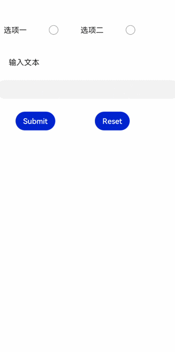

# form

更新时间：2026-03-09 02:50:43

来源：https://developer.huawei.com/consumer/cn/doc/harmonyos-references/js-components-container-form
**支持设备：** Phone / PC/2in1 / Tablet / Wearable / TV


> [!NOTE]
> 从API version 6开始支持。后续版本如有新增内容，则采用上角标单独标记该内容的起始版本。

表单容器，支持容器内input元素的内容提交和重置。


## 权限列表
**支持设备：** Phone / PC/2in1 / Tablet / Wearable / TV

无


## 子组件
**支持设备：** Phone / PC/2in1 / Tablet / Wearable / TV

支持。


## 属性
**支持设备：** Phone / PC/2in1 / Tablet / Wearable / TV

支持[通用属性](https://developer.huawei.com/consumer/cn/doc/harmonyos-references/js-components-common-attributes)。


## 样式
**支持设备：** Phone / PC/2in1 / Tablet / Wearable / TV

支持[组件通用样式](https://developer.huawei.com/consumer/cn/doc/harmonyos-references/js-components-common-styles)。


## 事件
**支持设备：** Phone / PC/2in1 / Tablet / Wearable / TV

除支持[通用事件](https://developer.huawei.com/consumer/cn/doc/harmonyos-references/js-components-common-events)外，还支持如下事件：


| 名称 | 参数 | 描述 |
| --- | --- | --- |
| submit | FormResult | 点击提交按钮，进行表单提交时，触发该事件。 |
| reset | - | 点击重置按钮后，触发该事件。 |


**表1** FormResult


| 名称 | 类型 | 描述 |
| --- | --- | --- |
| value | Object | input元素的name和value的值。 |


## 方法
**支持设备：** Phone / PC/2in1 / Tablet / Wearable / TV

支持[通用方法](https://developer.huawei.com/consumer/cn/doc/harmonyos-references/js-components-common-methods)。


## 示例
**支持设备：** Phone / PC/2in1 / Tablet / Wearable / TV


```text
<!-- xxx.hml -->
<form onsubmit='onSubmit' onreset='onReset'>
<div style="width: 600px;height: 150px;flex-direction: row;justify-content: space-around;">
<label>选项一</label>
<input type='radio' name='radioGroup' value='radio1'></input>
<label>选项二</label>
<input type='radio' name='radioGroup' value='radio2'></input>
</div>
<text style="margin-left: 50px;margin-bottom: 50px;">输入文本</text>
<input type='text' name='user'></input>
<div style="width: 600px;height: 150px;margin-top: 50px;flex-direction: row;justify-content: space-around;">
<input type='submit'>Submit</input>
<input type='reset'>Reset</input>
</div>
</form>
```


```text
// xxx.js
export default{
onSubmit(result) {
console.info(result.value.radioGroup) // radio1 or radio2
console.info(result.value.user) // text input value
},
onReset() {
console.info('reset all value')
}
}
```


