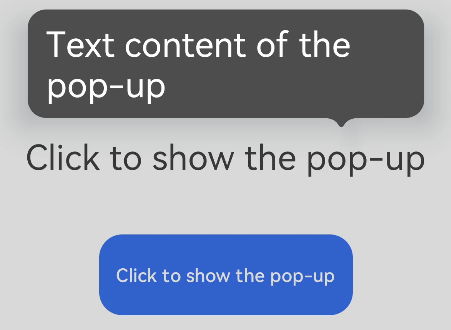

# popup

更新时间：2026-03-09 02:50:43

来源：https://developer.huawei.com/consumer/cn/doc/harmonyos-references/js-components-container-popup
**支持设备：** Phone / PC/2in1 / Tablet / Wearable / TV


> [!NOTE]
> 从API version 4开始支持。后续版本如有新增内容，则采用上角标单独标记该内容的起始版本。

气泡指示。给控件绑定气泡弹窗，并在点击控件或者调用气泡弹窗显示方法后弹出相应的气泡提示来引导用户进行操作。


## 权限列表
**支持设备：** Phone / PC/2in1 / Tablet / Wearable / TV

无


## 子组件
**支持设备：** Phone / PC/2in1 / Tablet / Wearable / TV

支持单个子组件节点5+。


## 属性
**支持设备：** Phone / PC/2in1 / Tablet / Wearable / TV

除支持[通用属性](https://developer.huawei.com/consumer/cn/doc/harmonyos-references/js-components-common-attributes)外，还支持如下属性：


| 名称 | 类型 | 默认值 | 必填 | 描述 |
| --- | --- | --- | --- | --- |
| target | string | - | 是 | popup绑定目标元素的id属性值，不支持动态切换。 |
| placement | string | bottom | 否 | popup相对于目标元素的位置。可选值为： - left：位于目标元素左边； - right：位于目标元素右边； - top：位于目标元素上边； - bottom：位于目标元素下边； - topLeft：位于目标元素左上角； - topRight：位于目标元素右上角； - bottomLeft：位于目标元素左下角； - bottomRight：位于目标元素右下角。 |
| keepalive5+ | boolean | false | 否 | 设置当前popup是否需要保留。设置为true时，点击屏幕区域或者页面切换气泡不会消失，需调用气泡组件的hide方法才可让气泡消失；设置为false时，点击屏幕区域或者页面切换气泡会自动消失。 |
| clickable5+ | boolean | true | 否 | popup是否支持点击目标元素弹窗，当设置为false时，只支持方法调用显示弹窗。 |
| arrowoffset5+ | &lt;length&gt; | 0 | 否 | popup箭头在弹窗处的偏移，默认居中，正值按照语言方向进行偏移，负值相反。 |


## 样式
**支持设备：** Phone / PC/2in1 / Tablet / Wearable / TV

除支持[通用样式](https://developer.huawei.com/consumer/cn/doc/harmonyos-references/js-components-common-styles)外，还支持如下样式：


| 名称 | 类型 | 默认值 | 必填 | 描述 |
| --- | --- | --- | --- | --- |
| mask-color | &lt;color&gt; | - | 否 | 遮罩层的颜色，默认值为全透明。 |


## 事件
**支持设备：** Phone / PC/2in1 / Tablet / Wearable / TV

除支持[通用事件](https://developer.huawei.com/consumer/cn/doc/harmonyos-references/js-components-common-events)外，还支持如下事件：


| 名称 | 参数 | 描述 |
| --- | --- | --- |
| visibilitychange | { visibility: boolean } | 当气泡弹出和消失时会触发该回调函数。 |


## 方法
**支持设备：** Phone / PC/2in1 / Tablet / Wearable / TV

仅支持如下方法：


| 名称 | 参数 | 描述 |
| --- | --- | --- |
| show5+ | - | 弹出气泡提示。 |
| hide5+ | - | 隐藏气泡提示。 |


## 示例
**支持设备：** Phone / PC/2in1 / Tablet / Wearable / TV


```text
<!-- xxx.hml -->
<div class="container">
<text id="text">Click to show the pop-up</text>
<!-- popup supports single child of any type5+ -->
<popup id="popup" class="popup" target="text" placement="top" keepalive="true" clickable="true"
arrowoffset="100px" onvisibilitychange="visibilitychange" onclick="hidepopup">
<text class="text">Text content of the pop-up</text>
</popup>
<button class="button" onclick="showpopup">Click to show the pop-up</button>
</div>
```


```text
/* xxx.css */
.container {
flex-direction: column;
align-items: center;
padding-top: 200px;
padding-left: 200px;
}
.popup {
mask-color: gray;
}
.text {
color: white;
}
.button {
width: 220px;
height: 100px;
margin-top: 50px;
}
```


```text
// xxx.js
import promptAction from '@ohos.promptAction'
export default {
visibilitychange(e) {
promptAction.showToast({
message: 'visibility change visibility: ' + e.visibility,
duration: 3000
});
},
showpopup() {
this.$element("popup").show();
},
hidepopup() {
this.$element("popup").hide();
}
}
```


