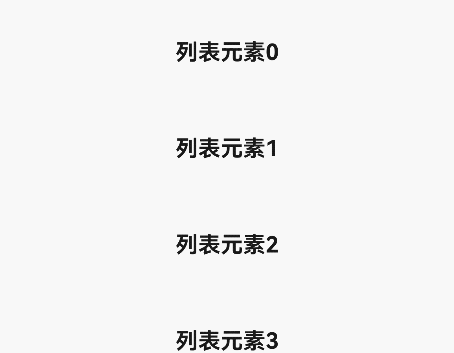

# refresh

更新时间：2026-03-09 02:50:43

来源：https://developer.huawei.com/consumer/cn/doc/harmonyos-references/js-components-container-refresh
**支持设备：** Phone / PC/2in1 / Tablet / Wearable / TV


> [!NOTE]
> 从API version 4开始支持。后续版本如有新增内容，则采用上角标单独标记该内容的起始版本。

下拉刷新容器。


## 权限列表
**支持设备：** Phone / PC/2in1 / Tablet / Wearable / TV

无


## 子组件
**支持设备：** Phone / PC/2in1 / Tablet / Wearable / TV

支持。


## 属性
**支持设备：** Phone / PC/2in1 / Tablet / Wearable / TV

除支持[通用属性](https://developer.huawei.com/consumer/cn/doc/harmonyos-references/js-components-common-attributes)外，还支持如下属性：


| 名称 | 类型 | 默认值 | 必填 | 描述 |
| --- | --- | --- | --- | --- |
| offset | &lt;length&gt; | - | 否 | 刷新组件静止时距离父组件顶部的距离。 |
| refreshing | boolean | false | 否 | 标识刷新组件当前是否正在刷新。 - true：刷新组件当前处于刷新状态。 - false：刷新组件当前未处于刷新状态。 |
| type | string | auto | 否 | 设置组件刷新时的动效。两个可选值，不支持动态修改。 - auto: 默认效果，列表界面拉到顶后，列表不移动，下拉后有转圈弹出。 - pulldown: 列表界面拉到顶后，可以继续往下滑动一段距离触发刷新，刷新完成后有回弹效果（如果子组件含有list，防止下拉效果冲突，需将list的scrolleffect设置为no）。 |
| lasttime | boolean | false | 否 | 设置是否显示上次更新时间，字符串格式为：“上次更新时间：XXXX ”，XXXX 按照时间日期显示规范显示，不可动态修改（建议type为pulldown时使用，固定距离位于内容下拉区域底部，使用时注意offset属性设置，防止出现重叠）。 - true：显示上次更新时间。 - false：不显示上次更新时间。 |
| timeoffset6+ | &lt;length&gt; | - | 否 | 设置更新时间距离父组件顶部的距离。 |
| friction | number | 42 | 否 | 下拉摩擦系数，取值范围：0-100，数值越大refresh组件跟手性高，数值越小refresh跟手性低。 |


## 样式
**支持设备：** Phone / PC/2in1 / Tablet / Wearable / TV

除支持[通用样式](https://developer.huawei.com/consumer/cn/doc/harmonyos-references/js-components-common-styles)外，还支持如下样式：


| 名称 | 类型 | 默认值 | 必填 | 描述 |
| --- | --- | --- | --- | --- |
| background-color | &lt;color&gt; | white | 否 | 设置刷新组件的背景颜色。 |
| progress-color | &lt;color&gt; | black | 否 | 设置刷新组件的loading图标颜色。 |


## 事件
**支持设备：** Phone / PC/2in1 / Tablet / Wearable / TV

仅支持如下事件：


| 名称 | 参数 | 描述 |
| --- | --- | --- |
| refresh | { refreshing: refreshingValue } | 下拉刷新状态变化时触发。可能值： - true：当前处于下拉刷新中状态。 - false：当前未处于下拉刷新中状态。 |
| pulldown | { state: string } | 下拉开始和松手时触发。可能值： - start：表示开始下拉。 - end：表示结束下拉。 |


## 方法
**支持设备：** Phone / PC/2in1 / Tablet / Wearable / TV

不支持[通用方法](https://developer.huawei.com/consumer/cn/doc/harmonyos-references/js-components-common-methods)。


## 示例
**支持设备：** Phone / PC/2in1 / Tablet / Wearable / TV


```text
<!-- xxx.hml -->
<div class="container">
<refresh refreshing="{{fresh}}" onrefresh="refresh">
<list class="list" scrolleffect="no">
<list-item class="listitem" for="list">
<div class="content">
<text class="text">{{$item}}</text>
</div>
</list-item>
</list>
</refresh>
</div>
```


```text
/* xxx.css */
.container {
flex-direction: column;
align-items: center;
width: 100%;
height: 100%;
}

.list {
width: 100%;
height: 100%;
}

.listitem {
width: 100%;
height: 150px;
}

.content {
width: 100%;
height: 100%;
flex-direction: column;
align-items: center;
justify-content: center;
}

.text {
font-size: 35px;
font-weight: bold;
}
```


```text
// xxx.js
import promptAction from '@ohos.promptAction';
export default {
data: {
list:[],
fresh:false
},
onInit() {
this.list = [];
for (var i = 0; i <= 3; i++) {
var item = '列表元素' + i;
this.list.push(item);
}
},
refresh: function (e) {
promptAction.showToast({
message: '刷新中...'
})
var that = this;
that.fresh = e.refreshing;
setTimeout(function () {
that.fresh = false;
var addItem = '更新元素';
that.list.unshift(addItem);
promptAction.showToast({
message: '刷新完成!'
})
}, 2000)
}
}
```


