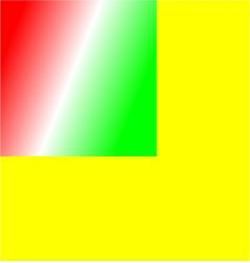

# CanvasGradient对象

更新时间：2026-03-09 02:50:43

来源：https://developer.huawei.com/consumer/cn/doc/harmonyos-references/js-components-canvas-canvasgradient
**支持设备：** Phone / PC/2in1 / Tablet / Wearable / TV


> [!NOTE]
> 从API version 4开始支持。后续版本如有新增内容，则采用上角标单独标记该内容的起始版本。

渐变对象。


## addColorStop
**支持设备：** Phone / PC/2in1 / Tablet / Wearable / TV

addColorStop(offset: number, color: string): void

设置渐变断点值，包括偏移和颜色。

**参数：**


| 参数 | 类型 | 描述 |
| --- | --- | --- |
| offset | number | 设置渐变点距离起点的位置占总体长度的比例，范围为0到1。 |
| color | string | 设置渐变的颜色。 |


**示例：**


```text
<!-- xxx.hml -->
<div>
<canvas ref="canvas" style="width: 500px; height: 500px; background-color: #ffff00;"></canvas>
</div>
```


```text
// xxx.js
export default {
onShow() {
const el = this.$refs.canvas;
const ctx = el.getContext('2d');
const gradient = ctx.createLinearGradient(50, 0, 300, 100);
gradient.addColorStop(0.0, '#ff0000')
gradient.addColorStop(0.5, '#ffffff')
gradient.addColorStop(1.0, '#00ff00')
ctx.fillStyle = gradient
ctx.fillRect(0, 0, 300, 300)
}
}
```


