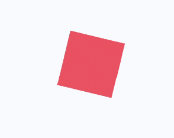
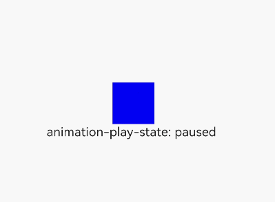
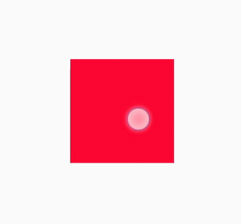
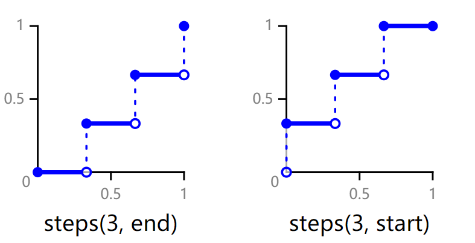

# 动画样式

更新时间：2026-03-09 02:50:43

来源：https://developer.huawei.com/consumer/cn/doc/harmonyos-references/js-components-common-animation
**支持设备：** Phone / PC/2in1 / Tablet / Wearable / TV


> [!NOTE]
> 从API version 4开始支持。后续版本如有新增内容，则采用上角标单独标记该内容的起始版本。

组件支持动态的旋转、平移、缩放效果，可在style或css中设置。


| 名称 | 类型 | 描述 |
| --- | --- | --- |
| transform-origin | string6+ \|  &lt;percentage&gt; \|  &lt;length&gt; string6+ \|  &lt;percentage&gt; \| &lt;length&gt; | 变换对象的原点位置，支持px和百分比(相对于动画目标组件)，如果仅设置一个值，另一个值为50%，第一个string的可选值为：left \| center \| right ，第二个string的可选值为：top \| center \| bottom。 示例： transform-origin: 200px 30%。 transform-origin: 100px top。 transform-origin: center center。 默认值：center center |
| transform | string | 支持同时设置平移/旋转/缩放的属性。 详情请参见表1 transform操作说明。 |
| animation6+ | string | 格式：duration \| timing-function \| delay \| iteration-count \| direction \| fill-mode \| play-state \| name，每个字段不区分先后，但是 duration / delay 按照出现的先后顺序解析。 默认值：0s ease 0s 1 normal none running none |
| animation-name | string | 指定@keyframes，详情请参见表2 @keyframes属性说明。 |
| animation-delay | &lt;time&gt; | 定义动画播放的延迟时间。支持的单位为[s(秒)\|ms(毫秒) ]，默认单位为ms，格式为：1000ms或1s。 默认值：0 |
| animation-duration | &lt;time&gt; | 定义一个动画周期。支持的单位为[s(秒)\|ms(毫秒) ]，默认单位为ms，格式为：1000ms或1s。 必须设置animation-duration 样式，否则时长为 0将不会播放动画。 默认值：0 |
| animation-iteration-count | number \| infinite | 定义动画播放的次数，默认播放一次，可通过设置为infinite无限次播放。 默认值：1 |
| animation-timing-function | string | 描述动画执行的速度曲线，用于使动画更为平滑。 可选项有： - linear：表示动画从头到尾的速度都是相同的。 - ease：表示动画以低速开始，然后加快，在结束前变慢，cubic-bezier(0.25, 0.1, 0.25, 1.0)。 - ease-in：表示动画以低速开始，cubic-bezier(0.42, 0.0, 1.0, 1.0)。 - ease-out：表示动画以低速结束，cubic-bezier(0.0, 0.0, 0.58, 1.0)。 - ease-in-out：表示动画以低速开始和结束，cubic-bezier(0.42, 0.0, 0.58, 1.0)。 - friction：阻尼曲线，cubic-bezier(0.2, 0.0, 0.2, 1.0)。 - extreme-deceleration：急缓曲线，cubic-bezier(0.0, 0.0, 0.0, 1.0)。 - sharp：锐利曲线，cubic-bezier(0.33, 0.0, 0.67, 1.0)。 - rhythm：节奏曲线，cubic-bezier(0.7, 0.0, 0.2, 1.0)。 - smooth：平滑曲线，cubic-bezier(0.4, 0.0, 0.4, 1.0)。 - cubic-bezier：在三次贝塞尔函数中定义动画变化过程，入参的x和y值必须处于0-1之间。 - steps: 阶梯曲线6+。语法：steps(number[, end\|start])；number必须设置，支持的类型为正整数。第二个参数可选，表示在每个间隔的起点或是终点发生阶跃变化，支持设置end或start，默认值为end。 默认值：ease |
| animation-direction6+ | string | 指定动画的播放模式： - normal： 动画正向循环播放。 - reverse： 动画反向循环播放。 - alternate：动画交替循环播放，奇数次正向播放，偶数次反向播放。 - alternate-reverse：动画反向交替循环播放，奇数次反向播放，偶数次正向播放。 默认值：normal |
| animation-fill-mode | string | 指定动画开始和结束的状态： - none：在动画执行之前和之后都不会应用任何样式到目标上。 - forwards：在动画结束后，目标将保留动画结束时的状态（在最后一个关键帧中定义）。 - backwards6+：动画将在animation-delay期间应用第一个关键帧中定义的值。当animation-direction为"normal"或"alternate"时应用from关键帧中的值，当animation-direction为"reverse"或"alternate-reverse"时应用to关键帧中的值。 - both6+：动画将遵循forwards和backwards的规则，从而在两个方向上扩展动画属性。 默认值：none |
| animation-play-state6+ | string | 指定动画的当前状态： - paused：动画状态为暂停。 - running：动画状态为播放。 默认值：running |
| transition6+ | string | 指定组件状态切换时的过渡效果，可以通过transition属性设置如下四个属性： - transition-property：规定设置过渡效果的 CSS 属性的名称，目前支持宽、高、背景色。 - transition-duration：规定完成过渡效果需要的时间，单位秒。 - transition-timing-function：规定过渡效果的时间曲线，支持样式动画提供的曲线。 - transition-delay：规定过渡效果延时启动时间，单位秒。 默认值：all 0 ease 0 |


**表1** transform操作说明


| 名称 | 类型 | 描述 |
| --- | --- | --- |
| none6+ | - | 不进行任何转换。 |
| matrix6+ | &lt;number&gt; | 入参为六个值的矩阵，6个值分别代表：scaleX, skewY, skewX, scaleY, translateX, translateY。 |
| matrix3d6+ | &lt;number&gt; | 入参为十六个值的4X4矩阵。 |
| translate | &lt;length&gt; \| &lt;percent&gt; | 平移动画属性，支持设置x轴和y轴两个维度的平移参数。 |
| translate3d6+ | &lt;length&gt; \| &lt;percent&gt; | 三个入参，分别代表X轴、Y轴、Z轴的平移距离。 |
| translateX | &lt;length&gt; \| &lt;percent&gt; | X轴方向平移动画属性。 |
| translateY | &lt;length&gt; \| &lt;percent&gt; | Y轴方向平移动画属性。 |
| translateZ6+ | &lt;length&gt; \| &lt;percent&gt; | Z轴的平移距离。 |
| scale | &lt;number&gt; | 缩放动画属性，支持设置x轴和y轴两个维度的缩放参数。 |
| scale3d6+ | &lt;number&gt; | 三个入参，分别代表X轴、Y轴、Z轴的缩放参数。 |
| scaleX | &lt;number&gt; | X轴方向缩放动画属性。 |
| scaleY | &lt;number&gt; | Y轴方向缩放动画属性。 |
| scaleZ6+ | &lt;number&gt; | Z轴的缩放参数。 |
| rotate | &lt;deg&gt; \| &lt;rad&gt; \| &lt;grad&gt;6+ \| &lt;turn&gt;6+ | 旋转动画属性，支持设置x轴和y轴两个维度的旋转参数。 |
| rotate3d6+ | &lt;deg&gt; \| &lt;rad&gt; \| &lt;grad&gt; \| &lt;turn&gt; | 四个入参，前三个分别为X轴、Y轴、Z轴的旋转向量，第四个是旋转角度。 |
| rotateX | &lt;deg&gt; \| &lt;rad&gt; \| &lt;grad&gt;6+ \| &lt;turn&gt;6+ | X轴方向旋转动画属性。 |
| rotateY | &lt;deg&gt; \| &lt;rad&gt; \| &lt;grad&gt;6+ \| &lt;turn&gt;6+ | Y轴方向旋转动画属性。 |
| rotateZ6+ | &lt;deg&gt; \| &lt;rad&gt; \| &lt;grad&gt; \| &lt;turn&gt; | Z轴方向的旋转角度。 |
| skew6+ | &lt;deg&gt; \| &lt;rad&gt; \| &lt;grad&gt; \| &lt;turn&gt; | 两个入参，分别为X轴和Y轴的2D倾斜角度。 |
| skewX6+ | &lt;deg&gt; \| &lt;rad&gt; \| &lt;grad&gt; \| &lt;turn&gt; | X轴的2D倾斜角度。 |
| skewY6+ | &lt;deg&gt; \| &lt;rad&gt; \| &lt;grad&gt; \| &lt;turn&gt; | Y轴的2D倾斜角度。 |
| perspective6+ | &lt;number&gt; | 3D透视场景下镜头距离元素表面的距离。 |


**表2** @keyframes属性说明


| 名称 | 类型 | 默认值 | 描述 |
| --- | --- | --- | --- |
| background-color | &lt;color&gt; | - | 动画执行后应用到组件上的背景颜色。 |
| opacity | number | 1 | 动画执行后应用到组件上的不透明度值，为介于0到1间的数值，默认为1。 |
| width | &lt;length&gt; | - | 动画执行后应用到组件上的宽度值。 |
| height | &lt;length&gt; | - | 动画执行后应用到组件上的高度值。 |
| transform | string | - | 定义应用在组件上的变换类型，详情请参见表1 transform操作说明。 |
| background-position6+ | string \| &lt;percentage&gt; \| &lt;length&gt; string \|  &lt;percentage&gt; \| &lt;length&gt; | 50% 50% | 背景图位置。单位支持百分比和px，第一个值是水平位置，第二个值是垂直位置。如果仅设置一个值，另一个值为50%。第一个string的可选值为：left \| center \| right ，第二个string的可选值为：top \| center \| bottom。 示例： - background-position: 200px 30% - background-position: 100px top - background-position: center center |


对于不支持起始值或终止值缺省的情况，可以通过from和to显式指定起始和结束。可以通过百分比指定动画运行的中间状态6+。示例：


```text
<!-- xxx.hml -->
<div class="container">
<div class="rect">
</div>
</div>
```


```text
/* xxx.css */
.container {
display: flex;
justify-content: center;
align-items: center;
margin: 150px;
}
.rect{
width: 200px;
height: 200px;
background-color: #f76160;
animation: Go 3s infinite;
}
@keyframes Go
{
from {
background-color: #f76160;
transform:translate(100px) rotate(0deg) scale(1.0);
}
/* 可以通过百分比指定动画运行的中间状态 */
50% {
background-color: #f76160;
transform:translate(100px) rotate(60deg) scale(1.3);
}
to {
background-color: #09ba07;
transform:translate(100px) rotate(180deg) scale(2.0);
}
}
```




```text
<!-- xxx.hml -->
<div class="container">
<div class="simpleAnimation simpleSize" style="animation-play-state: {{playState}}"></div>
<text onclick="toggleState">animation-play-state: {{playState}}</text>
</div>
```


```text
/* xxx.css */
.container {
flex-direction: column;
justify-content: center;
align-items: center;
}
.simpleSize {
background-color: blue;
width: 100px;
height: 100px;
}
.simpleAnimation {
animation: simpleFrames 9s;
}
@keyframes simpleFrames {
from { transform: translateX(0px); }
to { transform: translateX(100px); }
}
```


```text
// xxx.js
export default {
data: {
title: "",
playState: "running"
},
toggleState() {
if (this.playState ===  "running") {
this.playState = "paused";
} else {
this.playState = "running";
}
}
}
```




```text
<!-- xxx.hml -->
<div id='img' class="img"></div>
```


```text
/* xxx.css */
.img {
width: 294px;
height: 233px;
background-image: url('common/heartBeat.jpg');
background-repeat: no-repeat;
background-position: 0% 0%;
background-size: 900%;
animation-name: heartBeating;
animation-duration: 1s;
animation-delay: 0s;
animation-fill-mode: forwards;
animation-iteration-count: -1;
animation-timing-function: steps(8, end);
}

@keyframes heartBeating {
from { background-position: 0% 0%;}
to { background-position: 100% 0%;}
}
```


```text
<!-- xxx.hml -->
<div class="container">
<div class="content"></div>
</div>
```


```text
/* xxx.css */
.container {
flex-direction: column;
justify-content: center;
align-items: center;
}
.content { /* 组件状态1 */
height: 200px;
width: 200px;
background-color: red;
transition: all 5s ease 0s;
}
.content:active { /* 组件状态2 */
height: 400px;
width: 400px;
background-color: blue;
transition: all 5s linear 0s;
}
```




> [!NOTE]
> @keyframes的from/to不支持动态绑定。
> steps函数的end和start含义如下图所示。
> 
