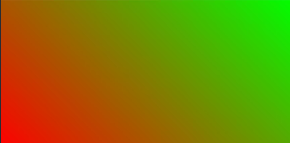
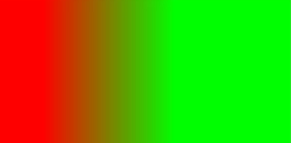
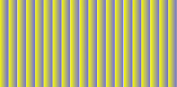

# 渐变样式

更新时间：2026-03-23 08:10:50

来源：https://developer.huawei.com/consumer/cn/doc/harmonyos-references/js-components-common-gradient
**支持设备：** Phone / PC/2in1 / Tablet / Wearable / TV


> [!NOTE]
> 从API version 4开始支持。后续版本如有新增内容，则采用上角标单独标记该内容的起始版本。

组件普遍支持在style或css中设置可以平滑过渡两个或多个指定的颜色。

开发框架支持线性渐变（linear-gradient）和重复线性渐变（repeating-linear-gradient）两种渐变效果。


## 线性渐变/重复线性渐变
**支持设备：** Phone / PC/2in1 / Tablet / Wearable / TV

使用渐变样式，需要定义过渡方向和过渡颜色。


### 过渡方向
**支持设备：** Phone / PC/2in1 / Tablet / Wearable / TV

通过direction或者angle指定过渡方向。


- direction：指定方向进行渐变。
- angle：指定角度进行渐变。


```text
// xxx.js
background: linear-gradient(direction/angle, color, color, ...);
background: repeating-linear-gradient(direction/angle, color, color, ...);
```


### 过渡颜色
**支持设备：** Phone / PC/2in1 / Tablet / Wearable / TV

支持以下四种方式：#ff0000、#ffff0000、rgb(255, 0, 0)、rgba(255, 0, 0, 1)，需要指定至少两种颜色。

**参数：**


| 名称 | 类型 | 默认值 | 必填 | 描述 |
| --- | --- | --- | --- | --- |
| direction | to &lt;side-or-corner&gt;  &lt;side-or-corner&gt; = [left \| right] \| [top \| bottom] | to bottom (由上到下渐变) | 否 | 指定过渡方向，如：to left (从右向左渐变)  ；或者 to bottom right (从左上角到右下角)。 |
| angle | &lt;deg&gt; | 180deg | 否 | 指定过渡方向，以元素几何中心为坐标原点，水平方向为X轴，angle指定了渐变线与Y轴的夹角(顺时针方向)。 |
| color | &lt;color&gt; [&lt;length&gt;\|&lt;percentage&gt;] | - | 是 | 定义使用渐变样式区域内颜色的渐变效果。 |


**示例：**


1. 默认渐变方向为从上向下渐变。  __PREBLOCK_1__  
2. 45度夹角渐变。  __PREBLOCK_2__  
3. 设置方向从左向右渐变。  __PREBLOCK_3__  
4. 重复渐变。  __PREBLOCK_4__  
