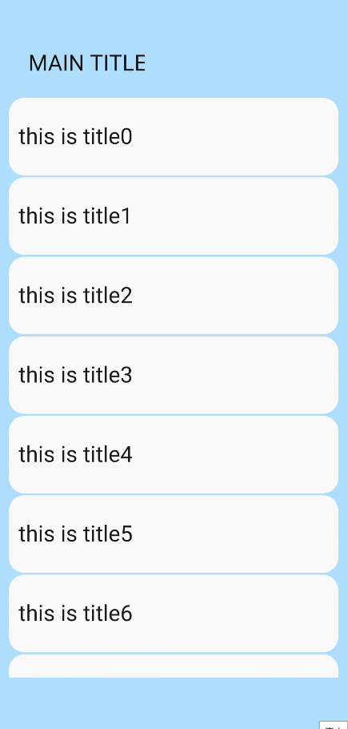
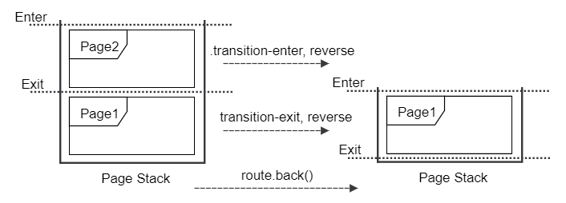
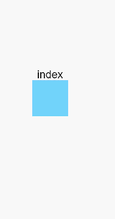

# 转场样式

更新时间：2026-03-09 02:50:43

来源：https://developer.huawei.com/consumer/cn/doc/harmonyos-references/js-components-common-transition
**支持设备：** Phone | PC/2in1 | Tablet | Wearable | TV

> [!NOTE]
> 从API version 4开始支持。后续版本如有新增内容，则采用上角标单独标记该内容的起始版本。

  

#### 共享元素转场

**支持设备：** Phone | PC/2in1 | Tablet | Wearable | TV

  

#### 属性

**支持设备：** Phone | PC/2in1 | Tablet | Wearable | TV
 
| 名称 | 类型 | 默认值 | 描述 |
| --- | --- | --- | --- |
| shareid | string | 无 | 进行共享元素转场时使用，若不配置，则转场样式不生效。共享元素转场当前支持的组件：list-item、image、text、button、label。 |
 
 
  

#### 样式

**支持设备：** Phone | PC/2in1 | Tablet | Wearable | TV
 
| 名称 | 类型 | 默认值 | 描述 |
| --- | --- | --- | --- |
| shared-transition-effect | string | exchange | 配置共享元素转场时的入场样式。 - exchange（默认值）：源页面元素移动到目的页元素位置，并进行适当缩放。 - static：目的页元素位置不变，用户可配置透明度动画。当前仅跳转目标页配置的static效果生效。 |
| shared-transition-name | string | - | 转场时，目的页配置的样式优先生效。该样式用于配置共享元素的动画效果，一个由@keyframes定义的动画序列，支持transform和透明度动画。若共享元素效果与自定义的动画冲突，以自定义动画为准。 |
| shared-transition-timing-function | string | friction | 转场时，目的页配置的样式优先生效。该属性定义了共享元素转场时的插值曲线。若不配置，默认使用friction曲线。 |
 
 
  

#### 注意事项

**支持设备：** Phone | PC/2in1 | Tablet | Wearable | TV
1. 若同时配置了共享元素转场和自定义页面转场样式，页面转场效果以自定义效果为准。
2. 共享元素的exchange效果类似下图。

  **图1** 共享元素转场默认效果

  


3. 共享元素动画对元素的边框、背景色不生效。
4. 共享元素转场时，由于页面元素会被隐藏，故页面元素配置的动画样式/动画方法失效。
5. 动态修改shareid5+：若组件A的shareid被组件B的shareid覆盖，组件A的共享元素效果将失效。即使后续修改组件B的shareid，组件A的共享元素效果也不会恢复。
 
  

#### 示例

**支持设备：** Phone | PC/2in1 | Tablet | Wearable | TV

PageA跳转到PageB，跳转的共享元素为image， shareid为“shareImage”。
 
```text
<!-- PageA -->
<!-- xxx.hml -->
<div>
  <list>
    <list-item type="description">
      <image src="item.jpg" shareid="shareImage" onclick="jump" class="shared-transition-style"></image>
    </list-item>
    <list-item>
      <text onclick="jump">Click on picture to jump to the details</text>
    </list-item>
  </list>
</div>
```
 
```json
// xxx.js
import router from '@ohos.router';
export default {
  jump() {
    router.push({
      // 路径要与config.json配置里面的相同
      url: 'pages/detailpage',
    });
  },
}
```
 
```text
/* xxx.css */
.shared-transition-style {
  shared-transition-effect: exchange;
  shared-transition-name: shared-transition;
}
@keyframes shared-transition {
  from { opacity: 0; }
  to { opacity: 1; }
}
```
 
```text
<!-- PageB -->
<!-- xxx.hml -->
<div>
  <image src="itemDetail.jpg" shareid="shareImage" onclick="jumpBack" class="shared-transition-style"></image>
</div>
```
 
```text
// xxx.js
import router from '@ohos.router';
export default {
  jumpBack() {
    router.back();
  },
}
```
 
```text
/* xxx.css */
.shared-transition-style {
  shared-transition-effect: exchange;
  shared-transition-name: shared-transition;
}
@keyframes shared-transition {
  from { opacity: 0; }
  to { opacity: 1; }
}
```
 
  

#### 卡片转场样式

**支持设备：** Phone | PC/2in1 | Tablet | Wearable | TV

> [!NOTE]
> 卡片转场无法和其他转场(包括共享元素转场和自定义转场)共同使用。

 
  

#### 样式

**支持设备：** Phone | PC/2in1 | Tablet | Wearable | TV
 
| 名称 | 类型 | 默认值 | 描述 |
| --- | --- | --- | --- |
| transition-effect | string | - | 用于配置当前页面中的某个组件在卡片转场过程中是否进行转场动效，当前支持如下配置： - unfold：配置这个属性的组件，如在卡片的上方，则向上移动一个卡片的高度，如在卡片的下方，则向下移动一个卡片的高度。 - none：转场过程中没有动效。 |
 
 
  

#### 示例

**支持设备：** Phone | PC/2in1 | Tablet | Wearable | TV

source_page包含顶部内容以及卡片列表，点击卡片可以跳转到target_page。
 
```text
<!-- source_page -->
<!-- xxx.hml -->
<div class="container">
  <div class="outer">
    <text style="font-size: 23px; margin-bottom: 20px" >MAIN TITLE</text>
  </div>
  <list style="width:340px;height:600px;flex-direction:column;justify-content:center;align-items:center">
    <list-item type="listItem" class="item" card="true" for="list" id="{{$item.id}}" onclick="jumpPage({{$item.id}}, {{$item.url}})">
      <text style="margin-left: 10px; font-size: 23px;">{{$item.title}}</text>
    </list-item>
  </list>
</div>
```
 
```text
// xxx.js
import router from '@ohos.router';
export default {
  data: { list: [] },
  onInit() {
    for(var i = 0; i < 10; i++) {
      var item = { url: "pages/card_transition/target_page/index",
                   title: "this is title" + i, id: "item_" + i }
      this.list.push(item);
    }
  },
  jumpPage(id, url) {
    var cardId = this.$element(id).ref;
    router.push({ url: url, params : { ref : cardId } });
  }
}
```
 
```text
/* xxx.css */
.container {
  width: 100%;
  height: 100%;
  flex-direction: column;
  align-items: center;
  background-color: #ABDAFF;
}
.item {
  height: 80px;
  background-color: #FAFAFA;
  margin-top: 2px;
}
.outer {
  width: 300px;
  height: 100px;
  align-items: flex-end;
  transition-effect: unfold;
}
```
 
```text
<!-- target_page -->
<!-- xxx.hml -->
<div class="container">
  <div class="div">
    <text style="font-size: 30px">this is detail</text>
  </div>
</div>
```
 
```text
/* xxx.css */
.container {
  width: 100%;
  height: 100%;
  flex-direction: column;
  align-items: center;
  background-color: #EBFFD7;
}
.div {
  height: 600px;
  flex-direction: column;
  align-items: center;
  justify-content: center;
}
```
 



 
  

#### 页面转场样式

**支持设备：** Phone | PC/2in1 | Tablet | Wearable | TV

  

#### 样式

**支持设备：** Phone | PC/2in1 | Tablet | Wearable | TV
 
| 名称 | 类型 | 默认值 | 描述 |
| --- | --- | --- | --- |
| transition-enter | string | - | 与@keyframes配套使用，支持transform和透明度动画，详见动画样式 表2 @keyframes属性说明。 |
| transition-exit | string | - | 与@keyframes配套使用，支持transform和透明度动画，详见动画样式 表2 @keyframes属性说明。 |
| transition-duration | string | 跟随设备默认的页面转场时间 | 支持的单位为[s(秒)\|ms(毫秒) ]，默认单位为ms，未配置时使用系统默认值。 |
| transition-timing-function | string | friction | 描述转场动画执行的速度曲线，用于使转场更为平滑。详细参数见动画样式中“animation-timing-function”有效值说明。 |
 
 
  

#### 注意事项

**支持设备：** Phone | PC/2in1 | Tablet | Wearable | TV
1. 配置自定义转场时，建议配置页面背景色为不透明颜色，否则在转场过程中可能会出现衔接不自然的现象。
2. transition-enter和transition-exit可单独配置，没有配置时使用系统默认的参数。
3. transition-enter/transition-exit说明如下：

  a. push场景下：进入页面栈的Page2.js应用transition-enter描述的动画配置；进入页面栈第二位置的Page1.js应用transition-exit描述的动画配置。

  



  b. back场景下：退出页面栈的Page2.js应用transition-enter描述的动画配置，并进行倒播；从页面栈第二位置进入栈顶位置的Page1.js应用transition-exit描述的动画配置，并进行倒播。

  


 
  

#### 示例

**支持设备：** Phone | PC/2in1 | Tablet | Wearable | TV

Page1有一个不透明盒子，点击盒子会跳转到Page2，当点击Page2中的盒子，会回退到Page1页面。
 1. Page1

  
```text
<!-- xxx.hml -->
<div class="container">
    <text>index</text>
    <div class="move_page" onclick="jump"></div>
</div>
```
  
```text
// xxx.js
import router from '@ohos.router';
export default {
    data: {

    },
    jump() {
        router.push({
            url:'pages/transition2/transition2'
        })
    }
}
```
  
```text
/* xxx.css */
.container {
    flex-direction: column;
    justify-content: center;
    align-items: center;
    width: 100%;
    height: 100%;
}
.move_page {
    width: 100px;
    height: 100px;
    background-color: #72d3fa;
    transition-enter: go_page;
    transition-exit: exit_page;
    transition-duration: 5s;
    transition-timing-function: friction;
}

@keyframes go_page {
    from {
        opacity: 0;
        transform: translate(0px) rotate(60deg) scale(1.0);
    }

    to {
        opacity: 1;
        transform: translate(100px) rotate(360deg) scale(1.0);
    }
}
@keyframes exit_page {
    from {
        opacity: 1;
        transform: translate(200px) rotate(60deg) scale(2);
    }

    to {
        opacity: 0;
        transform: translate(200px) rotate(360deg) scale(2);
    }
}
```

2. Page2

  
```text
<!-- xxx.hml -->
<div class="container">
    <text>transition</text>
    <div class="move_page" onclick="jumpBack"></div>
</div>
```
  
```text
// xxx.js
import router from '@ohos.router';
export default {
    data: {

    },
    jumpBack() {
        router.back()
    }
}
```
  
```text
/* xxx.css */
.container {
    flex-direction: column;
    justify-content: center;
    align-items: center;
    width: 100%;
    height: 100%;
}

.move_page {
    width: 100px;
    height: 100px;
    background-color: #f172fa;
    transition-enter: go_page;
    transition-exit: exit_page;
    transition-duration: 5s;
    transition-timing-function: ease;
}

@keyframes go_page {
    from {
        opacity: 0;
        transform:translate(100px) rotate(0deg) scale(1.0);
    }
    to {
        opacity: 1;
        transform:translate(100px) rotate(180deg) scale(2.0);
    }
}

@keyframes exit_page {
    from {
        opacity: 1;
        transform: translate(0px) rotate(60deg) scale(1);
    }
    to {
        opacity: 0;
        transform: translate(0px) rotate(360deg) scale(1);
    }
}
```
  

