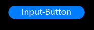
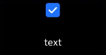
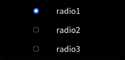

# input

更新时间：2026-04-03 09:39:20

来源：https://developer.huawei.com/consumer/cn/doc/harmonyos-references/js-lite-components-basic-input
**支持设备：** Phone / PC/2in1 / Tablet / Wearable / lite_wearable / TV

交互式组件，包括单选框，多选框，按钮。

> [!NOTE]
> 该组件从API version 4 开始支持。后续版本如有新增内容，则采用上角标单独标记该内容的起始版本。

## 子组件
**支持设备：** Phone / PC/2in1 / Tablet / Wearable / lite_wearable / TV

不支持。

## 属性
**支持设备：** Phone / PC/2in1 / Tablet / Wearable / lite_wearable / TV

| 名称 | 类型 | 默认值 | 必填 | 描述 |
| --- | --- | --- | --- | --- |
| type | string | button | 否 | input组件类型，可选值为button，checkbox，radio，text。          button，checkbox，radio，text不支持动态修改。可选值定义如下：          - button：定义可点击的按钮。          - checkbox：定义多选框。          - radio：定义单选按钮，允许在多个拥有相同name值的选项中选中其中一个。          - text：定义用于文字输入的文本框，仅在支持输入法功能的真机设备上，支持点击拉起文字输入界面，[UI预览](https://developer.huawei.com/consumer/cn/doc/harmonyos-guides/ui-ide-previewer)无效果。 |
| checked | boolean | false | 否 | 当前组件是否选中，true表示选中，false表示未选中。仅type为checkbox和radio生效。 |
| name | string | - | 否 | input组件的名称。 |
| value | string | - | 否 | input组件的value值，当类型为radio时必填且相同name值的选项该值唯一。 |
| id | string | - | 否 | 组件的唯一标识。 |
| style | string | - | 否 | 组件的样式声明。 |
| class | string | - | 否 | 组件的样式类，用于引用样式表。 |
| ref | string | - | 否 | 用来指定指向子元素的引用信息，该引用将注册到父组件的\$refs 属性对象上。 |

## 事件
**支持设备：** Phone / PC/2in1 / Tablet / Wearable / lite_wearable / TV

- 当input类型为checkbox、radio时，支持如下事件：                                             名称           参数           描述                                                 change           { checked:true | false }           checkbox多选框或radio单选框的checked状态发生变化时触发该事件。                               click           -           点击动作触发该事件。                               longpress           -           长按动作触发该事件。                               swipe5+           [SwipeEvent](https://developer.huawei.com/consumer/cn/doc/harmonyos-references/js-lite-common-events)           组件上快速滑动后触发。
- 当input类型为button时，支持如下事件：                                             名称           参数           描述                                                 click           -           点击动作触发该事件。                               longpress           -           长按动作触发该事件。                               swipe5+           [SwipeEvent](https://developer.huawei.com/consumer/cn/doc/harmonyos-references/js-lite-common-events)           组件上快速滑动后触发。

## 样式
**支持设备：** Phone / PC/2in1 / Tablet / Wearable / lite_wearable / TV

| 名称 | 类型 | 默认值 | 必填 | 描述 |
| --- | --- | --- | --- | --- |
| color | &lt;color&gt; | #ffffff | 否 | 按钮的文本颜色。 |
| font-size | &lt;length&gt; | 30px | 否 | 按钮的文本尺寸。 |
| width | &lt;length&gt; | - | 否 | type为button时，默认值为100px。 |
| height | &lt;length&gt; | - | 否 | type为button时，默认值为50px。 |
| font-family | string | SourceHanSansSC-Regular | 否 | 字体。目前仅支持SourceHanSansSC-Regular 字体。 |
| padding | &lt;length&gt; | 0 | 否 | 使用简写属性设置所有的内边距属性。          该属性可以有1到4个值：          - 指定一个值时，该值指定四个边的内边距。          - 指定两个值时，第一个值指定上下两边的内边距，第二个指定左右两边的内边距。          - 指定三个值时，第一个指定上边的内边距，第二个指定左右两边的内边距，第三个指定下边的内边距。          - 指定四个值时分别为上��右、下、左边的内边距（顺时针顺序）。 |
| padding-[left\|top\|right\|bottom] | &lt;length&gt; | 0 | 否 | 设置左、上、右、下内边距属性。 |
| margin | &lt;length&gt; \| &lt;percentage&gt;5+ | 0 | 否 | 使用简写属性设置所有的外边距属性，该属性可以有1到4个值。          - 只有一个值时，这个值会被指定给全部的四个边。          - 两个值时，第一个值被匹配给上和下，第二个值被匹配给左和右。          - 三个值时，第一个值被匹配给上, 第二个值被匹配给左和右，第三个值被匹配给下。          - 四个值时，会依次按上、右、下、左的顺序匹配 (即顺时针顺序)。 |
| margin-[left\|top\|right\|bottom] | &lt;length&gt; \| &lt;percentage&gt;5+ | 0 | 否 | 设置左、上、右、下外边距属性。 |
| border-width | &lt;length&gt; | 0 | 否 | 使用简写属性设置元素的所有边框宽度。 |
| border-color | &lt;color&gt; | black | 否 | 使用简写属性设置元素的所有边框颜色。 |
| border-radius | &lt;length&gt; | - | 否 | border-radius属性是设置元素的外边框圆角半径。 |
| background-color | &lt;color&gt; | - | 否 | 设置背景颜色。 |
| display | string | flex | 否 | 确定一个元素所产生的框的类型，可选值为：          - flex：弹性布局。          - none：不渲染此元素。 |
| [left\|top] | &lt;length&gt; \| &lt;percentage&gt;6+ | - | 否 | left\|top确定元素的偏移位置。          - left属性规定元素的左边缘。该属性定义了定位元素左外边距边界与其包含块左边界之间的偏移。          - top属性规定元素的顶部边缘。该属性定义了一个定位元素的上外边距边界与其包含块上边界之间的偏移。 |

## 示例
**支持设备：** Phone / PC/2in1 / Tablet / Wearable / lite_wearable / TV

1. type为button       __PREBLOCK_0__       __PREBLOCK_1__       
2. type为checkbox       __PREBLOCK_2__       __PREBLOCK_3__       __PREBLOCK_4__       
3. type为radio       __PREBLOCK_5__       __PREBLOCK_6__       
