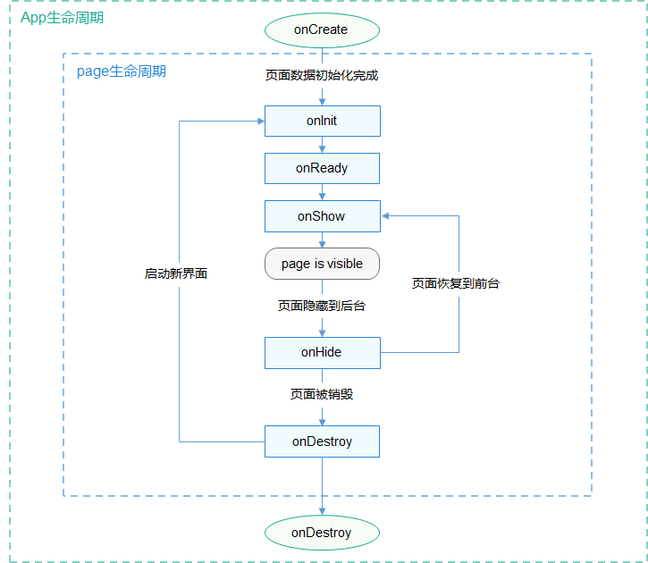

# 生命周期

更新时间：2026-03-09 02:50:43

来源：https://developer.huawei.com/consumer/cn/doc/harmonyos-references/js-lite-framework-lifecycle
**支持设备：** Phone / PC/2in1 / Tablet / Wearable / lite_wearable / TV

## 应用生命周期
**支持设备：** Phone / PC/2in1 / Tablet / Wearable / lite_wearable / TV

在app.js中可以定义如下应用生命周期函数：

| 属性 | 类型 | 描述 | 触发时机 |
| --- | --- | --- | --- |
| onCreate | () =&gt; void | 应用创建 | 当应用创建时调用。 |
| onDestroy | () =&gt; void | 应用销毁 | 当应用退出时触发。 |

## 页面生命周期
**支持设备：** Phone / PC/2in1 / Tablet / Wearable / lite_wearable / TV

在页面JS文件中可以定义如下页面生命周期函数：

> [!NOTE]
> 请注意不要在生命周期函数中执行复杂耗时操作，以避免影响页面切换性能。

| 属性 | 类型 | 描述 | 触发时机 |
| --- | --- | --- | --- |
| onInit | () =&gt; void | 页面初始化 | 页面数据初始化完成时触发，只触发一次。 |
| onReady | () =&gt; void | 页面创建完成 | 页面创建完成时触发，只触发一次。 |
| onShow | () =&gt; void | 页面显示 | 页面显示时触发。 |
| onHide | () =&gt; void | 页面消失 | 页面消失时触发。 |
| onDestroy | () =&gt; void | 页面销毁 | 页面销毁时触发。 |

页面A的生命周期接口的调用顺序：

- 打开页面A：onInit() -> onReady() -> onShow()
- 在页面A打开页面B：onHide() -> onDestroy()
- 从页面B返回页面A：onInit() -> onReady() -> onShow()
- 退出页面A：onHide() -> onDestroy()
- 页面隐藏到后台运行：onHide()
- 页面从后台运行恢复到前台：onShow()

