# CanvasRenderingContext2D对象

更新时间：2026-03-27 08:08:20

来源：https://developer.huawei.com/consumer/cn/doc/harmonyos-references/js-lite-components-canvas-canvasrenderingcontext2d
**支持设备：** Phone | PC/2in1 | Tablet | Wearable | lite_wearable | TV

使用CanvasRenderingContext2D在canvas画布组件上进行绘制，绘制对象可以是矩形、文本。
 
**示例：**
 
```text
<!-- xxx.hml -->
<div>
    <canvas ref="canvas1" style="width: 200px; height: 150px; background-color: #ffff00;"></canvas>
    <input type="button" style="width: 180px; height: 60px;" value="fillStyle" onclick="handleClick" />
</div>
```
 
```text
// xxx.js
export default {
  handleClick() {
    const el = this.$refs.canvas1;
    const ctx = el.getContext('2d');
    ctx.beginPath();
    ctx.arc(100, 75, 50, 0, 6.28);
    ctx.stroke();
  },
}
```
 
 
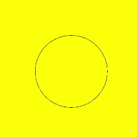

  

##### fillRect()

填充一个矩形。
 
**参数：**
  
| 参数 | 类型 | 描述 |
| --- | --- | --- |
| x | number | 指定矩形左上角点的x坐标。 |
| y | number | 指定矩形左上角点的y坐标。 |
| width | number | 指定矩形的宽度。 |
| height | number | 指定矩形的高度。 |
 
 
**示例：**
 
 


 
```text
ctx.fillRect(20, 20, 200, 150);
```
 
  

##### fillStyle

指定绘制的填充色。
 
**参数：**
  
| 参数 | 类型 | 描述 |
| --- | --- | --- |
| color | &lt;color&gt; | 设置填充区域的颜色。 |
 
 
**示例：**
 
 
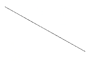

 
```text
ctx.fillStyle = '#0000ff';
ctx.fillRect(20, 20, 150, 100);
```
 
  

##### strokeRect()

绘制具有边框的矩形，矩形内部不填充。
 
**参数：**
  
| 参数 | 类型 | 描述 |
| --- | --- | --- |
| x | number | 指定矩形的左上角x坐标。 |
| y | number | 指定矩形的左上角y坐标。 |
| width | number | 指定矩形的宽度。 |
| height | number | 指定矩形的高度。 |
 
 
**示例：**
 
 
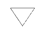

 
```text
ctx.strokeRect(30, 30, 200, 150);
```
 
  

##### fillText()

绘制填充类文本。
 
**参数：**
  
| 参数 | 类型 | 描述 |
| --- | --- | --- |
| text | string | 需要绘制的文本内容。 |
| x | number | 需要绘制的文本的左下角x坐标。 |
| y | number | 需要绘制的文本的左下角y坐标。 |
 
 
**示例：**
 
 
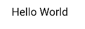

 
```text
ctx.font = '35px sans-serif';
ctx.fillText("Hello World!", 20, 60);
```
 
  

##### lineWidth

指定绘制线条的宽度值。
 
**参数：**
  
| 参数 | 类型 | 描述 |
| --- | --- | --- |
| lineWidth | number | 设置绘制线条的宽度。 |
 
 
**示例：**
 
 
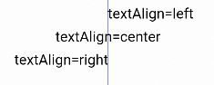

 
```text
ctx.lineWidth = 5;
ctx.strokeRect(25, 25, 85, 105);
```
 
  

##### strokeStyle

设置描边的颜色。
 
**参数：**
  
| 参数 | 类型 | 描述 |
| --- | --- | --- |
| color | &lt;color&gt; | 指定描边使用的颜色 |
 
 
**示例：**
 
 
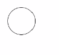

 
```text
ctx.lineWidth = 10;
ctx.strokeStyle = '#0000ff';
ctx.strokeRect(25, 25, 155, 105);
```
 
  

##### stroke()5+

进行边框绘制操作。
 
**示例：**
 

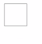

 
```text
ctx.moveTo(25, 25);
ctx.lineTo(25, 105);
ctx.strokeStyle = 'rgb(0,0,255)';
ctx.stroke();
```
 
  

##### beginPath()5+

创建一个新的绘制路径。
 
**示例：**
 
 


 
```text
ctx.beginPath();
ctx.lineWidth = 6;
ctx.strokeStyle = '#0000ff';
ctx.moveTo(15, 80);
ctx.lineTo(280, 80);
ctx.stroke();
```
 
  

##### moveTo()5+

路径从当前点移动到指定点。
 
**参数：**
  
| 参数 | 类型 | 描述 |
| --- | --- | --- |
| x | number | 指定位置的x坐标。 |
| y | number | 指定位置的y坐标。 |
 
 
**示例：**
 
 
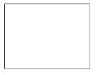

 
```text
ctx.beginPath();
ctx.moveTo(10, 10);
ctx.lineTo(280, 160);
ctx.stroke();
```
 
  

##### lineTo()5+

从当前点到指定点进行路径连接。
 
**参数：**
  
| 参数 | 类型 | 描述 |
| --- | --- | --- |
| x | number | 指定位置的x坐标。 |
| y | number | 指定位置的y坐标。 |
 
 
**示例：**
 


 
```text
ctx.beginPath();
ctx.moveTo(10, 10);
ctx.lineTo(280, 160);
ctx.stroke();
```
 
  

##### closePath()5+

结束当前路径形成一个封闭路径。
 
**示例：**
 
 
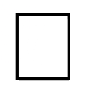

 
```text
ctx.beginPath();
ctx.moveTo(30, 30);
ctx.lineTo(110, 30);
ctx.lineTo(70, 90);
ctx.closePath();
ctx.stroke();
```
 
  

##### font

设置文本绘制中的字体样式。
 
**参数：**
  
| 参数 | 类型 | 描述 |
| --- | --- | --- |
| value | string | 字体样式支持：sans-serif, serif, monospace，该属性默认值为30px HYQiHei-65S。 |
 
 
**示例：**
 
 
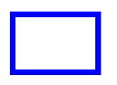

 
```text
ctx.font = '30px sans-serif';
ctx.fillText("Hello World", 20, 60);
```
 
  

##### textAlign

设置文本绘制中的文本对齐方式。
 
**参数：**
  
| 参数 | 类型 | 描述 |
| --- | --- | --- |
| align | string | 可选值为： - left（默认）：文本左对齐； - right：文本右对齐； - center：文本居中对齐； |
 
 
**示例：**
 
 


 
```text
ctx.strokeStyle = '#0000ff';
ctx.moveTo(140, 10);
ctx.lineTo(140, 160);
ctx.stroke();

ctx.font = '18px sans-serif';

// Show the different textAlign values
ctx.textAlign = 'left';
ctx.fillText('textAlign=left', 140, 100);
ctx.textAlign = 'center';
ctx.fillText('textAlign=center',140, 120);
ctx.textAlign = 'right';
ctx.fillText('textAlign=right',140, 140);
```
 
  

##### arc()5+

绘制弧线路径。
 
**参数：**
  
| 参数 | 类型 | 必填 | 描述 |
| --- | --- | --- | --- |
| x | number | 是 | 弧线圆心的x坐标值，单位：vp。 |
| y | number | 是 | 弧线圆心的y坐标值，单位：vp。 |
| radius | number | 是 | 弧线的圆半径，单位：vp。 |
| startAngle | number | 是 | 弧线的起始弧度，单位：弧度。 |
| endAngle | number | 是 | 弧线的终止弧度，单位：弧度。 |
| anticlockwise | boolean | 否 | 是否逆时针绘制圆弧。 true：逆时针方向绘制弧线。 false：顺时针方向绘制弧线。 默认值：false。 |
 
 
**示例：**
 

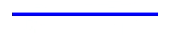

 
```text
ctx.beginPath();
ctx.arc(100, 75, 50, 0, 6.28);
ctx.stroke();
```
 
  

##### rect()5+

创建矩形路径。
 
**参数：**
  
| 参数 | 类型 | 必填 | 描述 |
| --- | --- | --- | --- |
| x | number | 是 | 指定矩形的左上角x坐标值，单位：vp。 |
| y | number | 是 | 指定矩形的左上角y坐标值，单位：vp。 |
| width | number | 是 | 指定矩形的宽度，单位：vp。 |
| height | number | 是 | 指定矩形的高度，单位：vp。 |
 
 
**示例：**
 

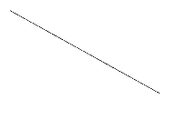

 
```text
ctx.rect(20, 20, 100, 100); // Create a 100*100 rectangle at (20, 20)
ctx.stroke(); // Draw it
```
