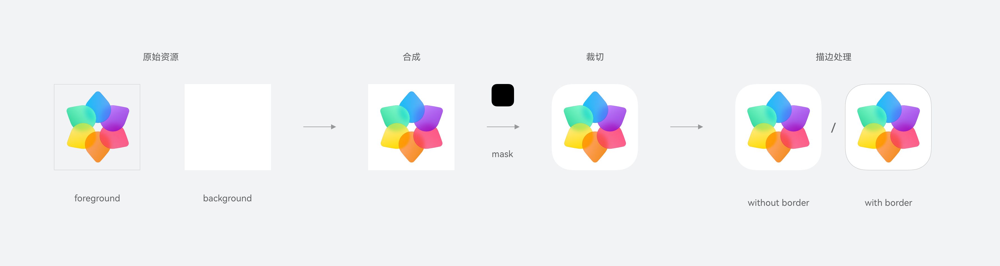
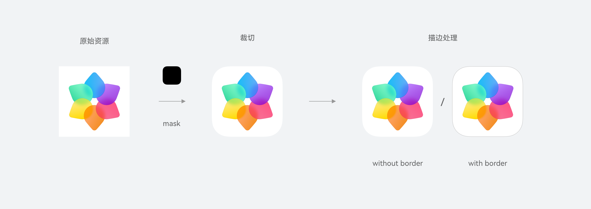

# hdsDrawable

更新时间：2026-04-20 06:34:33

来源：https://developer.huawei.com/consumer/cn/doc/harmonyos-references/ui-design-hdsdrawable
**支持设备：** Phone / PC/2in1 / Tablet / TV

本模块提供图标处理能力，包括对前后景合成、剪切、缩放、描边处理，支持分层图标和单层图标处理。

**起始版本：** 5.0.0(12)


## 导入模块
**支持设备：** Phone / PC/2in1 / Tablet / TV


```ts
import { hdsDrawable } from '@kit.UIDesignKit';
```


## hdsDrawable.getHdsLayeredIcon
**支持设备：** Phone / PC/2in1 / Tablet / TV

getHdsLayeredIcon(bundleName: string, layeredDrawableDescriptor: LayeredDrawableDescriptor, size: number, hasBorder?: boolean): image.PixelMap

获取处理后的分层图标接口，可通过该接口获取PixelMap格式的图标，适用于需插入单个图标的场景。分层图标对象以LayeredDrawableDescriptor格式定义，可以通过传入Symbol资源的id或name生成，其中hasBorder参数决定是否为输出的图标添加描边（在线主题场景时不支持设置描边），size参数指定输出图标的尺寸。

LayeredDrawableDescriptor对象：判断的方法是打开对应的Symbol json文件后观察其layered-image属性是否包含类似下面的结构：


```json
"layered-image":
{
  "background": "$background_path",
  "foreground": "$foreground_path"
}
```

**元服务API：** 从版本5.0.0(12)开始，该接口支持在元服务中使用。

**模型约束：** 此接口仅可在Stage模型下使用。

**系统能力：** SystemCapability.UIDesign.Core

**起始版本：** 5.0.0(12)

**参数：**


| 参数名 | 类型 | 必填 | 说明 |
| --- | --- | --- | --- |
| bundleName | string | 是 | 与应用绑定，为应用Bundle名称。 |
| layeredDrawableDescriptor | [LayeredDrawableDescriptor](https://developer.huawei.com/consumer/cn/doc/harmonyos-references/js-apis-arkui-drawabledescriptor#layereddrawabledescriptor) | 是 | 需要处理的分层图标数据对象。 |
| size | number | 是 | 接口处理完成后输出的图标对象为正方形，该值表示输出对象的正方形边长，包含描边区域，取值范围：大于0，单位：vp。 |
| hasBorder | boolean | 否 | 是否描边，true：描边，false：不描边，默认false，在线主题场景不支持设置描边。 |


**返回值：**


| 类型 | 说明 |
| --- | --- |
| [image.PixelMap](https://developer.huawei.com/consumer/cn/doc/harmonyos-references/arkts-apis-image-pixelmap) | 接口处理完成后返回的图标数据对象，格式为PixelMap。 |


**错误码：**

以下错误码的详细介绍请参见[ArkTS API错误码](https://developer.huawei.com/consumer/cn/doc/harmonyos-references/ui-design-error-code)。


| 错误码ID | 错误信息 |
| --- | --- |
| 401 | Parameter error. The value of bundleName is incorrect. Parameter error. The value of layeredDrawableDescriptor is incorrect. Parameter error. The value of size is incorrect. Parameter error. The value of hasBorder is incorrect. Parameter error. Possible causes: 1. Mandatory parameters are left unspecified. |


**示例：**


```ts
import { LayeredDrawableDescriptor } from '@kit.ArkUI';
import { hdsDrawable } from '@kit.UIDesignKit';
import { image } from '@kit.ImageKit';
import { BusinessError } from '@kit.BasicServicesKit';
import { resourceManager } from '@kit.LocalizationKit';
import { common } from '@kit.AbilityKit';

let bundleName: string = 'com.example.uidesignkit';
try {
  // 请在组件内获取context，确保this.getUIContext().getHostContext()返回结果为UIAbilityContext
  let resManager: resourceManager.ResourceManager = (
    this.getUIContext().getHostContext() as common.UIAbilityContext
  )?.resourceManager;
  let layeredDrawableDescriptor: LayeredDrawableDescriptor =
    resManager.getDrawableDescriptor(
      $r('app.media.drawable').id,
    ) as LayeredDrawableDescriptor; // 传入已创建的图片资源
  let processedIcon: image.PixelMap = hdsDrawable.getHdsLayeredIcon(
    bundleName,
    layeredDrawableDescriptor,
    48,
    true,
  );
} catch (err) {
  let message = (err as BusinessError).message;
  let code = (err as BusinessError).code;
  console.error(`getHdsLayeredIcon failed, code: ${code}, message: ${message}`);
}
```


## hdsDrawable.getHdsLayeredIconAsync
**支持设备：** Phone / PC/2in1 / Tablet / TV

getHdsLayeredIconAsync(bundleName: string, layeredDrawableDescriptor: LayeredDrawableDescriptor, size: number, hasBorder?: boolean): Promise<image.PixelMap>

获取处理后的分层图标接口，使用Promise异步回调。

**元服务API：** 从版本5.0.0(12)开始，该接口支持在元服务中使用。

**模型约束：** 此接口仅可在Stage模型下使用。

**系统能力：** SystemCapability.UIDesign.Core

**起始版本：** 5.0.0(12)

**参数：**


| 参数名 | 类型 | 必填 | 说明 |
| --- | --- | --- | --- |
| bundleName | string | 是 | 与应用绑定，为应用Bundle名称。 |
| layeredDrawableDescriptor | [LayeredDrawableDescriptor](https://developer.huawei.com/consumer/cn/doc/harmonyos-references/js-apis-arkui-drawabledescriptor#layereddrawabledescriptor) | 是 | 需要处理的分层图标数据对象。 |
| size | number | 是 | 接口处理完成后输出的图标对象为正方形，该值表示输出对象的正方形边长，包含描边区域，取值范围：大于0，单位：vp。 |
| hasBorder | boolean | 否 | 处理后的图标是否要描边，true：描边，false：不描边，默认false，在线主题场景不支持设置描边。 |


**返回值：**


| 类型 | 说明 |
| --- | --- |
| Promise&lt;[image.PixelMap](https://developer.huawei.com/consumer/cn/doc/harmonyos-references/arkts-apis-image-pixelmap)&gt; | Promise对象，接口处理完成后返回的图标数据对象，格式为PixelMap。 |


**错误码：**

以下错误码的详细介绍请参见[ArkTS API错误码](https://developer.huawei.com/consumer/cn/doc/harmonyos-references/ui-design-error-code)。


| 错误码ID | 错误信息 |
| --- | --- |
| 401 | Parameter error. The value of bundleName is incorrect. Parameter error. The value of layeredDrawableDescriptor is incorrect. Parameter error. The value of size is incorrect. Parameter error. The value of hasBorder is incorrect. Parameter error. Possible causes: 1. Mandatory parameters are left unspecified. |


**示例：**


```ts
import { LayeredDrawableDescriptor } from '@kit.ArkUI';
import { hdsDrawable } from '@kit.UIDesignKit';
import { image } from '@kit.ImageKit';
import { BusinessError } from '@kit.BasicServicesKit';
import { resourceManager } from '@kit.LocalizationKit';
import { common } from '@kit.AbilityKit';

let bundleName: string = 'com.example.uidesignkit';
try {
  // 请在组件内获取context，确保this.getUIContext().getHostContext()返回结果为UIAbilityContext
  let resManager: resourceManager.ResourceManager = (
    this.getUIContext().getHostContext() as common.UIAbilityContext
  )?.resourceManager;
  let layeredDrawableDescriptor: LayeredDrawableDescriptor =
    resManager.getDrawableDescriptor(
      $r('app.media.drawable').id,
    ) as LayeredDrawableDescriptor; // 传入已创建���图片资源

  hdsDrawable
    .getHdsLayeredIconAsync(bundleName, layeredDrawableDescriptor, 48, true)
    .then((data: image.PixelMap) => {
      let processedIcon: image.PixelMap = data;
    })
    .catch((err: BusinessError) => {
      console.error(
        `getHdsLayeredIconAsync return error, code: ${err.code}, msg: ${err.message}`,
      );
    });
} catch (err) {
  let message = (err as BusinessError).message;
  let code = (err as BusinessError).code;
  console.error(
    `getHdsLayeredIconAsync failed, code: ${code}, message: ${message}`,
  );
}
```


## hdsDrawable.getHdsIcon
**支持设备：** Phone / PC/2in1 / Tablet / TV

getHdsIcon(bundleName: string, pixelMap: image.PixelMap, size: number, mask: image.PixelMap, hasBorder?: boolean): image.PixelMap

获取处理后的单层图标接口，可通过该接口获取PixelMap格式的图标，适用于需插入单个图标的场景。其中hasBorder参数决定是否为输出的图标添加描边（在线主题场景时不支持设置描边），size参数指定输出图标的尺寸。

**元服务API：** 从版本5.0.0(12)开始，该接口支持在元服务中使用。

**模型约束：** 此接口仅可在Stage模型下使用。

**系统能力：** SystemCapability.UIDesign.Core

**起始版本：** 5.0.0(12)

**参数：**


| 参数名 | 类型 | 必填 | 说明 |
| --- | --- | --- | --- |
| bundleName | string | 是 | 与应用绑定，为应用Bundle名称。 |
| pixelMap | [image.PixelMap](https://developer.huawei.com/consumer/cn/doc/harmonyos-references/arkts-apis-image-pixelmap) | 是 | 单层图标数据对象。 |
| size | number | 是 | 接口处理完成后输出的图标对象为正方形，该值表示输出对象的正方形边长，包含描边区域，取值范围：大于0，单位：vp。 |
| mask | [image.PixelMap](https://developer.huawei.com/consumer/cn/doc/harmonyos-references/arkts-apis-image-pixelmap) | 是 | 图标蒙版信息，用于图标剪切处理。 |
| hasBorder | boolean | 否 | 是否描边，true：描边，false：不描边，默认false，在线主题场景不支持设置描边。 |


**返回值：**


| 类型 | 说明 |
| --- | --- |
| [image.PixelMap](https://developer.huawei.com/consumer/cn/doc/harmonyos-references/arkts-apis-image-pixelmap) | 接口处理完成后返回的图标数据对象，格式为PixelMap。 |


**错误码：**

以下错误码的详细介绍请参见[ArkTS API错误码](https://developer.huawei.com/consumer/cn/doc/harmonyos-references/ui-design-error-code)。


| 错误码ID | 错误信息 |
| --- | --- |
| 401 | Parameter error. The value of bundleName is incorrect. Parameter error. The value of pixelMap is incorrect. Parameter error. The value of size is incorrect. Parameter error. The value of mask is incorrect. Parameter error. The value of hasBorder is incorrect. Parameter error. Possible causes: 1. Mandatory parameters are left unspecified. |


**示例：**


```ts
import { LayeredDrawableDescriptor, DrawableDescriptor } from '@kit.ArkUI';
import { hdsDrawable } from '@kit.UIDesignKit';
import { image } from '@kit.ImageKit';
import { BusinessError } from '@kit.BasicServicesKit';
import { resourceManager } from '@kit.LocalizationKit';
import { common } from '@kit.AbilityKit';

let bundleName: string = 'com.example.uidesignkit';
try {
  // 请在组件内获取context，确保this.getUIContext().getHostContext()返回结果为UIAbilityContext
  let resManager: resourceManager.ResourceManager = (
    this.getUIContext().getHostContext() as common.UIAbilityContext
  )?.resourceManager;
  let layeredDrawableDescriptor: LayeredDrawableDescriptor =
    resManager.getDrawableDescriptor(
      $r('app.media.drawable').id,
    ) as LayeredDrawableDescriptor; // 传入已创建的图片资源
  let drawableDescriptor: DrawableDescriptor =
    resManager?.getDrawableDescriptor(
      $r('app.media.normal_icon_512').id,
    ) as DrawableDescriptor; // 传入已创建的图片资源
  let processedIcon: image.PixelMap = hdsDrawable.getHdsIcon(
    bundleName,
    drawableDescriptor?.getPixelMap(),
    48,
    layeredDrawableDescriptor?.getMask().getPixelMap(),
    true,
  );
} catch (err) {
  let message = (err as BusinessError).message;
  let code = (err as BusinessError).code;
  console.error(`getHdsIcon failed, code: ${code}, message: ${message}`);
}
```


## hdsDrawable.getHdsIconAsync
**支持设备：** Phone / PC/2in1 / Tablet / TV

getHdsIconAsync(bundleName: string, pixelMap: image.PixelMap, size: number, mask: image.PixelMap, hasBorder?: boolean): Promise<image.PixelMap>

获取处理后的单层图标接口，使用Promise异步回调。

**元服务API：** 从版本5.0.0(12)开始，该接口支持在元服务中使用。

**模型约束：** 此接口仅可在Stage模型下使用。

**系统能力：** SystemCapability.UIDesign.Core

**起始版本：** 5.0.0(12)

**参数：**


| 参数名 | 类型 | 必填 | 说明 |
| --- | --- | --- | --- |
| bundleName | string | 是 | 与应用绑定，为应用Bundle名称。 |
| pixelMap | [image.PixelMap](https://developer.huawei.com/consumer/cn/doc/harmonyos-references/arkts-apis-image-pixelmap) | 是 | 单层图标数据对象。 |
| size | number | 是 | 接口处理完成后输出的图标对象为正方形，该值表示输出对象的正方形边长，包含描边区域，取值范围：大于0，单位：vp。 |
| mask | [image.PixelMap](https://developer.huawei.com/consumer/cn/doc/harmonyos-references/arkts-apis-image-pixelmap) | 是 | 图标蒙版信息，用于图标剪切处理。 |
| hasBorder | boolean | 否 | 处理后的图标是否要描边，true：描边，false：不描边，默认false，在线主题场景不支持设置描边。 |


**返回值：**


| 类型 | 说明 |
| --- | --- |
| Promise&lt;[image.PixelMap](https://developer.huawei.com/consumer/cn/doc/harmonyos-references/arkts-apis-image-pixelmap)&gt; | Promise对象，接口处理完成后返回的图标数据对象，格式为PixelMap。 |


**错误码：**

以下错误码的详细介绍请参见[ArkTS API错误码](https://developer.huawei.com/consumer/cn/doc/harmonyos-references/ui-design-error-code)。


| 错误码ID | 错误信息 |
| --- | --- |
| 401 | Parameter error. The value of bundleName is incorrect. Parameter error. The value of pixelMap is incorrect. Parameter error. The value of size is incorrect. Parameter error. The value of mask is incorrect. Parameter error. The value of hasBorder is incorrect. Parameter error. Possible causes: 1. Mandatory parameters are left unspecified. |


**示例：**


```ts
import { LayeredDrawableDescriptor, DrawableDescriptor } from '@kit.ArkUI';
import { hdsDrawable } from '@kit.UIDesignKit';
import { image } from '@kit.ImageKit';
import { BusinessError } from '@kit.BasicServicesKit';
import { resourceManager } from '@kit.LocalizationKit';
import { common } from '@kit.AbilityKit';

let bundleName: string = 'com.example.uidesignkit';
try {
  // 请在组件内获取context，确保this.getUIContext().getHostContext()返回结果为UIAbilityContext
  let resManager: resourceManager.ResourceManager = (
    this.getUIContext().getHostContext() as common.UIAbilityContext
  )?.resourceManager;
  let layeredDrawableDescriptor: LayeredDrawableDescriptor =
    resManager.getDrawableDescriptor(
      $r('app.media.drawable').id,
    ) as LayeredDrawableDescriptor; // 传入已创建的图片资源
  let drawableDescriptor: DrawableDescriptor =
    resManager?.getDrawableDescriptor(
      $r('app.media.normal_icon_512').id,
    ) as DrawableDescriptor; // 传入已创建的图片资源

  hdsDrawable
    .getHdsIconAsync(
      bundleName,
      drawableDescriptor?.getPixelMap(),
      48,
      layeredDrawableDescriptor?.getMask().getPixelMap(),
      true,
    )
    .then((data: image.PixelMap) => {
      let processedIcon: image.PixelMap = data;
    })
    .catch((err: BusinessError) => {
      console.error(
        `getHdsIconAsync return error, code: ${err.code}, msg: ${err.message}`,
      );
    });
} catch (err) {
  let message = (err as BusinessError).message;
  let code = (err as BusinessError).code;
  console.error(`getHdsIconAsync failed, code: ${code}, message: ${message}`);
}
```


## hdsDrawable.getHdsLayeredIcons
**支持设备：** Phone / PC/2in1 / Tablet / TV

getHdsLayeredIcons(icons: Array<LayeredIcon>, options: Options): Promise<Array<ProcessedIcon>>

批量获取处理后的分层图标接口，使用Promise异步回调。

**元服务API：** 从版本5.0.0(12)开始，该接口支持在元服务中使用。

**模型约束：** 此接口仅可在Stage模型下使用。

**系统能力：** SystemCapability.UIDesign.Core

**起始版本：** 5.0.0(12)

**参数：**


| 参数名 | 类型 | 必填 | 说明 |
| --- | --- | --- | --- |
| icons | Array&lt;[LayeredIcon](#layeredicon)&gt; | 是 | 待处理的分层图标数据集合。 |
| options | [Options](#options) | 是 | 处理分层图标的配置项信息。 |


**返回值：**


| 类型 | 说明 |
| --- | --- |
| Promise&lt;Array&lt;[ProcessedIcon](#processedicon)&gt;&gt; | Promise对象，返回处理后的图像数据集合。 |


**错误码：**

以下错误码的详细介绍请参见[ArkTS API错误码](https://developer.huawei.com/consumer/cn/doc/harmonyos-references/ui-design-error-code)。


| 错误码ID | 错误信息 |
| --- | --- |
| 401 | Parameter error. The value of icons is incorrect. Parameter error. The value of size is incorrect. Parameter error. The value of hasBorder is incorrect. Parameter error. The value of parallelNumber is incorrect. |
| 1012600001 | Task is busy. |


**示例：**


```ts
import { LayeredDrawableDescriptor } from '@kit.ArkUI';
import { hdsDrawable } from '@kit.UIDesignKit';
import { BusinessError } from '@kit.BasicServicesKit';
import { resourceManager } from '@kit.LocalizationKit';
import { common } from '@kit.AbilityKit';

let bundleName: string = 'com.example.uidesignkit';
let options: hdsDrawable.Options = {
  size: 48,
  hasBorder: true,
  parallelNumber: 4,
};

try {
  // 请在组件内获取context，确保this.getUIContext().getHostContext()返回结果为UIAbilityContext
  let resManager: resourceManager.ResourceManager = (
    this.getUIContext().getHostContext() as common.UIAbilityContext
  )?.resourceManager;
  let layeredDrawableDescriptor: LayeredDrawableDescriptor =
    resManager.getDrawableDescriptor(
      $r('app.media.drawable').id,
    ) as LayeredDrawableDescriptor; // 传入已创建的图片资源
  let layeredIcons: Array<hdsDrawable.LayeredIcon> = [];
  for (let i = 0; i < 10; i++) {
    layeredIcons.push({
      bundleName: `${bundleName}-${i}`,
      layeredDrawableDescriptor: layeredDrawableDescriptor,
    });
  }

  hdsDrawable
    .getHdsLayeredIcons(layeredIcons, options)
    .then((data: Array<hdsDrawable.ProcessedIcon>) => {
      console.info(`getHdsLayeredIcons data size: ${data.length}`);
      let processedIconList: Array<hdsDrawable.ProcessedIcon> = data;
    })
    .catch((err: BusinessError) => {
      console.error(
        `getHdsLayeredIcons error, code: ${err.code}, msg: ${err.message}`,
      );
    });
} catch (err) {
  let message = (err as BusinessError).message;
  let code = (err as BusinessError).code;
  console.error(
    `getHdsLayeredIcons failed, code: ${code}, message: ${message}`,
  );
}
```




## hdsDrawable.getHdsIcons
**支持设备：** Phone / PC/2in1 / Tablet / TV

getHdsIcons(icons: Array<Icon>, mask: image.PixelMap, options: Options): Promise<Array<ProcessedIcon>>

批量获取处理后的单层图标接口，使用Promise异步回调。

**元服务API：** 从版本5.0.0(12)开始，该接口支持在元服务中使用。

**模型约束：** 此接口仅可在Stage模型下使用。

**系统能力：** SystemCapability.UIDesign.Core

**起始版本：** 5.0.0(12)

**参数：**


| 参数名 | 类型 | 必填 | 说明 |
| --- | --- | --- | --- |
| icons | Array&lt;[Icon](#icon)&gt; | 是 | 待处理的单层图标数据集合。 |
| mask | [image.PixelMap](https://developer.huawei.com/consumer/cn/doc/harmonyos-references/arkts-apis-image-pixelmap) | 是 | 图标蒙版信息，用于图标剪切处理。 |
| options | [Options](#options) | 是 | 处理单层图标的配置项信息。 |


**返回值：**


| 类型 | 说明 |
| --- | --- |
| Promise&lt;Array&lt;[ProcessedIcon](#processedicon)&gt;&gt; | Promise对象，返回处理后的图像数据集合。 |


**错误码：**

以下错误码的详细介绍请参见[ArkTS API错误码](https://developer.huawei.com/consumer/cn/doc/harmonyos-references/ui-design-error-code)。


| 错误码ID | 错误信息 |
| --- | --- |
| 401 | Parameter error. The value of icons is incorrect. Parameter error. The value of mask is incorrect. Parameter error. The value of size is incorrect. Parameter error. The value of hasBorder is incorrect. Parameter error. The value of parallelNumber is incorrect. |
| 1012600001 | Task is busy. |


**示例：**


```ts
import { LayeredDrawableDescriptor, DrawableDescriptor } from '@kit.ArkUI';
import { hdsDrawable } from '@kit.UIDesignKit';
import { BusinessError } from '@kit.BasicServicesKit';
import { resourceManager } from '@kit.LocalizationKit';
import { common } from '@kit.AbilityKit';

let bundleName: string = 'com.example.uidesignkit';
let options: hdsDrawable.Options = {
  size: 48,
  hasBorder: true,
  parallelNumber: 4,
};

try {
  // 请在组件内获取context，确保this.getUIContext().getHostContext()返回结果为UIAbilityContext
  let resManager: resourceManager.ResourceManager = (
    this.getUIContext().getHostContext() as common.UIAbilityContext
  )?.resourceManager;
  let layeredDrawableDescriptor: LayeredDrawableDescriptor =
    resManager.getDrawableDescriptor(
      $r('app.media.drawable').id,
    ) as LayeredDrawableDescriptor; // 传入已创建的图片资源
  let drawableDescriptor: DrawableDescriptor =
    resManager?.getDrawableDescriptor(
      $r('app.media.normal_icon_512').id,
    ) as DrawableDescriptor; // 传入已创建的图片资源
  let icons: Array<hdsDrawable.Icon> = [];
  for (let i = 0; i < 10; i++) {
    icons.push({
      bundleName: `${bundleName}-${i}`,
      pixelMap: drawableDescriptor.getPixelMap(),
    });
  }

  hdsDrawable
    .getHdsIcons(
      icons,
      layeredDrawableDescriptor.getMask().getPixelMap(),
      options,
    )
    .then((data: Array<hdsDrawable.ProcessedIcon>) => {
      console.info(`getHdsIcons data size: ${data.length}`);
      let processedIconList: Array<hdsDrawable.ProcessedIcon> = data;
    })
    .catch((err: BusinessError) => {
      console.error(
        `getHdsIcons error, code: ${err.code}, msg: ${err.message}`,
      );
    });
} catch (err) {
  let message = (err as BusinessError).message;
  let code = (err as BusinessError).code;
  console.error(`getHdsIcons failed, code: ${code}, message: ${message}`);
}
```




## LayeredIcon
**支持设备：** Phone / PC/2in1 / Tablet / TV

分层图标数据对象。

**元服务API：** 从版本5.0.0(12)开始，该接口支持在元服务中使用。

**模型约束：** 此接口仅可在Stage模型下使用。

**系统能力：** SystemCapability.UIDesign.Core

**起始版本：** 5.0.0(12)

**参数：**


| 名称 | 类型 | 只读 | 可选 | 说明 |
| --- | --- | --- | --- | --- |
| bundleName | string | 否 | 否 | 应用Bundle名称。 |
| layeredDrawableDescriptor | [LayeredDrawableDescriptor](https://developer.huawei.com/consumer/cn/doc/harmonyos-references/js-apis-arkui-drawabledescriptor#layereddrawabledescriptor) | 否 | 否 | 需要处理的分层图标数据对象。 |


## Options
**支持设备：** Phone / PC/2in1 / Tablet / TV

图标数据处理接口对应的配置项信息。

**元服务API：** 从版本5.0.0(12)开始，该接口支持在元服务中使用。

**模型约束：** 此接口仅可在Stage模型下使用。

**系统能力：** SystemCapability.UIDesign.Core

**起始版本：** 5.0.0(12)

**参数：**


| 名称 | 类型 | 只读 | 可选 | 说明 |
| --- | --- | --- | --- | --- |
| size | number | 否 | 否 | 接口处理完成后输出的图标对象为正方形，该值表示输出对象的正方形边长，包含描边区域，取值范围：大于0，单位：vp。 |
| hasBorder | boolean | 否 | 是 | 是否描边，true：描边，false：不描边，默认false，在线主题场景不支持设置描边。 |
| parallelNumber | number | 否 | 是 | 批量处理图标数据的并发数量，默认（推荐）：4，最大10。 |


## ProcessedIcon
**支持设备：** Phone / PC/2in1 / Tablet / TV

处理后的图标对象。

**元服务API：** 从版本5.0.0(12)开始，该接口支持在元服务中使用。

**模型约束：** 此接口仅可在Stage模型下使用。

**系统能力：** SystemCapability.UIDesign.Core

**起始版本：** 5.0.0(12)

**参数：**


| 名称 | 类型 | 只读 | 可选 | 说明 |
| --- | --- | --- | --- | --- |
| bundleName | string | 是 | 否 | 应用Bundle名称。 |
| pixelMap | [image.PixelMap](https://developer.huawei.com/consumer/cn/doc/harmonyos-references/arkts-apis-image-pixelmap) | 是 | 否 | 接口处理完成后返回的图标数据对象，格式为PixelMap。 |


## Icon
**支持设备：** Phone / PC/2in1 / Tablet / TV

单层图标数据对象。

**元服务API：** 从版本5.0.0(12)开始，该接口支持在元服务中使用。

**模型约束：** 此接口仅可在Stage模型下使用。

**系统能力：** SystemCapability.UIDesign.Core

**起始版本：** 5.0.0(12)

**参数：**


| 名称 | 类型 | 只读 | 可选 | 说明 |
| --- | --- | --- | --- | --- |
| bundleName | string | 否 | 否 | 应用Bundle名称。 |
| pixelMap | [image.PixelMap](https://developer.huawei.com/consumer/cn/doc/harmonyos-references/arkts-apis-image-pixelmap) | 否 | 否 | 单层图标数据对象。 |
