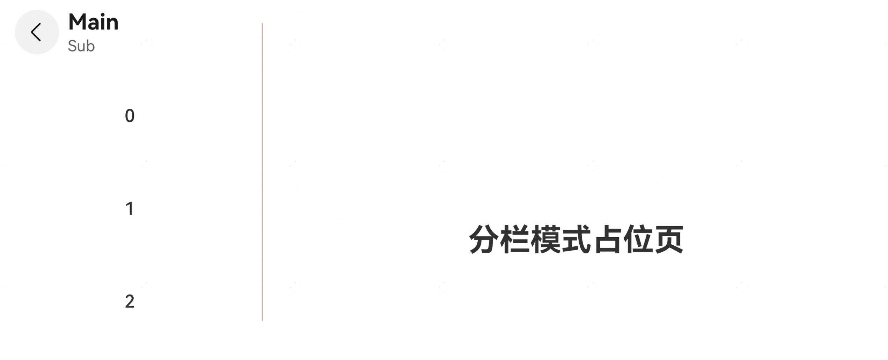
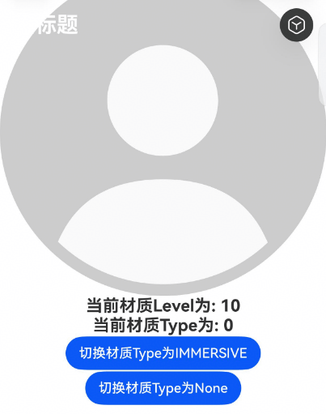

# HdsNavigation

更新时间：2026-05-07 09:37:20

来源：https://developer.huawei.com/consumer/cn/doc/harmonyos-references/ui-design-hdsnavigation
**支持设备：** Phone | PC/2in1 | Tablet | TV

本模块提供导航组件的能力，默认支持标题栏随内容区滚动的动态模糊样式。6.0.0(20)及以上版本，推荐使用[bindToScrollable](#bindtoscrollable)、[bindToNestedScrollable](#bindtonestedscrollable)属性绑定导航组件和可滚动容器组件后，再使用导航组件滚动相关的功能，从而获得更优的体验。如滚动生效动态模糊样式，标题栏随内容区滚动动态显隐功能等。

HdsNavigation组件是路由导航的根视图容器，一般作为Page页面的根容器使用，其内部默认包含了标题栏、内容区和工具栏。其中内容区默认首页显示导航内容（HdsNavigation的子组件）或非首页显示（[HdsNavDestination](https://developer.huawei.com/consumer/cn/doc/harmonyos-references/ui-design-hdsnavdestination)的子组件），首页和非首页通过路由进行切换。

**起始版本：** 5.1.0(18)


##### 导入模块

> [!NOTE]
> HdsNavigationAttribute是用于配置HdsNavigation组件属性的关键接口。6.0.1(21)及之前版本，导入HdsNavigation组件后需要开发者手动导入HdsNavigationAttribute，否则会编译报错。从6.0.2(22)版本开始，编译工具链识别到导入HdsNavigation组件后，会自动导入HdsNavigationAttribute，无需开发者手动导入。 如果开发者手动导入HdsNavigationAttribute，DevEco Studio会显示置灰，6.0.1(21)及之前版本删除会编译报错，从6.0.2(22)版本开始，删除对功能无影响。


6.0.1(21)及之前版本：

```text
import { HdsNavigation, HdsNavigationAttribute } from '@kit.UIDesignKit';
```

6.0.2(22)及之后版本：

```text
import { HdsNavigation } from '@kit.UIDesignKit';
```


##### 子组件

可以包含子组件。 推荐使用[NavPathStack](https://developer.huawei.com/consumer/cn/doc/harmonyos-references/ts-basic-components-navigation#navpathstack10)配合[HdsNavDestination](https://developer.huawei.com/consumer/cn/doc/harmonyos-references/ui-design-hdsnavdestination)属性进行页面路由。


##### 接口

HdsNavigation(pathInfos?: NavPathStack)

绑定路由栈到HdsNavigation组件。

**模型约束：** 此接口仅可在Stage模型下使用。

**系统能力：** SystemCapability.UIDesign.HDSComponent.Core

**起始版本：** 5.1.0(18)

**参数：**

| 参数名 | 类型 | 必填 | 说明 |
| --- | --- | --- | --- |
| pathInfos | NavPathStack | 否 | 路由栈信息。 |


##### 属性

除支持[通用属性](https://developer.huawei.com/consumer/cn/doc/harmonyos-references/ts-component-general-attributes)外，还支持以下属性：


##### titleBar

titleBar(options?: HdsNavigationTitleBarOptions)

设置HdsNavigation组件titleBar区域（包含返回图标区域、标题区域、菜单区域、背景板）样式以及内容。

标题字符串超长时，如果不设置副标题，先缩小再换行（2行）最后以"..."截断。如果设置副标题，先缩小后以"..."截断。

**模型约束：** 此接口仅可在Stage模型下使用。

**系统能力：** SystemCapability.UIDesign.HDSComponent.Core

**起始版本：** 5.1.0(18)

**参数：**

| 参数名 | 类型 | 必填 | 说明 |
| --- | --- | --- | --- |
| options | HdsNavigationTitleBarOptions | 否 | 标题栏配置信息。 |


##### titleMode

titleMode(value: HdsNavigationTitleMode)

设置页面标题栏显示模式。

**模型约束：** 此接口仅可在Stage模型下使用。

**系统能力：** SystemCapability.UIDesign.HDSComponent.Core

**起始版本：** 5.1.0(18)

**参数：**

| 参数名 | 类型 | 必填 | 说明 |
| --- | --- | --- | --- |
| value | HdsNavigationTitleMode | 是 | 页面标题栏显示模式。 默认值：HdsNavigationTitleMode.FREE。 |


##### toolbarConfiguration

toolbarConfiguration(value: Array&lt;ToolbarItem&gt; | CustomBuilder, options?: NavigationToolbarOptions)

> [!NOTE]
> 不支持通过SymbolGlyphModifier对象的fontSize属性修改图标大小、effectStrategy属性修改动效、symbolEffect属性修改动效类型。


设置工具栏内容。不设置时不显示工具栏。

**模型约束：** 此接口仅可在Stage模型下使用。

**系统能力：** SystemCapability.UIDesign.HDSComponent.Core

**起始版本：** 5.1.0(18)

**参数：**

| 参数名 | 类型 | 必填 | 说明 |
| --- | --- | --- | --- |
| value | Array&lt;ToolbarItem&gt; \| CustomBuilder | 是 | 工具栏内容。 使用Array&lt;ToolbarItem&gt;写法设置的工具栏有如下特性： - 如果为Stack模式，不推荐使用该写法。推荐使用CustomBuilder配合ToolBar组件写法，避免布局显示问题。 - 工具栏所有选项均分底部工具栏，在每个均分内容区布局文本和图标。 - 文本超长时，若工具栏选项个数小于5个，优先拓展选项的宽度，最大宽度与屏幕等宽，其次逐级缩小，缩小之后换行，最后截断。 - 最多支持显示5个图标，多余的图标会被放入自动生成的更多图标。 使用CustomBuilder写法为用户自定义工具栏选项，除均分底部工具栏外不具备以上功能。 |
| options | NavigationToolbarOptions | 否 | 工具栏选项。 |


##### hideToolBar

hideToolBar(hide: boolean, animated?: boolean)

设置是否隐藏工具栏，并且可设置在工具栏显示隐藏的状态变化中是否使用动画。

**模型约束：** 此接口仅可在Stage模型下使用。

**系统能力：** SystemCapability.UIDesign.HDSComponent.Core

**起始版本：** 5.1.0(18)

**参数：**

| 参数名 | 类型 | 必填 | 说明 |
| --- | --- | --- | --- |
| hide | boolean | 是 | 是否隐藏工具栏。 默认值：false。 - true： 隐藏工具栏。 - false：显示工具栏。 |
| animated | boolean | 否 | 设置是否使用动画显隐工具栏。 默认值：false。 - true：使用动画显示隐藏工具栏。 - false：不使用动画显示隐藏工具栏。 |


##### hideTitleBar

hideTitleBar(hide: boolean, animated?: boolean)

设置是否隐藏标题栏，并且可设置在标题栏显示隐藏的状态变化中是否使用动画。

**模型约束：** 此接口仅可在Stage模型下使用。

**系统能力：** SystemCapability.UIDesign.HDSComponent.Core

**起始版本：** 5.1.0(18)

**参数：**

| 参数名 | 类型 | 必填 | 说明 |
| --- | --- | --- | --- |
| hide | boolean | 是 | 是否隐藏标题栏。 默认值：false。 - true：隐藏标题栏。 - false：显示标题栏。 |
| animated | boolean | 否 | 设置是否使用动画显隐标题栏。 默认值：false。 - true：使用动画显示隐藏标题栏。 - false：不使用动画显示隐藏标题栏。 |


##### hideBackButton

hideBackButton(value: boolean)

设置是否隐藏标题栏中的返回键。返回键仅针对[titleMode](#titlemode)为HdsNavigationTitleMode.MINI时才生效。

**模型约束：** 此接口仅可在Stage模型下使用。

**系统能力：** SystemCapability.UIDesign.HDSComponent.Core

**起始版本：** 5.1.0(18)

**参数：**

| 参数名 | 类型 | 必填 | 说明 |
| --- | --- | --- | --- |
| value | boolean | 是 | 是否隐藏标题栏中的返回键。 默认值：false。 - true：隐藏返回键。 - false：显示返回键。 |


##### navBarWidth

navBarWidth(value: Length)

设置导航栏宽度。仅在HdsNavigation组件分栏时生效。

**模型约束：** 此接口仅可在Stage模型下使用。

**系统能力：** SystemCapability.UIDesign.HDSComponent.Core

**起始版本：** 5.1.0(18)

**参数：**

| 参数名 | 类型 | 必填 | 说明 |
| --- | --- | --- | --- |
| value | Length | 是 | 导航栏宽度。 默认值：240。单位：vp。 undefined：行为不做处理，导航栏宽度与默认值保持一致。 |


##### navBarPosition

navBarPosition(value: NavBarPosition)

设置导航栏位置。仅在HdsNavigation组件分栏时生效。

**模型约束：** 此接口仅可在Stage模型下使用。

**系统能力：** SystemCapability.UIDesign.HDSComponent.Core

**起始版本：** 5.1.0(18)

**参数：**

| 参数名 | 类型 | 必填 | 说明 |
| --- | --- | --- | --- |
| value | NavBarPosition | 是 | 导航栏位置。 默认值：NavBarPosition.Start。 |


##### mode

mode(value: NavigationMode)

设置导航栏的显示模式。支持Stack、Split与Auto模式。

**模型约束：** 此接口仅可在Stage模型下使用。

**系统能力：** SystemCapability.UIDesign.HDSComponent.Core

**起始版本：** 5.1.0(18)

**参数：**

| 参数名 | 类型 | 必填 | 说明 |
| --- | --- | --- | --- |
| value | NavigationMode | 是 | 导航栏的显示模式。 默认值：NavigationMode.Auto。 自适应：基于组件宽度自适应单栏和双栏。 |


##### divider

divider(style: NavigationDividerStyle | null)

设置HdsNavigation双栏模式下的分割线样式。

**模型约束：** 此接口仅可在Stage模型下使用。

**系统能力：** SystemCapability.UIDesign.HDSComponent.Core

**起始版本：** 6.1.0(23)

**参数：**

| 参数名 | 类型 | 必填 | 说明 |
| --- | --- | --- | --- |
| style | NavigationDividerStyle \| null | 是 | 设置双栏分割线样式。 配置为null时：隐藏分割线。 |


##### hideNavBar

hideNavBar(value: boolean)

设置是否隐藏导航栏。

**模型约束：** 此接口仅可在Stage模型下使用。

**系统能力：** SystemCapability.UIDesign.HDSComponent.Core

**起始版本：** 5.1.0(18)

**参数：**

| 参数名 | 类型 | 必填 | 说明 |
| --- | --- | --- | --- |
| value | boolean | 是 | 是否隐藏导航栏。设置为false时，不隐藏导航栏。设置为true时，隐藏HdsNavigation的导航栏，包括标题栏、内容区和工具栏。如果此时路由栈中存在HdsNavDestination页面，则直接显示栈顶HdsNavDestination页面，反之显示空白。 默认值：false。 |


##### navDestination

navDestination(builder: NavDestinationBuilder)

创建HdsNavDestination组件。使用builder函数，基于name和pageInfos构造HdsNavDestination组件。builder下只能有一个根节点。builder中允许在HdsNavDestination组件外包含一层自定义组件， 但自定义组件不允许设置属性和事件，否则仅显示空白。

**模型约束：** 此接口仅可在Stage模型下使用。

**系统能力：** SystemCapability.UIDesign.HDSComponent.Core

**起始版本：** 5.1.0(18)

**参数：**

| 参数名 | 类型 | 必填 | 说明 |
| --- | --- | --- | --- |
| builder | NavDestinationBuilder | 是 | 创建HdsNavDestination组件。 |


##### navBarWidthRange

navBarWidthRange(value: NavBarWidthRangeOptions)

设置导航栏最小和最大宽度（双栏模式下生效）。

**规则：** 优先级规则详见[minContentWidth](#mincontentwidth)属性的说明。

**模型约束：** 此接口仅可在Stage模型下使用。

**系统能力：** SystemCapability.UIDesign.HDSComponent.Core

**起始版本：** 5.1.0(18)

**参数：**

| 参数名 | 类型 | 必填 | 说明 |
| --- | --- | --- | --- |
| value | NavBarWidthRangeOptions | 是 | 导航栏最小和最大宽度配置。 |


##### minContentWidth

minContentWidth(value: Dimension)

设置导航栏内容区最小宽度（双栏模式下生效）。

**规则：** 优先级规则详见说明。

**模型约束：** 此接口仅可在Stage模型下使用。

**系统能力：** SystemCapability.UIDesign.HDSComponent.Core

**起始版本：** 5.1.0(18)

**参数：**

| 参数名 | 类型 | 必填 | 说明 |
| --- | --- | --- | --- |
| value | Dimension | 是 | 导航栏内容区最小宽度。 默认值：360。单位：vp。 undefined：行为不做处理，导航栏内容区最小宽度与默认值保持一致。 |


> [!NOTE]
> 仅设置navBarWidth时，不支持HdsNavigation分割线拖拽。 navBarWidthRange指定分割线可以拖拽范围。如果不设置值，则按照默认值处理。拖拽范围需要满足navBarWidthRange设置的范围和minContentWidth限制。 HdsNavigation显示范围缩小顺序：a. 缩小内容区大小。如果不设置minContentWidth属性，则可以缩小内容区至0， 否则最小缩小至minContentWidth。b. 缩小导航栏大小，缩小时需要满足导航栏宽度大于navBarRange的下限。c. 对显示内容进行裁切。


##### ignoreLayoutSafeArea

ignoreLayoutSafeArea(types?: Array&lt;LayoutSafeAreaType&gt;, edges?: Array&lt;LayoutSafeAreaEdge&gt;)

控制组件的布局，使其扩展到非安全区域。

**模型约束：** 此接口仅可在Stage模型下使用。

**系统能力：** SystemCapability.UIDesign.HDSComponent.Core

**起始版本：** 5.1.0(18)

**参数：**

| 参数名 | 类型 | 必填 | 说明 |
| --- | --- | --- | --- |
| types | Array &lt;LayoutSafeAreaType&gt; | 否 | 配置扩展安全区域的类型。 默认值：[LayoutSafeAreaType.SYSTEM]。 |
| edges | Array &lt;LayoutSafeAreaEdge&gt; | 否 | 配置扩展安全区域的方向。 默认值：[LayoutSafeAreaEdge.TOP, LayoutSafeAreaEdge.BOTTOM]。 |


> [!NOTE]
> 组件设置LayoutSafeArea之后生效的条件为： 设置LayoutSafeAreaType.SYSTEM时，组件的边界与非安全区域重合时组件能够延伸到非安全区域下。例如：设备顶部状态栏高度100，组件在屏幕中纵向方位的绝对偏移需要在0到100之间。 若组件延伸到非安全区域内，此时在非安全区域里触发的事件（例如：点击事件）等可能会被系统拦截，优先响应状态栏等系统组件。


##### systemBarStyle

systemBarStyle(originalStyle: Optional&lt;SystemBarStyle&gt;, scrollEffectStyle: Optional&lt;SystemBarStyle&gt;)

当HdsNavigation中显示HdsNavigation首页时，设置对应系统状态栏的样式。

**模型约束：** 此接口仅可在Stage模型下使用。

**系统能力：** SystemCapability.UIDesign.HDSComponent.Core

**起始版本：** 5.1.0(18)

**参数：**

| 参数名 | 类型 | 必填 | 说明 |
| --- | --- | --- | --- |
| originalStyle | Optional&lt;SystemBarStyle&gt; | 是 | 系统状态栏初始样式。未设置systemBarStyle属性时，颜色默认值同主标题栏字体颜色。 |
| scrollEffectStyle | Optional&lt;SystemBarStyle&gt; | 是 | HdsNavigation动态样式生效后，系统状态栏对应的动态样式。未设置systemBarStyle属性时，颜色默认值同主标题栏字体颜色。 |


> [!TIP]
> 不建议混合使用systemBarStyle属性和window设置状态栏样式的相关接口，例如： setWindowSystemBarProperties 。 Split 模式下的HdsNavigation，如果内容区没有HdsNavDestination，则遵从HdsNavigation首页的设置，反之则遵从栈顶HdsNavDestination的设置。 仅支持在主窗口的主页面中使用systemBarStyle设置状态栏样式。 当页面设置不同样式时，在页面转场开始时生效。 非全屏窗口下，HdsNavigation/HdsNavDestination设置的状态栏不生效。


##### recoverable

recoverable(recoverable: Optional&lt;boolean&gt;)

配置HdsNavigation是否可恢复。如配置为可恢复，当应用进程异常退出并重新冷启动时，可自动创建该HdsNavigation，并恢复至异常退出时的页面栈。

**模型约束：** 此接口仅可在Stage模型下使用。

**系统能力：** SystemCapability.UIDesign.HDSComponent.Core

**起始版本：** 5.1.0(18)

**参数：**

| 参数名 | 类型 | 必填 | 说明 |
| --- | --- | --- | --- |
| recoverable | Optional&lt;boolean&gt; | 是 | HdsNavigation是否可恢复，默认为不可恢复。 默认值：false。 - true：页面栈可恢复。 - false：页面栈不可恢复。 |


> [!TIP]
> 使用该接口需要先设置HdsNavigation的 id属性 ，否则该接口无效。 该接口需要配合HdsNavDestination的 recoverable 接口使用。 恢复的过程中不可序列化的信息，例如不可序列化的参数与用户设置的onPop等，会被丢弃，无法恢复。 当应用退到后台，因系统资源不足等原因被系统终止后，如果某页面已配置为可恢复，当应用再次被唤醒至前台时，系统将自动恢复该页面。详细说明请参考 UIAbility备份恢复 。


##### dynamicHideTitleBar

dynamicHideTitleBar(value: DynamicHideParams)

设置标题栏跟随内容区动态显隐配置，推荐搭配[bindToScrollable](#bindtoscrollable)/[bindToNestedScrollable](#bindtonestedscrollable)体验更佳的滑动效果。

**模型约束：** 此接口仅可在Stage模型下使用。

**系统能力：** SystemCapability.UIDesign.HDSComponent.Core

**起始版本：** 6.0.0(20)

**参数：**

| 参数名 | 类型 | 必填 | 说明 |
| --- | --- | --- | --- |
| value | DynamicHideParams | 是 | 标题栏跟随内容区滚动动态显隐配置。 当标题栏模式为HdsNavigationTitleMode.MODAL时该接口设置无效。 不支持在显隐过程中动态切换属性。 |


##### bindToScrollable

bindToScrollable(scrollers: Array&lt;Scroller&gt;)

绑定导航组件和可滚动容器组件，动态显隐标题区域，状态栏及底部自定义区域，使能动态显隐更优体验。

**模型约束：** 此接口仅可在Stage模型下使用。

**系统能力：** SystemCapability.UIDesign.HDSComponent.Core

**起始版本：** 6.0.0(20)

**参数：**

| 参数名 | 类型 | 必填 | 说明 |
| --- | --- | --- | --- |
| scrollers | Array&lt;Scroller&gt; | 是 | 可滚动容器组件的控制器。 |


##### bindToNestedScrollable

bindToNestedScrollable(scrollers: Array&lt;NestedScrollInfo&gt;)

绑定导航组件和嵌套的可滚动容器组件，动态显隐标题区域、状态栏及底部自定义区域，使能动态显隐更优体验。

**模型约束：** 此接口仅可在Stage模型下使用。

**系统能力：** SystemCapability.UIDesign.HDSComponent.Core

**起始版本：** 6.0.0(20)

**参数：**

| 参数名 | 类型 | 必填 | 说明 |
| --- | --- | --- | --- |
| scrollers | Array&lt;NestedScrollInfo&gt; | 是 | 嵌套的可滚动容器组件的控制器。 |


> [!NOTE]
> 当多个可滚动容器组件绑定了同一个导航组件时，滚动任何一个容器都会触发标题栏显示或隐藏效果。且当任何一个可滚动容器组件滑动到底部或顶部位 置时，会立即触发标题栏显示动效。因此，为了获得最佳用户体验，不建议同时触发多个可滚动容器组件的滚动事件。


##### enableDragBar

enableDragBar(isEnabled: Optional&lt;boolean&gt;)

控制分栏场景下是否显示拖拽条。

**模型约束：** 此接口仅可在Stage模型下使用。

**系统能力：** SystemCapability.UIDesign.HDSComponent.Core

**起始版本：** 6.0.0(20)

**参数：**

| 参数名 | 类型 | 必填 | 说明 |
| --- | --- | --- | --- |
| isEnabled | Optional&lt;boolean&gt; | 是 | 是否开启拖拽条，默认为无拖拽条样式。 默认值：false。 - true：有拖拽条样式。 - false：无拖拽条样式。 |


##### enableModeChangeAnimation

enableModeChangeAnimation(isEnabled: Optional&lt;boolean&gt;)

控制是否开启[NavigationMode](https://developer.huawei.com/consumer/cn/doc/harmonyos-references/ts-basic-components-navigation#navigationmode9枚举说明)单双栏切换时的动效。

**模型约束：** 此接口仅可在Stage模型下使用。

**系统能力：** SystemCapability.UIDesign.HDSComponent.Core

**起始版本：** 6.0.0(20)

**参数：**

| 参数名 | 类型 | 必填 | 说明 |
| --- | --- | --- | --- |
| isEnabled | Optional&lt;boolean&gt; | 是 | 是否开启单双栏切换动效。 默认值：true。 - true：开启单双栏切换动效。 - false：关闭单双栏切换动效。 |


##### withTheme

withTheme(value: WithThemeOptions)

设置HdsNavigation的[WithTheme](https://developer.huawei.com/consumer/cn/doc/harmonyos-references/ts-container-with-theme)能力。

**模型约束：** 此接口仅可在Stage模型下使用。

**系统能力：** SystemCapability.UIDesign.HDSComponent.Core

**起始版本：** 6.1.0(23)

| 参数名 | 类型 | 必填 | 说明 |
| --- | --- | --- | --- |
| value | WithThemeOptions | 是 | WithTheme能力配置信息。 |


##### splitPlaceholder

splitPlaceholder(placeholder: ComponentContent)

HdsNavigation双栏模式下，支持设置右侧页面显示默认占位页，占位页仅作为UI展示页，不可获焦和响应事件。

**模型约束：** 此接口仅可在Stage模型下使用。

**系统能力：** SystemCapability.UIDesign.HDSComponent.Core

**起始版本：** 6.1.0(23)

| 参数名 | 类型 | 必填 | 说明 |
| --- | --- | --- | --- |
| placeholder | ComponentContent | 是 | 设置Navigation双栏模式下右侧的默认占位页。 |


##### enableVisibilityLifecycleWithContentCover

enableVisibilityLifecycleWithContentCover(isEnabled: Optional&lt;boolean&gt;)

设置是否启用HdsNavDestination页面的[onHidden](https://developer.huawei.com/consumer/cn/doc/harmonyos-references/ui-design-hdsnavdestination#onhidden)、[onShown](https://developer.huawei.com/consumer/cn/doc/harmonyos-references/ui-design-hdsnavdestination#onshown)生命周期与全模态的联动触发。

**模型约束：** 此接口仅可在Stage模型下使用。

**系统能力：** SystemCapability.UIDesign.HDSComponent.Core

**起始版本：** 6.1.0(23)

| 参数名 | 类型 | 必填 | 说明 |
| --- | --- | --- | --- |
| isEnabled | Optional&lt;boolean&gt; | 是 | 是否启用HdsNavDestination页面onShown、onHidden生命周期与全模态的联动触发。 默认值：true。 - true：全模态拉起时，会触发当前HdsNavDestination页面的onHidden生命周期；全模态关闭时，会触发当前HdsNavDestination页面的onShown生命周期。 - false：HdsNavDestination页面onHidden、onShown生命周期不会因为全模态的拉起、关闭而触发。 |


##### 事件


##### onNavBarStateChange

onNavBarStateChange(callback: Callback&lt;boolean&gt;)

导航栏显示状态切换时触发该回调。

**模型约束：** 此接口仅可在Stage模型下使用。

**系统能力：** SystemCapability.UIDesign.HDSComponent.Core

**起始版本：** 5.1.0(18)

**参数：**

| 参数名 | 类型 | 必填 | 说明 |
| --- | --- | --- | --- |
| callBack | Callback&lt;boolean&gt; | 是 | 参数为true时表示显示导航栏，为false时表示隐藏导航栏。 |


##### onNavigationModeChange

onNavigationModeChange(callback: Callback&lt;NavigationMode&gt;)

当HdsNavigation首次显示或者单双栏状态发生变化时触发该回调。

**模型约束：** 此接口仅可在Stage模型下使用。

**系统能力：** SystemCapability.UIDesign.HDSComponent.Core

**起始版本：** 5.1.0(18)

**参数：**

| 参数名 | 类型 | 必填 | 说明 |
| --- | --- | --- | --- |
| callback | Callback&lt;NavigationMode&gt; | 是 | - 参数为NavigationMode.Split时：当前HdsNavigation显示为双栏。 - 参数为NavigationMode.Stack时：当前HdsNavigation显示为单栏。 |


##### onTitleModeChange

onTitleModeChange(callback: Callback&lt;HdsNavigationTitleMode&gt;)

当titleMode为HdsNavigationTitleMode.FREE时，随着可滚动组件的滑动标题栏模式发生变化时触发此回调。

**模型约束：** 此接口仅可在Stage模型下使用。

**系统能力：** SystemCapability.UIDesign.HDSComponent.Core

**起始版本：** 6.0.0(20)

**参数：**

| 参数名 | 类型 | 必填 | 说明 |
| --- | --- | --- | --- |
| callback | Callback&lt;HdsNavigationTitleMode&gt; | 是 | 参数为标题栏显示模式。 |


##### customNavContentTransition

customNavContentTransition(delegate: CustomTransitionDelegate)

自定义转场动画回调。

**模型约束：** 此接口仅可在Stage模型下使用。

**系统能力：** SystemCapability.UIDesign.HDSComponent.Core

**起始版本：** 6.0.0(20)

**参数：**

| 参数名 | 类型 | 必填 | 说明 |
| --- | --- | --- | --- |
| delegate | CustomTransitionDelegate | 是 | 自定义转场动画回调方法。 |


##### ScrollEffectType

标题栏模糊样式枚举。

**模型约束：** 此接口仅可在Stage模型下使用。

**系统能力：** SystemCapability.UIDesign.HDSComponent.Core

**起始版本：** 5.1.0(18)

| 名称 | 值 | 说明 |
| --- | --- | --- |
| COMMON_BLUR | 0 | 标题栏的模糊样式类型：通用模糊。 对组件背景进行均匀的模糊处理，模糊强度一致，边界清晰，用于强调控件与内容的层级分隔。 滑动内容进入/离开标题栏区域过程中，模糊背板和分割线透明渐变出现/消失。此方式适用于非沉浸式场景。 |
| GRADUAL_BLUR | 1 | 标题栏的模糊样式类型：过渡模糊。 对组件背景进行均匀的模糊处理，模糊强度一致，边界清晰，用于强调控件与内容的层级分隔。 滑动前后标题栏内容发生颜色/状态变化，滑动过程中，线性跟手变化。此样式适用于沉浸式图文类的场景。 起始版本： 6.0.0(20) |
| GRADIENT_BLUR | 2 | 标题栏的模糊样式类型：渐变模糊。 模糊效果在空间维度上呈现渐强/渐弱的变化，模糊边界柔和，用于增强页面沉浸感。 - 当ScrollEffectOptions.enableScrollEffect属性配置为true时，标题栏样式从originalStyle到scrollEffectStyle线性过渡。 - 当ScrollEffectOptions.enableScrollEffect属性配置为false时，直接生效模糊。此方式适用于列表型非沉浸式场景。 起始版本： 6.0.0(20) |
| IMMERSIVE_GRADIENT_BLUR | 3 | 标题栏的模糊样式类型：沉浸式渐变模糊。 模糊效果在空间维度上呈现渐强/渐弱的变化，模糊边界柔和，用于增强页面沉浸感。 - 当ScrollEffectOptions.enableScrollEffect属性配置为true时，标题栏样式从originalStyle到scrollEffectStyle线性过渡。 - 当ScrollEffectOptions.enableScrollEffect属性配置为false时，直接生效模糊。此样式适用于沉浸式图文类的场景。 起始版本： 6.1.0(23) |


##### HdsNavigationTitleMode

标题栏显示模式枚举。

**模型约束：** 此接口仅可在Stage模型下使用。

**系统能力：** SystemCapability.UIDesign.HDSComponent.Core

**起始版本：** 5.1.0(18)

| 名称 | 值 | 说明 |
| --- | --- | --- |
| FREE | 0 | 标题随着内容向上滚动而缩小（子标题的大小不变、淡出）。向下滚动内容到顶时则恢复原样。 未滚动状态，标题栏高度与FULL模式一致；滚动时，标题栏的最小高度与MINI模式一致。 推荐搭配bindToScrollable/bindToNestedScrollable体验更佳的联动效果。 |
| FULL | 1 | 固定为大标题模式。 默认值：只有主标题时，标题栏高度为112vp；同时有主标题和副标题时，标题栏高度为138vp。 |
| MINI | 2 | 固定为小标题模式。标题栏高度为56vp。 |
| MODAL | 3 | 固定为半模态模式。 - 一级页面只有主标题时，背板高度64vp，标题栏高度为56vp，上padding为8vp。 - 一级页面有主标题和副标题时，背板高度为80vp，标题栏为72vp，上padding为8vp。 起始版本： 6.0.0(20) |


##### DividerShowType

分割线显示类型枚举。

**模型约束：** 此接口仅可在Stage模型下使用。

**系统能力：** SystemCapability.UIDesign.HDSComponent.Core

**起始版本：** 6.0.0(20)

| 名称 | 值 | 说明 |
| --- | --- | --- |
| OFF | 0 | 分割线始终不显示。 |
| ON | 1 | 分割线始终显示。 |
| AUTO | 2 | 分割线随内容区滚动跟手显示。 |


##### TextStyleMode

文字型图标模式枚举。

**模型约束：** 此接口仅可在Stage模型下使用。

**系统能力：** SystemCapability.UIDesign.HDSComponent.Core

**起始版本：** 6.0.0(20)

| 名称 | 值 | 说明 |
| --- | --- | --- |
| NORMAL | 200 | 普通文本模式。 胶囊按钮，圆角为sys.float.corner_radius_level10。 |
| SINGLE_CHARACTER | 201 | 单字文本模式。 圆形按钮。 |


##### BottomBuilderShowType

bottomBuilder显示类型枚举。

**模型约束：** 此接口仅可在Stage模型下使用。

**系统能力：** SystemCapability.UIDesign.HDSComponent.Core

**起始版本：** 6.0.0(20)

| 名称 | 值 | 说明 |
| --- | --- | --- |
| DIRECTLY_SHOW | 0 | 直接显示bottomBuilder。 |
| OVERDRAG_SHOW | 1 | 过度拖拽场景下，显示bottomBuilder。 |


##### HideMode

标题栏动态显隐模式枚举。

**模型约束：** 此接口仅可在Stage模型下使用。

**系统能力：** SystemCapability.UIDesign.HDSComponent.Core

**起始版本：** 6.0.0(20)

| 名称 | 值 | 说明 |
| --- | --- | --- |
| SCROLL_UP_TO | 0 | 上滑到固定位置隐藏，下滑到固定位置显示。 |
| SCROLL_UP | 1 | 任意位置上滑隐藏，下滑显示。仅针对连续滑动场景生效，使用滚动组件接口触发的滚动不生效该隐藏模式。 |
| SCROLL_DOWN | 2 | 任意位置上滑显示，下滑隐藏。仅标题栏模式为HdsNavigationTitleMode.MINI或者HdsNavDestinationTitleMode.MINI时该配置生效。仅针对连续滑动场景生效，使用滚动组件接口触发的滚动不生效该隐藏模式。 |
| SCROLL_UP_TO_BLEND_SCROLL_UP | 3 | 混合隐藏模式，bottomBuilder使用SCROLL_UP_TO隐藏模式，标题栏使用SCROLL_UP隐藏模式。 |


##### IconStyleMode

图片型图标模式枚举。

**模型约束：** 此接口仅可在Stage模型下使用。

**系统能力：** SystemCapability.UIDesign.HDSComponent.Core

**起始版本：** 6.0.0(20)

| 名称 | 值 | 说明 |
| --- | --- | --- |
| SMALL | 100 | 小图标模式，图标默认大小为18vp * 18vp。 |
| NORMAL | 101 | 普通图标模式，图标默认大小为24vp * 24vp。 |
| LARGE | 102 | 大图标模式，图标默认大小为40vp * 40vp。 |


##### BlurStrategy

模糊效果生效策略枚举。

**模型约束：** 此接口仅可在Stage模型下使用。

**系统能力：** SystemCapability.UIDesign.HDSComponent.Core

**起始版本：** 6.0.0(20)

| 名称 | 值 | 说明 |
| --- | --- | --- |
| ENABLE | 0 | 使能模糊效果。 |
| DISABLE | 1 | 不使能模糊效果。 |
| ADAPTIVE | 2 | 模糊效果生效策略将根据系统策略进行调整。共设置三档系统策略：精美、轻柔、流畅，只有精美档位配置能够生效模糊效果。 系统策略由设备厂商根据设备性能配置，未配置时默认执行精美策略。 |


##### TitleSize

标题字号大小。

**模型约束：** 此接口仅可在Stage模型下使用。

**系统能力：** SystemCapability.UIDesign.HDSComponent.Core

**起始版本：** 6.1.0(23)

| 名称 | 值 | 说明 |
| --- | --- | --- |
| TITLE_S | 0 | 小号标题。 |
| TITLE_ML | 1 | 中等偏大号标题。 |


##### NavDestinationBuilder

type NavDestinationBuilder = (name: string, pageInfos: Object) => void

基于name和pageInfos构造HdsNavDestination组件的Builder方法。

**模型约束：** 此接口仅可在Stage模型下使用。

**系统能力：** SystemCapability.UIDesign.HDSComponent.Core

**起始版本：** 5.1.0(18)

**参数：**

| 参数名 | 类型 | 必填 | 说明 |
| --- | --- | --- | --- |
| name | string | 是 | 创建的HdsNavDestination页面的名称。 |
| pageInfos | Object | 是 | 创建的HdsNavDestination页面的详细参数。 |


##### CustomTransitionDelegate

type CustomTransitionDelegate = (from: NavContentInfo, to: NavContentInfo, operation: NavigationOperation) => NavigationAnimatedTransition | undefined

自定义转场动画回调方法。

**模型约束：** 此接口仅可在Stage模型下使用。

**系统能力：** SystemCapability.UIDesign.HDSComponent.Core

**起始版本：** 6.0.0(20)

**参数：**

| 参数名 | 类型 | 必填 | 说明 |
| --- | --- | --- | --- |
| from | NavContentInfo | 是 | 退场Destination的页面。 |
| to | NavContentInfo | 是 | 进场Destination的页面。 |
| operation | NavigationOperation | 是 | 转场类型。 |


**返回值：**

| 类型 | 说明 |
| --- | --- |
| NavigationAnimatedTransition \| undefined | 自定义转场动画协议。 undefined：返回未定义，执行默认转场动效。 |


##### IconType

type IconType = ResourceStr | SymbolGlyphModifier | PixelMap

HdsNavigation标题栏上单个图标型菜单项支持的图片资源类型。

**模型约束：** 此接口仅可在Stage模型下使用。

**系统能力：** SystemCapability.UIDesign.HDSComponent.Core

**起始版本：** 5.1.0(18)

| 类型 | 说明 |
| --- | --- |
| ResourceStr | 字符串类型。 |
| SymbolGlyphModifier | symbol资源类型。 |
| PixelMap | 图像像素类型。 起始版本： 6.0.0(20) |


##### HdsNavigationMenuItemOptions

type HdsNavigationMenuItemOptions = HdsNavigationBadgeIconOptions

HdsNavigation标题栏菜单项配置。

**模型约束：** 此接口仅可在Stage模型下使用。

**系统能力：** SystemCapability.UIDesign.HDSComponent.Core

**起始版本：** 5.1.0(18)

| 类型 | 说明 |
| --- | --- |
| HdsNavigationBadgeIconOptions | 带信息提醒的图标配置信息。 |


##### HdsNavigationBackButtonItemOptions

type HdsNavigationBackButtonItemOptions = HdsNavigationIconOptions

HdsNavigation标题栏返回按钮配置。

**模型约束：** 此接口仅可在Stage模型下使用。

**系统能力：** SystemCapability.UIDesign.HDSComponent.Core

**起始版本：** 5.1.0(18)

| 类型 | 说明 |
| --- | --- |
| HdsNavigationIconOptions | 图标配置信息。 |


##### HdsNavigationBackgroundStyle

HdsNavigation标题栏背景板样式。

**模型约束：** 此接口仅可在Stage模型下使用。

**系统能力：** SystemCapability.UIDesign.HDSComponent.Core

**起始版本：** 5.1.0(18)

| 名称 | 类型 | 只读 | 可选 | 说明 |
| --- | --- | --- | --- | --- |
| backgroundColor | ResourceColor | 否 | 是 | 标题栏背景板背景色。 默认值： 模糊样式类型为COMMON_BLUR或GRADUAL_BLUR时，背景色默认值均为透明色。 模糊样式类型为GRADIENT_BLUR时，背景色生效线性径向渐变色，具体默认值分以下场景： - 若ScrollEffectOptions.enableScrollEffect为true，在TitleBarStyleOptions.originalStyle中，backgroundColor默认值为透明色；在TitleBarStyleOptions.scrollEffectStyle中，backgroundColor默认值为#99000000。 - 若ScrollEffectOptions.enableScrollEffect为false，仅在TitleBarStyleOptions.originalStyle中，backgroundColor生效，默认值为透明色。 从6.1.0(23)开始，新增如下背景色默认规则： 当模糊样式类型为GRADIENT_BLUR并已配置systemMaterialEffect，或者模糊类型为IMMERSIVE_GRADIENT_BLUR时，对应默认值如下： - 若ScrollEffectOptions.enableScrollEffect为true，默认值为透明色；若ScrollEffectOptions.enableScrollEffect为false，默认值为\$r('sys.color.comp_background_gray')。 - 仅当ScrollEffectOptions.enableScrollEffect为true时生效，默认值为r('sys.color.comp_background_gray')。 |
| maskExtraHeight | number | 否 | 是 | 标题栏模糊蒙层超出标题栏的额外高度。该配置只在模糊样式类型配置为GRADIENT_BLUR时生效。单位：vp。 默认值：32。单位：vp。 起始版本： 6.0.0(20) |
| blurRadius | number | 否 | 是 | 标题栏模糊半径。仅在模糊样式类型配置为渐变模糊GRADIENT_BLUR及沉浸式渐变模糊IMMERSIVE_GRADIENT_BLUR时生效。取值范围为[0.0, 128.0]。超出取值范围时，按默认值处理。 默认值： - 作为TitleBarStyleOptions.originalStyle中的属性时，当ScrollEffectOptions.enableScrollEffect为true时，默认值为0.0；当ScrollEffectOptions.enableScrollEffect为false，未配置systemMaterialEffect时，默认值为16.0，配置systemMaterialEffect时，默认值为12.0。 - 作为TitleBarStyleOptions.scrollEffectStyle中的属性时，仅在ScrollEffectOptions.enableScrollEffect为true时生效，未配置systemMaterialEffect时，默认值为16.0，配置systemMaterialEffect时，默认值为12.0。 起始版本： 6.1.0(23) |


##### HdsNavigationTitleStyle

HdsNavigation标题栏的标题样式。

**模型约束：** 此接口仅可在Stage模型下使用。

**系统能力：** SystemCapability.UIDesign.HDSComponent.Core

**起始版本：** 5.1.0(18)

| 名称 | 类型 | 只读 | 可选 | 说明 |
| --- | --- | --- | --- | --- |
| mainTitleColor | ResourceColor | 否 | 是 | 标题栏主标题颜色。 默认值： - 当模糊样式类型配置为COMMON_BLUR时，主标题默认颜色为\$r('sys.color.font_primary')。 - 当模糊样式类型配置为GRADUAL_BLUR时，动态样式生效前，主标题默认颜色为\$r('sys.color.font_on_primary')，动态样式生效后，主标题默认颜色为\$r('sys.color.font_primary')。 - 当模糊样式类型配置为GRADIENT_BLUR且ScrollEffectOptions.enableScrollEffect配置为false时，主标题默认颜色为\$r('sys.color.font_on_primary')。 - 当模糊样式类型配置为GRADIENT_BLUR且ScrollEffectOptions.enableScrollEffect配置为true时，动态样式生效前，主标题默认颜色为\$r('sys.color.font_primary')，动态样式生效后，主标题默认颜色为\$r('sys.color.font_on_primary')。 |
| subTitleColor | ResourceColor | 否 | 是 | 标题栏副标题颜色。 默认值： - 当模糊样式类型配置为COMMON_BLUR时，副标题默认颜色为\$r('sys.color.font_secondary')。 - 当模糊样式类型配置为GRADUAL_BLUR时，动态样式生效前，副标题默认颜色为\$r('sys.color.font_on_secondary')，动态样式生效后，副标题默认颜色为\$r('sys.color.font_secondary')。 - 当模糊样式类型配置为GRADIENT_BLUR且ScrollEffectOptions.enableScrollEffect配置为false时，副标题默认颜色为\$r('sys.color.font_on_secondary')。 - 当模糊样式类型配置为GRADIENT_BLUR且ScrollEffectOptions.enableScrollEffect配置为true时，动态样式生效前，副标题默认颜色为\$r('sys.color.font_secondary')，动态样式生效后，副标题默认颜色为\$r('sys.color.font_on_secondary')。 |
| mainTitleShadowColor | ResourceColor | 否 | 是 | 标题栏主标题投影颜色，仅在配置systemMaterialEffect场景生效。 默认值为：\$r('sys.color.comp_background_gary')。 起始版本： 6.1.0(23) |
| subTitleShadowColor | ResourceColor | 否 | 是 | 标题栏副标题投影颜色，仅在配置systemMaterialEffect场景生效。 默认值为：\$r('sys.color.comp_background_gary')。 起始版本： 6.1.0(23) |


##### HdsNavigationIconItemStyle

HdsNavigation标题栏的图标样式。

**模型约束：** 此接口仅可在Stage模型下使用。

**系统能力：** SystemCapability.UIDesign.HDSComponent.Core

**起始版本：** 5.1.0(18)

| 名称 | 类型 | 只读 | 可选 | 说明 |
| --- | --- | --- | --- | --- |
| backgroundColor | ResourceColor | 否 | 是 | 标题栏图标背景色。 默认值： - 当模糊样式类型配置为COMMON_BLUR时，图标背板默认色为\$r('sys.color.comp_background_tertiary')。 - 当模糊样式类型配置为GRADUAL_BLUR时，默认值为透明色，同时生效提亮压暗样式。 - 当模糊样式类型配置为GRADIENT_BLUR且ScrollEffectOptions.enableScrollEffect配置为false时，默认值为透明色，同时生效提亮压暗样式。 - 当模糊样式类型配置为GRADIENT_BLUR且ScrollEffectOptions.enableScrollEffect配置为true时，动态样式生效前，背景色默认值为\$r('sys.color.comp_background_tertiary')，动态样式生效后，默认值为透明色，同时生效提亮压暗样式。 |
| iconColor | ResourceColor | 否 | 是 | 标题栏图标色。在配置了图标模式为IconStyleMode时生效。 默认值： - 当模糊样式类型配置为COMMON_BLUR时，默认值为\$r('sys.color.icon_primary')。 - 当模糊样式类型配置为GRADUAL_BLUR时，在动态样式生效前，默认值为\$r('sys.color.icon_on_primary')；动态样式生效后，默认值为\$r('sys.color.icon_primary')。 - 当模糊样式类型配置为GRADIENT_BLUR且ScrollEffectOptions.enableScrollEffect配置为false时，默认值为\$r('sys.color.icon_on_primary')。 - 当模糊样式类型配置为GRADIENT_BLUR且ScrollEffectOptions.enableScrollEffect配置为true时，动态样式生效前，默认值为\$r('sys.color.icon_primary')，动态样式生效后，默认值为\$r('sys.color.icon_on_primary')。 |
| textColor | ResourceColor | 否 | 是 | 标题栏图标文本色。在配置了图标模式为TextStyleMode时生效。 默认值： - 当模糊样式类型配置为COMMON_BLUR时，默认值为\$r('sys.color.font_primary')。 - 当模糊样式类型配置为GRADUAL_BLUR时，在动态样式生效前，默认值为\$r('sys.color.font_on_primary')；动态样式生效后，默认值为\$r('sys.color.font_primary')。 - 当模糊样式类型配置为GRADIENT_BLUR且ScrollEffectOptions.enableScrollEffect配置为false时，默认值为\$r('sys.color.font_on_primary')。 - 当模糊样式类型配置为GRADIENT_BLUR且ScrollEffectOptions.enableScrollEffect配置为true时，动态样式生效前，默认值为\$r('sys.color.font_primary')，动态样式生效后，默认值为\$r('sys.color.font_on_primary')。 起始版本： 6.0.0(20) |


##### HdsNavigationDividerStyle

HdsNavigation标题栏的分割线样式。

**模型约束：** 此接口仅可在Stage模型下使用。

**系统能力：** SystemCapability.UIDesign.HDSComponent.Core

**起始版本：** 6.0.0(20)

| 名称 | 类型 | 只读 | 可选 | 说明 |
| --- | --- | --- | --- | --- |
| dividerColor | ResourceColor | 否 | 是 | 标题栏分割线颜色。 默认值：\$r('sys.color.comp_divider')。 |


##### HdsTitleBarContentStyle

HdsNavigation标题栏的内容区样式。

**模型约束：** 此接口仅可在Stage模型下使用。

**系统能力：** SystemCapability.UIDesign.HDSComponent.Core

**起始版本：** 5.1.0(18)

| 名称 | 类型 | 只读 | 可选 | 说明 |
| --- | --- | --- | --- | --- |
| titleStyle | HdsNavigationTitleStyle | 否 | 是 | 标题栏内容区标题样式。 |
| menuStyle | HdsNavigationIconItemStyle | 否 | 是 | 标题栏内容区菜单栏样式。 |
| backIconStyle | HdsNavigationIconItemStyle | 否 | 是 | 标题栏内容区返回图标样式。 |
| subIconStyle | HdsNavigationIconItemStyle | 否 | 是 | 标题栏内容区子图标样式。 起始版本： 6.0.0(20) |
| dividerStyle | HdsNavigationDividerStyle | 否 | 是 | 标题栏内容区分割线样式。 起始版本： 6.0.0(20) |


##### HdsNavigationTitleBarStyle

HdsNavigation标题栏样式。

**模型约束：** 此接口仅可在Stage模型下使用。

**系统能力：** SystemCapability.UIDesign.HDSComponent.Core

**起始版本：** 5.1.0(18)

| 名称 | 类型 | 只读 | 可选 | 说明 |
| --- | --- | --- | --- | --- |
| backgroundStyle | HdsNavigationBackgroundStyle | 否 | 是 | HdsNavigation标题栏背板样式。 |
| contentStyle | HdsTitleBarContentStyle | 否 | 是 | HdsNavigation标题栏内容区样式。 |


##### ScrollEffectOptions

HdsNavigation标题栏的动态样式参数配置。

**模型约束：** 此接口仅可在Stage模型下使用。

**系统能力：** SystemCapability.UIDesign.HDSComponent.Core

**起始版本：** 5.1.0(18)

| 名称 | 类型 | 只读 | 可选 | 说明 |
| --- | --- | --- | --- | --- |
| enableScrollEffect | boolean | 否 | 是 | 配置标题栏是否随内容区滚动的总偏移量动态生效标题栏样式。 默认值：true。 - true：内容区滚动的总偏移量从blurEffectiveStartOffset到blurEffectiveEndOffset，标题栏样式从originalStyle到scrollEffectStyle线性过渡。 - false：不随内容区滚动动态生效标题栏样式，仅生效originalStyle。 |
| scrollEffectType | ScrollEffectType | 否 | 是 | 标题栏模糊样式类型。 默认值：ScrollEffectType.COMMON_BLUR。 |
| enableRefreshOffsetChange | boolean | 否 | 是 | 是否响应内容区Refresh组件的滚动。 默认值：true。 - true：随内容区Refresh组件的滚动变化生效对应的标题栏样式。 - false：不随内容区Refresh组件的滚动变化生效对应的标题栏样式。 起始版本： 6.1.0(23) |
| blurEffectiveStartOffset | LengthMetrics | 否 | 是 | 动态样式线性过渡的起始位置。当内容区滚动的总偏移量超过该值时，标题栏开始从originalStyle到scrollEffectStyle线性过渡。 取值范围[0,+∞)。 默认值：LengthMetric.vp(0)。 超出取值范围时，按默认值处理。 |
| blurEffectiveEndOffset | LengthMetrics | 否 | 是 | 动态样式线性过渡的终点位置。当内容区滚动的总偏移量超过该值时，标题栏的动态样式过渡结束，固定为scrollEffectStyle。 取值范围[0,+∞)。 若设置数值小于blurEffectiveStartOffset，按默认值处理。 默认值： - 标题栏模糊样式类型设置为ScrollEffectType.COMMON_BLUR或者ScrollEffectType.GRADIENT_BLUR时，默认值为LengthMetric.vp(8)。 - 标题栏模糊样式类型设置为ScrollEffectType.GRADUAL_BLUR，默认值为LengthMetric.vp(56)。 |


##### TitleBarStyleOptions

HdsNavigation标题栏的样式配置。

**模型约束：** 此接口仅可在Stage模型下使用。

**系统能力：** SystemCapability.UIDesign.HDSComponent.Core

**起始版本：** 5.1.0(18)

| 名称 | 类型 | 只读 | 可选 | 说明 |
| --- | --- | --- | --- | --- |
| scrollEffectOpts | ScrollEffectOptions | 否 | 是 | 标题栏的动态样式参数配置。 |
| originalStyle | HdsNavigationTitleBarStyle | 否 | 是 | 设置标题栏的初始样式。 |
| scrollEffectStyle | HdsNavigationTitleBarStyle | 否 | 是 | 设置标题栏随内容区滚动生效的终点样式。 如果设置的模糊参数与模糊样式类型不匹配时，按照模糊样式类型对应的默认样式生效。 |
| blurStrategy | BlurStrategy | 否 | 是 | 设置标题栏的模糊生效策略。 默认值：BlurStrategy.ADAPTIVE。 起始版本： 6.0.0(20) |
| thermoCtrl | boolean | 否 | 是 | 设置组件样式的生效策略是否跟随热管理档位ThermalLevel信息管理。 默认值：false。 - true：跟随热管理档位信息生效组件样式，组件创建时，若ThermalLevel > OVERHEATED，关闭组件模糊效果。 - false：不跟随热管理档位信息生效组件样式。 起始版本： 6.1.0(23) |
| systemMaterialEffect | SystemMaterialParams | 否 | 是 | 设置标题栏沉浸光感样式。 起始版本： 6.1.0(23) |


##### HdsNavigationBadgeOptions

HdsNavigation标题栏的信息标记配置。

**模型约束：** 此接口仅可在Stage模型下使用。

**系统能力：** SystemCapability.UIDesign.HDSComponent.Core

**起始版本：** 5.1.0(18)

| 名称 | 类型 | 只读 | 可选 | 说明 |
| --- | --- | --- | --- | --- |
| count | number | 否 | 是 | 设置提醒信息数，大于99时，显示“99+”。 取值范围：[-2147483648,2147483647]。超出范围时会加上或减去4294967296，使得值仍在范围内，非整数时会舍去小数部分取整数部分。 默认值：-1。 设置为小于等于0时，不显示信息标记。 |
| value | string | 否 | 是 | 提示内容的文本字符串。 - 同时设置value和count属性时，优先显示开发者设置的value。 - 开发者不设置value时，信息标记按照count属性配置生效。 - value配置为空字符串时，信息标记显示为“小红点”。 |
| accessibilityText | ResourceStr | 否 | 是 | 标题栏信息标记的的无障碍文本属性。 当组件不包含文本属性时，屏幕朗读选中此组件时不播报，使用者无法清楚地知道当前选中了什么组件。为了解决此场景，开发人员可为不包含文字信息的组件设置无障碍文本，当屏幕朗读选中此组件时播报无障碍文本的内容，帮助屏幕朗读的使用者清楚地知道自己选中了什么组件。 默认值：""。 起始版本： 6.0.0(20) |


##### HdsNavigationIconOptions

HdsNavigation标题栏上图标配置信息。

**模型约束：** 此接口仅可在Stage模型下使用。

**系统能力：** SystemCapability.UIDesign.HDSComponent.Core

**起始版本：** 5.1.0(18)

| 名称 | 类型 | 只读 | 可选 | 说明 |
| --- | --- | --- | --- | --- |
| icon | IconType | 否 | 是 | 图标型菜单项支持的图片资源类型。 不配置时，显示空白。 |
| label | ResourceStr | 否 | 是 | 图标型菜单项的文本。 默认值：""。 |
| isEnabled | boolean | 否 | 是 | 是否使能。 默认值：true。 - true：使能。 - false：未使能。 |
| action | Callback&lt;void&gt; | 否 | 是 | 当前选项被选中的事件回调。 |
| componentId | string | 否 | 是 | 组件Id，组件的唯一标识，唯一性由使用者保证。 默认值：""。 起始版本： 6.0.0(20) |
| type | IconStyleMode \| TextStyleMode | 否 | 是 | 标题栏图标类型。当图标类型配置为TextStyleMode.NORMAL时，该图标不支持设置badge属性。 默认值：IconStyleMode.NORMAL。 起始版本： 6.0.0(20) |


##### HdsNavigationBadgeIconOptions

HdsNavigation标题栏上带信息提醒的图标配置信息。

**模型约束：** 此接口仅可在Stage模型下使用。

**系统能力：** SystemCapability.UIDesign.HDSComponent.Core

**起始版本：** 5.1.0(18)

| 名称 | 类型 | 只读 | 可选 | 说明 |
| --- | --- | --- | --- | --- |
| content | HdsNavigationIconOptions | 否 | 是 | 图标配置信息。 |
| badge | HdsNavigationBadgeOptions | 否 | 是 | 信息标记配置。 |


##### HdsNavigationMenuContentOptions

HdsNavigation标题栏的菜单区域内容配置。

**模型约束：** 此接口仅可在Stage模型下使用。

**系统能力：** SystemCapability.UIDesign.HDSComponent.Core

**起始版本：** 5.1.0(18)

| 名称 | 类型 | 只读 | 可选 | 说明 |
| --- | --- | --- | --- | --- |
| value | Array&lt;HdsNavigationMenuItemOptions&gt; | 否 | 是 | 菜单栏的图标配置。 |
| maxCount | number | 否 | 是 | 菜单栏最多显示的图标个数，默认最多支持显示3个图标，多余的图标会被放入自动生成的更多图标。 |
| multiWindowEntryInAPPMenu | MultiWindowEntryInAPPMenuParams | 否 | 是 | 应用内多窗菜单栏配置。 说明： 依赖全景多窗特性，只有当前设备及屏幕状态支持全景多窗，才支持设置此功能。目前支持全景多窗的设备形态有： - 双折叠：展开态。 - 三折叠：双屏态，三屏态的横屏态。 - 平板：横屏态。 对于不支持的设备形态，该组件不可交互，不响应点击事件。 起始版本： 6.0.0(20) |


##### MultiWindowEntryInAPPMenuParams

HdsNavigation标题栏的菜单区域应用内多窗配置。

**模型约束：** 此接口仅可在Stage模型下使用。

**系统能力：** SystemCapability.UIDesign.HDSComponent.Core

**起始版本：** 6.0.0(20)

| 名称 | 类型 | 只读 | 可选 | 说明 |
| --- | --- | --- | --- | --- |
| want | Want | 否 | 否 | 需要启动窗口的参数，有以下要求： - 必填字段：abilityName, moduleName和bundleName； - 应用限制：所有指定的名称（abilityName, moduleName 和bundleName）必须属于当前应用； - 跨应用限制：多窗口功能不支持跨应用的能力。 |


##### HdsNavigationTitle

HdsNavigation标题栏的标题资源配置。字符串超长时，如果不设置副标题，先缩小再换行（2行）最后以"..."截断。如果设置副标题，先缩小最后以"..."截断。

**模型约束：** 此接口仅可在Stage模型下使用。

**系统能力：** SystemCapability.UIDesign.HDSComponent.Core

**起始版本：** 5.1.0(18)

| 名称 | 类型 | 只读 | 可选 | 说明 |
| --- | --- | --- | --- | --- |
| mainTitle | ResourceStr | 否 | 否 | 设置标题栏主标题。 |
| subTitle | ResourceStr | 否 | 是 | 设置标题栏副标题。不设置时，不显示副标题。 |
| subTitleBuilder | CustomBuilder | 否 | 是 | 设置副标题自定义区域。配置subTitle时，从subTitle尾部开始布局。该配置只在标题栏模式为HdsNavigationTitleMode.MODAL或者HdsNavDestinationTitleMode.MODAL时生效。 起始版本： 6.0.0(20) |
| subTitleComponent | ComponentContent | 否 | 是 | 设置副标题自定义区域。配置subTitle时，从subTitle尾部开始布局。该配置只在标题栏模式为HdsNavigationTitleMode.MODAL或者HdsNavDestinationTitleMode.MODAL时生效。 当同时配置了subTitleBuilder属性与subTitleComponent属性时，生效subTitleComponent属性。 起始版本： 6.0.1(21) |
| mainTitleId | string | 否 | 是 | 设置主标题的组件ID。 默认值：""。 起始版本： 6.0.0(20) |
| subTitleId | string | 否 | 是 | 设置副标题的组件ID。 默认值：""。 起始版本： 6.0.0(20) |
| mainTitleAccessibilityText | ResourceStr | 否 | 是 | 设置主标题的无障碍文本。 起始版本： 6.1.0(23) |
| subTitleAccessibilityText | ResourceStr | 否 | 是 | 设置副标题的无障碍文本。 起始版本： 6.1.0(23) |
| mainTitleSize | TitleSize | 否 | 是 | 设置主标题字号。该配置只在标题栏模式为HdsNavigationTitleMode.MINI或者HdsNavDestinationTitleMode.MINI时生效。 起始版本： 6.1.0(23) |


##### BottomBuilderParams

HdsNavigation标题栏底部自定义区域配置。

**模型约束：** 此接口仅可在Stage模型下使用。

**系统能力：** SystemCapability.UIDesign.HDSComponent.Core

**起始版本：** 6.0.0(20)

| 名称 | 类型 | 只读 | 可选 | 说明 |
| --- | --- | --- | --- | --- |
| builder | CustomBuilder | 否 | 否 | 设置标题底部自定义区域内容。 |
| builderComponent | ComponentContent | 否 | 是 | 设置标题底部自定义区域内容。 当同时配置了builder属性与builderComponent属性时，生效builderComponent属性。 起始版本： 6.0.1(21) |
| height | Length | 否 | 是 | 设置标题栏底部自定义区域高度。不支持设置百分比单位。 默认值：56vp。 |
| showType | BottomBuilderShowType | 否 | 是 | 设置标题栏底部自定义区域显示类型。仅在HideMode配置为HideMode.SCROLL_UP_TO时，该配置生效。 默认值：BottomBuilderShowType.DIRECTLY_SHOW。 |


##### HdsNavigationDividerParams

HdsNavigation标题栏分割线配置，该参数不支持动态切换。

**模型约束：** 此接口仅可在Stage模型下使用。

**系统能力：** SystemCapability.UIDesign.HDSComponent.Core

**起始版本：** 6.0.0(20)

| 名称 | 类型 | 只读 | 可选 | 说明 |
| --- | --- | --- | --- | --- |
| showType | DividerShowType | 否 | 是 | 设置标题栏分割线显示类型。 默认值：DividerShowType.AUTO。 |


##### TitleBarContentOptions

HdsNavigation标题栏的内容区配置信息。

**模型约束：** 此接口仅可在Stage模型下使用。

**系统能力：** SystemCapability.UIDesign.HDSComponent.Core

**起始版本：** 5.1.0(18)

| 名称 | 类型 | 只读 | 可选 | 说明 |
| --- | --- | --- | --- | --- |
| title | HdsNavigationTitle | 否 | 是 | 设置标题栏标题内容。 |
| menu | HdsNavigationMenuContentOptions | 否 | 是 | 设置标题栏菜单栏内容。 |
| backIcon | HdsNavigationBackButtonItemOptions | 否 | 是 | 设置标题栏的返回按钮内容。 |
| stackBuilder | CustomBuilder | 否 | 是 | 设置标题栏顶部自定义区域。 起始版本： 6.0.0(20) |
| stackBuilderComponent | ComponentContent | 否 | 是 | 设置标题栏顶部自定义区域。 当同时配置了stackBuilder属性与stackBuilderComponent属性时，生效stackBuilderComponent属性。 起始版本： 6.0.1(21) |
| bottomBuilder | BottomBuilderParams | 否 | 是 | 设置标题栏底部自定义区域。 起始版本： 6.0.0(20) |
| divider | HdsNavigationDividerParams | 否 | 是 | 设置标题栏分割线内容。 起始版本： 6.0.0(20) |
| subIcon | HdsNavigationBadgeIconOptions | 否 | 是 | 设置标题栏子图标内容。 起始版本： 6.0.0(20) |


##### PaddingOptions

标题栏的内间距配置。

**模型约束：** 此接口仅可在Stage模型下使用。

**系统能力：** SystemCapability.UIDesign.HDSComponent.Core

**起始版本：** 5.1.0(18)

| 名称 | 类型 | 只读 | 可选 | 说明 |
| --- | --- | --- | --- | --- |
| start | LengthMetrics | 否 | 是 | 标题栏起始端内间距。 默认值：页面宽度小于600vp时，默认值为16vp，页面宽度大于等于840vp时，默认值为32vp，其他场景默认值为24vp。 |
| end | LengthMetrics | 否 | 是 | 标题栏结束端内间距。 默认值：页面宽度小于600vp时，默认值为16vp，页面宽度大于等于800vp时，默认值为32vp，其他场景默认值为24vp。 |


##### NavBarWidthRangeOptions

导航栏最大最小宽度配置信息。

**模型约束：** 此接口仅可在Stage模型下使用。

**系统能力：** SystemCapability.UIDesign.HDSComponent.Core

**起始版本：** 5.1.0(18)

| 名称 | 类型 | 只读 | 可选 | 说明 |
| --- | --- | --- | --- | --- |
| minWidth | Dimension | 否 | 是 | 导航栏最小宽度。 默认值：240vp。 |
| maxWidth | Dimension | 否 | 是 | 导航栏最大宽度。 默认值：组件宽度的40% ，且不大于 432，单位：vp。 |


##### HdsNavigationTitleBarOptions

HdsNavigation标题栏配置信息。

**模型约束：** 此接口仅可在Stage模型下使用。

**系统能力：** SystemCapability.UIDesign.HDSComponent.Core

**起始版本：** 5.1.0(18)

| 名称 | 类型 | 只读 | 可选 | 说明 |
| --- | --- | --- | --- | --- |
| padding | PaddingOptions | 否 | 是 | 标题栏内间距设置。 |
| style | TitleBarStyleOptions | 否 | 是 | 标题栏样式设置。 |
| content | TitleBarContentOptions | 否 | 是 | 标题栏内容区设置。 |
| enableHoverMode | boolean | 否 | 是 | 是否响应悬停态。 使用规则： 1. 需满足HdsNavigation为全屏大小； 2. 标题栏显示模式为HdsNavigationTitleMode.FREE时此接口设置无效。 默认值：false。 - true：响应悬停态。 - false：不响应悬停态。 起始版本： 6.0.0(20) |
| avoidLayoutSafeArea | boolean | 否 | 是 | 是否需要标题栏主动避让安全区。 默认值：false。 - true：需要标题栏主动避让安全区。 - false：不需要标题栏主动避让安全区。 起始版本： 6.0.0(20) |
| enableComponentSafeArea | boolean | 否 | 是 | 是否将标题栏设置为组件级安全区。 默认值：false。 - true：将标题栏设置为组件级安全区。 - false：不将标题栏设置为组件级安全区。 起始版本： 6.0.0(20) |


##### DynamicHideParams

HdsNavigation标题栏动态显隐配置信息。

**模型约束：** 此接口仅可在Stage模型下使用。

**系统能力：** SystemCapability.UIDesign.HDSComponent.Core

**起始版本：** 6.0.0(20)

| 名称 | 类型 | 只读 | 可选 | 说明 |
| --- | --- | --- | --- | --- |
| hideTitleArea | boolean | 否 | 是 | 是否隐藏标题区域。 默认值：false。 - true：隐藏标题区域。 - false：不隐藏标题区域。 |
| hideBottomBuilder | boolean | 否 | 是 | 是否隐藏标题栏底部自定义区域。 默认值：false。 - true：隐藏标题栏底部自定义区域。 - false：不隐藏标题栏底部自定义区域。 |
| hideStatusBar | boolean | 否 | 是 | 是否隐藏状态栏区域。只有在配置隐藏标题区域时，配置隐藏状态栏才能生效 默认值：false。 - true：隐藏状态栏区域。 - false：不隐藏状态栏区域。 |
| mode | HideMode | 否 | 是 | 标题栏动态隐藏模式。 默认值：HideMode.SCROLL_UP_TO。 |
| hideOffset | number | 否 | 是 | 设置标题栏开始隐藏的滚动距离。只在HideMode.SCROLL_UP_TO隐藏模式下生效。 默认值：0。单位：vp。 |
| hideRatio | number | 否 | 是 | 设置内容区滚动距离与标题栏隐藏的比例，取值范围[1.0,3.0]。 当内容区每滚动1vp，标题栏隐藏1/hideRatio vp。 超出取值范围，按默认值处理。 默认值：2.0。 |


##### NestedScrollInfo

嵌套可滚动容器组件信息。

**模型约束：** 此接口仅可在Stage模型下使用。

**系统能力：** SystemCapability.UIDesign.HDSComponent.Core

**起始版本：** 6.0.0(20)

| 名称 | 类型 | 只读 | 可选 | 说明 |
| --- | --- | --- | --- | --- |
| parent | Scroller | 否 | 否 | 可滚动容器组件的控制器。 |
| child | Scroller | 否 | 否 | 可滚动容器组件的控制器，child对应的组件需要是parent对应组件的子组件，且组件间存在嵌套滚动关系。 |


##### WithThemeOptions

标题栏[WithTheme](https://developer.huawei.com/consumer/cn/doc/harmonyos-references/ts-container-with-theme)能力配置信息。

**模型约束：** 此接口仅可在Stage模型下使用。

**系统能力：** SystemCapability.UIDesign.HDSComponent.Core

**起始版本：** 6.1.0(23)

| 名称 | 类型 | 只读 | 可选 | 说明 |
| --- | --- | --- | --- | --- |
| enableThemeColorMode | boolean | 否 | 是 | 是否支持WithTheme作用域内组件自定义深浅色配置。 默认值：false。 - true：支持WithTheme作用域内自定义深浅色配置。 - false：不支持WithTheme作用域内自定义深浅色配置。 |


##### SystemMaterialParams

材质效果参数。

**模型约束：** 此接口仅可在Stage模型下使用。

**系统能力：** SystemCapability.UIDesign.HDSComponent.Core

**起始版本：** 6.1.0(23)

| 名称 | 类型 | 只读 | 可选 | 说明 |
| --- | --- | --- | --- | --- |
| materialType | hdsMaterial.MaterialType | 否 | 是 | 设置材质类型。 默认值：hdsMaterial.MaterialType.NONE。 |
| materialLevel | hdsMaterial.MaterialLevel | 否 | 是 | 设置材质等级。 默认值：hdsMaterial.MaterialLevel.ADAPTIVE 说明： 推荐使用默认值ADAPTIVE档位： 该模式下，系统会根据当前设备的算力动态调整组件的材质效果，实现性能与显示效果的最佳平衡体验。 若未采用系统自适应能力： 请先调用getSystemMaterialTypes()接口查询当前设备支持的材质能力，再根据查询结果选用相应的材质效果枚举： 1. 如果查询结果显示当前设备支持IMMERSIVE材质类型，可选用EXQUISITE或GENTLE效果。 2. 如果查询结果显示当前设备不支持IMMERSIVE材质类型，则建议使用SMOOTH效果，以降低卡顿和发热风险，保障用户体验。 详细使用指导： 请参见HDS组件使用沉浸光感材质指南。 |


##### 示例


##### 设置动态模糊样式

通过titleBar属性，自定义设置标题栏随内容区滚动的动态模糊样式。

```text
// 从6.0.2(22)版本开始，无需手动导入HdsNavigationAttribute。具体请参考HdsNavigation的导入模块说明。
import { HdsNavigation, HdsNavigationAttribute, ScrollEffectType, HdsNavigationTitleMode } from '@kit.UIDesignKit';
import { LengthMetrics } from '@kit.ArkUI';

const TITLE_BAR_HEIGHT_FREE: number = 138;

@Entry
@Component
struct Index {
  @Provide('pageInfos') pageInfos: NavPathStack = new NavPathStack();
  scroller: Scroller = new Scroller();
  @State blankHeight: number = TITLE_BAR_HEIGHT_FREE;
  @State isHideBackButton: boolean = false;
  @State titleMode: HdsNavigationTitleMode = HdsNavigationTitleMode.FREE;
  @State subTitle: string = 'Sub';

  build() {
    HdsNavigation(this.pageInfos) {
      Column() {
        Stack() {
          Scroll(this.scroller) {
            Column() {
              Blank().height(this.blankHeight)
              Image($r('app.media.scenery')).width('100%') // scenery为自定义资源，开发者需替换本地资源
            }
          }.edgeEffect(EdgeEffect.Spring).scrollBar(BarState.Off)
        }
      }
    }
    .titleBar({
      padding: {
        start: LengthMetrics.vp(2),
        end: LengthMetrics.vp(2)
      },
      style: {
        scrollEffectOpts: {
          enableScrollEffect: true,
          scrollEffectType: ScrollEffectType.COMMON_BLUR,
          blurEffectiveStartOffset: LengthMetrics.vp(0),
          blurEffectiveEndOffset: LengthMetrics.vp(20)
        },
        originalStyle: {
          backgroundStyle: {
            backgroundColor: $r('sys.color.ohos_id_color_background'),
          },
          contentStyle: {
            titleStyle: { mainTitleColor: $r('sys.color.font_primary'), subTitleColor: $r('sys.color.font_secondary') },
            menuStyle: {
              backgroundColor: $r('sys.color.comp_background_tertiary'),
              iconColor: $r('sys.color.icon_primary')
            },
            backIconStyle: {
              backgroundColor: $r('sys.color.comp_background_tertiary'),
              iconColor: $r('sys.color.icon_primary')
            }
          }
        },
        scrollEffectStyle: {
          backgroundStyle: {
            backgroundColor: $r('sys.color.ohos_id_color_background_transparent'),
          },
          contentStyle: {
            titleStyle: { mainTitleColor: $r('sys.color.font_primary'), subTitleColor: $r('sys.color.font_secondary') },
            menuStyle: {
              backgroundColor: $r('sys.color.comp_background_tertiary'),
              iconColor: $r('sys.color.icon_primary')
            },
            backIconStyle: {
              backgroundColor: $r('sys.color.comp_background_tertiary'),
              iconColor: $r('sys.color.icon_primary')
            }
          }
        }
      },
      content: {
        title: {
          mainTitle: 'Main',
          subTitle: this.subTitle
        },
        menu: {
          value: [{
            content: {
              label: 'menu1',
              icon: $r('sys.symbol.ohos_wifi'),
              isEnabled: true,
              action: () => {
                console.info("HdsNavigation menu1");
              }
            }
          }, {
            content: {
              label: 'menu2',
              icon: $r('sys.symbol.plus'),
              isEnabled: true,
            }
          }, {
            content: {
              label: 'menu3',
              icon: $r('sys.symbol.lock'),
            }
          }, {
            content: {
              label: 'menu4',
              icon: $r('sys.symbol.trunk'),
            }
          }]
        },
        backIcon: {
          label: 'backButton',
          icon: $r('sys.symbol.trunk'),
          isEnabled: true,
        }
      }
    })
    .systemBarStyle({ statusBarContentColor: '#0A59F7' }, { statusBarContentColor: '#C7C7CD' })
    .titleMode(this.titleMode)
    .hideBackButton(this.isHideBackButton)
    .hideTitleBar(false)
  }
}
```


##### 设置菜单消息提醒

通过设置标题栏上菜单配置中的Badge属性，使用信息提醒能力，在菜单项右上角附加消息提醒。

```text
// 从6.0.2(22)版本开始，无需手动导入HdsNavigationAttribute。具体请参考HdsNavigation的导入模块说明。
import { HdsNavigation, HdsNavigationAttribute } from '@kit.UIDesignKit';

const TITLE_BAR_HEIGHT_FREE: number = 138;

@Entry
@Component
struct Index {
  @Provide('pageInfos') pageInfos: NavPathStack = new NavPathStack();
  @State blankHeight: number = TITLE_BAR_HEIGHT_FREE;
  @State subTitle: string = 'Sub';

  build() {
    HdsNavigation(this.pageInfos) {
      Column() {
        Stack() {
          Column() {
            Blank().height(this.blankHeight)
            Image($r('app.media.background1')) // background1为自定义资源，开发者需替换本地资源
              .width('100%')
          }
        }
      }
    }
    .titleBar({
      content: {
        title: {
          mainTitle: "Main",
          subTitle: this.subTitle
        },
        menu: {
          value: [{
            content: {
              label: 'menu1',
              icon: $r('sys.symbol.plus'),
              isEnabled: true,
            },
            badge: {
              count: 1,
            }
          }, {
            content: {
              label: 'menu2',
              icon: $r('sys.symbol.trunk'),
              isEnabled: true,
            },
            badge: {
              count: 100,
            }
          }]
        },
      }
    })
  }
}
```





##### 设置自定义区域

通过设置titleBar属性中的stackBuilder，bottomBuilder属性，可以使用标题栏的自定义区域设置能力。

```text
// 从6.0.2(22)版本开始，无需手动导入HdsNavigationAttribute。具体请参考HdsNavigation的导入模块说明。
import { HdsNavigation, HdsNavigationAttribute, ScrollEffectType } from '@kit.UIDesignKit';
import { LengthMetrics } from '@kit.ArkUI';

const TITLE_BAR_HEIGHT_FREE: number = 138;
const BOTTOM_BUILDER_HEIGHT: number = 56;

@Entry
@Component
struct Index {
  scroller: Scroller = new Scroller();
  @State blankHeight: number = TITLE_BAR_HEIGHT_FREE + BOTTOM_BUILDER_HEIGHT;

  @Builder
  StackBuilder() {
    Column() {
      Button("HdsNavigation")
    }
    .height(56)
    .justifyContent(FlexAlign.Center)
  }

  @Builder
  BottomBuilder() {
    Column() {
      Search()
    }
    .width('100%')
    .height(56)
  }

  build() {
    Column() {
      HdsNavigation() {
        Scroll(this.scroller) {
          Column() {
            Blank().height(this.blankHeight).width('100%')
            Image($r('app.media.scenery')).width('100%') // scenery为自定义资源，开发者需替换本地资源
          }
        }.edgeEffect(EdgeEffect.Spring).scrollBar(BarState.Off)
      }
      .titleBar({
        style: {
          scrollEffectOpts: {
            enableScrollEffect: true,
            scrollEffectType: ScrollEffectType.GRADIENT_BLUR,
            blurEffectiveStartOffset: LengthMetrics.vp(0),
            blurEffectiveEndOffset: LengthMetrics.vp(20)
          },
          scrollEffectStyle: {
            backgroundStyle: { maskExtraHeight: 56.0 },
          }
        },
        content: {
          title: {
            mainTitle: 'MainTitle',
            subTitle: 'SubTitle'
          },
          stackBuilder: (): void => this.StackBuilder(),
          bottomBuilder: { builder: (): void => this.BottomBuilder() },
          menu: {
            value: [{
              content: {
                label: 'menu1',
                icon: $r('sys.symbol.plus'),
              },
            }, {
              content: {
                label: 'menu2',
                icon: $r('sys.symbol.lock'),
              }
            }]
          }
        }
      })
      .bindToScrollable([this.scroller])
    }
  }
}
```





##### 设置标题栏的动态显隐

通过设置dynamicHideTitleBar属性，可以使用标题栏随内容区动态显隐能力。

```text
// 从6.0.2(22)版本开始，无需手动导入HdsNavigationAttribute。具体请参考HdsNavigation的导入模块说明。
import { HdsNavigation, HdsNavigationAttribute, HideMode } from '@kit.UIDesignKit';

const TITLE_BAR_HEIGHT_FREE: number = 138;
const BOTTOM_BUILDER_HEIGHT: number = 56;

@Entry
@Component
struct Index {
  scroller: Scroller = new Scroller();
  @State blankHeight: number = TITLE_BAR_HEIGHT_FREE + BOTTOM_BUILDER_HEIGHT;

  @Builder
  BottomBuilder() {
    Column() {
      Search()
    }
    .width('100%')
    .height(56)
  }

  build() {
    Column() {
      HdsNavigation() {
        Scroll(this.scroller) {
          Column() {
            Blank().height(this.blankHeight).width('100%')
            Image($r('app.media.scenery')).width('100%') // scenery为自定义资源，开发者需替换本地资源
          }
        }.edgeEffect(EdgeEffect.Spring).scrollBar(BarState.Off)
      }
      .titleBar({
        content: {
          title: {
            mainTitle: 'MainTitle',
            subTitle: 'SubTitle'
          },
          bottomBuilder: { builder: (): void => this.BottomBuilder() },
          menu: {
            value: [{
              content: {
                label: 'menu1',
                icon: $r('sys.symbol.plus'),
              },
            }]
          }
        }
      })
      .bindToScrollable([this.scroller])
      .dynamicHideTitleBar({
        hideTitleArea: true,
        hideBottomBuilder: true,
        hideStatusBar: false,
        mode: HideMode.SCROLL_UP_TO
      })
    }
  }
}
```


##### 设置标题栏图标样式

通过设置HdsNavigationIconOptions属性中的type属性，可以设置图标为文字型或者图片型图标。

```text
// 从6.0.2(22)版本开始，无需手动导入HdsNavigationAttribute。具体请参考HdsNavigation的导入模块说明。
import {
  HdsNavigation,
  HdsNavigationAttribute,
  HdsNavigationTitleMode,
  IconStyleMode,
  TextStyleMode,
  DividerShowType
} from '@kit.UIDesignKit';

const TITLE_BAR_HEIGHT_MINI: number = 56;

@Entry
@Component
struct Index {
  scroller: Scroller = new Scroller();
  @State blankHeight: number = TITLE_BAR_HEIGHT_MINI;

  build() {
    Column() {
      HdsNavigation() {
        Scroll(this.scroller) {
          Column() {
            Blank().height(this.blankHeight).width('100%')
            Image($r('app.media.background1')).width('100%')
          }
        }.edgeEffect(EdgeEffect.Spring).scrollBar(BarState.Off)
      }
      .titleMode(HdsNavigationTitleMode.MINI)
      .hideBackButton(true)
      .titleBar({
        content: {
          title: {
            mainTitle: 'Main',
            subTitle: 'Sub'
          },
          menu: {
            value: [{
              content: {
                label: 'CAPSULE',
                type: TextStyleMode.NORMAL,
              }
            }, {
              content: {
                label: '5',
                type: TextStyleMode.SINGLE_CHARACTER,
              }
            }, {
              content: {
                label: 'smallIcon',
                icon: $r('sys.symbol.plus'),
                type: IconStyleMode.LARGE,
              }
            }]
          },
          subIcon: {
            content: {
              label: 'headIcon',
              icon: $r('sys.symbol.lock'),
              type: IconStyleMode.SMALL,
            }
          },
          divider: { showType: DividerShowType.ON },
        }
      })
    }
  }
}
```


##### 半模态标题栏样式

通过titleMode设置半模态标题栏显示模式，半模态模式下，可以在subTitle右侧区域设置用户自定义的subTitleBuilder。半模态样式下，设置图标类型为IconStyleMode.SMALL，同时不设置图标资源时，默认显示关闭按钮。

```text
// 从6.0.2(22)版本开始，无需手动导入HdsNavigationAttribute。具体请参考HdsNavigation的导入模块说明。
import { HdsNavigation, HdsNavigationAttribute, HdsNavigationTitleMode, IconStyleMode } from '@kit.UIDesignKit';

const TITLE_BAR_HEIGHT_MODAL: number = 80;

@Entry
@Component
struct SheetTransitionExample {
  @State isShow: boolean = false;
  @State blankHeight: number = TITLE_BAR_HEIGHT_MODAL;
  scroller: Scroller = new Scroller();

  @Builder
  SubTitleBuilder() {
    Text("click to share")
      .fontColor(Color.Blue)
      .maxFontScale(1)
      .lineHeight(`${14 * 1.49}vp`)
      .fontSize(14)
      .onClick(() => {
        console.info("click to share");
      })
  }

  // 创建半模态页面显示内容
  @Builder
  myBuilder() {
    Column() {
      HdsNavigation() {
        Scroll(this.scroller) {
          Column() {
            Blank().height(this.blankHeight).width('100%')
            Image($r('app.media.background1')) // background1为自定义资源，开发者需替换本地资源
              .width('100%')
          }
        }.edgeEffect(EdgeEffect.Spring).scrollBar(BarState.Off)
      }
      .titleMode(HdsNavigationTitleMode.MODAL) // 设置显示的HdsNavigation为半模态样式
      .titleBar({
        content: {
          title: {
            mainTitle: 'MainTitle',
            subTitle: 'SubTitle',
            subTitleBuilder: this.SubTitleBuilder.bind(this), // 自定义副标题区域
          },
          menu: {
            value: [{
              content: {
                label: 'modal_cancel',
                isEnabled: true,
                type: IconStyleMode.SMALL,
                action: () => {
                  console.info("model cancel");
                }
              }
            }]
          },
          subIcon: {
            content: {
              label: 'leftIcon',
              icon: $r('sys.symbol.ohos_wifi'),
              isEnabled: true,
            }
          },
        }
      })
    }
  }

  build() {
    Column() {
      Button("transition modal")
        .onClick(() => {
          this.isShow = true;
        })
        .fontSize(20)
        .margin(10)
        .bindSheet($$this.isShow, this.myBuilder(), { showClose: false }) // 绑定半模态页面
    }
    .justifyContent(FlexAlign.Center)
    .width('100%')
    .height('100%')
  }
}
```


##### 图标上绑定自定义menu

通过设置菜单项HdsNavigationIconOptions中的componentId属性，结合promptAction.openMenu方法，绑定TargetInfo中的Id属性为设置的componentId，可以在对应的图标上弹出用户自定义菜单。

```text
// 从6.0.2(22)版本开始，无需手动导入HdsNavigationAttribute。具体请参考HdsNavigation的导入模块说明。
import { HdsNavigation, HdsNavigationAttribute, HdsNavigationTitleMode } from '@kit.UIDesignKit';
import { ComponentContent, LengthMetrics, Prompt } from '@kit.ArkUI';
import { BusinessError } from '@kit.BasicServicesKit';

const TITLE_BAR_HEIGHT_FULL: number = 138;

@Builder
function menuComponent() {
  Menu() {
    MenuItem({ content: "copy" }).onClick(() => {
      Prompt.showToast({ message: 'on click' });
    })
    MenuItem({ content: "paste" }).enabled(false)
  }
  .width(224).menuItemDivider({ strokeWidth: LengthMetrics.px(1), color: $r('sys.color.comp_divider') })
}

@Entry
@Component
struct Index {
  scroller: Scroller = new Scroller();
  @State blankHeight: number = TITLE_BAR_HEIGHT_FULL;
  private targetId: string = 'bindMenu';

  build() {
    Column() {
      HdsNavigation() {
        Scroll(this.scroller) {
          Column() {
            Blank().height(this.blankHeight).width('100%')
            Image($r('app.media.background1'))
              .width('100%')
          }
        }.edgeEffect(EdgeEffect.Spring).scrollBar(BarState.Off)
      }
      .titleMode(HdsNavigationTitleMode.FULL)
      .titleBar({
        content: {
          title: {
            mainTitle: 'MainTitle',
            subTitle: 'SubTitle'
          },
          menu: {
            value: [{
              content: {
                label: 'menu1',
                icon: $r('sys.symbol.plus'),
                isEnabled: true,
                componentId: this.targetId,
                action: () => {
                  let uiContext = this.getUIContext();
                  let promptAction = uiContext.getPromptAction();
                  let contentNode = new ComponentContent(uiContext, wrapBuilder(menuComponent));
                  try {
                    promptAction.openMenu(
                      contentNode,
                      { id: this.targetId },
                      { backgroundColor: Color.Yellow });
                  } catch (error) {
                    let message = (error as BusinessError).message;
                    let code = (error as BusinessError).code;
                    console.error(`openMenu args error code is ${code}, message is ${message}`);
                  }
                  console.info("model cancel");
                }
              }
            }, {
              content: {
                label: 'menu2',
                icon: $r('sys.symbol.ohos_wifi'),
              }
            }]
          },
        }
      })
    }
  }
}
```


##### 设置应用内多窗图标

创建一级导航组件，通过配置titleBar中的menu上的multiWindowEntryInAPPMenu属性，实现应用内多窗图标设置。

```text
// 从6.0.2(22)版本开始，无需手动导入HdsNavigationAttribute。具体请参考HdsNavigation的导入模块说明。
import { HdsNavigation, HdsNavigationAttribute, HdsNavigationMenuContentOptions } from '@kit.UIDesignKit';
import { Want } from '@kit.AbilityKit';

@Entry
@Component
struct MultiWindowEntryInAPPTest {
  private want: Want = {
    // 修改为当前应用的bundleName、moduleName、abilityName，启动应用内的UIAbility
    bundleName: "com.example.myapplication",
    moduleName: "entry",
    abilityName: "FuncAbility",
  }
  @State menuContent: HdsNavigationMenuContentOptions = {
    multiWindowEntryInAPPMenu: {
      want: this.want,
    },
    maxCount: 3,
    value: [
      { content: { label: 'menu1', icon: $r('sys.symbol.search_things'), } },
      { content: { label: 'menu2', icon: $r('sys.symbol.plus'), } }
    ]
  }

  build() {
    HdsNavigation() {
      Stack() {
        Text("Page1")
      }.alignContent(Alignment.Center)
      .width("100%")
      .height("100%")
    }
    .hideToolBar(false)
    .navBarWidth('100%')
    .titleBar({
      content: {
        title: {
          mainTitle: "Index"
        },
        menu: this.menuContent
      }
    })
  }
}
```


##### 设置HdsNavigation双栏模式

该示例主要展示HdsNavigation在双栏模式下，右侧显示默认占位页。

```text
// 从6.0.2(22)版本开始，无需手动导入HdsNavigationAttribute。具体请参考HdsNavigation的导入模块说明。
import { HdsNavigation, HdsNavigationAttribute, HdsNavigationTitleMode } from '@kit.UIDesignKit';
import { ComponentContent } from '@kit.ArkUI';

@Builder
function PlaceholderPage() {
  Column() {
    Text("分栏模式占位页")
      .fontSize(28)
      .fontWeight(700)
      .margin({ top: 200 })
  }.width("100%")
  .height("100%")
}

@Entry
@Component
struct Index {
  scroller: Scroller = new Scroller();
  placeholder = new ComponentContent(this.getUIContext(), wrapBuilder(PlaceholderPage))
  private arr: number[] = [0, 1, 2, 3, 4, 5, 6, 7, 8, 9];

  build() {
    HdsNavigation() {
      List({ space: 12, initialIndex: 0, scroller: this.scroller }) {
        ForEach(this.arr, (item: number) => {
          ListItem() {
            Text('' + item)
              .width('90%')
              .height(72)
              .backgroundColor('#FFFFFF')
              .borderRadius(24)
              .fontSize(16)
              .fontWeight(500)
              .textAlign(TextAlign.Center)
          }
        }, (item: number) => item.toString())
      }
      .height(324)
      .width('100%')
      .margin({ top: 12, left: '10%' })
    }
    .mode(NavigationMode.Split) // 设置HdsNavigation模式为Split
    .splitPlaceholder(this.placeholder)
    .titleMode(HdsNavigationTitleMode.MINI)
    .titleBar({
      enableComponentSafeArea: true,
      content: {
        title: {
          mainTitle: 'Main',
          subTitle: 'Sub'
        },
      }
    })
    .bindToScrollable([this.scroller])
    .divider({ startMargin: 20, endMargin: 20, color: Color.Red }) // 从6.1.0(23)开始，新增divider属性。
  }
}
```


##### 设置标题栏沉浸式样式

该示例主要展示HdsNavigation配置沉浸式模糊和材质的各类型效果。

```text
// 从6.0.2(22)版本开始，无需手动导入HdsNavigationAttribute。具体请参考HdsNavigation的导入模块说明。
import {
  hdsMaterial,
  HdsNavigation,
  HdsNavigationAttribute,
  HdsNavigationTitleMode,
  ScrollEffectType,
} from '@kit.UIDesignKit'
import { promptAction } from '@kit.ArkUI'

@Entry
@Component
struct Index {
  private scrollerForScroll: Scroller = new Scroller();
  @State materialLevel: hdsMaterial.MaterialLevel = hdsMaterial.MaterialLevel.ADAPTIVE;
  @State materialType: hdsMaterial.MaterialType = hdsMaterial.MaterialType.IMMERSIVE;

  aboutToAppear(): void {
    // 该示例以系统支持的材质类型为hdsMaterial.MaterialType.IMMERSIVE为例
    try {
      let materialTypes: Array<hdsMaterial.MaterialType> = hdsMaterial.getSystemMaterialTypes();
      console.info(`getSystemMaterialTypes successed, types: ${materialTypes}`);
    } catch (err) {
      let message = (err as BusinessError).message;
      let code = (err as BusinessError).code;
      console.error(`getSystemMaterialTypes failed, code: ${code}, message: ${message}`);
    }
  }

  build() {
    HdsNavigation() {
      Scroll(this.scrollerForScroll) {
        Column() {
          // 'app.media.demo_img'需要替换为开发者所需的资源文件
          Image($r('app.media.demo_img'))
            .width('100%')
          Text(`当前材质Level为: ${this.materialLevel}`).fontSize(20).fontWeight(FontWeight.Bold)
          Text(`当前材质Type为: ${this.materialType}`).fontSize(20).fontWeight(FontWeight.Bold)
          Button('切换材质Type为IMMERSIVE').onClick(() => {
            // 沉浸式材质效果，该示例场景ADAPTIVE为沉浸式材质
            this.materialType = hdsMaterial.MaterialType.IMMERSIVE;
          }).margin({ top: 2 })
          Button('切换材质Type为None').onClick(() => {
            // 无材质效果
            this.materialType = hdsMaterial.MaterialType.NONE;
          }).margin({ top: 2 })
        }.height('100%')
      }.edgeEffect(EdgeEffect.Spring).height('100%')
    }
    .titleBar({
      content: {
        title: {
          mainTitle: '主标题',
        },
        menu: {
          value: [{
            content: {
              icon: $r('sys.symbol.search_things'),
              label: 'search',
              action: () => {
                promptAction.openToast({ message: 'on click' });
              },
            }
          }]
        },
      },
      style: {
        scrollEffectOpts: {
          // 从6.1.0(23)开始， 新增IMMERSIVE_GRADIENT_BLUR类型，标题文字和图标样式从白色到黑色线性过渡。
          scrollEffectType: ScrollEffectType.IMMERSIVE_GRADIENT_BLUR,
        },
        // 从6.1.0(23)开始，支持材质相关属性。
        // 推荐与ScrollEffectType.IMMERSIVE_GRADIENT_BLUR（推荐沉浸式图文类的场景使用） 或 ScrollEffectType.GRADIENT_BLUR（推荐非沉浸式列表类的场景使用）搭配使用。
        systemMaterialEffect: {
          materialType: this.materialType,
          materialLevel: this.materialLevel
        }
      },
    })
    .bindToScrollable([this.scrollerForScroll])
    .hideBackButton(true)
    .titleMode(HdsNavigationTitleMode.MINI)
    .ignoreLayoutSafeArea([LayoutSafeAreaType.SYSTEM], [LayoutSafeAreaEdge.TOP, LayoutSafeAreaEdge.BOTTOM])
  }
}
```


