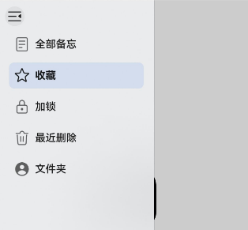

# HdsSideMenu

更新时间：2026-04-20 06:34:33

来源：https://developer.huawei.com/consumer/cn/doc/harmonyos-references/ui-design-hdssidemenu
**支持设备：** Phone / PC/2in1 / Tablet / TV

本模块提供一种菜单栏样式组件。设置侧边栏对应的一级菜单和二级菜单，并显示其新消息数量。

**起始版本：** 6.0.0(20)


## 导入模块
**支持设备：** Phone / PC/2in1 / Tablet / TV


```ts
import {
  HdsSideMenu,
  HdsSideMenuMainItem,
  HdsSideMenuSubItem,
  HdsSideMenuBadgeParam,
} from '@kit.UIDesignKit';
```


## 接口
**支持设备：** Phone / PC/2in1 / Tablet / TV

HdsSideMenu({items?: HdsSideMenuMainItem[], selectedIndex: number, \$selectedIndex?: OnSelectedIndexChange, maxItemTextLines?: number})

侧边菜单栏组件信息。

**装饰器类型：** @ComponentV2

**模型约束：** 此接口仅可在Stage模型下使用。

**系统能力：** SystemCapability.UIDesign.HDSPattern.Standard

**起始版本：** 6.0.0(20)


| 参数名 | 类型 | 必填 | 装饰器类型 | 说明 |
| --- | --- | --- | --- | --- |
| items | [HdsSideMenuMainItem](#hdssidemenumainitem)[] | 否 | @Param | 一级菜单栏组，数量最多为5个。 |
| selectedIndex | number | 是 | @Param @Require | 当前选中的菜单栏。 取值范围：大于等于-1的整数。 -1表示当前侧边菜单栏没有菜单被选中。 |
| \$selectedIndex | [OnSelectedIndexChange](#onselectedindexchange) | 否 | @Event | 用于双向绑定selectedIndex。 |
| maxItemTextLines | number | 否 | @Param | 设置最大内容行数。 默认值：1。 取值范围：(0, +∞)的整数。 |


## build
**支持设备：** Phone / PC/2in1 / Tablet / TV

build(): void

struct的默认构造函数，无法直接调用此方法。

**模型约束：** 此接口仅可在Stage模型下使用。

**系统能力：** SystemCapability.UIDesign.HDSPattern.Standard

**起始版本：** 6.0.0(20)


## HdsSideMenuMainItem
**支持设备：** Phone / PC/2in1 / Tablet / TV

HdsSideMenu一级菜单栏。

**装饰器类型**：@ObservedV2

**模型约束：** 此接口仅可在Stage模型下使用。

**系统能力：** SystemCapability.UIDesign.HDSPattern.Standard

**起始版本：** 6.0.0(20)


### constructor
**支持设备：** Phone / PC/2in1 / Tablet / TV

constructor(param: HdsSideMenuMainItemParam)

HdsSideMenuMainItem的构造函数。

**模型约束：** 此接口仅可在Stage模型下使用。

**系统能力：** SystemCapability.UIDesign.HDSPattern.Standard

**起始版本：** 6.0.0(20)

**参数：**


| 参数名 | 类型 | 必填 | 说明 |
| --- | --- | --- | --- |
| param | [HdsSideMenuMainItemParam](#hdssidemenumainitemparam) | 是 | HdsSideMenu一级菜单栏的参数。 |


### getSideMenuSubItem
**支持设备：** Phone / PC/2in1 / Tablet / TV

getSideMenuSubItem(): HdsSideMenuSubItem[]

从一级菜单对象获取当前菜单下的二级菜单对象数组。

**模型约束：** 此接口仅可在Stage模型下使用。

**系统能力：** SystemCapability.UIDesign.HDSPattern.Standard

**起始版本：** 6.0.0(20)

**返回值：**


| 类型 | 说明 |
| --- | --- |
| [HdsSideMenuSubItem](#hdssidemenusubitem)[] | 当前菜单下的二级菜单对象数组。 |


### updateBadge
**支持设备：** Phone / PC/2in1 / Tablet / TV

updateBadge(badge?: HdsSideMenuBadgeParam): HdsSideMenuMainItem

更新一级菜单栏的角标属性。

**模型约束：** 此接口仅可在Stage模型下使用。

**系统能力：** SystemCapability.UIDesign.HDSPattern.Standard

**起始版本：** 6.0.0(20)

**参数：**


| 参数名 | 类型 | 必填 | 说明 |
| --- | --- | --- | --- |
| badge | [HdsSideMenuBadgeParam](#hdssidemenubadgeparam) | 否 | HdsSideMenu上带信息提醒的图标配置信息。 |


**返回值：**


| 类型 | 说明 |
| --- | --- |
| [HdsSideMenuMainItem](#hdssidemenumainitem) | 当前菜单下的一级菜单对象。 |


## HdsSideMenuSubItem
**支持设备：** Phone / PC/2in1 / Tablet / TV

HdsSideMenu二级菜单栏。

**装饰器类型**：@ObservedV2

**模型约束：** 此接口仅可在Stage模型下使用。

**系统能力：** SystemCapability.UIDesign.HDSPattern.Standard

**起始版本：** 6.0.0(20)


### constructor
**支持设备：** Phone / PC/2in1 / Tablet / TV

constructor(param: HdsSideMenuSubItemParam)

HdsSideMenuSubItem的构造函数。

**模型约束：** 此接口仅可在Stage模型下使用。

**系统能力：** SystemCapability.UIDesign.HDSPattern.Standard

**起始版本：** 6.0.0(20)

**参数：**


| 参数名 | 类型 | 必填 | 说明 |
| --- | --- | --- | --- |
| param | [HdsSideMenuSubItemParam](#hdssidemenusubitemparam) | 是 | HdsSideMenu二级菜单栏的参数。 |


### updateBadge
**支持设备：** Phone / PC/2in1 / Tablet / TV

updateBadge(badge?: HdsSideMenuBadgeParam): HdsSideMenuSubItem

更新二级菜单栏的角标属性。

**模型约束：** 此接口仅可在Stage模型下使用。

**系统能力：** SystemCapability.UIDesign.HDSPattern.Standard

**起始版本：** 6.0.0(20)

**参数：**


| 参数名 | 类型 | 必填 | 说明 |
| --- | --- | --- | --- |
| badge | [HdsSideMenuBadgeParam](#hdssidemenubadgeparam) | 否 | HdsSideMenu上带信息提醒的图标配置信息。 |


**返回值：**


| 类型 | 说明 |
| --- | --- |
| [HdsSideMenuSubItem](#hdssidemenusubitem) | 当前菜单下的二级菜单对象。 |


## HdsSideMenuBadgeParam
**支持设备：** Phone / PC/2in1 / Tablet / TV

HdsSideMenu上带信息提醒的图标配置信息。

**模型约束：** 此接口仅可在Stage模型下使用。

**系统能力：** SystemCapability.UIDesign.HDSPattern.Standard

**起始版本：** 6.0.0(20)


| 名称 | 类型 | 只读 | 可选 | 说明 |
| --- | --- | --- | --- | --- |
| count | number | 否 | 是 | 设置提醒消息数。值为0时不显示；值为1时，显示“·”；大于99时，显示“99+”。不支持设置小于0的数字。 默认值：0。 |
| value | string | 否 | 是 | 提示内容的文本字符串，超长文本换行显示。 默认值：""。 |


## HdsSideMenuBaseItemParam
**支持设备：** Phone / PC/2in1 / Tablet / TV

HdsSideMenu菜单栏基础类。

**模型约束：** 此接口仅可在Stage模型下使用。

**系统能力：** SystemCapability.UIDesign.HDSPattern.Standard

**起始版本：** 6.0.0(20)


| 名称 | 类型 | 只读 | 可选 | 说明 |
| --- | --- | --- | --- | --- |
| itemId | string | 否 | 是 | 菜单的id。 默认值：""。 |
| label | [ResourceStr](https://developer.huawei.com/consumer/cn/doc/harmonyos-references/ts-types#resourcestr) | 否 | 是 | 菜单显示的文本内容。 |
| action | [Callback](https://developer.huawei.com/consumer/cn/doc/harmonyos-references/ts-types#callback12)&lt;void&gt; | 否 | 是 | 点击菜单时的回调。 |


## HdsSideMenuMainItemParam
**支持设备：** Phone / PC/2in1 / Tablet / TV

HdsSideMenu一级菜单栏配置项，继承自[HdsSideMenuBaseItemParam](#hdssidemenubaseitemparam)。

**模型约束：** 此接口仅可在Stage模型下使用。

**系统能力：** SystemCapability.UIDesign.HDSPattern.Standard

**起始版本：** 6.0.0(20)


| 名称 | 类型 | 只读 | 可选 | 说明 |
| --- | --- | --- | --- | --- |
| icon | [ResourceStr](https://developer.huawei.com/consumer/cn/doc/harmonyos-references/ts-types#resourcestr) | 否 | 是 | 设置一级菜单栏的图标，优先级高于symbol。 |
| symbol | [SymbolGlyphModifier](https://developer.huawei.com/consumer/cn/doc/harmonyos-references/ts-universal-attributes-attribute-modifier#自定义modifier) | 否 | 是 | 设置一级菜单栏的图标。 |
| hdsSideMenuSubItem | [HdsSideMenuSubItem](#hdssidemenusubitem)[] | 否 | 是 | 设置一级菜单栏中的二级菜单栏数组。二级菜单栏数量最多5个。 |
| badge | [HdsSideMenuBadgeParam](#hdssidemenubadgeparam) | 否 | 是 | 设置一级菜单栏上带信息提醒的图标配置信息。 |


## HdsSideMenuSubItemParam
**支持设备：** Phone / PC/2in1 / Tablet / TV

HdsSideMenu二级菜单栏配置项，继承自[HdsSideMenuBaseItemParam](#hdssidemenubaseitemparam)。

**模型约束：** 此接口仅可在Stage模型下使用。

**系统能力：** SystemCapability.UIDesign.HDSPattern.Standard

**起始版本：** 6.0.0(20)


| 名称 | 类型 | 只读 | 可选 | 说明 |
| --- | --- | --- | --- | --- |
| badge | [HdsSideMenuBadgeParam](#hdssidemenubadgeparam) | 否 | 是 | 设置二级菜单栏上带信息提醒的图标配置信息。 |


## 事件
**支持设备：** Phone / PC/2in1 / Tablet / TV


## OnSelectedIndexChange
**支持设备：** Phone / PC/2in1 / Tablet / TV

type OnSelectedIndexChange = (selectedIndex: number) => void

HdsSideMenu的selectedIndex发生变化时的回调函数。

**模型约束：** 此接口仅可在Stage模型下使用。

**系统能力：** SystemCapability.UIDesign.HDSPattern.Standard

**起始版本：** 6.0.0(20)

**参数：**


| 参数名 | 类型 | 必填 | 说明 |
| --- | --- | --- | --- |
| selectedIndex | number | 是 | 选择项的序号。 |


## 示例
**支持设备：** Phone / PC/2in1 / Tablet / TV

HdsSideMenu提供一种菜单栏样式。


```ts
import { HdsSideMenu, HdsSideMenuMainItem, HdsSideBar } from '@kit.UIDesignKit';
import { SymbolGlyphModifier } from '@kit.ArkUI';

@Entry
@ComponentV2
struct Index {
  @Local isShowSidebar: boolean = true;
  @Local selectedIndex: number = 1;
  listOptionsDefault?: HdsSideMenuMainItem[] = [
  new HdsSideMenuMainItem({
    symbol: new SymbolGlyphModifier($r('sys.symbol.doc_plaintext')),
    label: '全部备忘',
  }),
  new HdsSideMenuMainItem({
    symbol: new SymbolGlyphModifier($r('sys.symbol.star')),
    label: '收藏',
  }),
  new HdsSideMenuMainItem({
    symbol: new SymbolGlyphModifier($r('sys.symbol.lock')),
    label: '加锁',
  }),
  new HdsSideMenuMainItem({
    symbol: new SymbolGlyphModifier($r('sys.symbol.trash')),
    label: '最近删除',
  }),
  new HdsSideMenuMainItem({
    label: '文件夹',
  }),
  ]

  @Builder
  SideBarPanelBuilder() {
    Column() {
      HdsSideMenu({
        items: this.listOptionsDefault,
        selectedIndex: this.selectedIndex,
        $selectedIndex: (selectedIndex: number) => {
          this.selectedIndex = selectedIndex;
        },
      })
    }
    .width('100%')
    .height('100%')
    .margin(40)
  }

  @Builder
  ContentPanelBuilder() {
    Column() {
      Image($r('sys.media.ohos_ic_public_albums'))
      .width('120vp')
      .height('120vp')
    }
    .margin({ top: 250 })
  }

  @BuilderParam contentBuilder: () => void = this.ContentPanelBuilder
  @BuilderParam sideBarBuilder: () => void = this.SideBarPanelBuilder

  @Builder
  build() {
    Stack({ alignContent: Alignment.TopStart }) {
      Button() {
        SymbolGlyph(this.isShowSidebar ? $r('sys.symbol.open_sidebar') : $r('sys.symbol.close_sidebar'))
        .fontWeight(FontWeight.Normal)
        .fontSize($r('sys.float.ohos_id_text_size_headline7'))
        .fontColor([$r('sys.color.ohos_id_color_titlebar_icon')])
        .hitTestBehavior(HitTestMode.None)
      }
      .id('side_bar_button')
      .backgroundColor($r('sys.color.ohos_id_color_button_normal'))
      .height(30)
      .width(30)
      .onClick(() => {
        this.isShowSidebar = !this.isShowSidebar;
      })
      .zIndex(1)
      .margin({ top: 10, left: 10 })

      HdsSideBar({
        sideBarPanelBuilder: (): void => {
          this.sideBarBuilder()
        },
        contentPanelBuilder: (): void => {
          this.contentBuilder()
        },
        isShowSideBar: this.isShowSidebar,
        $isShowSideBar: (isShowSidebar: boolean) => {
          this.isShowSidebar = !isShowSidebar
        },
      })
    }
  }
}
```


