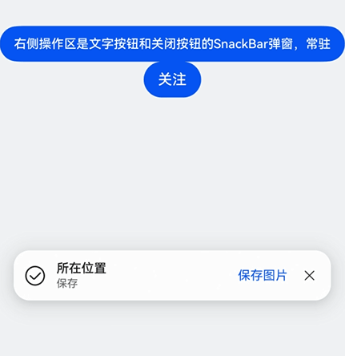

# HdsSnackBar

更新时间：2026-04-20 06:34:33

来源：https://developer.huawei.com/consumer/cn/doc/harmonyos-references/ui-design-hdssnackbar
**支持设备：** Phone / PC/2in1 / Tablet / TV

提供简短通知的非模态弹窗，其内部默认包含了图标区、内容区和操作区。

**起始版本：** 6.0.0(20)


## 导入模块
**支持设备：** Phone / PC/2in1 / Tablet / TV


```ts
import { HdsSnackBar } from '@kit.UIDesignKit';
```


## HdsSnackBar
**支持设备：** Phone / PC/2in1 / Tablet / TV

定义HdsSnackBar类。

**模型约束：** 此接口仅可在Stage模型下使用。

**系统能力：** SystemCapability.UIDesign.HDSPattern.Standard

**起始版本：** 6.0.0(20)


### constructor
**支持设备：** Phone / PC/2in1 / Tablet / TV

constructor(uiContext: UIContext)

获取HdsSnackBar对象。

**模型约束：** 此接口仅可在Stage模型下使用。

**系统能力：** SystemCapability.UIDesign.HDSPattern.Standard

**起始版本：** 6.0.0(20)


| 参数名 | 类型 | 必填 | 说明 |
| --- | --- | --- | --- |
| uiContext | [UIContext](https://developer.huawei.com/consumer/cn/doc/harmonyos-references/arkts-apis-uicontext-uicontext) | 是 | 应用的UIContext。 |


### show
**支持设备：** Phone / PC/2in1 / Tablet / TV

show(icon: SnackBarIconOptions, message: SnackBarMessageOptions, operation: SnackBarOperationOptions, style?: SnackBarStyleOptions): void

显示HdsSnackBar弹窗。

**模型约束：** 此接口仅可在Stage模型下使用。

**系统能力：** SystemCapability.UIDesign.HDSPattern.Standard

**起始版本：** 6.0.0(20)


| 参数名 | 类型 | 必填 | 说明 |
| --- | --- | --- | --- |
| icon | [SnackBarIconOptions](#snackbariconoptions) | 是 | HdsSnackBar图标区的配置信息。 |
| message | [SnackBarMessageOptions](#snackbarmessageoptions) | 是 | HdsSnackBar中间内容区文本的配置信息。 |
| operation | [SnackBarOperationOptions](#snackbaroperationoptions) | 是 | HdsSnackBar操作区的配置信息。 |
| style | [SnackBarStyleOptions](#snackbarstyleoptions) | 否 | HdsSnackBar样式的配置信息。 |


### dismiss
**支持设备：** Phone / PC/2in1 / Tablet / TV

dismiss(): void

关闭HdsSnackBar弹窗。

**模型约束：** 此接口仅可在Stage模型下使用。

**系统能力：** SystemCapability.UIDesign.HDSPattern.Standard

**起始版本：** 6.0.0(20)


## SnackBarIconOptions
**支持设备：** Phone / PC/2in1 / Tablet / TV

定义HdsSnackBar的左侧图标。

**模型约束：** 此接口仅可在Stage模型下使用。

**系统能力：** SystemCapability.UIDesign.HDSPattern.Standard

**起始版本：** 6.0.0(20)


| 名称 | 类型 | 只读 | 可选 | 说明 |
| --- | --- | --- | --- | --- |
| icon | [ResourceStr](https://developer.huawei.com/consumer/cn/doc/harmonyos-references/ts-types#resourcestr) | 否 | 是 | HdsSnackBar的图标，支持SymbolGlyph和Image。 |
| iconType | [SnackBarIconType](#snackbaricontype) | 否 | 是 | HdsSnackBar的图标类型。 默认值：SnackBarIconType.SMALL。 |
| iconModifier | [ImageModifier](https://developer.huawei.com/consumer/cn/doc/harmonyos-references/ts-universal-attributes-attribute-modifier#自定义modifier) | 否 | 是 | HdsSnackBar的Image图片的modifier。 |
| iconSymbolModifier | [SymbolGlyphModifier](https://developer.huawei.com/consumer/cn/doc/harmonyos-references/ts-universal-attributes-attribute-modifier#自定义modifier) | 否 | 是 | HdsSnackBar的SymbolGlyph图标的modifier。 |


## SnackBarMessageOptions
**支持设备：** Phone / PC/2in1 / Tablet / TV

定义HdsSnackBar的中间文本。

**模型约束：** 此接口仅可在Stage模型下使用。

**系统能力：** SystemCapability.UIDesign.HDSPattern.Standard

**起始版本：** 6.0.0(20)


| 名称 | 类型 | 只读 | 可选 | 说明 |
| --- | --- | --- | --- | --- |
| title | [ResourceStr](https://developer.huawei.com/consumer/cn/doc/harmonyos-references/ts-types#resourcestr) | 否 | 是 | HdsSnackBar的中间文本的标题。 |
| titleColor | [ColorMetrics](https://developer.huawei.com/consumer/cn/doc/harmonyos-references/js-apis-arkui-graphics#colormetrics12) | 否 | 是 | HdsSnackBar的中间文本的标题颜色。 |
| content | [ResourceStr](https://developer.huawei.com/consumer/cn/doc/harmonyos-references/ts-types#resourcestr) | 否 | 是 | HdsSnackBar的中间文本的内容。 |
| contentColor | [ColorMetrics](https://developer.huawei.com/consumer/cn/doc/harmonyos-references/js-apis-arkui-graphics#colormetrics12) | 否 | 是 | HdsSnackBar的中间文本的内容颜色。 |


## SnackBarOperationOptions
**支持设备：** Phone / PC/2in1 / Tablet / TV

定义HdsSnackBar的右侧操作区。

**模型约束：** 此接口仅可在Stage模型下使用。

**系统能力：** SystemCapability.UIDesign.HDSPattern.Standard

**起始版本：** 6.0.0(20)


| 名称 | 类型 | 只读 | 可选 | 说明 |
| --- | --- | --- | --- | --- |
| operationType | [SnackBarOperationType](#snackbaroperationtype) | 否 | 是 | HdsSnackBar的右侧操作区域元素样式。 |
| content | [ResourceStr](https://developer.huawei.com/consumer/cn/doc/harmonyos-references/ts-types#resourcestr) | 否 | 是 | HdsSnackBar的右侧区域文本按钮的文本内容。 说明：当右侧操作区是关闭按钮（即operationType为CLOSE_BUTTON_ONLY）时，该参数不生效。 |
| contentColor | [ColorMetrics](https://developer.huawei.com/consumer/cn/doc/harmonyos-references/js-apis-arkui-graphics#colormetrics12) | 否 | 是 | HdsSnackBar的右侧区域文本按钮的文本颜色。 说明：当右侧操作区是关闭按钮（即operationType为CLOSE_BUTTON_ONLY）时，该参数不生效。 |
| onContentClick | [Callback](https://developer.huawei.com/consumer/cn/doc/harmonyos-references/ts-types#callback12)&lt;void&gt; | 否 | 是 | HdsSnackBar的右侧区域文本按钮的点击事件。 说明：当右侧操作区是关闭按钮或者带有右箭头的文本按钮（即operationType为CLOSE_BUTTON_ONLY或者TEXT_WITH_ARROW）时，该参数不生效。 |
| contentAccessibilityText | [ResourceStr](https://developer.huawei.com/consumer/cn/doc/harmonyos-references/ts-types#resourcestr) | 否 | 是 | HdsSnackBar的右侧区域文本按钮的无障碍文本属性。当组件不包含文本属性时，屏幕朗读选中此组件时不播报，使用者无法清楚地知道当前选中了什么组件。为了解决此场景，开发人员可为不包含文字信息的组件设置无障碍文本，当屏幕朗读选中此组件时播报无障碍文本的内容，帮助屏幕朗读的使用者清楚地知道自己选中了什么组件。 默认值：""。 说明：当右侧操作区是关闭按钮（即operationType为CLOSE_BUTTON_ONLY）时，该参数不生效。 |
| contentAccessibilityDescription | [ResourceStr](https://developer.huawei.com/consumer/cn/doc/harmonyos-references/ts-types#resourcestr) | 否 | 是 | HdsSnackBar的右侧区域文本按钮的无障碍描述。此描述用于向用户详细解释当前组件，开发人员应为组件的这一属性提供较为详尽的文本说明，以协助用户理解即将执行的操作及其可能产生的后果。特别是当这些后果无法仅从组件的属性和无障碍文本中直接获知时。如果组件同时具备文本属性和无障碍说明属性，当组件被选中时，系统将首先播报组件的文本属性，随后播报无障碍说明属性的内容。 默认值："单指双击即可执行"。 说明：当右侧操作区是关闭按钮（即operationType为CLOSE_BUTTON_ONLY）时，该参数不生效。 |
| onCloseButtonClick | [Callback](https://developer.huawei.com/consumer/cn/doc/harmonyos-references/ts-types#callback12)&lt;void&gt; | 否 | 是 | HdsSnackBar的右侧区域关闭按钮的点击事件。 说明：当右侧操作区是文本按钮或者带有右箭头的文本按钮（即operationType为TEXT_ONLY或者TEXT_WITH_ARROW）时，该参数不生效。 |
| closeButtonAccessibilityText | [ResourceStr](https://developer.huawei.com/consumer/cn/doc/harmonyos-references/ts-types#resourcestr) | 否 | 是 | HdsSnackBar的右侧区域关闭按钮的无障碍文本属性。当组件不包含文本属性时，屏幕朗读选中此组件时不播报，使用者无法清楚地知道当前选中了什么组件。为了解决此场景，开发人员可为不包含文字信息的组件设置无障碍文本，当屏幕朗读选中此组件时播报无障碍文本的内容，帮助屏幕朗读的使用者清楚地知道自己选中了什么组件。 默认值：""。 说明：当右侧操作区是文本按钮或者带有右箭头的文本按钮（即operationType为TEXT_ONLY或者TEXT_WITH_ARROW）时，该参数不生效。 |
| closeButtonAccessibilityDescription | [ResourceStr](https://developer.huawei.com/consumer/cn/doc/harmonyos-references/ts-types#resourcestr) | 否 | 是 | HdsSnackBar的右侧区域关闭按钮的无障碍描述。此描述用于向用户详细解释当前组件，开发人员应为组件的这一属性提供较为详尽的文本说明，以协助用户理解即将执行的操作及其可能产生的后果。特别是当这些后果无法仅从组件的属性和无障碍文本中直接获知时。如果组件同时具备文本属性和无障碍说明属性，当组件被选中时，系统将首先播报组件的文本属性，随后播报无障碍说明属性的内容。 默认值："单指双击即可执行"。 说明：当右侧操作区是文本按钮或者带有右箭头的文本按钮（即operationType为TEXT_ONLY或者TEXT_WITH_ARROW）时，该参数不生效。 |
| arrowColor | [ColorMetrics](https://developer.huawei.com/consumer/cn/doc/harmonyos-references/js-apis-arkui-graphics#colormetrics12)[] | 否 | 是 | HdsSnackBar的右侧区域的右箭头颜色。 说明：当右侧操作区是带有右箭头的文本按钮（即operationType为TEXT_WITH_ARROW）时，该参数生效。 |
| onArrowClick | [Callback](https://developer.huawei.com/consumer/cn/doc/harmonyos-references/ts-types#callback12)&lt;void&gt; | 否 | 是 | HdsSnackBar的右侧区域的带有右箭头的文本按钮的点击事件。 说明：当右侧操作区是带有右箭头的文本按钮（即operationType为TEXT_WITH_ARROW）时，该参数生效。 |
| highlightBackBoardColor | [ColorMetrics](https://developer.huawei.com/consumer/cn/doc/harmonyos-references/js-apis-arkui-graphics#colormetrics12) | 否 | 是 | HdsSnackBar的右侧区域的高亮文本按钮的背板颜色。 说明：当右侧操作区是带有关闭按钮的高亮按钮（即operationType为HIGHLIGHT_TEXT_WITH_CLOSE）时，该参数生效。 |
| textButtonId | string | 否 | 是 | HdsSnackBar的文本按钮或者高亮文本按钮的id。 说明：当右侧操作区是关闭按钮或者带有右箭头的文本按钮（即operationType为CLOSE_BUTTON_ONLY或者TEXT_WITH_ARROW）时，该参数不生效。 |
| cancelButtonId | string | 否 | 是 | HdsSnackBar的关闭按钮的id。 说明：当右侧操作区是文本按钮或者带有右箭头的文本按钮（即operationType为TEXT_ONLY或者TEXT_WITH_ARROW）时，该参数不生效。 |
| arrowButtonId | string | 否 | 是 | HdsSnackBar的带有右箭头的文本按钮的id。 说明：当右侧操作区是带有右箭头的文本按钮（即operationType为TEXT_WITH_ARROW）时，该参数生效。 |


## SnackBarStyleOptions
**支持设备：** Phone / PC/2in1 / Tablet / TV

定义HdsSnackBar的样式。

**模型约束：** 此接口仅可在Stage模型下使用。

**系统能力：** SystemCapability.UIDesign.HDSPattern.Standard

**起始版本：** 6.0.0(20)


| 名称 | 类型 | 只读 | 可选 | 说明 |
| --- | --- | --- | --- | --- |
| width | [LengthMetrics](https://developer.huawei.com/consumer/cn/doc/harmonyos-references/js-apis-arkui-graphics#lengthmetrics12) | 否 | 是 | HdsSnackBar的宽度。 |
| backgroundColor | [ColorMetrics](https://developer.huawei.com/consumer/cn/doc/harmonyos-references/js-apis-arkui-graphics#colormetrics12) | 否 | 是 | HdsSnackBar的背景颜色。 |
| backgroundBlurStyle | [BlurStyle](https://developer.huawei.com/consumer/cn/doc/harmonyos-references/ts-universal-attributes-background#blurstyle9) | 否 | 是 | HdsSnackBar的背板背景模糊效果。 |
| duration | number | 否 | 是 | HdsSnackBar定时显示时的定时消失时间。 默认值：5000。 单位：ms。 取值范围：(-∞, +∞)。 如果用户设置成小于等于0的表示snackBar不会定时消失，常驻。 |
| keyboardDownAvoidHeight | [LengthMetrics](https://developer.huawei.com/consumer/cn/doc/harmonyos-references/js-apis-arkui-graphics#lengthmetrics12) | 否 | 是 | HdsSnackBar键盘收起时的避让高度。 |
| keyboardUpAvoidHeight | [LengthMetrics](https://developer.huawei.com/consumer/cn/doc/harmonyos-references/js-apis-arkui-graphics#lengthmetrics12) | 否 | 是 | HdsSnackBar键盘抬起时的避让高度。 |
| nextFocusId | string | 否 | 是 | HdsSnackBar走焦到下一个组件的id。 |
| theme | [Theme](https://developer.huawei.com/consumer/cn/doc/harmonyos-references/js-apis-arkui-theme#theme) \| [CustomTheme](https://developer.huawei.com/consumer/cn/doc/harmonyos-references/js-apis-arkui-theme#customtheme) | 否 | 是 | HdsSnackBar的主题。 |
| themeColorMode | [ThemeColorMode](https://developer.huawei.com/consumer/cn/doc/harmonyos-references/ts-universal-attributes-foreground-blur-style#themecolormode枚举说明) | 否 | 是 | HdsSnackBar的主题色。 |
| pressBackCallback | [Callback](https://developer.huawei.com/consumer/cn/doc/harmonyos-references/ts-types#callback12)&lt;void&gt; | 否 | 是 | HdsSnackBar弹窗出现后，左滑屏幕，应用可以自定义返回到上一页的回调函数。 |
| blurStrategy | [BlurStrategy](https://developer.huawei.com/consumer/cn/doc/harmonyos-references/ui-design-hdsnavigation#blurstrategy) | 否 | 是 | HdsSnackBar的模糊生效策略。 默认值：BlurStrategy.ADAPTIVE。 |
| isHeightAdaptive | boolean | 否 | 是 | HdsSnackBar的背板高度是否随组件内文本内容自适应变化。 true：背板高度会随组件内文本内容自适应变化。 false：背板高度不会随组件内文本内容自适应变化。 默认值：false。 起始版本： 6.1.0(23)。 |


## SnackBarOperationType
**支持设备：** Phone / PC/2in1 / Tablet / TV

定义SnackBarOperationType枚举。

**模型约束：** 此接口仅可在Stage模型下使用。

**系统能力：** SystemCapability.UIDesign.HDSPattern.Standard

**起始版本：** 6.0.0(20)


| 名称 | 值 | 说明 |
| --- | --- | --- |
| TEXT_ONLY | 0 | 文本按钮。 |
| CLOSE_BUTTON_ONLY | 1 | 关闭按钮。 |
| TEXT_WITH_ARROW | 2 | 带有右箭头的文本按钮。 |
| TEXT_WITH_CLOSE | 3 | 带有关闭按钮的文本按钮。 |
| HIGHLIGHT_TEXT_WITH_CLOSE | 4 | 带有关闭按钮的高亮文本按钮。 |


## SnackBarIconType
**支持设备：** Phone / PC/2in1 / Tablet / TV

定义SnackBarIconType枚举。

**模型约束：** 此接口仅可在Stage模型下使用。

**系统能力：** SystemCapability.UIDesign.HDSPattern.Standard

**起始版本：** 6.0.0(20)


| 名称 | 值 | 说明 |
| --- | --- | --- |
| SMALL | 0 | 小图标。 |
| NORMAL | 1 | 普通图标。 |


## 示例
**支持设备：** Phone / PC/2in1 / Tablet / TV

HdsSnackBar提供带按钮操作的通知弹窗。


```ts
import {
  HdsSnackBar,
  SnackBarIconOptions,
  SnackBarMessageOptions,
  SnackBarOperationOptions,
  SnackBarStyleOptions,
  SnackBarOperationType
} from '@kit.UIDesignKit'

@Entry
@ComponentV2
struct TestSnackBar {
  uiContext: UIContext = this.getUIContext();
  hdsSnackBar: HdsSnackBar = new HdsSnackBar(this.uiContext);
  icon: SnackBarIconOptions = {
    icon: $r('sys.symbol.checkmark_circle')
  }
  message: SnackBarMessageOptions = {
    title: $r('sys.string.ohos_id_text_location_button_description_current_position'),
    content: $r('sys.string.ohos_id_text_save_button_description_save')
  }
  operation: SnackBarOperationOptions = {
    operationType: SnackBarOperationType.TEXT_WITH_CLOSE,
    content: $r('sys.string.ohos_id_text_save_button_description_save_image'),
    textButtonId: 'snackBarTextButton'
  }
  style: SnackBarStyleOptions = {
    nextFocusId: 'button',
    duration: -1
  }

  build() {
    Column() {
      Blank()
      .height(400)
      Button('右侧操作区是文字按钮和关闭按钮的SnackBar弹窗，常驻')
      .onClick(() => {
        this.hdsSnackBar.show(this.icon, this.message, this.operation, this.style);
      })
      .id("button")

      Button('关注')
      .nextFocus({
        // 这里forward的id必须和SnackBarOperationOptions接口中传入的textButtonId相同
        forward: 'snackBarTextButton'
      })
    }
    .width('100%')
    .height('100%')
    .backgroundColor(0xF1F3F5)
  }
}
```

效果图：


