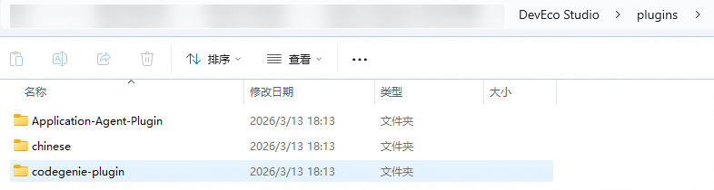

# 点击CodeGenie顶部栏的新建会话、历史记录等快捷按钮后无反应

更新时间：2026-04-02 07:57:02

来源：https://developer.huawei.com/consumer/cn/doc/harmonyos-faqs/faqs-codegenie-2

问题现象

CodeGenie使用过程中，点击顶部栏新建会话、历史记录、Agent配置等快捷按钮后无反应。

问题原因

代码异常，导致前端渲染问题。

解决措施

1. 保存工程并关闭DevEco Studio。
2. 打开当前DevEco Studio的安装目录，按如下安装路径找到**codegenie-plugin**文件夹，手动删除此文件夹或将此文件夹移动到其他位置缓存备份。

3. 在[官网链接](https://developer.huawei.com/consumer/cn/download/deveco-codegenie)下载最新发布的**DevEco CodeGenie 6.0.2 Release**版本，按照[插件安装指导](https://developer.huawei.com/consumer/cn/doc/harmonyos-guides/ide-codegenie#section18337533718)安装和使用新版本插件。
