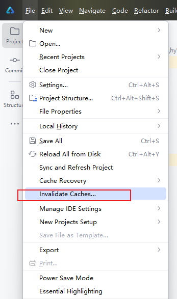
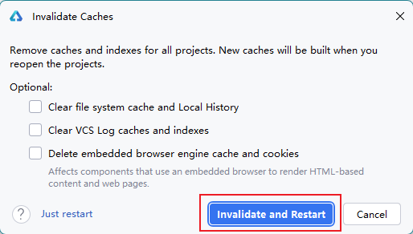

# server启动失败，进程意外退出

更新时间：2026-03-10 06:16:35

来源：https://developer.huawei.com/consumer/cn/doc/harmonyos-faqs/faqs-coding-17

**问题现象**
 
server启动过程中，意外退出，弹框提示：
 

 

 
**解决措施**
 
1. 清除缓存重新启动DevEco Studio。
 

 

 
2. 收集日志，打开华为开发者联盟的“[在线提单](https://developer.huawei.com/consumer/cn/support/feedback/#/7?level2=101747979797569375)”页面进行反馈。
 

