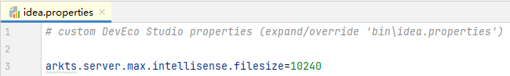

# 如何过滤编辑器对超大文件的扫描

更新时间：2026-03-10 06:16:35

来源：https://developer.huawei.com/consumer/cn/doc/harmonyos-faqs/faqs-coding-11

**问题现象**
 
在工程中，如果存在由ProtoBuf等工具自动生成的超大源码文件（例如，超过十万行的源码文件），编辑器在扫描和加载这些文件时会占用大量系统运行内存。如果不需要在这些文件中使用代码编辑功能，可以通过配置编辑器来限制扫描单个文件的最大大小，从而进行过滤。
 
**解决措施**
 
以过滤大小超过10 MB的文件为例，通过DevEco Studio菜单栏的“Help > Edit Custom Properties...”选项，打开idea.properties配置文件，在文件中新增一行arkts.server.max.intellisense.filesize=10240，然后重启DevEco Studio。编辑器将过滤大小超过10 MB的文件。arkts.server.max.intellisense.filesize字段应配置为大于0的整数值。
 

