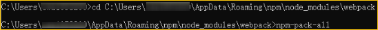
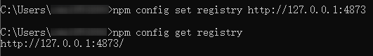
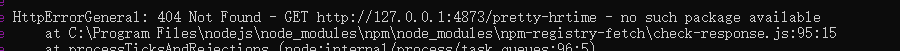

# 如何通过离线方式安装npm包

更新时间：2026-03-10 06:16:35

来源：https://developer.huawei.com/consumer/cn/doc/harmonyos-faqs/faqs-project-management-20

前置条件

- 有网环境的PC
- 离线环境的PC有Node基础环境
- 离线环境的PC需安装Verdaccio工具

1. 在有网络的环境下，使用npm-pack-all工具包将所有依赖项打包成.tgz文件。安装 npm-pack-all：npm install -g npm-pack-all。安装全局 husky（npm-pack-all 依赖）。
2. 下载所需依赖包：npm install -g （示例中以webpack为例，即输入npm install -g webpack）。

3. 进入全局 npm 包的路径并制作离线安装包：cd C:\Users\\AppData\Roaming\npm\node_modules\（如webpack），然后运行命令：npm-pack-all。

 将生成的.tgz文件拷贝到目标PC（无网环境PC），然后运行npm install XXXX.tgz命令安装该.tgz文件。成功后，重新配置离线PC中npm的地址路径，将registry路径设置为本地路径。
1. 需要使用Verdaccio工具搭建源以提供离线开发环境。在离线PC中安装Verdaccio后，运行以下命令：verdaccio。
2. 运行成功后，将在本地搭建一个 npm 服务器。接下来，在新的命令行窗口中执行以下命令：npm config set registry http://127.0.0.1:4873，然后执行npm config get registry以验证设置是否成功。

 在本地搭建好npm服务器后，进入项目目录，执行以下命令即可在无网环境下更新项目的npm依赖库。
1. 运行 npm install。
2. 注：若安装时报错提示"404 Not Found 'xxx'"，说明本地库缺少该依赖，需要从有网络的环境中拷贝相应的依赖文件。操作步骤与上述相同。

