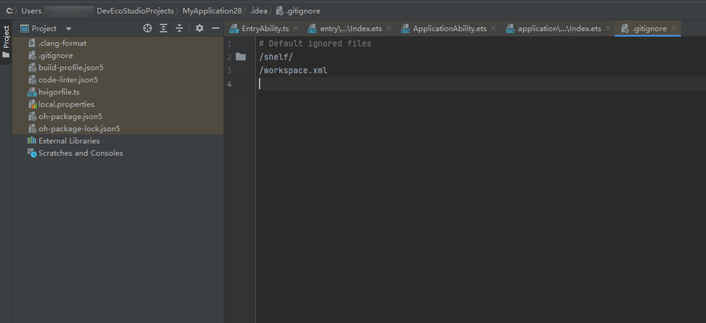
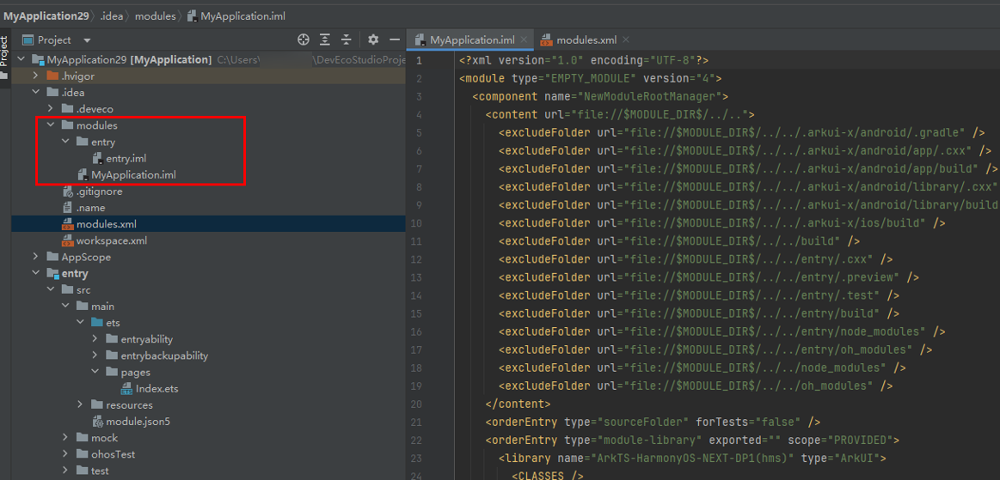
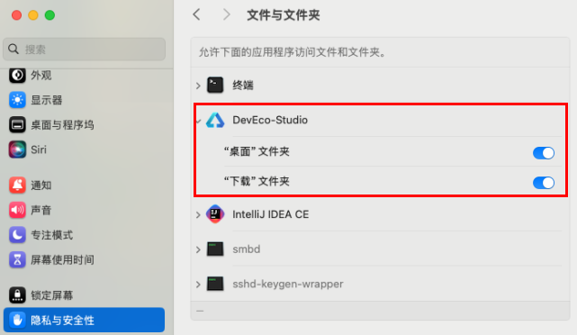
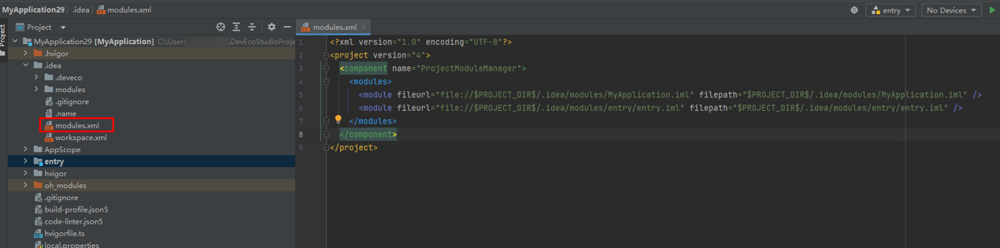

# 打开工程时左侧目录树不显示

更新时间：2026-04-27 09:10:01

来源：https://developer.huawei.com/consumer/cn/doc/harmonyos-faqs/faqs-project-management-24

**问题现象**
 
左侧目录树不显示，如下图所示。
 

 
**问题原因**
 
**情况1：**
 
在 macOS上，系统对隐私权限的管理非常严格。如果没有获得访问特定目录（如“下载”或“桌面”）的权限，就会出现项目虽然打开了，但左侧目录树一片空白的情况。
 
**情况2：**
 
当用户删除工程目录下的.idea/modules文件夹或者.idea/modules文件夹不存在时，如下图所示。
 

 
由于modules文件夹下的iml文件定义了详细的工程模块结构信息，modules.xml定义了工程模块结构文件的位置。删除modules文件夹后根据modules.xml无法找到对应的iml文件。
 

 
**解决措施**
 
**情况1：**
 
如果缺少访问权限，设置项目文件夹访问权限就可以解决问题：系统设置->隐私与安全->文件和文件夹->允许访问（找到DevEco Studio，点击展开），重启IDE，工程目录树才可以恢复
 

 
**情况2：**
 
需要关闭工程，在文件管理器中删除工程的modules.xml，重新启动IDE打开工程，工程目录树才可以恢复。
 

