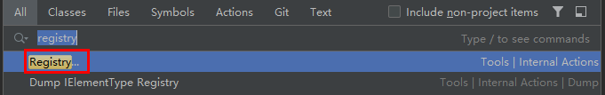
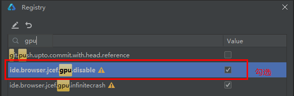
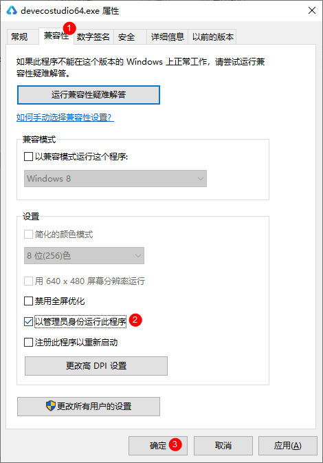
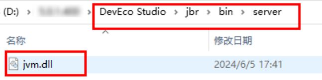
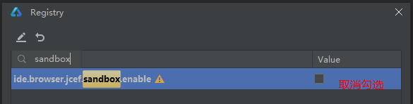

# 环境诊断、创建工程/模块界面全部显示空白

更新时间：2026-03-17 00:56:02

来源：https://developer.huawei.com/consumer/cn/doc/harmonyos-faqs/faqs-project-management-3

问题现象

打开环境诊断界面，选择工程或模块模板时，界面显示为空；工程预览界面同样为空。

原因分析

这些页面都是使用JCEF绘制的，JCEF无法正常启动会导致这种问题。

可能原因一

JCEF窗口组件的GPU兼容性有问题。

解决措施

关闭JCEF的GPU渲染。

解决JCEF窗口组件的GPU兼容性问题，点击右上角的放大镜图标。

输入registry，点击下面的Registry...选项。

搜索gpu，找到ide.browser.jcef.gpu.disable，然后勾选这一项，最后重启DevEco Studio。

可能原因二

IntelliJ底座问题，没有权限启动JCEF。

解决措施

可能是DevEco Studio权限不足导致，找到DevEco Studio的启动图标，选中图标，然后右键 > 属性 > 兼容性 > 以管理员身份运行此程序 > 确定。

可能原因三

JCEF文件缺失，可能被杀毒软件误删除。

解决措施

检查JCEF文件是否缺失。

JCEF文件缺失，可能被杀毒软件误删除，导致JCEF进程无法拉起，查看这两个文件是否还存在，如果不存在，则需要重新安装DevEco Studio。

\${DevEco Studio安装目录}/jbr/bin/server/jvm.dll

\${DevEco Studio安装目录}/jbr/bin/chrome_elf.dll

可能原因四

JCEF沙箱环境与当前电脑环境冲突。

解决措施

JCEF沙箱环境与当前电脑环境冲突，导致JCEF无法正常工作。

点击右上角的放大镜图标。

输入registry，点击下面的Registry...选项。

搜索sandbox，找到ide.browser.jcef.sandbox.enable，取消勾选这一项，最后重启DevEco Studio。

