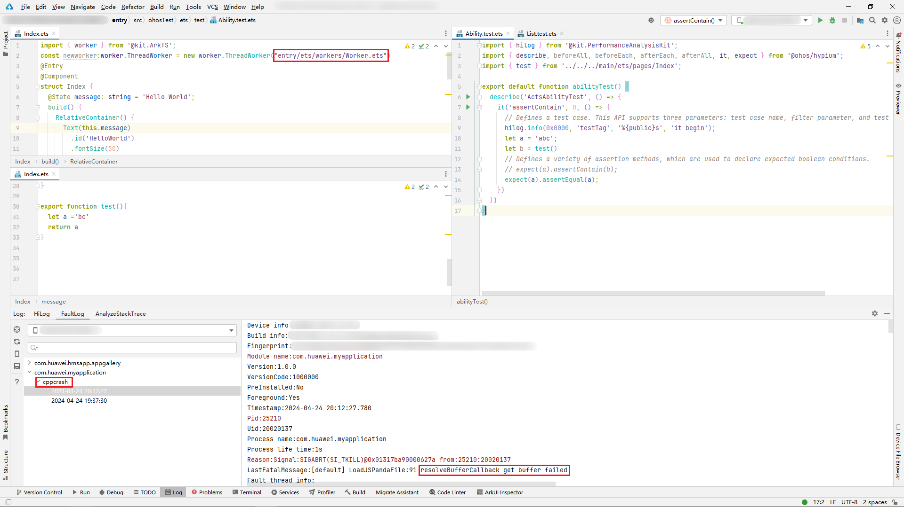
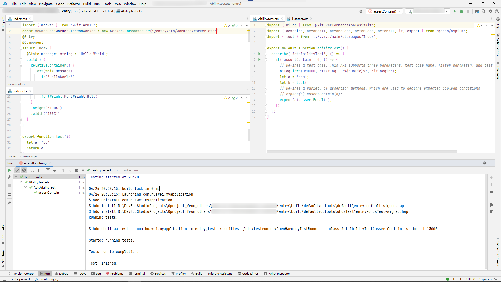
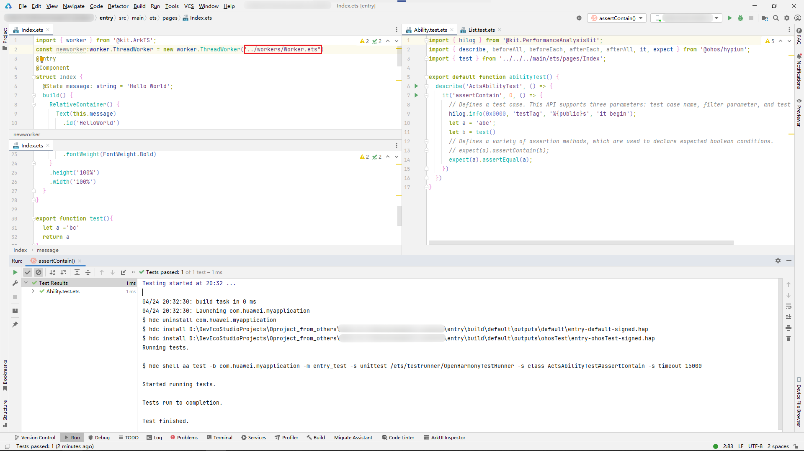

# ohosTest测试文件引用了entry模块的方法，测试时报cppcrash

更新时间：2026-03-10 06:16:35

来源：https://developer.huawei.com/consumer/cn/doc/harmonyos-faqs/faqs-app-test-8

问题现象

如果ohosTest测试文件引用了entry的方法，并且entry中存在以普通形式（例如"entry/ets/workers/Worker.ets"）加载worker时，测试执行期间会报cppcrash。

解决措施

修改entry中实例化worker的路径形式为带@标识的路径加载形式或相对路径加载形式，再次执行测试以确保可以正常通过。

- @标识路径加载形式("@entry/ets/workers/Worker.ets")：

- 相对路径加载形式("../workers/Worker.ets")：

