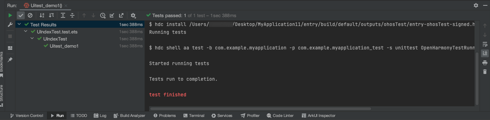

# 运行UITest用例，运行超时屏幕黑屏后报错

更新时间：2026-03-10 06:16:35

来源：https://developer.huawei.com/consumer/cn/doc/harmonyos-faqs/faqs-app-test-5

**问题现象**
 
运行UITest用例时，如果屏幕黑屏并超时，将报错提示“Tests failed”。
 

 
**解决措施**
 
运行UITest用例时，需确保设备屏幕常亮。屏幕常亮时，用例能够成功运行。
 

