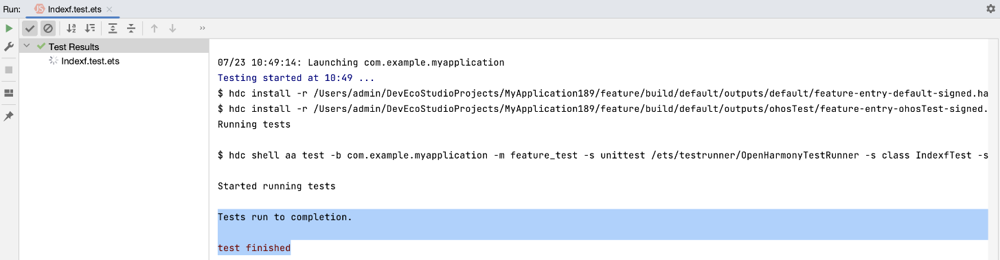
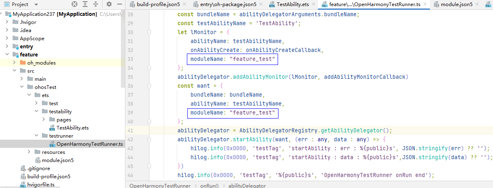

# 运行测试用例时，结果树始终处于加载状态

更新时间：2026-03-10 06:16:35

来源：https://developer.huawei.com/consumer/cn/doc/harmonyos-faqs/faqs-app-test-3

问题现象

如果多个模块（如entry和feature模块）同时依赖HSP，在设备上先运行entry和HSP模块，再执行feature模块下的测试用例时，任务结果树会一直处于加载状态，无法正常完成。

解决措施

1. 打开非entry模块的ohosTest/ets/testrunner/OpenHarmonyTestRunner.ts文件。
2. 在lMonitor与want中分别增加moduleName字段，该字段用于指定当前模块的名称（即该模块下的module.json5文件中module字段下name的值）。示例代码如下：

