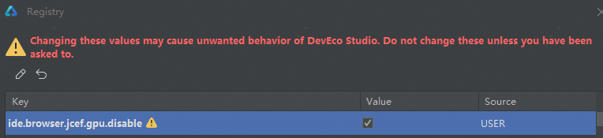

# Native调试堆栈可视化功能并行栈视图显示空白

更新时间：2026-03-10 06:16:35

来源：https://developer.huawei.com/consumer/cn/doc/harmonyos-faqs/faqs-app-debugging-56

**问题现象**
 
使用Native调试堆栈可视化功能时，如果在任意两个页签之间来回切换，可能会遇到并行栈视图界面显示为空白的情况。
 
**解决措施**
 
导致该问题的原因可能是电脑GPU不兼容，或在云桌面的场景下使用DevEco Studio。
 
在DevEco Studio中**双击Shift**，在弹出的窗口中搜索**Registry**，**在Registry**页面中勾选**ide.browser.jcef.gpu.disable**项，关闭窗口并重启DevEco Studio即可。
 

