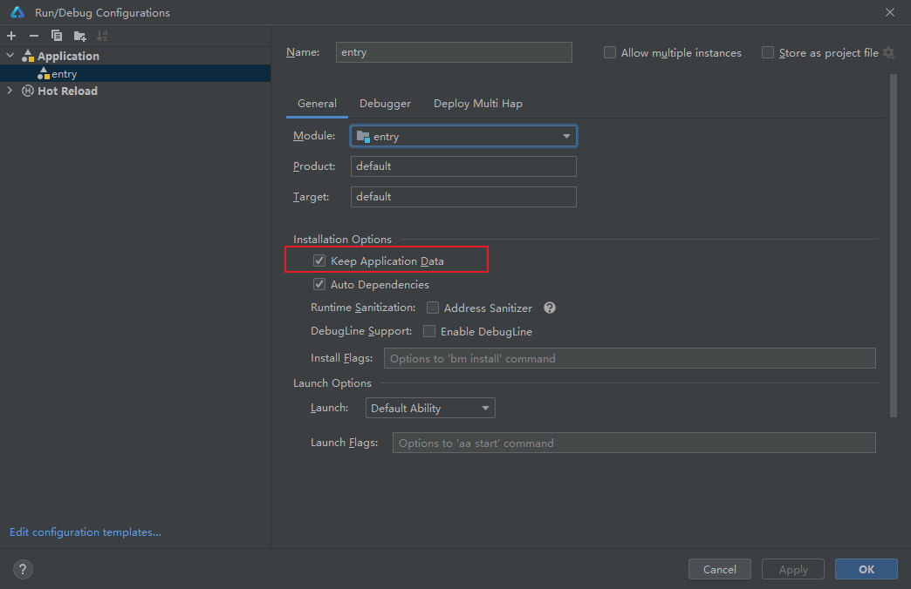

# 如何保证代码修改后每次Run之后Preferences存储的用户信息不会被清除

更新时间：2026-03-10 06:16:35

来源：https://developer.huawei.com/consumer/cn/doc/harmonyos-faqs/faqs-app-debugging-58

如果需要在运行后保留存储在Preferences中的用户信息，可以在DevEco Studio中进行如下设置：点击“Run”->“Edit Configurations...”，进入“Debug Configurations”->“General”->“Installation Options”，勾选“Keep Application Data”。

