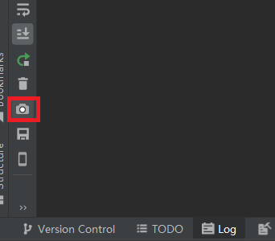

# 如何将设备中的截屏图片导出到本地

更新时间：2026-03-10 06:16:35

来源：https://developer.huawei.com/consumer/cn/doc/harmonyos-faqs/faqs-app-debugging-28

使用DevEco Studio的截图功能。
1. 连接设备到电脑。
2. 在DevEco Studio底部工具栏的Log栏中，点击左侧相机图标可截图并保存到指定路径。

