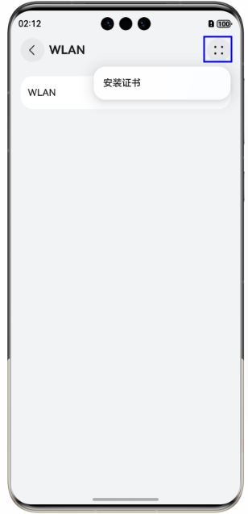
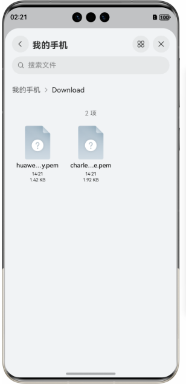

# 使用模拟器发起HTTPS请求时如何安装数字证书

更新时间：2026-03-10 06:16:35

来源：https://developer.huawei.com/consumer/cn/doc/harmonyos-faqs/faqs-app-running-27

问题现象

在使用网络代理发送HTTPS请求时，需要安装网站服务器的数字证书。

解决措施

1. 将证书拖拽上传至模拟器，可在文件管理的“我的手机”>“下载”目录下查看上传的文件。
2. 安装证书的方式如下：
- 点击**设置 > WLAN >**

**> 安装证书 > CA证书**，选择pem格式证书进行安装。



- 在本机命令行窗口中使用以下命令打开证书管理。
```bash
hdc shell aa start -a MainAbility -b com.ohos.certmanager
```
 选择从存储设备安装，安装pem格式的证书。
