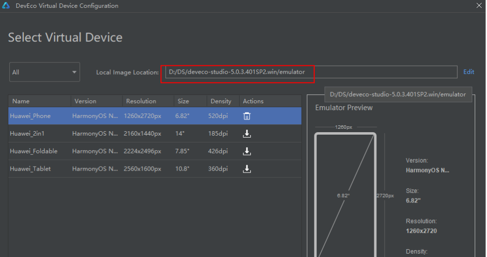
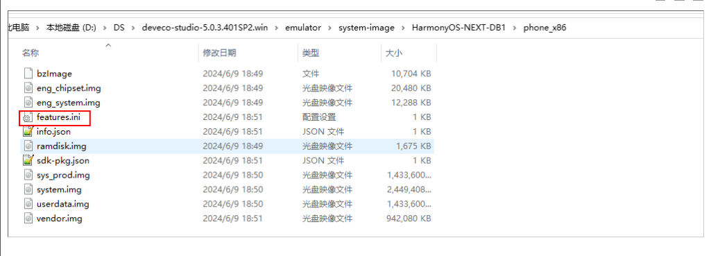
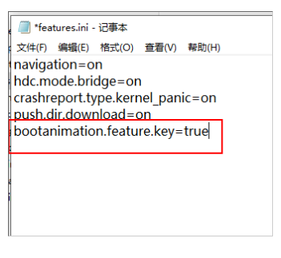

# 模拟器在后台放置一段时间后会卡在加载状态，CPU占用率高

更新时间：2026-03-10 06:16:35

来源：https://developer.huawei.com/consumer/cn/doc/harmonyos-faqs/faqs-app-running-20

**问题描述**
 

 

 
打开活动检测器，发现模拟器的CPU占用率为80%。
 
**解决措施**
 
1.打开模拟器设备管理页面。
 

 
2.选择“新建模拟器”弹窗。
 

 

 
3.复制路径并用文件夹打开system-image\HarmonyOS-NEXT-DB1\phone_x86。
 

 
4.打开features.ini文件，将bootanimation.feature.key的值改为true，保存后重启模拟器。
 

