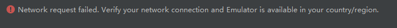
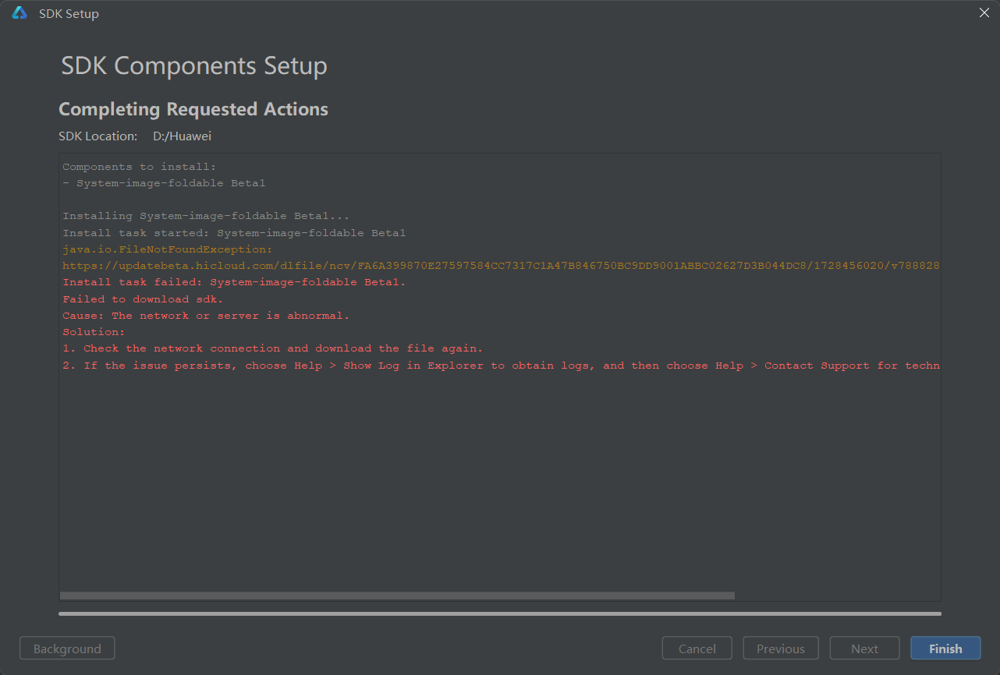
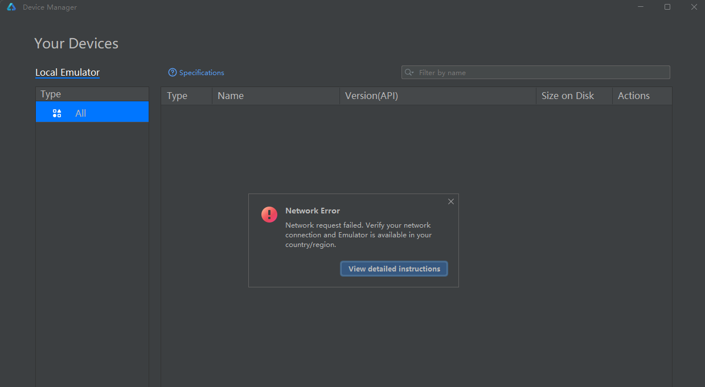

# 设备管理获取模板数据提示网络异常，下载模拟器镜像提示网络异常

更新时间：2026-04-02 07:57:02

来源：https://developer.huawei.com/consumer/cn/doc/harmonyos-faqs/faqs-app-running-40

问题现象

- **场景一**：设备管理获取模板数据失败，错误提示：“Network request failed. Verify your network connection and Emulator is available in your country/region.”

- **场景二**：模拟器镜像下载失败，提示“The network or server is abnormal.”。

- **场景三**：打开设备管理，界面显示为空，错误提示：“Network request failed. Verify your network connection and Emulator is available in your country/region.”

解决措施

1. 尝试清除本机DevEco Studio缓存文件后重启，缓存目录：Windows:C:\Users\xxx\AppData\Local\Huawei\DevEcoStudioX.X\caches Mac：~/Library/Caches/Huawei/DevEcoStudioX.X/caches
2. 尝试修改本机网络环境后进行重试，例如：[配置Proxy代理](https://developer.huawei.com/consumer/cn/doc/harmonyos-guides/ide-environment-config#section10369436568)、连接手机热点、关闭VPN。
3. 请检测您的网络并确认您当前电脑环境或华为账号是否在[模拟器支持的国家/地区](https://developer.huawei.com/consumer/cn/doc/harmonyos-guides/ide-emulator-devicetype)内。
