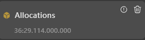

# Profiler分析任务录制失败

更新时间：2026-03-10 06:16:35

来源：https://developer.huawei.com/consumer/cn/doc/harmonyos-faqs/faqs-profiler-1

**问题现象**
 
单击Profiler深度分析任务的启动录制按钮后，录制失败。
 
- DevEco Studio提示任务启动或录制失败。

 
- Session列表中任务显示异常图标。

 
**解决措施**
 
启动深度分析任务录制后，将经历初始化、录制和停止录制后分析及组装数据三个阶段。每个阶段都可能遇到任务录制失败的问题，具体原因包括连接断开、插件错误和设备状态异常。
 
请参考以下步骤进行操作。
 1. 确保设备亮屏运行。
1. 尝试重新推送包到设备，或者重启应用和服务。
2. 重启设备。
3. 重启DevEco Studio。
