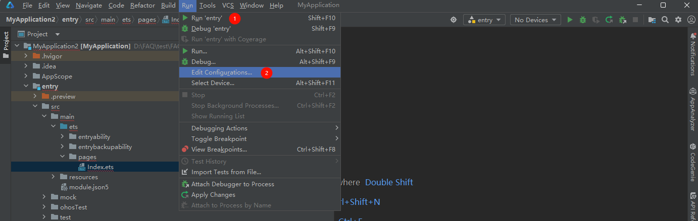
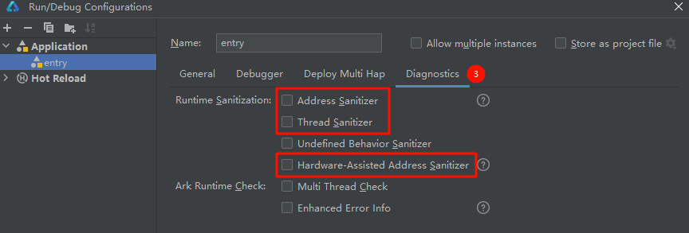

# Profiler录制Allocation没有Native信息

更新时间：2026-03-10 06:16:35

来源：https://developer.huawei.com/consumer/cn/doc/harmonyos-faqs/faqs-profiler-5

**解决措施**
 
取消勾选Run > Edit Configurations > Diagnostics 内的Address Sanitizer、Thread Sanitizer、Hardware-Assisted Address Sanitizer选项重新运行应用录制即可。
 

 

