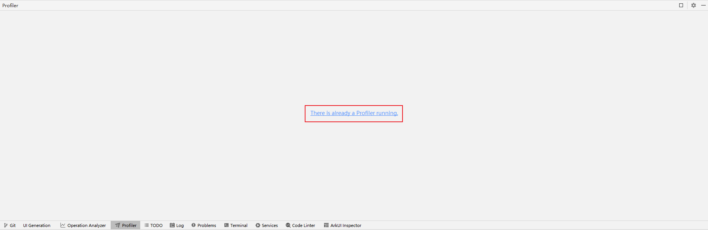

# Profiler窗口无法加载

更新时间：2026-03-10 06:16:35

来源：https://developer.huawei.com/consumer/cn/doc/harmonyos-faqs/faqs-profiler-6

**问题现象**
 
Profiler窗口提示“There is already a Profiler running.”。
 

 
**问题原因**
 
Profiler仅支持单例模式，即同时打开多个DevEco Studio只支持运行一个Profiler。
 
**解决措施**
 
- 关闭当前的DevEco Studio，使用能够正常展示Profiler界面的DevEco Studio。
- 关闭其他的DevEco Studio，然后点击当前DevEco Studio中“There is already a Profiler running.”提示，等待Profiler界面重新刷新。
